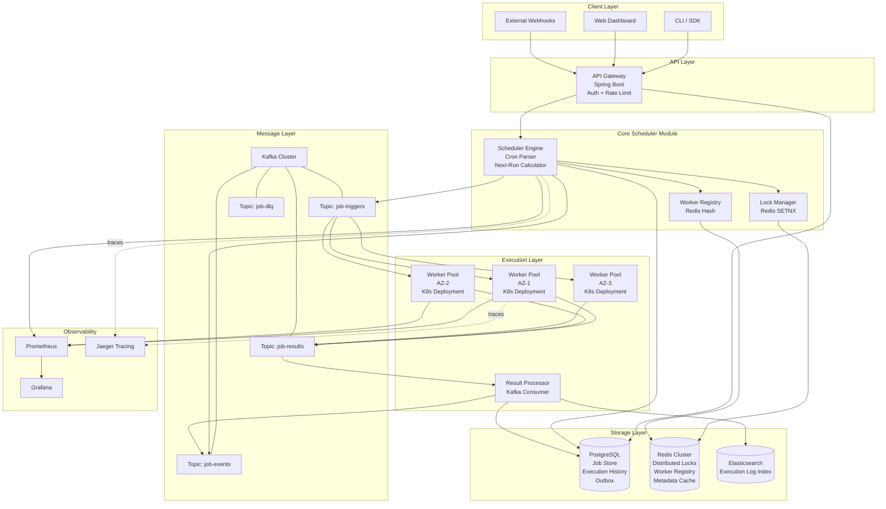

# 01 — High-Level Architecture: Distributed Job Scheduler

## Objective
Define the top-level architectural style, justify the choice, and provide a complete view of system components, their interactions, and the rationale for every significant structural decision.

---

## 1. Architecture Decision: Modular Monolith → Microservices Migration Path

### Why NOT start with Microservices

A job scheduler is a coordination-heavy system. The core operations — scan due jobs, acquire lock, dispatch to queue, record execution — are tightly coupled by nature. Starting with microservices would introduce:

- **Distributed transaction complexity** on every trigger cycle (scheduler → lock service → queue service → history service)
- **Operational overhead** disproportionate to the team size in Phase 1
- **Network latency** in the critical scheduling hot path
- **Premature decomposition** before service boundaries are empirically understood

### Why Modular Monolith with DDD

The system starts as a **modular monolith** with clearly separated internal modules following DDD bounded contexts. Each module has:
- Its own domain model (no cross-module entity sharing)
- Its own database schema (enforced via schema namespacing in PostgreSQL)
- Well-defined interfaces (application service contracts between modules)
- Independent testability

This gives the team the option to **extract a module into a microservice** when a specific scaling bottleneck justifies it — typically the Execution module (high fan-out) in Phase 2.

### Architecture Evolution Trigger Points

| Trigger | Action |
|---|---|
| Scheduler module becomes bottleneck (can't keep up with 10M jobs) | Extract into dedicated Scheduler Service with its own PostgreSQL partition |
| Worker management complexity grows (multi-cloud, custom executors) | Extract Worker Management into standalone service |
| Multi-tenant isolation requirement | Extract API Gateway + Tenant Router into edge service |
| Execution history read load > 10k RPS | Extract Execution History into read-optimized service (Elasticsearch-backed) |

---

## 2. Component Overview

### Core Components

| Component | Role | Technology |
|---|---|---|
| **API Gateway** | Entry point, auth, rate limiting | Spring Boot + Spring Security |
| **Scheduler Engine** | Polls due jobs, acquires locks, dispatches | Spring Boot module |
| **Job Store** | Persistent job definitions, schedules, locks | PostgreSQL |
| **Dispatch Queue** | Job trigger fanout to workers | Kafka |
| **Worker Pool** | Executes jobs, reports results | Spring Boot (HPA on K8s) |
| **Result Processor** | Consumes worker results, updates history | Spring Boot module |
| **Distributed Lock Manager** | Prevents double execution | Redis |
| **Worker Registry** | Tracks live workers, capabilities | Redis |
| **Execution History Store** | Queryable history for API/dashboard | PostgreSQL (partitioned) + Elasticsearch |
| **Event Bus** | Internal domain events, outbox relay | Kafka |
| **Monitoring Stack** | Metrics, tracing, alerting | Prometheus + Grafana + Jaeger |

---

## 3. High-Level Architecture Diagram



---

## 4. Scheduler Engine Design

The Scheduler Engine is the most critical component. It has two primary responsibilities:

### 4.1 Job Polling Loop

```
Every T seconds (configurable, default 1s):
1. SELECT jobs WHERE next_execution_time <= now() + lookahead_window AND status = 'ACTIVE'
   ORDER BY next_execution_time ASC LIMIT batch_size
2. For each due job:
   a. Attempt Redis SETNX lock (job_id, scheduler_node_id, TTL=max_execution_time)
   b. If lock acquired: publish to Kafka topic job-triggers
   c. Update job.last_triggered_at and calculate job.next_execution_time
   d. Write to outbox table (transactionally with job update)
3. Outbox relay publishes to Kafka (guaranteed delivery)
```

**Key Design Decision**: The outbox pattern ensures that if the scheduler crashes between "dispatch to Kafka" and "update next_execution_time in DB," the job is not lost. The outbox relay retries Kafka publish without re-triggering the scheduling logic.

### 4.2 Next Execution Time Calculation

- Uses a cron expression library (e.g., CronUtils in Java) for parsing
- Calculates `next_execution_time` immediately after scheduling (stored in DB)
- Timezone-aware: stores next execution in UTC, applies timezone offset at calculation time
- Calendar-aware cron supported (skip weekends, skip holidays) — Phase 2

---

## 5. Worker Node Design

Workers are **stateless executors**. They:
1. Consume from Kafka topic `job-triggers` (partitioned by job group)
2. Fetch full job definition from PostgreSQL (or Redis cache)
3. Execute the job (invoke HTTP callback / run shell / call gRPC endpoint)
4. Publish result to `job-results` Kafka topic
5. Send periodic heartbeat to Redis Worker Registry

Workers do NOT hold state between executions. All state lives in PostgreSQL and Redis.

### Worker Types (Phase 2)
- **HTTP Worker**: calls an HTTP webhook endpoint
- **Shell Worker**: executes a containerized command
- **gRPC Worker**: invokes a gRPC service method
- **Custom Worker**: plug-in executor via SPI (Service Provider Interface)

---

## 6. Scheduler HA Design

### Phase 1: Active-Passive (Leader Election via Redis)
- All scheduler nodes participate in leader election using Redis distributed lock
- Only the leader polls for due jobs and dispatches
- Follower nodes watch for leader heartbeat; if heartbeat expires, election re-runs
- Failover time: ≤ lock TTL (default: 10 seconds)

### Phase 2: Active-Active (Partitioned Scheduler)
- Jobs are partitioned by `job_group_id % num_scheduler_nodes`
- Each scheduler node owns a subset of jobs — no leader needed
- Requires consistent hashing when nodes join/leave
- More complex but eliminates single-point bottleneck

**Tradeoff**: Active-passive is simpler and sufficient for Phase 1. Active-active is needed when a single scheduler node cannot keep up with the polling load.

---

## 7. Design Decisions and Tradeoffs

| Decision | Chosen Approach | Alternative | Why |
|---|---|---|---|
| Architecture style | Modular Monolith | Microservices from day 1 | Reduces operational complexity; easier to refactor boundaries after empirical usage |
| Scheduler HA | Active-passive (Redis election) | Active-active (partitioned) | Simpler correctness guarantees; sufficient for Phase 1 |
| Dispatch mechanism | Kafka | RabbitMQ / DB polling | Durability, replayability, fan-out, consumer group isolation |
| Distributed lock | Redis SETNX + TTL | PostgreSQL advisory locks | Redis sub-millisecond latency; PostgreSQL locks don't expire on crash |
| Execution history | PostgreSQL (partitioned) + ES | Pure Elasticsearch | PostgreSQL for transactional writes; ES for full-text/aggregation queries |
| Worker design | Stateless Kafka consumers | Stateful executor pool | Simpler horizontal scaling; no sticky sessions |

---

## 8. Risks

- **Leader election lag**: If Redis goes down during election, no jobs are dispatched. Mitigation: Redis Sentinel / Cluster with automatic failover.
- **Outbox table growth**: High-frequency jobs flood the outbox. Mitigation: aggressive TTL cleanup after Kafka ACK.
- **Hot job groups**: If one job group has 90% of jobs, a single Kafka partition becomes a bottleneck. Mitigation: partition by job ID (not just group).
- **Worker registry staleness**: Redis TTL for worker heartbeat may not reflect network partitions. Mitigation: conservative TTL (30s) + explicit deregistration on shutdown.

---

## 9. Startup vs FAANG Differences

| Aspect | Startup | FAANG |
|---|---|---|
| Architecture start | Modular Monolith or single-node | Possibly full microservices with shared infra teams |
| HA | Active-passive, manual failover runbooks | Active-active, automated chaos testing |
| Multi-tenancy | Single tenant Phase 1 | Multi-tenant from day 1 (cost allocation, isolation) |
| Worker types | HTTP webhooks only | Custom executor framework with sandboxed containers |
| Observability | Basic Prometheus + Grafana | Full distributed tracing, anomaly detection, ML-based alerting |

---

## Interview Discussion Points

**Q: Why not use a simple database polling approach (like Sidekiq)?**
A: Database polling works at small scale (< 100k jobs/day). At 1M+ dispatches/hour, polling becomes a lock contention bottleneck. Kafka decouples dispatch from execution and provides durability, replayability, and fan-out — all critical at scale.

**Q: How do you ensure the scheduler doesn't fall behind during a cold start?**
A: On cold start, the scheduler processes overdue jobs in priority order (oldest first) with a configurable catch-up rate to avoid a dispatch storm. Jobs that exceeded their max-delay threshold are marked MISSED and not re-triggered.

**Q: What happens if the modular monolith grows too large?**
A: Each module is already designed with clean interface boundaries and separate DB schemas. Extraction to a microservice is a matter of: (1) exposing the module's application service as a REST/gRPC endpoint, (2) replacing in-process calls with HTTP/gRPC, (3) deploying independently. The bounded context design makes this incremental.
