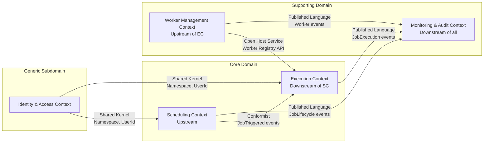

# 03 — DDD Bounded Contexts: Distributed Job Scheduler

## Objective
Define the bounded contexts that partition the scheduling domain, establish their context map (how they relate), and design anti-corruption layers that prevent model contamination across boundaries.

---

## 1. Bounded Contexts Overview

The system is divided into four primary bounded contexts:

| Bounded Context | Primary Responsibility | Core Aggregate |
|---|---|---|
| **Scheduling** | Define jobs, compute triggers, dispatch work | Job, Schedule |
| **Execution** | Run jobs, track lifecycle, manage retries | JobExecution, ExecutionResult |
| **Worker Management** | Track workers, route jobs, monitor health | Worker, WorkerPool |
| **Monitoring & Audit** | Observe system state, alert, audit trail | ExecutionSummary, AuditEntry |

Additionally, there is a supporting context:
- **Identity & Access** (Generic Subdomain) — User, Role, Permission, Namespace — handled by Spring Security + OAuth2, not modeled deeply here

---

## 2. Context Map



### Relationship Types

**SC → EC: Conformist**
The Execution context conforms to the Scheduling context's event schema (JobTriggered event). Execution does not try to reinterpret or translate — it takes the dispatch message as-is. If the Scheduling context changes its event schema, the Execution context must update to conform.

**Rational:** The two contexts have a natural producer-consumer relationship. The Scheduling context is the upstream authority on when jobs should run.

**WM → EC: Open Host Service**
The Worker Management context exposes a well-defined API (Worker Registry) that the Execution context calls to: discover available workers, check capacity, and register result callbacks. The Worker Management context maintains a stable contract regardless of internal implementation changes.

**EC → MA: Published Language**
The Execution context publishes a well-defined, versioned event schema (JobExecution events) that the Monitoring context subscribes to. The Monitoring context is purely downstream — it never influences execution decisions.

**IAM → SC, EC: Shared Kernel**
The `Namespace` and `UserId` value objects are shared between Identity/Access and the core contexts. This shared kernel is small and carefully governed — changes require coordination between teams.

---

## 3. Scheduling Bounded Context

### Responsibility
- Job lifecycle management (CRUD)
- Schedule definition and validation
- Next execution time computation
- Job dispatch (triggering, lock acquisition, outbox relay)
- Misfire policy enforcement

### Ubiquitous Language

| Term | Meaning |
|---|---|
| **Job** | A reusable unit of work with a definition and schedule |
| **Schedule** | The timing rule that determines when a Job fires |
| **Trigger** | A single firing event that spawns one execution |
| **Misfire** | A trigger that was missed because the system was down |
| **Next Execution Time** | The precomputed UTC timestamp of the next trigger |
| **Dispatch** | The act of publishing a trigger event to the execution queue |
| **Fencing Token** | A monotonic counter that prevents stale worker writes |

### Module Interface (Application Service)

```
SchedulingApplicationService:
  - registerJob(RegisterJobCommand) → JobId
  - updateJob(UpdateJobCommand) → void
  - pauseJob(PauseJobCommand) → void
  - resumeJob(ResumeJobCommand) → void
  - deleteJob(DeleteJobCommand) → void
  - triggerJobManually(ManualTriggerCommand) → ExecutionId
  - getJobById(JobId, Namespace) → JobDTO
  - listJobs(ListJobsQuery) → Page<JobDTO>
```

### Internal Components
- `SchedulerEngine` (domain service) — polling loop, lock acquisition, dispatch
- `CronParser` (infrastructure service) — delegates to CronUtils library
- `OutboxRelay` (infrastructure service) — polls outbox table, publishes to Kafka
- `JobRepository` (port) — PostgreSQL implementation

---

## 4. Execution Bounded Context

### Responsibility
- Consuming dispatch events and creating JobExecution records
- Routing executions to appropriate workers via Kafka partitioning
- Tracking execution lifecycle (QUEUED → EXECUTING → COMPLETED/FAILED)
- Retry orchestration
- Timeout monitoring
- DAG dependency resolution

### Ubiquitous Language

| Term | Meaning |
|---|---|
| **Execution** | A single attempt to run a Job |
| **Attempt** | One try within an execution; a retry is a new attempt |
| **Routing** | Assignment of an execution to a worker pool via Kafka partition key |
| **Fencing** | Rejection of stale writes using monotonic token comparison |
| **Timeout** | Hard deadline for an execution to complete |
| **DAG** | Directed acyclic graph of job dependencies |
| **Orphan** | An execution whose worker went offline mid-run |

### Module Interface (Application Service)

```
ExecutionApplicationService:
  - getExecutionById(ExecutionId) → ExecutionDTO
  - listExecutions(ListExecutionsQuery) → Page<ExecutionDTO>
  - cancelExecution(CancelExecutionCommand) → void
  - getExecutionLogs(ExecutionId) → LogReference
  - getDependencyGraph(JobId) → DAGView
```

### Internal Components
- `ExecutionLifecycleService` — handles state machine transitions
- `RetryOrchestrationService` — evaluates retry policy, creates retry executions
- `TimeoutMonitor` — periodic scan for timed-out executions (separate scheduled task)
- `DAGResolutionService` — evaluates dependency readiness
- `OrphanRecoveryService` — detects executions on dead workers, reschedules

---

## 5. Worker Management Bounded Context

### Responsibility
- Worker registration and deregistration
- Heartbeat tracking and liveness detection
- Capability-based routing (which workers can run which job types)
- Worker pool capacity management
- Load reporting (current vs max concurrent)

### Ubiquitous Language

| Term | Meaning |
|---|---|
| **Worker** | A node capable of executing jobs |
| **Capabilities** | Tags describing what a worker can execute (e.g., "gpu", "large-memory") |
| **Heartbeat** | Periodic signal from worker to indicate liveness |
| **Drain** | Graceful shutdown: accept no new jobs, complete in-flight |
| **Zone** | Availability zone for locality-aware routing |
| **Pool** | Logical group of workers sharing the same capabilities |

### Open Host Service (API exposed to Execution Context)

```
WorkerRegistryService:
  - registerWorker(WorkerRegistrationRequest) → WorkerId
  - heartbeat(WorkerId, LoadReport) → void
  - deregisterWorker(WorkerId) → void
  - getAvailableWorkers(WorkerType, Capabilities) → List<WorkerDTO>
  - getWorkerById(WorkerId) → WorkerDTO
```

This API is implemented over Redis (fast reads) with PostgreSQL as the audit/history store.

---

## 6. Monitoring & Audit Bounded Context

### Responsibility
- Aggregate execution metrics (success rate, latency, throughput)
- Maintain immutable audit log of all scheduling and config changes
- Expose dashboards and alerting hooks
- Expose historical query APIs (search by job, time range, status)
- DLQ monitoring and alerting

### Ubiquitous Language

| Term | Meaning |
|---|---|
| **Audit Entry** | Immutable record of a configuration change with who, what, when |
| **ExecutionSummary** | Denormalized read model for dashboard queries |
| **DLQ** | Dead-letter queue — executions that exhausted all retries |
| **Alert** | Condition-based notification (stuck job, high failure rate, DLQ growth) |
| **SLO** | Service-level objective — quantitative reliability target |

### Read Models (CQRS Projections)

The Monitoring context maintains its own read models, built by consuming events from the Execution and Scheduling contexts:

```
ExecutionSummaryProjection:
  - jobId, executionId, status, scheduledFor, startedAt, completedAt
  - duration (derived), latency (derived from scheduledFor → startedAt)
  - workerHostname, attemptNumber, namespace

JobHealthProjection:
  - jobId, successRate (last 24h), avgLatency, p99Latency, failureCount
  - lastSuccessAt, lastFailureAt, dlqCount
```

These projections are stored in Elasticsearch for fast aggregation and full-text search.

---

## 7. Anti-Corruption Layers

### ACL: Scheduling → Execution

When the Execution context receives a `JobTriggered` event from Kafka, an ACL translates the Scheduling context's event schema into the Execution context's internal model:

```
JobTriggeredEventACL:
  Incoming: SchedulingContext.JobTriggeredEvent {
    jobId, scheduleId, scheduledFor, fencingToken, params
  }
  Outgoing: ExecutionContext.CreateExecutionCommand {
    executionId (new UUID),
    jobId,
    triggerType: SCHEDULED,
    scheduledFor,
    fencingToken,
    executionContext: merged params snapshot
  }
```

This isolates the Execution context from Scheduling context schema changes.

### ACL: Worker Management → Execution

The Execution context calls the Worker Registry via a port/adapter pattern. The port interface is defined in the Execution context; the adapter translates to Redis calls:

```
WorkerRegistryPort (Execution context):
  - findEligibleWorkers(JobType, Set<Capability>) → List<WorkerId>

RedisWorkerRegistryAdapter (Infrastructure):
  - Calls Redis HSCAN on workers:{type}:{capability} hash
  - Returns WorkerIds that have active heartbeat within last 30s
```

### ACL: External Job Payload

When jobs are registered via API, job parameters may reference external secrets (vault paths, encrypted values). The Scheduling context has a `SecretResolutionACL` that resolves secret references at dispatch time — not at registration time — to avoid stale secrets.

---

## 8. Context Boundary Enforcement in Code

In the modular monolith, boundaries are enforced via:
1. **Package structure**: Each bounded context is a top-level package. Cross-package imports are prohibited except through defined application service interfaces.
2. **Module tests**: Each module has its own test scope; integration is only tested via the published API/event interface.
3. **Database schema namespacing**: PostgreSQL schemas (`scheduling`, `execution`, `worker_mgmt`, `monitoring`) enforce data ownership.
4. **Static analysis**: ArchUnit rules (in CI) prevent illegal cross-module dependencies.

---

## Interview Discussion Points

**Q: What happens when the Scheduling context needs data from the Execution context — e.g., to prevent triggering a job that's still running?**
A: The Scheduling context does NOT call the Execution context. Instead, the distributed lock (Redis SETNX keyed on job ID) prevents double dispatch. If a job is running, its lock is held. The Scheduling context's lock acquisition fails silently, and the job is skipped until the next poll. This avoids a cross-context synchronous dependency in the hot path.

**Q: Why is Worker Management a separate bounded context rather than infrastructure?**
A: Worker management has its own domain language (capabilities, draining, pool capacity) and evolves independently. In Phase 2, workers may be heterogeneous (GPU pools, ARM pools, cloud-burst workers) — having a distinct context allows modeling this richness without polluting the Execution or Scheduling contexts.

**Q: How do you handle schema evolution in cross-context Kafka events?**
A: Kafka events use Avro schemas registered in Confluent Schema Registry with backward-compatible evolution rules. The ACLs handle version negotiation. The Published Language pattern means the upstream context (Scheduling) is responsible for maintaining backward compatibility for at least two major versions.
