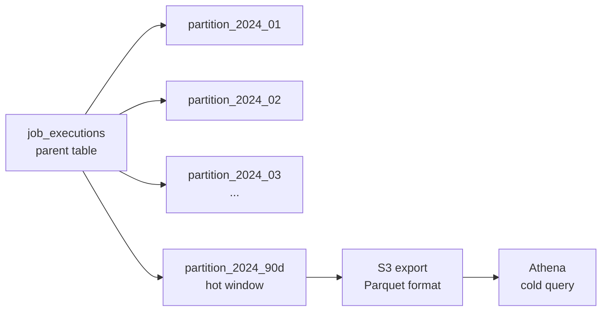

# 05 — Database Design: Distributed Job Scheduler

## Objective
Design the full PostgreSQL schema — tables, indexes, partitioning, locking strategy, archival, and sharding considerations — to support 10M registered jobs, 100k concurrent executions, and 90-day hot execution history with 2-year cold storage.

---

## 1. Database Architecture Overview

```
PostgreSQL (Primary + 2 Read Replicas)
├── Schema: scheduling
│   ├── jobs
│   ├── schedules
│   ├── job_dependencies
│   └── outbox_events
├── Schema: execution
│   ├── job_executions (partitioned by created_at, range monthly)
│   ├── execution_logs_refs
│   └── retry_policies
├── Schema: worker_mgmt
│   ├── workers (audit/history)
│   └── worker_capabilities
├── Schema: monitoring
│   ├── audit_log (partitioned by created_at)
│   └── dlq_entries
└── Schema: idempotency
    └── idempotency_keys
```

**Why PostgreSQL?**
- ACID transactions for job + schedule + outbox atomicity
- Row-level locking for optimistic concurrency
- Declarative partitioning for execution history scale
- Mature tooling for backup, replication, failover (Patroni + PgBouncer)
- JSONB for flexible job parameters without schema changes
- Native advisory locks available as fallback for distributed lock scenarios

---

## 2. Core Tables

### 2.1 `scheduling.jobs`

```sql
CREATE TABLE scheduling.jobs (
    job_id          UUID PRIMARY KEY DEFAULT gen_random_uuid(),
    namespace       VARCHAR(64) NOT NULL,
    name            VARCHAR(255) NOT NULL,
    description     TEXT,
    job_type        VARCHAR(32) NOT NULL,         -- HTTP | SHELL | GRPC | CUSTOM
    priority        SMALLINT NOT NULL DEFAULT 2,  -- 0=highest, 4=lowest
    job_group       VARCHAR(128),
    status          VARCHAR(32) NOT NULL DEFAULT 'ACTIVE',  -- ACTIVE|PAUSED|DELETED|ARCHIVED
    job_config      JSONB NOT NULL,               -- type-specific config (httpConfig, shellConfig, etc.)
    parameters      JSONB DEFAULT '{}',           -- default runtime parameters
    tags            JSONB DEFAULT '{}',           -- key-value tags for filtering
    created_by      VARCHAR(255) NOT NULL,
    updated_by      VARCHAR(255),
    created_at      TIMESTAMPTZ NOT NULL DEFAULT now(),
    updated_at      TIMESTAMPTZ NOT NULL DEFAULT now(),
    deleted_at      TIMESTAMPTZ,                  -- soft delete timestamp
    version         BIGINT NOT NULL DEFAULT 1,    -- optimistic lock version
    fence_token_seq BIGINT NOT NULL DEFAULT 0     -- monotonic fencing counter
);

-- Unique constraint: name is unique within namespace (for active jobs)
CREATE UNIQUE INDEX idx_jobs_namespace_name_active
    ON scheduling.jobs (namespace, name)
    WHERE status != 'DELETED';

-- Primary lookup indexes
CREATE INDEX idx_jobs_namespace_status ON scheduling.jobs (namespace, status);
CREATE INDEX idx_jobs_job_group ON scheduling.jobs (job_group, status);
CREATE INDEX idx_jobs_priority_status ON scheduling.jobs (priority, status);

-- Tag filtering (GIN index for JSONB containment queries)
CREATE INDEX idx_jobs_tags ON scheduling.jobs USING GIN (tags);
```

---

### 2.2 `scheduling.schedules`

```sql
CREATE TABLE scheduling.schedules (
    schedule_id         UUID PRIMARY KEY DEFAULT gen_random_uuid(),
    job_id              UUID NOT NULL REFERENCES scheduling.jobs(job_id) ON DELETE CASCADE,
    schedule_type       VARCHAR(32) NOT NULL,     -- CRON | INTERVAL | ONE_TIME | MANUAL
    cron_expression     VARCHAR(128),             -- nullable for non-CRON
    interval_seconds    BIGINT,                   -- nullable, for INTERVAL type
    fire_at             TIMESTAMPTZ,              -- nullable, for ONE_TIME type
    timezone            VARCHAR(64) NOT NULL DEFAULT 'UTC',
    start_at            TIMESTAMPTZ,              -- effective from (nullable = immediate)
    end_at              TIMESTAMPTZ,              -- expires at (nullable = never)
    next_execution_time TIMESTAMPTZ,              -- pre-computed, indexed for polling
    last_execution_time TIMESTAMPTZ,
    misfire_policy      VARCHAR(32) NOT NULL DEFAULT 'FIRE_ONCE',
    created_at          TIMESTAMPTZ NOT NULL DEFAULT now(),
    updated_at          TIMESTAMPTZ NOT NULL DEFAULT now()
);

-- THE most critical index in the entire system: scheduler polling query
-- Covers: WHERE next_execution_time <= now() AND status = 'ACTIVE'
-- (status join from jobs table via indexed join)
CREATE INDEX idx_schedules_next_execution
    ON scheduling.schedules (next_execution_time ASC)
    WHERE next_execution_time IS NOT NULL;

-- Job lookup
CREATE INDEX idx_schedules_job_id ON scheduling.schedules (job_id);
```

**Design Note on `next_execution_time`:**
This column is updated immediately after every trigger. The scheduler polling query is:
```sql
SELECT j.*, s.*
FROM scheduling.schedules s
JOIN scheduling.jobs j ON j.job_id = s.job_id
WHERE s.next_execution_time <= now() + INTERVAL '5 seconds'  -- 5s lookahead
  AND j.status = 'ACTIVE'
ORDER BY s.next_execution_time ASC
LIMIT 1000
FOR UPDATE SKIP LOCKED;  -- critical: multiple scheduler nodes don't collide
```
`FOR UPDATE SKIP LOCKED` allows multiple scheduler nodes (in active-active mode) to partition the work without blocking each other.

---

### 2.3 `scheduling.job_dependencies`

```sql
CREATE TABLE scheduling.job_dependencies (
    id                  BIGSERIAL PRIMARY KEY,
    job_id              UUID NOT NULL REFERENCES scheduling.jobs(job_id) ON DELETE CASCADE,
    depends_on_job_id   UUID NOT NULL REFERENCES scheduling.jobs(job_id),
    dependency_type     VARCHAR(32) NOT NULL DEFAULT 'SUCCESS',  -- SUCCESS | COMPLETION | CUSTOM
    time_window_seconds INT NOT NULL DEFAULT 3600,
    created_at          TIMESTAMPTZ NOT NULL DEFAULT now(),
    UNIQUE (job_id, depends_on_job_id)
);

CREATE INDEX idx_job_deps_job_id ON scheduling.job_dependencies (job_id);
CREATE INDEX idx_job_deps_depends_on ON scheduling.job_dependencies (depends_on_job_id);
```

---

### 2.4 `scheduling.outbox_events`

```sql
CREATE TABLE scheduling.outbox_events (
    event_id        UUID PRIMARY KEY DEFAULT gen_random_uuid(),
    aggregate_type  VARCHAR(64) NOT NULL,    -- 'Job' | 'JobExecution'
    aggregate_id    UUID NOT NULL,
    event_type      VARCHAR(128) NOT NULL,
    payload         JSONB NOT NULL,
    kafka_topic     VARCHAR(255) NOT NULL,
    kafka_key       VARCHAR(255) NOT NULL,
    status          VARCHAR(32) NOT NULL DEFAULT 'PENDING',  -- PENDING | PUBLISHED | FAILED
    created_at      TIMESTAMPTZ NOT NULL DEFAULT now(),
    published_at    TIMESTAMPTZ,
    retry_count     INT NOT NULL DEFAULT 0,
    error_message   TEXT
);

CREATE INDEX idx_outbox_pending ON scheduling.outbox_events (created_at ASC)
    WHERE status = 'PENDING';
```

**Outbox relay process:** Dedicated thread polls `PENDING` rows every 100ms, publishes to Kafka, marks as `PUBLISHED`. Rows are deleted after 24h (cleanup job).

---

### 2.5 `execution.job_executions` (Partitioned)

```sql
CREATE TABLE execution.job_executions (
    execution_id        UUID NOT NULL DEFAULT gen_random_uuid(),
    job_id              UUID NOT NULL,
    namespace           VARCHAR(64) NOT NULL,
    trigger_type        VARCHAR(32) NOT NULL,         -- SCHEDULED | MANUAL | DEPENDENCY | RETRY
    triggered_by        VARCHAR(255),                 -- user or system identifier
    scheduled_for       TIMESTAMPTZ,                  -- original scheduled time
    queued_at           TIMESTAMPTZ NOT NULL DEFAULT now(),
    started_at          TIMESTAMPTZ,
    completed_at        TIMESTAMPTZ,
    status              VARCHAR(32) NOT NULL DEFAULT 'QUEUED',
    worker_id           VARCHAR(255),
    attempt_number      SMALLINT NOT NULL DEFAULT 1,
    retry_of            UUID,                         -- parent execution for retries
    fencing_token       BIGINT NOT NULL,
    execution_context   JSONB NOT NULL DEFAULT '{}',  -- merged params at dispatch time
    result_exit_code    SMALLINT,
    result_summary      TEXT,
    result_log_ref      TEXT,                         -- S3/GCS URI to full log
    failure_reason      TEXT,
    created_at          TIMESTAMPTZ NOT NULL DEFAULT now(),
    updated_at          TIMESTAMPTZ NOT NULL DEFAULT now(),
    PRIMARY KEY (execution_id, created_at)            -- composite PK required for partitioned table
) PARTITION BY RANGE (created_at);

-- Monthly partitions (created via automation)
CREATE TABLE execution.job_executions_2024_01
    PARTITION OF execution.job_executions
    FOR VALUES FROM ('2024-01-01') TO ('2024-02-01');

CREATE TABLE execution.job_executions_2024_02
    PARTITION OF execution.job_executions
    FOR VALUES FROM ('2024-02-01') TO ('2024-03-01');
-- ... and so on
```

**Partition management strategy:**
- New partitions created 30 days in advance via cron job
- Partitions older than 90 days are exported to S3 as Parquet (via pg_dump or COPY TO)
- After export verification, old partitions are dropped: `DROP TABLE execution.job_executions_2024_01`
- Athena table points to S3 for historical queries

**Indexes on each partition (inherited from parent table):**

```sql
CREATE INDEX idx_executions_job_id ON execution.job_executions (job_id, created_at DESC);
CREATE INDEX idx_executions_status ON execution.job_executions (status, created_at DESC)
    WHERE status IN ('QUEUED', 'EXECUTING', 'RETRYING');  -- partial index
CREATE INDEX idx_executions_worker ON execution.job_executions (worker_id, status)
    WHERE status = 'EXECUTING';
CREATE INDEX idx_executions_namespace_created ON execution.job_executions (namespace, created_at DESC);
```

---

### 2.6 Distributed Lock Table (PostgreSQL fallback)

While Redis is the primary lock store, a PostgreSQL lock table serves as the canonical record:

```sql
CREATE TABLE execution.distributed_locks (
    lock_key        VARCHAR(512) PRIMARY KEY,     -- e.g., "job-lock::{job_id}"
    holder_id       VARCHAR(255) NOT NULL,         -- scheduler or worker node ID
    fencing_token   BIGINT NOT NULL,
    acquired_at     TIMESTAMPTZ NOT NULL DEFAULT now(),
    expires_at      TIMESTAMPTZ NOT NULL,
    heartbeat_at    TIMESTAMPTZ NOT NULL DEFAULT now()
);

CREATE INDEX idx_locks_expires ON execution.distributed_locks (expires_at);
```

**Usage:** Lock is primarily managed in Redis. The PostgreSQL lock table is written as an audit record and used for recovery when Redis is unavailable (fall back to PostgreSQL advisory locks on `lock_key` hash).

---

### 2.7 `monitoring.audit_log` (Partitioned)

```sql
CREATE TABLE monitoring.audit_log (
    id              BIGSERIAL,
    namespace       VARCHAR(64) NOT NULL,
    entity_type     VARCHAR(64) NOT NULL,         -- 'Job' | 'Schedule' | 'Worker'
    entity_id       UUID NOT NULL,
    action          VARCHAR(64) NOT NULL,         -- 'CREATE' | 'UPDATE' | 'DELETE' | 'PAUSE' etc.
    actor           VARCHAR(255) NOT NULL,        -- user or system
    actor_ip        INET,
    before_snapshot JSONB,                        -- state before change
    after_snapshot  JSONB,                        -- state after change
    metadata        JSONB DEFAULT '{}',
    created_at      TIMESTAMPTZ NOT NULL DEFAULT now(),
    PRIMARY KEY (id, created_at)
) PARTITION BY RANGE (created_at);

-- Audit log is IMMUTABLE: no UPDATE or DELETE after insert
-- Enforced via row-level security policy:
ALTER TABLE monitoring.audit_log ENABLE ROW LEVEL SECURITY;
CREATE POLICY audit_insert_only ON monitoring.audit_log FOR ALL USING (false) WITH CHECK (true);
-- (Only INSERT allowed; all other operations denied to application role)
```

---

### 2.8 `monitoring.dlq_entries`

```sql
CREATE TABLE monitoring.dlq_entries (
    dlq_id          UUID PRIMARY KEY DEFAULT gen_random_uuid(),
    job_id          UUID NOT NULL,
    execution_id    UUID NOT NULL,
    namespace       VARCHAR(64) NOT NULL,
    failure_reason  TEXT NOT NULL,
    attempt_count   SMALLINT NOT NULL,
    original_params JSONB NOT NULL,
    enqueued_at     TIMESTAMPTZ NOT NULL DEFAULT now(),
    resolved_at     TIMESTAMPTZ,
    resolution      VARCHAR(32),                  -- 'RETRIED' | 'DISCARDED' | 'PENDING'
    resolved_by     VARCHAR(255)
);

CREATE INDEX idx_dlq_namespace_pending ON monitoring.dlq_entries (namespace, enqueued_at DESC)
    WHERE resolved_at IS NULL;
```

---

### 2.9 `idempotency.idempotency_keys`

```sql
CREATE TABLE idempotency.idempotency_keys (
    idempotency_key VARCHAR(255) NOT NULL,
    namespace       VARCHAR(64) NOT NULL,
    endpoint        VARCHAR(255) NOT NULL,
    status_code     SMALLINT NOT NULL,
    response_body   JSONB NOT NULL,
    created_at      TIMESTAMPTZ NOT NULL DEFAULT now(),
    expires_at      TIMESTAMPTZ NOT NULL DEFAULT now() + INTERVAL '24 hours',
    PRIMARY KEY (idempotency_key, namespace)
);

CREATE INDEX idx_idempotency_expires ON idempotency.idempotency_keys (expires_at);
```

---

## 3. Indexing Strategy Summary

| Table | Critical Index | Purpose |
|---|---|---|
| `schedules` | `(next_execution_time ASC)` | Scheduler polling |
| `job_executions` | `(job_id, created_at DESC)` | Per-job history lookup |
| `job_executions` | `(status) WHERE QUEUED OR EXECUTING` | Orphan detection, status counts |
| `jobs` | `(namespace, status)` | Tenant job listing |
| `jobs` | `GIN(tags)` | Tag-based filtering |
| `outbox_events` | `(created_at) WHERE PENDING` | Outbox relay polling |
| `dlq_entries` | `(namespace, enqueued_at) WHERE unresolved` | DLQ dashboard |
| `audit_log` | `(entity_id, created_at DESC)` | Entity change history |

---

## 4. Optimistic Locking

The `jobs` table uses `version` for optimistic locking:

```sql
-- Update with version check
UPDATE scheduling.jobs
SET    name = $1, updated_at = now(), version = version + 1
WHERE  job_id = $2
  AND  version = $3  -- caller provides expected version
RETURNING version;
-- If 0 rows returned → version mismatch → throw OptimisticLockException
```

---

## 5. Read Replica Strategy

| Query Type | Target |
|---|---|
| Scheduler polling (due jobs) | Primary (needs consistency) |
| API: GET job details | Read replica |
| API: list executions | Read replica |
| API: execution history search | Elasticsearch (separate) |
| Worker: fetch job definition | Read replica (with Redis cache) |
| Result processor: update execution | Primary |

Read replicas are configured with synchronous replication for the `scheduling` schema and asynchronous for the `monitoring` schema (acceptable eventual consistency for dashboards).

---

## 6. Partitioning Strategy



**Partition lifecycle:**
1. Auto-create new monthly partition 30 days ahead
2. Mark partition older than 90 days as "cooling"
3. Run COPY TO S3 in Parquet format
4. Verify S3 row count matches PostgreSQL count
5. Drop old partition
6. Update Athena external table manifest

---

## 7. Data Archival Strategy

| Data Type | Hot Storage | Archive Trigger | Archive Target | Query Method |
|---|---|---|---|---|
| Job executions | PostgreSQL (partitioned) | > 90 days | S3 Parquet | Athena |
| Audit log | PostgreSQL (partitioned) | > 1 year | S3 Parquet + Glacier | Athena + manual |
| Job definitions | PostgreSQL (always hot) | DELETED + > 2 years | S3 JSON | API import/export |
| Worker history | PostgreSQL | > 30 days | S3 CSV | Athena |

---

## Interview Discussion Points

**Q: Why partition by `created_at` on job_executions instead of by `job_id`?**
A: Execution queries are almost always time-range based (last 24h, this week). Partitioning by time aligns with query patterns and allows clean archival — drop a whole time partition without touching other data. Partitioning by `job_id` would require querying all partitions for any time-range query.

**Q: How do you handle the `next_execution_time` update atomically with job dispatch?**
A: The scheduler uses a single transaction: (1) acquire row-level lock with `FOR UPDATE SKIP LOCKED`, (2) calculate new `next_execution_time`, (3) update `schedules` row, (4) insert into `outbox_events`. All in one transaction. If the transaction fails, no outbox entry exists, so no dispatch occurs. The outbox relay then handles Kafka delivery separately.

**Q: What's the risk of `FOR UPDATE SKIP LOCKED` with multiple scheduler nodes?**
A: In active-passive mode, only one node runs this query, so no contention. In active-active mode, each node claims a different batch of rows — they don't block each other (`SKIP LOCKED` skips already-locked rows). The risk is row starvation if one node holds locks very long — mitigated by short transaction scope.
