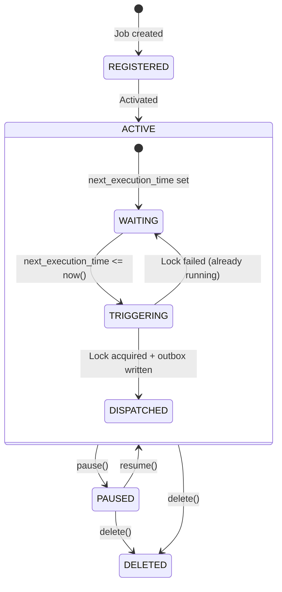
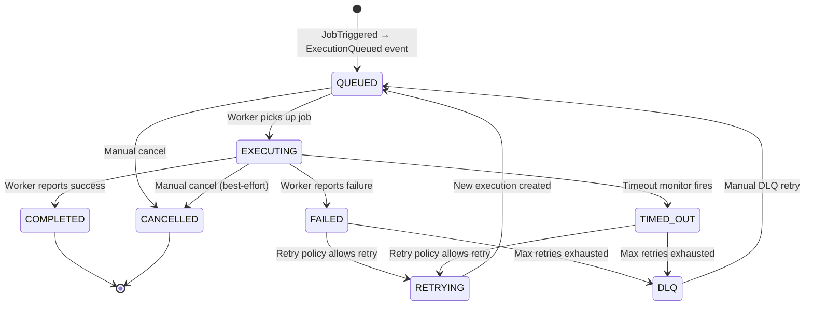
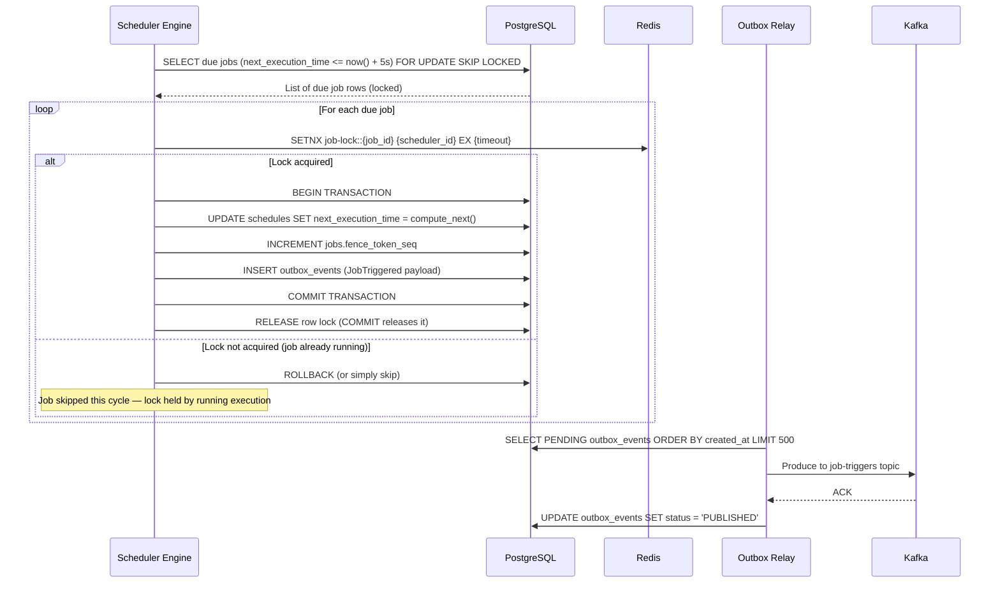
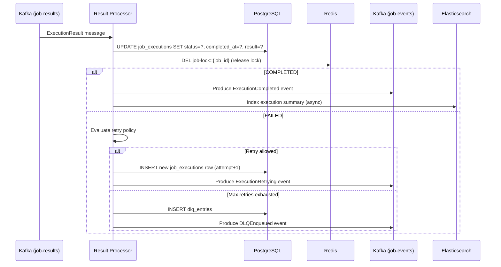
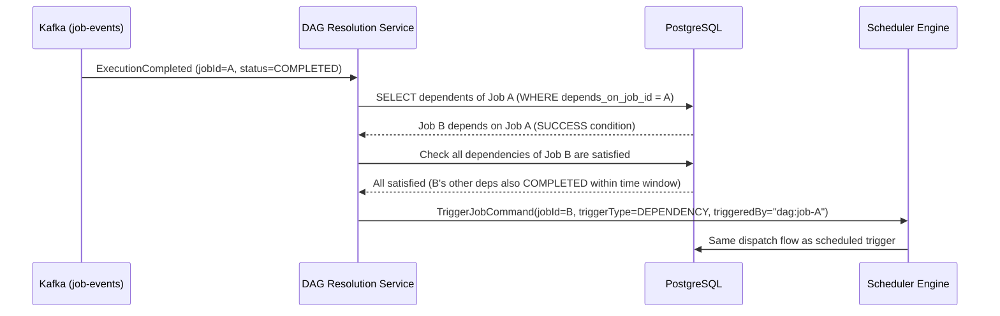

# 06 — Event Flow: Distributed Job Scheduler

## Objective
Define the complete event-driven flow for job scheduling and execution — from trigger detection through execution lifecycle to result recording — including Kafka topic design, outbox pattern, event sourcing considerations, and failure handling.

---

## 1. Job Lifecycle State Machine



---

## 2. Execution Lifecycle State Machine



---

## 3. End-to-End Event Flow

### Phase 1: Job Trigger Detection and Dispatch



### Phase 2: Worker Pickup and Execution

```mermaid
sequenceDiagram
    participant KF as Kafka (job-triggers)
    participant WK as Worker
    participant PG as PostgreSQL
    participant RD as Redis
    participant KR as Kafka (job-results)

    KF->>WK: JobTriggered message (jobId, executionId, fencingToken, params)
    WK->>RD: GET job-metadata::{job_id} (cache check)
    alt Cache miss
        WK->>PG: SELECT * FROM jobs WHERE job_id = ?
        WK->>RD: SET job-metadata::{job_id} EX 300 (5min cache)
    end
    WK->>PG: UPDATE job_executions SET status='EXECUTING', started_at=now(), worker_id=?
                WHERE execution_id=? AND fencing_token=?
    Note over WK: If fencing_token mismatch → abort (stale dispatch)
    
    WK->>WK: Execute job logic (HTTP call / shell / gRPC)
    WK-->>WK: Job completes (success or failure)
    
    WK->>KR: Produce ExecutionResult message (executionId, status, exitCode, logRef)
    KF-->>WK: COMMIT offset (after result published)
```

### Phase 3: Result Processing



---

## 4. Outbox Pattern Deep Dive

The outbox pattern guarantees that events are published to Kafka **if and only if** the database transaction commits. Without it, the scheduler could update `next_execution_time` but crash before publishing to Kafka — losing the trigger.

### Write Path
1. Application logic and outbox insert happen in the **same database transaction**
2. Outbox row contains: `aggregate_id`, `event_type`, `payload` (JSON), `kafka_topic`, `kafka_key`, `status=PENDING`
3. Transaction commits → both changes durable

### Relay Path
1. Outbox relay polls `PENDING` rows with a short interval (100ms)
2. For each row: publish to Kafka with configured topic and key
3. On Kafka ACK: mark row as `PUBLISHED`
4. On Kafka error: increment `retry_count`; after 5 retries, mark as `FAILED` (alert + manual intervention)
5. Cleanup: delete `PUBLISHED` rows older than 24h

### Guarantees
- **At-least-once** delivery to Kafka (relay may retry after Kafka timeout)
- **Exactly-once** dispatch is achieved by idempotent Kafka producer (`enable.idempotence=true`, `transactional.id`) combined with deduplication at the consumer side using `executionId`

---

## 5. Event Sourcing Consideration

**Question:** Should the system use event sourcing (store events as the source of truth, derive state via replay)?

**Analysis:**

| Aspect | Event Sourcing | Current Approach (State + Events) |
|---|---|---|
| Audit trail | Built-in — all changes are events | Requires explicit audit log |
| Complexity | High — projections, snapshots, eventual consistency | Lower — direct state mutations |
| Query patterns | Complex — must project for every read | Simple — direct SQL |
| Time travel | Natural | Requires point-in-time recovery |
| Team familiarity | Requires specific expertise | Standard CRUD |

**Decision: Hybrid approach — NOT full event sourcing.**

Rationale:
- Full event sourcing adds significant operational complexity (projection rebuilds, snapshot management)
- The system already has a clean event model via domain events + outbox
- Audit requirements are met by the immutable `audit_log` table
- Execution history is effectively an event log of state transitions
- The only benefit event sourcing would add (time-travel queries) is not a core requirement

**If event sourcing were needed (Phase 3):**
The Execution context is the best candidate. `job_executions` already reads like an event log. Migrating to full event sourcing here would allow: replay of execution history, re-projection with new aggregation logic, and debugging of complex retry chains.

---

## 6. Kafka Topic Design

| Topic | Partitions | Retention | Producer | Consumer |
|---|---|---|---|---|
| `job-triggers` | 64 | 7 days | Outbox Relay | Worker Pool (consumer group per worker type) |
| `job-results` | 32 | 7 days | Workers | Result Processor |
| `job-events` | 16 | 30 days | Result Processor, Scheduler Engine | Monitoring Context, DAG Service, Webhooks |
| `job-dlq` | 8 | 90 days | Result Processor | DLQ Monitor, Manual retry handler |

**Partition key strategy:**
- `job-triggers`: key = `{job_group}::{job_id}`. Ensures all triggers for the same job group go to the same partition (ordering within group). Single job triggers are always ordered.
- `job-results`: key = `{execution_id}`. Distribution across all partitions.
- `job-events`: key = `{job_id}`. All events for a job are ordered.
- `job-dlq`: key = `{namespace}`. Namespace-level ordering for DLQ management.

---

## 7. Consumer Group Design

```
Workers (HTTP):   consumer-group = workers-http,    subscribes to job-triggers (only HTTP partitions via filter)
Workers (Shell):  consumer-group = workers-shell,   subscribes to job-triggers
Workers (gRPC):   consumer-group = workers-grpc,    subscribes to job-triggers
Result Processor: consumer-group = result-processor, subscribes to job-results
Monitoring:       consumer-group = monitoring,       subscribes to job-events
DAG Service:      consumer-group = dag-resolution,   subscribes to job-events
Webhook Relay:    consumer-group = webhook-relay,    subscribes to job-events (filtered)
DLQ Monitor:      consumer-group = dlq-monitor,      subscribes to job-dlq
```

**Worker type filtering:** Workers filter on `job_type` header in the Kafka message header (not payload). This avoids deserializing the payload to determine eligibility. Workers configured for HTTP do not process SHELL triggers.

---

## 8. Event Schema (Avro)

### JobTriggered Event
```json
{
  "eventId": "uuid",
  "eventType": "JobTriggered",
  "schemaVersion": "1.0",
  "jobId": "uuid",
  "executionId": "uuid",
  "namespace": "string",
  "jobType": "HTTP | SHELL | GRPC | CUSTOM",
  "priority": "integer (0-4)",
  "jobGroup": "string",
  "scheduledFor": "ISO-8601 timestamp",
  "triggeredAt": "ISO-8601 timestamp",
  "triggerType": "SCHEDULED | MANUAL | DEPENDENCY | RETRY",
  "fencingToken": "long",
  "attemptNumber": "integer",
  "executionContext": {
    "params": "map<string, string>",
    "secrets": "map<string, string>"
  },
  "correlationId": "string (trace ID)"
}
```

### ExecutionResult Event
```json
{
  "eventId": "uuid",
  "eventType": "ExecutionResult",
  "schemaVersion": "1.0",
  "executionId": "uuid",
  "jobId": "uuid",
  "workerId": "string",
  "status": "COMPLETED | FAILED | TIMED_OUT",
  "exitCode": "integer",
  "outputSummary": "string (≤1KB)",
  "logReference": "URI",
  "startedAt": "ISO-8601",
  "completedAt": "ISO-8601",
  "durationMs": "long",
  "fencingToken": "long",
  "attemptNumber": "integer",
  "errorMessage": "string (nullable)",
  "correlationId": "string"
}
```

---

## 9. DAG Execution Flow



---

## 10. Event Ordering Guarantees

| Guarantee | Mechanism |
|---|---|
| All events for a job ordered | Same Kafka partition (key = job_id) |
| At-least-once delivery | Outbox pattern + Kafka producer retries |
| Exactly-once processing | Idempotency check in Result Processor (executionId) |
| No event lost on crash | Outbox persisted before Kafka publish |
| No duplicate trigger | Distributed lock (Redis SETNX) |
| Stale result rejection | Fencing token check in database update |

---

## Interview Discussion Points

**Q: What happens if the outbox relay crashes after publishing to Kafka but before marking the row as PUBLISHED?**
A: The outbox relay retries the row on next poll. Kafka receives a duplicate message. The consumer (worker) sees two identical `JobTriggered` events with the same `executionId`. The Result Processor's idempotency check (keyed on `executionId`) deduplicates the result. The distributed lock ensures only one worker starts executing — the second consumer's lock acquisition fails.

**Q: Why not use Kafka transactions (exactly-once semantics at the Kafka level)?**
A: Kafka transactions would give exactly-once between producers and consumers, but the critical gap is between the database write and Kafka produce. Kafka transactions don't span database boundaries. The outbox pattern is the correct solution for cross-system exactly-once semantics.

**Q: How does the DAG resolution handle a failed dependency?**
A: By default, a failed dependency does not trigger downstream jobs. The `dependency_type = SUCCESS` condition is not met. If the job is configured with `dependency_type = COMPLETION` (either success or failure), it triggers regardless. After the time window expires without resolution, the downstream job is marked as `DEPENDENCY_TIMEOUT` and goes to DLQ.
