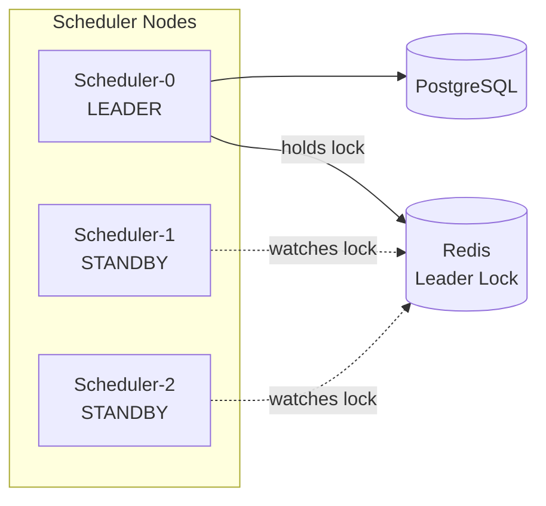
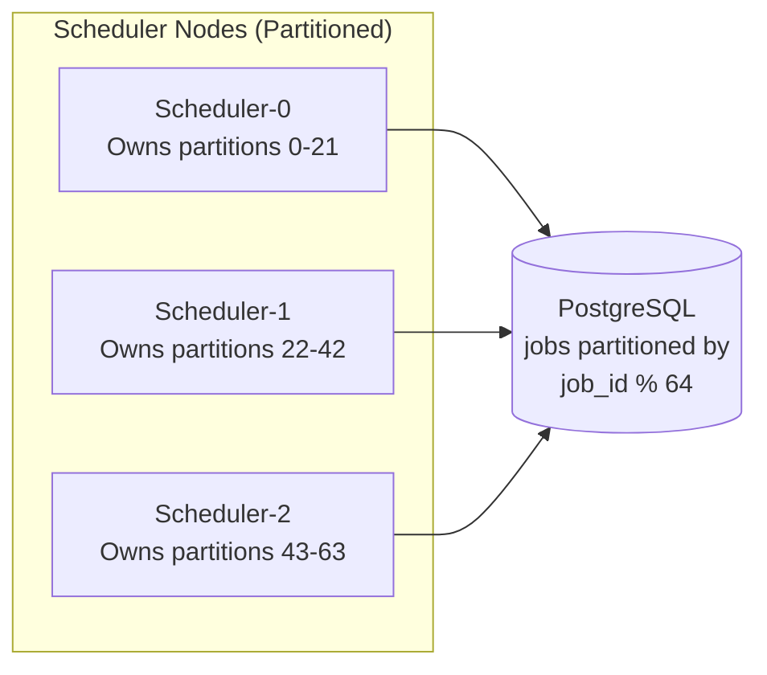
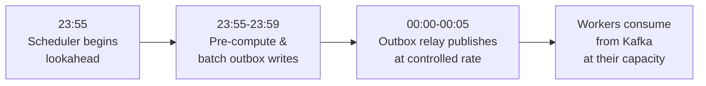
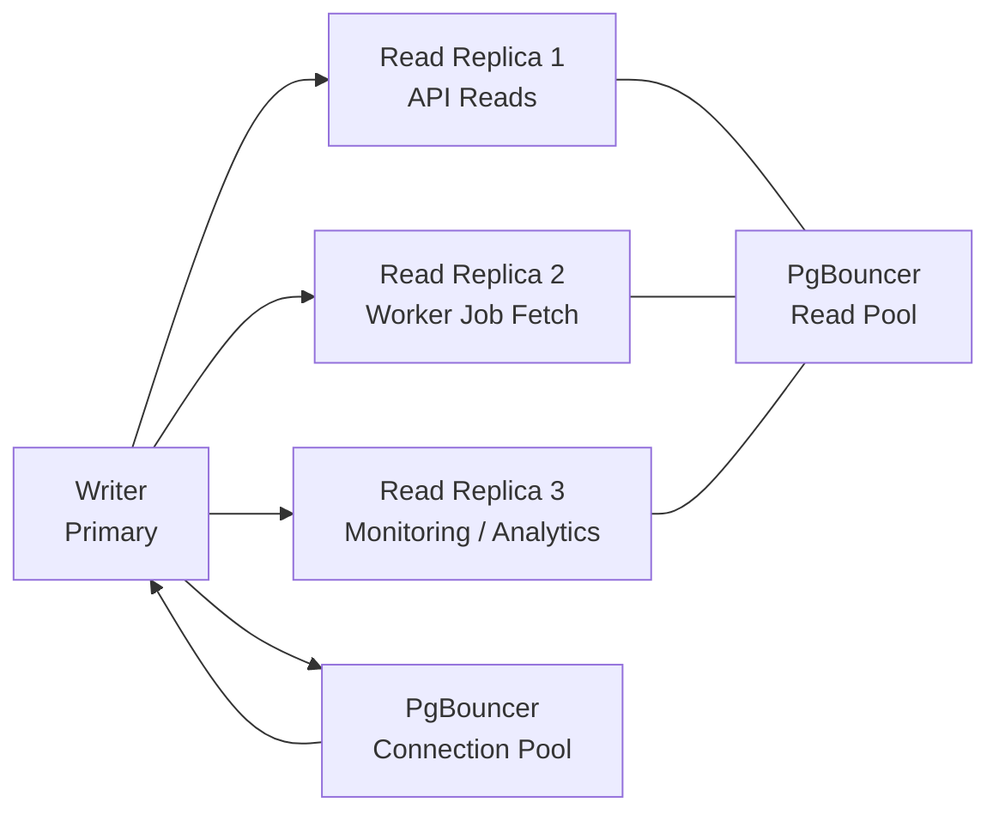

# 07 — Scaling Strategy: Distributed Job Scheduler

## Objective
Define how each system component scales horizontally and vertically, how to manage the midnight cron spike and other bursty load patterns, and what the limiting bottlenecks are at each scale tier.

---

## 1. Scaling Tiers

| Tier | Jobs | Concurrent Executions | Approach |
|---|---|---|---|
| MVP | <100k | <1k | Single-node scheduler, PostgreSQL, no Redis cluster |
| Phase 1 | <1M | <10k | Active-passive scheduler HA, Redis Sentinel, Kafka |
| Phase 2 | <10M | <100k | Active-active scheduler (partitioned), Kafka scale-out, read replicas |
| Phase 3 | >10M | >100k | Multi-region, sharded PostgreSQL, active-active everything |

---

## 2. Scheduler Engine Scaling

### Phase 1: Active-Passive (Leader Election)



**Leader election mechanism:**
- All nodes attempt `SET scheduler-leader {node_id} NX EX 30` on Redis
- Leader refreshes lock every 10 seconds (1/3 of TTL)
- If refresh fails (Redis unavailable), leader steps down
- Follower nodes poll for leader key absence; first to acquire becomes leader
- Failover time: ≤ TTL (30 seconds) — configurable, tradeoff between safety and recovery speed

**Capacity:** One scheduler node handles polling 1M active schedules via the indexed `next_execution_time` query. Each poll takes ~10-50ms (index scan, not full table scan).

### Phase 2: Active-Active (Partitioned Scheduler)



**Partition assignment:**
- Jobs are hash-partitioned by `job_id`: `partition = hash(job_id) % num_scheduler_nodes`
- Each scheduler node queries only its assigned partitions: `WHERE job_id % 3 = 0`
- When a node is added/removed, consistent hashing redistributes partitions gradually
- Each node independently polls and dispatches without coordination
- Double dispatch is still prevented by Redis distributed lock (partition assignment minimizes contention, lock eliminates it)

**Capacity:** 3 scheduler nodes each handle 3M jobs → supports 9M+ active schedules. Linear scaling.

---

## 3. Worker Pool Scaling

### Horizontal Autoscaling (KEDA)

Workers are stateless K8s Deployments. KEDA (Kubernetes Event-Driven Autoscaling) scales based on Kafka consumer lag:

```yaml
ScaledObject:
  triggers:
    - type: kafka
      metadata:
        topic: job-triggers
        consumerGroup: workers-http
        lagThreshold: "1000"    # scale up when lag > 1000 messages
        minReplicas: 10         # never scale below 10 (cold start penalty)
        maxReplicas: 5000       # hard cap (resource limits)
```

**Scale-up event:** Kafka lag > 1000 → KEDA increases replicas by 10% per 30-second window (configurable)
**Scale-down:** Kafka lag < 100 for 5 consecutive minutes → gradual scale-down (connection draining first)

### Worker Capacity Math

```
Target: 100,000 concurrent executions
Average execution time: 30 seconds
New jobs/second: 100,000 / 30 = 3,333/sec
Kafka peak throughput needed: 3,333 messages/sec = trivial for Kafka

Worker pod capacity: 10 concurrent executions per pod (configurable)
Pods needed: 100,000 / 10 = 10,000 pods

K8s node capacity (c5.4xlarge, 16 vCPU, 32GB): ~20 worker pods
Nodes needed: 10,000 / 20 = 500 nodes

With cluster autoscaler: nodes scale from 50 (idle) to 500 (peak) automatically
```

### Priority-Based Worker Pools

Instead of a single worker pool, maintain priority-specific pools to ensure high-priority jobs are not starved by low-priority floods:

| Pool | Topic | Priority | Pod Count |
|---|---|---|---|
| Critical | `job-triggers-p0` | P0 | Fixed 50 (never scaled down) |
| High | `job-triggers-p1` | P1 | Min 20, Max 500 |
| Normal | `job-triggers-p2-p3` | P2, P3 | Min 10, Max 2000 |
| Bulk | `job-triggers-p4` | P4 | Min 5, Max 5000 |

---

## 4. The Midnight Cron Spike Problem

### Problem Description
If 10% of 1M active jobs have a cron expression that fires at midnight (`0 0 * * *`), that's 100,000 jobs triggered simultaneously. The dispatch storm must not:
- Overwhelm PostgreSQL with outbox writes
- Overwhelm Kafka with burst produce load
- Overwhelm workers beyond their capacity

### Solution: Scheduler Lookahead with Rate Limiting



**Lookahead window:** Scheduler detects burst (>10k jobs due in next 5 min window) and pre-loads outbox rows starting 5 minutes early.

**Rate limiting the outbox relay:**
- Outbox relay respects a configurable dispatch rate: default 5,000 messages/sec to Kafka
- For the midnight spike (100k jobs), dispatch takes: 100,000 / 5,000 = 20 seconds
- No job is lost; execution starts are smoothed over 20 seconds instead of a 0-second burst

**Worker pre-warming:**
- KEDA watches a custom metric: "jobs due in next 5 minutes" (pre-computed by scheduler, exposed via Prometheus)
- HPA scales workers UP before the burst, not reactively
- Eliminates cold-start lag at midnight

**Burst Kafka capacity:**
- Kafka is already sized for 50,000 messages/sec sustained
- Midnight spike at 100,000 messages in 20 seconds = 5,000/sec — within normal operating range

### Jitter for Recurring Jobs

For jobs where the exact start time is not critical (e.g., cache warm-up, cleanup tasks), a configurable `startDelayJitter` allows the scheduler to add random delay (0 to N seconds) to smooth burst dispatch:

```
cronExpression: "0 0 * * *"
startDelayJitterSeconds: 300  # random delay 0-300s after midnight
```

This is analogous to AWS Lambda's `Random offset` for EventBridge Scheduler.

---

## 5. Database Scaling

### Read Replica Strategy



**Replica lag tolerance:**
- Scheduler polling: PRIMARY only (requires latest `next_execution_time`)
- Worker job definition fetch: replica (stale reads tolerated — job params change rarely)
- API history queries: replica (5-10s lag acceptable for dashboard)
- Execution status writes: PRIMARY

### Connection Pooling

PgBouncer in transaction-pooling mode:
- Max connections to PostgreSQL: 200 (PostgreSQL limit ~500)
- Max client connections: 10,000 (application threads)
- Pool mode: transaction (connection held only during active query, not for full request lifecycle)

### Vertical Scaling Triggers

| Metric | Threshold | Action |
|---|---|---|
| PostgreSQL CPU | >70% sustained | Upgrade instance class |
| Scheduler query time | >100ms | Investigate index / partition pruning |
| Outbox table size | >10M PENDING rows | Investigate Kafka connectivity |
| Lock contention | >5% lock wait ratio | Review lock acquisition patterns |

---

## 6. Redis Scaling

### Phase 1: Redis Sentinel

```
3 Redis nodes: 1 primary + 2 replicas
Redis Sentinel: 3 sentinel processes (quorum=2) for automatic failover
Failover time: 10-30 seconds (configurable in Sentinel)
```

### Phase 2: Redis Cluster

```
6 nodes: 3 primary shards + 3 replicas (one replica per shard)
Shards: 16,384 hash slots divided across 3 primaries
Data types per shard:
  - Shard 0 (hash slots 0-5460): job-locks, job-metadata-cache
  - Shard 1 (hash slots 5461-10922): worker-registry, worker-heartbeats
  - Shard 2 (hash slots 10923-16383): rate-limiting, idempotency keys
```

**Lock operations in Redis Cluster:**
Distributed locks using Redis Cluster require all lock keys to hash to the same slot for multi-key operations. Use hash tags: `{job-lock}::{job_id}` — the `{job-lock}` tag ensures the key always routes to the same shard.

---

## 7. Kafka Scaling

### Partition Scaling Math

```
job-triggers topic: 64 partitions
Target throughput: 5,000 messages/sec = 78 messages/sec/partition (healthy)
Peak throughput: 50,000 messages/sec = 781 messages/sec/partition (still OK)

Each Kafka broker handles ~1GB/sec throughput
Message size: ~2KB average (job params)
5,000 × 2KB = 10MB/sec — easily handled by a 3-broker cluster
```

**Scaling trigger:** Increase partitions when per-partition lag > 10,000 consistently. Note: partitions can only be increased, never decreased. Plan partition count conservatively higher.

### Kafka Cluster Sizing

| Phase | Brokers | Partitions (job-triggers) | Throughput |
|---|---|---|---|
| Phase 1 | 3 | 32 | 10k msg/sec |
| Phase 2 | 6 | 64 | 50k msg/sec |
| Phase 3 | 12+ | 128 | 200k msg/sec |

---

## 8. Hot Partition Problem

### Cause
If jobs are partitioned by `job_group` and one group (e.g., "analytics") contains 80% of all jobs, one Kafka partition receives 80% of traffic. Consumers on that partition lag; others sit idle.

### Solutions

**Option 1: Partition by job_id (not job_group)**
- Distributes load evenly
- Loses ordering guarantee within a job_group
- Acceptable for most use cases

**Option 2: Two-level partitioning**
- Kafka partition key: `{job_group}_{hash(job_id) % sub_partition_factor}`
- Maintains group-level ordering within sub-partitions
- More complex routing logic

**Option 3: Sticky partition rotation**
- Hot partitions detected via Prometheus metric: per-partition message rate
- Alert when one partition exceeds 3x average rate
- Operator manually adjusts partition strategy (requires consumer group rebalance)

---

## 9. Bottleneck Analysis by Scale

| Scale | First Bottleneck | Solution |
|---|---|---|
| 10k jobs | Nothing — single node works fine | — |
| 100k jobs | Scheduler polling — table scan | Add `next_execution_time` index |
| 1M jobs | Outbox table write contention | Batch outbox writes, async relay |
| 10M jobs | Scheduler single-node throughput | Active-active partitioned scheduler |
| 100M jobs | PostgreSQL single primary writes | Read replicas + sharding (Citus) |

---

## Interview Discussion Points

**Q: What's the single biggest scaling challenge in a job scheduler?**
A: The dual challenge of the "thundering herd" (burst at midnight) and "exactly-once dispatch" (preventing double execution as you add scheduler nodes). These two requirements pull in opposite directions — solving thundering herd wants more parallelism (more scheduler nodes), but more parallelism increases double-dispatch risk. The solution is the combination of active-active partitioned scheduling (for throughput) + Redis distributed locks (for correctness).

**Q: How would you handle 1 billion scheduled jobs?**
A: PostgreSQL cannot handle 1B rows in a single jobs table efficiently. You'd need: (1) horizontal sharding by namespace (Citus or application-level sharding), (2) job archival — inactive/deleted jobs move to cold storage, (3) tiered storage — hot jobs (due in next 7 days) in memory/Redis, warm jobs in PostgreSQL, cold jobs in S3 fetched on demand, (4) scheduler partitioning across hundreds of nodes with consistent hashing.

**Q: Why not just use a distributed cache (Redis) as the job store instead of PostgreSQL?**
A: Redis doesn't provide durability guarantees sufficient for a job store. Redis AOF persistence has replication lag, and if all Redis nodes fail simultaneously (rare but possible), all unexecuted job schedules are lost. PostgreSQL with WAL + streaming replication is the durable source of truth. Redis is the performance layer, not the durability layer.
