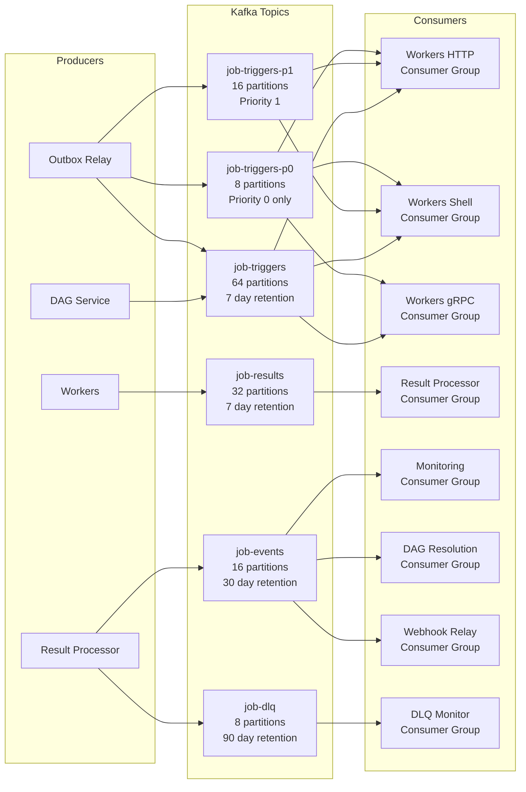

# 10 — Message Queue Design: Distributed Job Scheduler

## Objective
Design the Kafka-based messaging layer: topic structure, partitioning, consumer group strategy, message schemas, priority queue implementation, DLQ design, retry topology, and failure handling for the distributed job scheduler.

---

## 1. Why Kafka Over Alternatives

| Criterion | Kafka | RabbitMQ | Redis Streams | AWS SQS |
|---|---|---|---|---|
| Durability | Persistent (configurable replication) | Persistent | Append-only log | Durable |
| Replay | Yes (offset-based) | No | Yes | No |
| Throughput | Millions/sec | Tens of thousands/sec | High | High |
| Priority queues | Via separate topics | Native support | Manual | FIFO queues |
| Consumer group semantics | Excellent (partition-based) | Fair queues | Consumer groups | Visibility timeout |
| At-least-once | Yes | Yes | Yes | Yes |
| Ordering | Per partition | Per queue | Per stream | Per FIFO queue |
| Multi-tenant topics | Manual (prefix per tenant) | Virtual hosts | Manual | Per-queue |

**Decision: Kafka** for the following reasons:
- Job execution events must be replayable for debugging and re-processing
- Fan-out pattern: multiple consumer groups (workers, monitoring, DAG service, webhook relay) read the same topic independently
- Throughput headroom is necessary for burst events (midnight spike)
- Partition-based consumer group assignment maps naturally to worker pool scaling

**Tradeoff:** Kafka adds operational complexity (ZooKeeper/KRaft, schema registry, consumer group management). For a startup or MVP, RabbitMQ or Redis Streams would be sufficient. Kafka is justified at 10k+ dispatches/sec with multi-consumer fan-out requirements.

---

## 2. Topic Topology



---

## 3. Topic Specifications

### 3.1 `job-triggers` (Standard Priority: P2, P3)

```
Partitions: 64
Replication factor: 3
Retention: 7 days (allows replay for debugging, not meant as a job store)
Cleanup policy: delete (time-based)
Compression: LZ4 (fast, good ratio for JSON/Avro payloads)
Max message size: 1MB (job params can be large)
Partition key: {job_type}:{job_group}:{job_id_hash % 8}
```

**Key design rationale:** Hashing `job_id` within the key ensures consistent assignment while distributing load. Workers filter by `job_type` header to process only their type — they do not need to consume all 64 partitions.

### 3.2 `job-triggers-p0` and `job-triggers-p1` (High Priority)

Priority P0 (critical) and P1 (high) jobs are dispatched to dedicated topics with dedicated worker consumer groups. This prevents P0/P1 jobs from being delayed behind a flood of P3/P4 jobs.

```
job-triggers-p0:
  Partitions: 8
  Worker consumers: Fixed 50 pods (never scaled to zero)
  Use case: Payment processing, alerts, SLA-bound reports

job-triggers-p1:
  Partitions: 16
  Worker consumers: Min 20, Max 500
  Use case: High-importance background tasks
```

### 3.3 `job-results`

```
Partitions: 32
Retention: 7 days
Partition key: {execution_id} (even distribution)
Consumer: Result Processor (single consumer group, 32 instances max)
```

### 3.4 `job-events` (Domain Events Fan-out)

```
Partitions: 16
Retention: 30 days
Partition key: {job_id} (all events for a job in order)
Consumer groups:
  - monitoring: reads all events for metrics projection
  - dag-resolution: reads ExecutionCompleted / ExecutionFailed
  - webhook-relay: reads ExecutionCompleted / ExecutionFailed (filtered)
  - audit-projector: reads all events for audit log enrichment
```

### 3.5 `job-dlq`

```
Partitions: 8
Retention: 90 days
Partition key: {namespace}
Consumer group: dlq-monitor (alerts, dashboard population)
```

---

## 4. Priority Queue Implementation

Kafka does not natively support message priorities within a topic. Three approaches:

### Approach 1: Multiple Priority Topics (Chosen)

| Priority | Topic | Worker Pool | Pods |
|---|---|---|---|
| P0 (Critical) | `job-triggers-p0` | Dedicated, never scaled down | 50 (fixed) |
| P1 (High) | `job-triggers-p1` | Dedicated | 20–500 |
| P2, P3 (Normal) | `job-triggers` | Standard pool | 10–2000 |
| P4 (Bulk) | `job-triggers-bulk` | Bulk pool | 5–5000 |

Workers check P0 topic first (highest priority), then P1, then standard. In practice, different consumer groups handle different topics — not a single worker polling multiple topics in order.

**Pros:** Simple, operationally transparent. P0 SLA is completely isolated from P4 bulk floods.
**Cons:** More topics to manage. Worker pods must be configured for their priority tier. Partition explosion in multi-tenant mode.

### Approach 2: Priority Within a Single Topic (Not Chosen)

Messages include a `priority` header. Consumers fetch all messages but sort a local buffer by priority before processing.

**Cons:** Consumer must buffer messages (memory pressure), ordering by priority is only local (not global), Kafka delivers in partition order — can't reorder across partitions. This approach works only for small buffers and best-effort prioritization.

### Approach 3: Kafka Streams Priority Merge (Complex, Phase 3)

Use Kafka Streams to merge messages from priority topics into a single processing topology, with a priority-aware processor that emits P0 before P1 before P2.

**Cons:** High complexity, Kafka Streams operational overhead. Not justified until P3.

---

## 5. Consumer Group Design

### Worker Consumer Group Configuration

```yaml
# Spring Kafka configuration for HTTP workers
bootstrap-servers: kafka:9092
consumer:
  group-id: workers-http-${priority_tier}
  auto-offset-reset: latest          # workers should not replay old events on restart
  enable-auto-commit: false          # manual commit after job completes
  max-poll-records: 10               # match worker concurrency (10 concurrent jobs/pod)
  max-poll-interval-ms: 3600000      # 1 hour — long-running jobs must not trigger rebalance
  fetch-min-bytes: 1                 # respond immediately (low latency over throughput)
  heartbeat-interval-ms: 3000        # heartbeat every 3s
  session-timeout-ms: 30000          # 30s timeout before rebalance

producer:
  acks: all                          # wait for all replicas to ACK (no message loss)
  retries: 3
  enable-idempotence: true           # exactly-once producer semantics
  transactional-id: worker-${pod_id} # unique per worker instance
```

**Critical: `max-poll-interval-ms`**
If a worker picks up a job and takes longer than `max-poll-interval-ms` to call `poll()` again, Kafka considers the consumer dead and triggers a rebalance. For long-running jobs (up to 1 hour), this must be set to at least the job timeout + buffer.

Alternatively: workers immediately commit the offset on pickup (acknowledging consumption), then process asynchronously. This requires separate tracking of "in-progress" jobs outside Kafka — handled by the execution status in PostgreSQL.

### Result Processor Consumer Group

```yaml
group-id: result-processor
auto-offset-reset: earliest          # result processor should replay unprocessed results on restart
enable-auto-commit: false
max-poll-records: 100                # result processing is fast; batch for throughput
concurrency: 32                      # one thread per Kafka partition
```

---

## 6. Retry Topology

```mermaid
graph LR
    A[job-triggers] -->|Worker fails| B{Retry Policy\nEvaluated}
    B -->|Retry allowed| C[job-results\nstatus=FAILED + retry_at]
    C -->|Result Processor| D[New JobExecution created\nin PostgreSQL]
    D -->|After backoff delay| E[Outbox Relay\npublishes to job-triggers]
    B -->|Max retries\nexhausted| F[job-dlq]
    F -->|DLQ Monitor| G[Alert\nDashboard]
    G -->|Manual retry| H[POST /admin/dlq/{id}/retry]
    H -->|New dispatch| A
```

### Retry Backoff Implementation

The retry delay is not implemented in Kafka (Kafka has no delayed delivery). Instead:
1. Result Processor receives `FAILED` result
2. Calculates `next_retry_at = now() + backoff(attempt_number)`
3. Inserts new `job_executions` row with `status=QUEUED` and `queued_at = next_retry_at`
4. A separate **Retry Dispatcher** (lightweight scheduler task) polls for `QUEUED` executions where `queued_at <= now()` and dispatches them to Kafka
5. This is the same mechanism as the main scheduler — polling PostgreSQL and publishing to Kafka

**Why not use Kafka's built-in retry topics?**
Kafka retry topics (used in Spring Retry Topics) add per-attempt topics (`job-triggers-retry-1`, `job-triggers-retry-2`). This works but:
- Requires N retry topics for N max retry attempts
- Messages accumulate in retry topics (not the cleanest model)
- Backoff delay requires a scheduled consumer in retry topics — similar complexity to our approach
- Our approach uses the same infrastructure already in place (PostgreSQL + outbox relay)

---

## 7. Dead Letter Queue Design

### DLQ Entry Structure

When a job exhausts all retries:
1. Result Processor publishes to `job-dlq` topic
2. DLQ Monitor consumer inserts into `monitoring.dlq_entries` table
3. DLQ dashboard shows unresolved entries with failure details

### DLQ Operations

**Manual retry:**
- Operator calls `POST /api/v1/admin/dlq/{dlqEntryId}/retry`
- Creates a new `JobExecution` with `triggerType=MANUAL` and `attemptNumber=1` (fresh start, not continuation)
- Publishes to appropriate priority Kafka topic

**Discard:**
- Operator calls `DELETE /api/v1/admin/dlq/{dlqEntryId}`
- Marks DLQ entry as `DISCARDED`
- Emits audit log entry

**Auto-retry policy (optional, Phase 2):**
- Some jobs are configured with `dlqRetryAfterHours: 24` — auto-retry from DLQ after 24 hours
- A cron job scans DLQ entries older than configured threshold and re-dispatches

### DLQ Alerting

| Condition | Alert | Severity |
|---|---|---|
| DLQ size > 100 in 1 hour | Notification | MEDIUM |
| DLQ size > 1000 in 1 hour | PagerDuty | HIGH |
| DLQ entry older than 24 hours unresolved | PagerDuty | HIGH |
| DLQ topic consumer lag > 10,000 | Alert | CRITICAL (DLQ monitor is behind) |

---

## 8. Kafka Cluster Configuration

### Broker Settings

```properties
# Replication
default.replication.factor=3
min.insync.replicas=2           # at least 2 replicas must ACK before producer receives ACK
unclean.leader.election.enable=false  # never elect a lagging replica as leader

# Retention
log.retention.hours=168        # 7 days default (overridden per topic)
log.segment.bytes=536870912    # 512MB segments

# Performance
num.io.threads=16
num.network.threads=8
socket.send.buffer.bytes=102400
socket.receive.buffer.bytes=102400
socket.request.max.bytes=104857600  # 100MB max request

# Compression (per topic override)
compression.type=lz4
```

### Schema Registry

All Kafka messages use Avro schema with Confluent Schema Registry:
- Schema backward compatibility: `BACKWARD` (new schema can read old messages)
- Schema evolution: fields can be added with defaults; existing fields cannot be removed or renamed
- Consumer auto-upgrades to new schema when schema registry pushes new version

---

## 9. Message Headers

All Kafka messages carry standard headers for cross-cutting concerns:

```
Headers:
  job-type: HTTP | SHELL | GRPC        (worker type routing without deserializing payload)
  priority: 0 | 1 | 2 | 3 | 4         (priority tier for potential local sorting)
  namespace: {tenant_namespace}        (consumer-side filtering in single-topic mode)
  correlation-id: {trace_id}           (distributed tracing correlation)
  schema-version: 1.0                  (schema version for consumer ACL)
  producer-id: {outbox_relay_id}       (for idempotency deduplication)
```

Workers can filter on `job-type` header without deserializing the full Avro payload — a significant CPU savings at high throughput.

---

## 10. Kafka Monitoring

| Metric | Alert Threshold | Action |
|---|---|---|
| `kafka.consumer.lag` (per group) | > 50,000 | Scale up worker pool |
| `kafka.consumer.lag` (result-processor) | > 10,000 | Scale up result processor |
| `kafka.consumer.lag` (dlq-monitor) | > 1,000 | Investigate DLQ monitor |
| Broker disk usage | > 80% | Increase retention policy or expand cluster |
| Under-replicated partitions | > 0 | Broker health issue — CRITICAL |
| Consumer rebalances/hour | > 10 | Worker pod instability |

---

## Interview Discussion Points

**Q: Kafka delivers messages in partition order. How does this affect job priority when P2 and P4 jobs are in the same topic?**
A: They're not in the same topic. High-priority jobs go to dedicated priority topics (`job-triggers-p0`, `job-triggers-p1`) with dedicated consumer groups. P2-P4 share `job-triggers` but within that topic, priority is best-effort (local sorting by consumer). The system guarantees P0/P1 isolation; within P2-P4, ordering is approximate.

**Q: What happens to Kafka consumers during a worker rolling deployment?**
A: Rolling deployments cause consumer group rebalances. With 64 partitions and 50 workers, each rebalance (triggered by a pod restart) reassigns ~1.3 partitions per pod restart. Using `CooperativeStickyAssignor` (incremental cooperative rebalancing), only the affected partitions are moved — not a full group stop-the-world rebalance. In-flight jobs (already polled but not committed) are re-queued by the new consumer after the previous consumer's `max-poll-interval-ms` expires.

**Q: How do you handle a "poison pill" message in `job-triggers` that causes every worker to crash?**
A: Three defenses: (1) Message deserialization failures are caught and the message is immediately published to DLQ with error context — not retried indefinitely. (2) Worker pods have `maxRetries=3` at the consumer level before moving to DLQ. (3) Schema Registry enforces backward compatibility — malformed messages that don't match the schema are rejected at the producer side. Poison pills should be extremely rare with schema validation.
