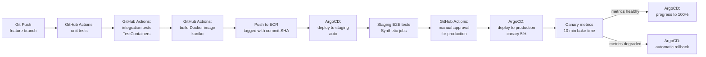

# 13 — Deployment Architecture: Distributed Job Scheduler

## Objective
Define the Kubernetes deployment topology, infrastructure layout, CI/CD pipeline, multi-AZ strategy, release processes, and local development setup for the distributed job scheduler.

---

## 1. Deployment Architecture Diagram

```mermaid
graph TB
    subgraph "Internet / Corporate Network"
        CLIENT[Client\nCLI / SDK / Dashboard]
    end

    subgraph "AWS / GCP — Region: us-east-1"
        subgraph "AZ-1 (us-east-1a)"
            subgraph "K8s Namespace: scheduler-prod"
                APIGW_1[API Gateway\n2 pods]
                SE_1[Scheduler Engine\nstatefulset-0 LEADER]
                WH_1[Workers HTTP\n~1000 pods HPA]
                WS_1[Workers Shell\n~500 pods HPA]
                RP_1[Result Processor\n5 pods]
            end
            PG_PRIMARY[(PostgreSQL Primary\nPatroni)]
            RD_1[(Redis Primary)]
        end

        subgraph "AZ-2 (us-east-1b)"
            subgraph "K8s Namespace: scheduler-prod"
                APIGW_2[API Gateway\n2 pods]
                SE_2[Scheduler Engine\nstatefulset-1 STANDBY]
                WH_2[Workers HTTP\n~1000 pods HPA]
                RP_2[Result Processor\n5 pods]
            end
            PG_REPLICA1[(PostgreSQL Replica 1)]
            RD_2[(Redis Replica)]
        end

        subgraph "AZ-3 (us-east-1c)"
            subgraph "K8s Namespace: scheduler-prod"
                APIGW_3[API Gateway\n2 pods]
                SE_3[Scheduler Engine\nstatefulset-2 STANDBY]
                WH_3[Workers HTTP\n~1000 pods HPA]
                RP_3[Result Processor\n5 pods]
            end
            PG_REPLICA2[(PostgreSQL Replica 2)]
            RD_3[(Redis Replica)]
        end

        subgraph "Shared Services"
            KAFKA[Kafka Cluster\n6 brokers\n2 per AZ]
            ES[Elasticsearch\n3-node cluster]
            VAULT[HashiCorp Vault\nHA mode]
            PROM[Prometheus\n+ Alertmanager]
            GRAF[Grafana]
            JAE[Jaeger]
        end

        LB[AWS ALB\nMulti-AZ]
        S3[(S3\nExecution Logs\nArchive)]
    end

    CLIENT --> LB
    LB --> APIGW_1
    LB --> APIGW_2
    LB --> APIGW_3

    SE_1 -.->|election| RD_1
    SE_2 -.->|watches| RD_1
    SE_3 -.->|watches| RD_1

    PG_PRIMARY --> PG_REPLICA1
    PG_PRIMARY --> PG_REPLICA2
    RD_1 --> RD_2
    RD_1 --> RD_3

    WH_1 --> KAFKA
    WH_2 --> KAFKA
    WH_3 --> KAFKA
    SE_1 --> KAFKA
    RP_1 --> KAFKA
```



---

## 2. Kubernetes Resource Specifications

### 2.1 Scheduler Engine — StatefulSet

```yaml
apiVersion: apps/v1
kind: StatefulSet
metadata:
  name: scheduler-engine
  namespace: scheduler-prod
spec:
  serviceName: scheduler-engine
  replicas: 3                         # 1 active leader + 2 standbys
  selector:
    matchLabels:
      app: scheduler-engine
  template:
    spec:
      topologySpreadConstraints:
        - maxSkew: 1
          topologyKey: topology.kubernetes.io/zone
          whenUnsatisfiable: DoNotSchedule
      containers:
        - name: scheduler-engine
          image: scheduler/engine:v2.1.0
          resources:
            requests:
              cpu: "2"
              memory: "4Gi"
            limits:
              cpu: "4"
              memory: "8Gi"
          readinessProbe:
            httpGet:
              path: /actuator/health/readiness
              port: 8080
            initialDelaySeconds: 30
            periodSeconds: 10
          livenessProbe:
            httpGet:
              path: /actuator/health/liveness
              port: 8080
            initialDelaySeconds: 60
            periodSeconds: 15
          env:
            - name: SCHEDULER_LEADER_LOCK_TTL_SECONDS
              value: "30"
            - name: SCHEDULER_POLL_INTERVAL_MS
              value: "1000"
```

**Why StatefulSet for Scheduler Engine?**
StatefulSet provides stable pod names (`scheduler-engine-0`, `-1`, `-2`) which serve as stable node IDs for leader election. The leader lock in Redis stores the pod name; if pod names were random (Deployment), a restarted pod would have a new name and be unable to reclaim leadership cleanly.

### 2.2 Workers — Deployment + HPA + KEDA

```yaml
apiVersion: apps/v1
kind: Deployment
metadata:
  name: workers-http
  namespace: scheduler-prod
spec:
  replicas: 20                        # initial replicas (KEDA overrides)
  strategy:
    type: RollingUpdate
    rollingUpdate:
      maxSurge: 10%
      maxUnavailable: 0               # zero-downtime rolling updates
  template:
    spec:
      topologySpreadConstraints:
        - maxSkew: 1
          topologyKey: topology.kubernetes.io/zone
          whenUnsatisfiable: ScheduleAnyway
      terminationGracePeriodSeconds: 3600  # 1 hour — allow in-flight jobs to complete
      containers:
        - name: worker-http
          image: scheduler/worker-http:v2.1.0
          resources:
            requests:
              cpu: "500m"
              memory: "1Gi"
            limits:
              cpu: "2"
              memory: "4Gi"
---
apiVersion: keda.sh/v1alpha1
kind: ScaledObject
metadata:
  name: workers-http-scaler
  namespace: scheduler-prod
spec:
  scaleTargetRef:
    name: workers-http
  minReplicaCount: 20
  maxReplicaCount: 5000
  cooldownPeriod: 300                 # 5 minutes before scaling down
  triggers:
    - type: kafka
      metadata:
        bootstrapServers: kafka:9092
        consumerGroup: workers-http
        topic: job-triggers
        lagThreshold: "500"           # scale up when lag > 500 messages
    - type: prometheus
      metadata:
        serverAddress: http://prometheus:9090
        metricName: jobs_due_in_5_minutes
        threshold: "5000"             # pre-scale if >5000 jobs due soon
        query: scheduler_jobs_due_lookahead_total
```

### 2.3 API Gateway — Deployment

```yaml
apiVersion: apps/v1
kind: Deployment
metadata:
  name: api-gateway
  namespace: scheduler-prod
spec:
  replicas: 6                         # 2 per AZ
  strategy:
    type: RollingUpdate
    rollingUpdate:
      maxSurge: 2
      maxUnavailable: 0
```

Standard HPA on CPU/memory for API gateway (not KEDA, as it's not queue-driven).

### 2.4 Result Processor — Deployment

```yaml
kind: Deployment
metadata:
  name: result-processor
spec:
  replicas: 15                        # 5 per AZ; KEDA scales based on job-results lag
```

---

## 3. Multi-AZ Strategy

### Distribution Rules

| Component | Distribution | Why |
|---|---|---|
| API Gateway | 2 per AZ (6 total) | Even request distribution via ALB |
| Scheduler Engine | 1 per AZ (3 total), active-passive | Pod identity stable via StatefulSet |
| Workers | Distributed across AZs via topology spread | Maximize availability; AZ failure loses 1/3 capacity |
| PostgreSQL | Primary in AZ-1, replicas in AZ-2, AZ-3 | Multi-AZ replication via Patroni |
| Redis | Primary in AZ-1, replicas in AZ-2, AZ-3 | Redis Sentinel for automatic failover |
| Kafka | 2 brokers per AZ | Rack-aware replication across AZs |
| Elasticsearch | 1 node per AZ | Shard replication across AZs |

### AZ Failure Scenario

**If AZ-1 goes down:**
- ALB routes traffic to AZ-2 and AZ-3 (automatic, within 30s via health check)
- Redis Sentinel promotes AZ-2 replica to primary (30s)
- Patroni promotes AZ-2 replica to PostgreSQL primary (15-30s)
- K8s reschedules AZ-1 pods to AZ-2/AZ-3 (scheduler engine standby already running there)
- Kafka continues on 4 remaining brokers (min.insync.replicas=2 still met)
- Worker capacity: 2/3 remaining → HPA scales up remaining nodes to compensate

---

## 4. CI/CD Pipeline



### Pipeline Stages

**Stage 1: Unit Tests**
- All bounded context unit tests
- Domain model invariant tests
- No external dependencies (pure unit)

**Stage 2: Integration Tests (TestContainers)**
- PostgreSQL container: test scheduling queries, optimistic locking, partitioning
- Redis container: test distributed lock acquisition, worker registry
- Kafka container: test outbox relay, consumer offset commit
- Elasticsearch container: test execution history indexing

**Stage 3: Build**
- Multi-stage Dockerfile: build → test → minimal runtime image
- Base image: `eclipse-temurin:21-jre-alpine` (Java 21 LTS)
- Image scanning: Trivy (vulnerability scanner) in pipeline
- SBOM generation for supply chain security

**Stage 4: Staging Deploy (ArgoCD — GitOps)**
- ArgoCD watches `deploy/staging/` directory in Git
- Image tag updated in Kustomize overlay
- ArgoCD syncs Kubernetes state to match Git
- Staging runs identical infrastructure to production (scaled down)

**Stage 5: Canary Release (Production)**
- ArgoCD Rollouts (Argo Rollouts CRD):
  - Deploy 5% of traffic to new version
  - Automated metric analysis: p99 latency, error rate, scheduler dispatch rate
  - Bake time: 10 minutes
  - If analysis passes: progress to 25% → 50% → 100%
  - If analysis fails: automatic rollback to previous version

---

## 5. Release Strategies

### Blue-Green (for Database Schema Changes)

When a database migration changes the schema in a backward-incompatible way:
1. Deploy new schema as additive change (new columns nullable, old columns kept)
2. Deploy new application version (reads/writes both old and new columns)
3. Backfill data in new columns
4. Deploy final version (reads only new columns)
5. Drop old columns (separate migration, after 1+ version cycle)

**Never deploy breaking schema changes and application changes simultaneously.**

### Feature Flags

For new features that require gradual rollout (e.g., DAG execution, active-active scheduler):
- LaunchDarkly or custom feature flag service
- Flags evaluated at runtime — no redeployment needed to enable/disable
- Flags gated by namespace (enable for `staging` before `production`)

---

## 6. Local Development Setup

### Docker Compose

```yaml
version: '3.8'
services:
  postgres:
    image: postgres:15
    environment:
      POSTGRES_DB: scheduler
      POSTGRES_USER: scheduler_user
      POSTGRES_PASSWORD: dev_password
    ports: ["5432:5432"]
    volumes:
      - ./init-scripts:/docker-entrypoint-initdb.d

  redis:
    image: redis:7-alpine
    ports: ["6379:6379"]

  kafka:
    image: confluentinc/cp-kafka:7.5.0
    environment:
      KAFKA_BROKER_ID: 1
      KAFKA_ZOOKEEPER_CONNECT: zookeeper:2181
      KAFKA_ADVERTISED_LISTENERS: PLAINTEXT://localhost:9092
      KAFKA_AUTO_CREATE_TOPICS_ENABLE: "true"
    ports: ["9092:9092"]
    depends_on: [zookeeper]

  zookeeper:
    image: confluentinc/cp-zookeeper:7.5.0
    environment:
      ZOOKEEPER_CLIENT_PORT: 2181
    ports: ["2181:2181"]

  schema-registry:
    image: confluentinc/cp-schema-registry:7.5.0
    environment:
      SCHEMA_REGISTRY_KAFKASTORE_BOOTSTRAP_SERVERS: kafka:9092
    ports: ["8081:8081"]

  elasticsearch:
    image: elasticsearch:8.11.0
    environment:
      discovery.type: single-node
      xpack.security.enabled: "false"
    ports: ["9200:9200"]

  kafka-ui:
    image: provectuslabs/kafka-ui:latest
    environment:
      KAFKA_CLUSTERS_0_BOOTSTRAPSERVERS: kafka:9092
    ports: ["8090:8080"]

  scheduler-app:
    build: .
    environment:
      SPRING_PROFILES_ACTIVE: local
      SPRING_DATASOURCE_URL: jdbc:postgresql://postgres:5432/scheduler
      SPRING_REDIS_HOST: redis
      SPRING_KAFKA_BOOTSTRAP-SERVERS: kafka:9092
    ports: ["8080:8080"]
    depends_on: [postgres, redis, kafka, elasticsearch]
```

**Start local environment:**
```bash
docker-compose up -d
# Wait for health checks, then:
./gradlew bootRun --args='--spring.profiles.active=local'
```

**Local test data:**
An `ApplicationRunner` bean (dev profile only) seeds the database with 10 test jobs including HTTP, cron, one-time, and DAG examples.

---

## 7. Infrastructure as Code

All infrastructure defined in Terraform (Phase 1) → later migrated to Crossplane (K8s-native IaC, Phase 2):

```
terraform/
├── modules/
│   ├── eks-cluster/        (K8s cluster)
│   ├── rds-postgres/       (PostgreSQL with Patroni)
│   ├── elasticache-redis/  (Redis Sentinel)
│   ├── msk-kafka/          (Managed Kafka)
│   └── monitoring-stack/   (Prometheus, Grafana, Jaeger)
├── environments/
│   ├── staging/
│   └── production/
└── global/
    ├── ecr/                (Container registry)
    └── s3/                 (Log archival buckets)
```

---

## Interview Discussion Points

**Q: Why use StatefulSet for the Scheduler Engine but Deployment for Workers?**
A: The Scheduler Engine needs stable pod identity for leader election — the pod name serves as the node ID in the Redis leader lock. Workers are stateless; they fetch work from Kafka, execute, and report back. No state is stored in the worker pod between executions. StatefulSet overhead (stable network identity, ordered rollout) is unnecessary for workers.

**Q: What's your zero-downtime deployment strategy for a rolling update of 5,000 worker pods?**
A: Workers have `terminationGracePeriodSeconds: 3600` — K8s waits up to 1 hour for in-flight jobs to complete before killing the pod. On receiving SIGTERM, the worker stops accepting new Kafka messages (commits offset but refuses new polls) and waits for in-flight executions to finish. Rolling update with `maxUnavailable: 0` ensures at least the current replica count is always available. With 5,000 pods and 10% maxSurge, this rolls out in batches, taking 30-60 minutes for a full update — which is acceptable.

**Q: How do you handle database migrations without downtime?**
A: Expand-contract pattern (also called blue-green migrations): (1) Add new column as nullable (expand) — no downtime; (2) Deploy application that reads both old and new column, writes to both; (3) Backfill data in new column; (4) Deploy application that reads only new column; (5) Drop old column (contract) — no downtime. Each step is independently rollbackable. Flyway manages migration versioning and ensures migrations are applied exactly once.
