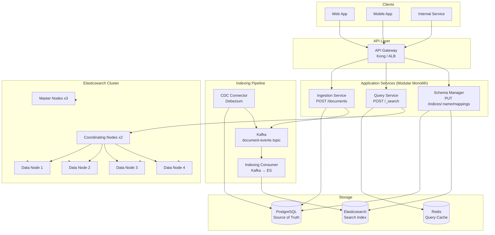
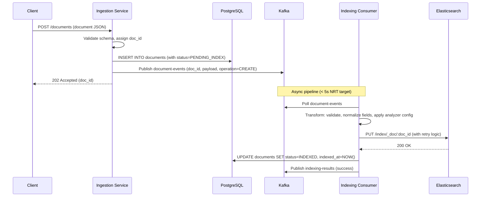
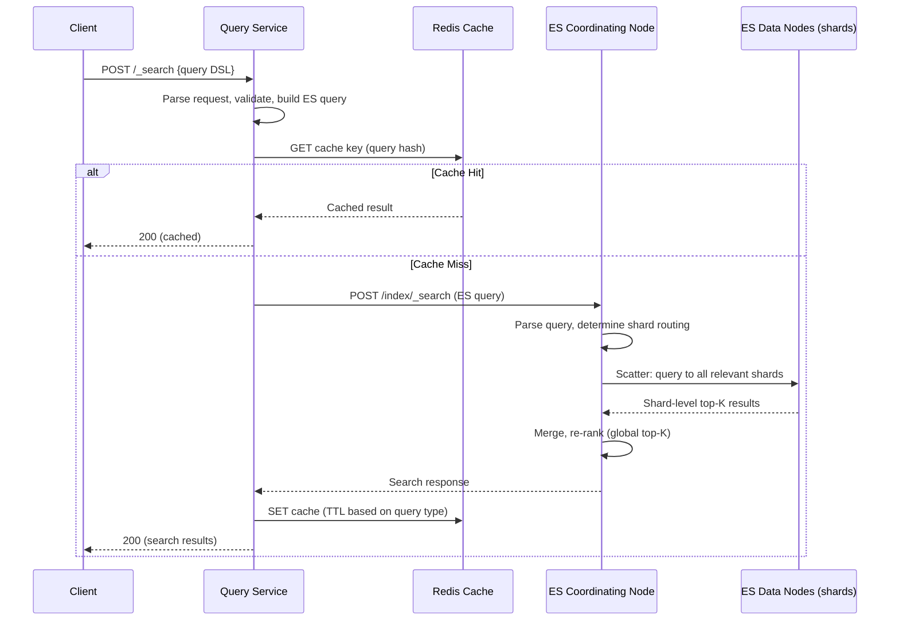

# 01 — High-Level Architecture: Mini Search Engine

## Objective

Establish the overall architectural shape: why Elasticsearch serves as the search tier alongside PostgreSQL as source of truth, how the indexing pipeline flows, how queries are served, and why the surrounding services are structured as a modular monolith migrating toward microservices.

---

## 1. Architecture Decision: Elasticsearch + PostgreSQL Dual-Store

### Why Elasticsearch as Search Tier

Elasticsearch (built on Lucene) is purpose-built for full-text search:

| Capability | PostgreSQL (pg_trgm / tsvector) | Elasticsearch |
|------------|--------------------------------|---------------|
| Inverted index | Limited (GIN/GiST) | Native, highly optimized |
| Relevance scoring (BM25) | No native ranking | Built-in, tunable |
| Horizontal sharding | Complex (Citus) | Native |
| Fuzzy search | Poor | Native (Levenshtein, n-grams) |
| Faceted aggregations | SQL GROUP BY (slow at scale) | Native aggregation framework |
| Autocomplete | Not suitable | Completion suggester, prefix queries |
| Query DSL | SQL only | Rich JSON query DSL |
| Near-real-time indexing | Yes | Yes (1s refresh cycle) |
| Distributed scaling | Manual | Automatic shard routing |

**Decision:** Use PostgreSQL as the authoritative source of truth (ACID transactions, foreign keys, audit, referential integrity). Elasticsearch is a **derived, eventually consistent projection** optimized for read path.

### Why Not Elasticsearch Alone

- Elasticsearch is not ACID — no multi-document transactions
- No referential integrity enforcement
- Harder to run complex relational joins
- Document mutations (update-by-query) are expensive and non-transactional
- Point-in-time consistency for billing, inventory, user records requires a relational store

---

## 2. Architecture Style Decision: Modular Monolith → Microservices Migration Path

### Selected: Modular Monolith (MVP and V1)

**Justification:**
- Team size at MVP: 4–6 engineers; microservices operational overhead is premature
- Kafka already decouples the indexing pipeline from the query path (natural async boundary)
- ES cluster is externally managed — biggest ops burden is already external
- Modular monolith with well-defined internal module boundaries allows extraction later

**Internal Modules:**
1. `indexing-module` — consumes Kafka, writes to ES
2. `query-module` — translates API queries to ES DSL, returns results
3. `schema-module` — manages ES index mappings, aliases, reindex jobs
4. `ingestion-module` — accepts documents, validates, persists to PostgreSQL, publishes events

**Migration Trigger to Microservices:**
- Indexing throughput bottleneck requires independent scaling
- Query module needs language-specific optimization (e.g., Go for high QPS)
- Schema management requires separate deployment cadence (risky to co-deploy with hot query path)

### When NOT to Use This Architecture

- If documents don't require full-text search → use PostgreSQL only
- If search is not latency-sensitive → avoid Elasticsearch complexity, use pg_trgm
- If team cannot operate Elasticsearch → use managed Typesense or Algolia

---

## 3. System Components

| Component | Technology | Role |
|-----------|------------|------|
| API Gateway | Kong / AWS ALB | Rate limiting, auth, routing |
| Ingestion Service | Spring Boot | Document validation, PostgreSQL write, Kafka publish |
| Query Service | Spring Boot | Search API, ES DSL translation, response shaping |
| Indexing Consumer | Spring Boot + Kafka | Consume events, index to Elasticsearch |
| Schema Manager | Spring Boot | Mapping management, alias management, reindex orchestration |
| PostgreSQL | PostgreSQL 15 | Source of truth, indexing_jobs, schema_versions |
| Elasticsearch | ES 8.x | Search index, inverted index storage |
| Kafka | Confluent Kafka | Event streaming, indexing pipeline |
| Redis | Redis 7 | Query result cache, autocomplete prefix cache |
| Zookeeper / KRaft | KRaft (Kafka 3.x) | Kafka metadata coordination |

---

## 4. High-Level Architecture Diagram

---

## 5. Indexing Pipeline Architecture

### Flow: Document Write to Index Visibility

### Two Indexing Modes

**Mode 1: Event-Driven (NRT)**
- Triggered per document change
- Latency: 1–5 seconds
- Use case: user-visible content changes (price, availability)

**Mode 2: Batch Reindex**
- Full scan of PostgreSQL → bulk index to ES
- Latency: minutes to hours (depends on corpus size)
- Use case: schema changes, analyzer tuning, index migration

---

## 6. Query Path Architecture

---

## 7. Why Not Alternative Architectures

### Alternative A: Full PostgreSQL with pg_trgm + tsvector

- **Pros:** No operational overhead, ACID, simple stack
- **Cons:** Cannot sustain 10k QPS at 100ms p99 with 100M docs; no BM25; no scalable facets
- **Verdict:** Valid for MVP (Phase 0) but hits a wall at ~5M documents

### Alternative B: Typesense or Meilisearch

- **Pros:** Operationally simpler, built-in typo tolerance, REST-native
- **Cons:** Less mature at 100M+ doc scale; limited aggregation capabilities; no field-level security
- **Verdict:** Good for startups with < 10M docs and small teams

### Alternative C: Solr

- **Pros:** Battle-tested, mature Lucene integration
- **Cons:** Less developer-friendly API; Zookeeper dependency; weaker cloud-native story
- **Verdict:** Elasticsearch has largely superseded Solr in new systems

### Alternative D: OpenSearch (AWS)

- **Pros:** ES-compatible API, managed service, lower ops overhead
- **Cons:** Lags ES feature releases by months; some APIs diverge
- **Verdict:** Prefer OpenSearch only if committed to AWS managed service; otherwise use ES

---

## 8. Startup vs FAANG Differences

| Concern | Startup | FAANG |
|---------|---------|-------|
| ES cluster management | Managed (Elastic Cloud, OpenSearch) | Self-hosted on K8s or bare metal |
| Shard count | 1–3 primary shards | 50–100+ shards across tenants |
| Replication | 1 replica | 2+ replicas, cross-AZ |
| Indexing pipeline | Simple Kafka consumer | Multi-stage with enrichment, dedup |
| Query DSL surface | Simple keyword + filter | Custom scoring scripts, percolation |
| Team | 1 infra engineer | Dedicated search platform team |
| Cost optimization | Minimize nodes | Hot-warm-cold tiering, ILM |

---

## 9. Overengineering Risks

- Adding vector search (dense retrieval) before relevance baseline is established
- Building custom ranking ML pipeline before measuring BM25 quality
- Multi-index per tenant before understanding tenant count and isolation needs
- Adding coordinating nodes before data nodes are the actual bottleneck
- Building a custom Query DSL translator when ES's native DSL is sufficient

---

## 10. Interview Discussion Points

- **Why eventual consistency between PG and ES is acceptable:** Search is a discovery UX. Users tolerate a 5-second delay in seeing new documents. Inventory and pricing need stronger consistency — those come from PostgreSQL directly, not ES.
- **What happens if Kafka consumer falls behind?** Indexing lag grows. Search results become stale. Alert on lag > 30s. ES does not serve errors — it serves stale results. This is a graceful degradation.
- **How do you prevent ES from becoming the bottleneck on the query path?** Redis caches popular queries. Request cache in ES caches repeated shard queries. Coordinating nodes prevent data nodes from being overwhelmed. HPA scales the query service layer.
