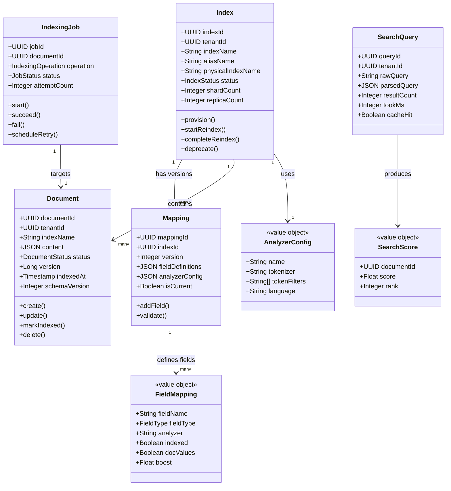

# 02 — Domain Modeling: Mini Search Engine

## Objective

Define the core domain model for the search platform: entities, value objects, aggregates, domain events, and the relationships between them. This model drives both the PostgreSQL schema (source of truth) and the Elasticsearch document structure (search projection).

---

## 1. Domain Overview

The search domain can be decomposed into two primary sub-domains:

1. **Indexing Domain** — responsible for accepting, validating, transforming, and storing documents into the search index
2. **Querying Domain** — responsible for accepting user search intent, translating it to an ES query, and returning ranked results

Supporting sub-domains:
- **Schema Management Domain** — manages index structure (field types, analyzers, aliases)
- **Relevance Tuning Domain** — manages boosting rules, synonyms, stop words, custom scoring
- **Tenant Domain** — manages multi-tenant isolation, per-tenant configurations

---

## 2. Core Entities

### 2.1 Document

The central entity in the indexing domain. Represents a piece of content to be indexed and made searchable.

| Field | Type | Description |
|-------|------|-------------|
| `document_id` | UUID | Immutable, globally unique identifier |
| `tenant_id` | UUID | Owner tenant — drives index isolation |
| `index_name` | String | Logical index this document belongs to |
| `content` | JSON | Raw document payload (source of truth) |
| `status` | Enum | PENDING_INDEX, INDEXED, FAILED, DELETED |
| `version` | Long | Optimistic lock version (Elasticsearch `_version`) |
| `created_at` | Timestamp | Document creation time |
| `updated_at` | Timestamp | Last modification time |
| `indexed_at` | Timestamp | Last successful ES index time |
| `schema_version` | Integer | Tracks which schema version document conforms to |

**Business rules:**
- A document belongs to exactly one index (determined by `index_name` + `tenant_id`)
- `document_id` is the ES `_id` — deterministic from business key, not ES-generated
- Version increment on every update; ES uses version for optimistic concurrency

### 2.2 Index

Represents a logical search index (maps to one or more Elasticsearch physical indices via alias).

| Field | Type | Description |
|-------|------|-------------|
| `index_id` | UUID | Internal identifier |
| `tenant_id` | UUID | Owning tenant |
| `index_name` | String | Human-readable name (e.g., `products`, `articles`) |
| `alias_name` | String | ES alias pointing to current physical index |
| `physical_index_name` | String | e.g., `products_v3` — versioned |
| `mapping_id` | UUID | Active schema/mapping version |
| `shard_count` | Integer | Immutable after creation |
| `replica_count` | Integer | Can be changed post-creation |
| `status` | Enum | ACTIVE, REINDEXING, DEPRECATED, DELETED |
| `settings` | JSON | Analyzer configs, refresh interval, etc. |
| `created_at` | Timestamp | |
| `updated_at` | Timestamp | |

**Business rules:**
- Shard count is immutable after index creation (Lucene constraint)
- Index alias enables zero-downtime cutover during schema changes
- At most one physical index is ACTIVE per alias at any time

### 2.3 Mapping (Schema)

Defines the field structure of an index — which fields are indexed, how they are analyzed.

| Field | Type | Description |
|-------|------|-------------|
| `mapping_id` | UUID | |
| `index_id` | UUID | FK to Index |
| `version` | Integer | Schema version number |
| `field_definitions` | JSON | List of FieldMapping value objects |
| `analyzer_config` | JSON | Custom analyzers, token filters, char filters |
| `created_at` | Timestamp | |
| `is_current` | Boolean | Only one mapping version is current per index |

**Business rules:**
- Adding new fields is backward compatible
- Changing field types requires a full reindex (Lucene restriction)
- `analyzer_config` changes require reindex (existing documents use old analysis)

### 2.4 IndexingJob

Represents a unit of work in the indexing pipeline.

| Field | Type | Description |
|-------|------|-------------|
| `job_id` | UUID | |
| `document_id` | UUID | Target document |
| `tenant_id` | UUID | |
| `operation` | Enum | INDEX, DELETE, REINDEX_FULL, REINDEX_PARTIAL |
| `status` | Enum | PENDING, IN_PROGRESS, SUCCESS, FAILED, DLQ |
| `attempt_count` | Integer | Retry tracking |
| `error_message` | String | Last failure reason |
| `payload_ref` | String | Kafka topic + offset reference |
| `created_at` | Timestamp | |
| `completed_at` | Timestamp | |
| `next_retry_at` | Timestamp | Exponential backoff |

### 2.5 SearchQuery

A first-class entity (logged for observability and relevance analysis).

| Field | Type | Description |
|-------|------|-------------|
| `query_id` | UUID | |
| `tenant_id` | UUID | |
| `user_id` | UUID (nullable) | If authenticated |
| `session_id` | String | Anonymous session tracking |
| `raw_query` | String | Original user input |
| `parsed_query` | JSON | Internal query representation |
| `index_name` | String | Target index |
| `result_count` | Integer | Number of results returned |
| `top_document_ids` | UUID[] | Top 5 document IDs returned |
| `took_ms` | Integer | Query execution time |
| `cache_hit` | Boolean | Whether result was from cache |
| `created_at` | Timestamp | Query execution time |

**Purpose:** Enables zero-result rate analysis, CTR tracking, relevance debugging.

### 2.6 SearchResult

A transient, non-persisted entity representing a query response (not stored in PostgreSQL — exists only in-memory and in cache).

| Field | Type | Description |
|-------|------|-------------|
| `query_id` | UUID | Links back to SearchQuery |
| `documents` | List\<SearchHit\> | Ranked document list |
| `total_hits` | Long | Total matching documents |
| `took_ms` | Integer | ES execution time |
| `aggregations` | Map | Facet counts, metric aggregations |
| `suggestions` | List\<String\> | Autocomplete or did-you-mean |
| `from_cache` | Boolean | |

---

## 3. Value Objects

### 3.1 FieldMapping

Immutable definition of a single field within a schema.

```
FieldMapping {
  field_name: String        // e.g., "title", "price", "created_at"
  field_type: FieldType     // TEXT, KEYWORD, INTEGER, FLOAT, DATE, NESTED, BOOLEAN, GEO_POINT
  analyzer: String          // "standard", "english", "autocomplete_analyzer"
  search_analyzer: String   // may differ from index analyzer
  indexed: Boolean          // whether field is searchable
  stored: Boolean           // whether original value is stored for retrieval
  doc_values: Boolean       // for sorting, aggregations, script access
  boost: Float              // per-field relevance boost
  copy_to: String[]         // denormalize into catch-all field
  nested_mappings: FieldMapping[]  // for NESTED type
}
```

### 3.2 SearchScore

Represents a document's relevance to a query.

```
SearchScore {
  document_id: UUID
  score: Float          // BM25 or custom score
  score_explanation: ScoreExplanation  // term frequency, IDF, field boost breakdown
  rank: Integer         // position in result set
}
```

### 3.3 AnalyzerConfig

Defines how text is tokenized and normalized.

```
AnalyzerConfig {
  name: String                    // e.g., "autocomplete_analyzer"
  tokenizer: String               // "standard", "edge_ngram", "whitespace"
  char_filters: String[]          // "html_strip", "mapping"
  token_filters: String[]         // "lowercase", "stop", "snowball", "synonym"
  language: String                // for language-specific stemming
}
```

### 3.4 QueryFilter

Represents a structured filter applied alongside a full-text query.

```
QueryFilter {
  field: String
  operator: FilterOperator  // EQ, NEQ, GT, GTE, LT, LTE, IN, NOT_IN, RANGE, EXISTS
  values: List<Object>
  boost: Float (optional)
}
```

---

## 4. Aggregates

### 4.1 Document Aggregate

**Root:** Document  
**Children:** (none — documents are atomic from the indexing perspective)

The Document aggregate owns its lifecycle: creation, updates, soft-delete, and hard-delete. It raises domain events that drive the indexing pipeline.

**Invariants:**
- A document cannot be marked INDEXED without a valid `indexed_at` timestamp
- Version must monotonically increase
- `status` transitions: `PENDING → INDEXED`, `PENDING → FAILED`, `INDEXED → DELETED`, `FAILED → PENDING` (retry)

### 4.2 Index Aggregate

**Root:** Index  
**Children:** Mapping (schema versions)

The Index aggregate owns its schema history. It orchestrates schema changes and coordinates alias switches during reindex.

**Invariants:**
- Only one Mapping can be `is_current = true` per Index
- Shard count cannot change after Index reaches ACTIVE status
- An Index in REINDEXING status cannot accept schema changes

### 4.3 IndexingJob Aggregate

**Root:** IndexingJob  
**Children:** (none — simple state machine)

Tracks the lifecycle of one indexing work unit. Independent from Document — allows tracking retry state without mutating the Document entity.

---

## 5. Domain Events

| Event | Raised By | Consumed By | Description |
|-------|-----------|-------------|-------------|
| `DocumentCreated` | Ingestion Service | Indexing Consumer | New document ready for indexing |
| `DocumentUpdated` | Ingestion Service | Indexing Consumer | Document fields changed |
| `DocumentDeleted` | Ingestion Service | Indexing Consumer | Document marked for removal |
| `DocumentIndexed` | Indexing Consumer | Ingestion Service, Metrics | Successful ES index confirmation |
| `DocumentIndexFailed` | Indexing Consumer | DLQ Handler, Alerting | ES index failed after retries |
| `IndexCreated` | Schema Manager | Indexing Consumer (configure) | New index provisioned in ES |
| `IndexMappingUpdated` | Schema Manager | Reindex Orchestrator | Schema change requires reindex |
| `ReindexStarted` | Schema Manager | Ops team, Monitoring | Full reindex pipeline initiated |
| `ReindexCompleted` | Schema Manager | Schema Manager (alias switch) | New index ready; switch alias |
| `ReindexFailed` | Schema Manager | Alerting | Reindex pipeline encountered unrecoverable error |
| `SearchQueryExecuted` | Query Service | Analytics, Relevance Tuning | Search telemetry event |

---

## 6. Domain Model Diagram



---

## 7. Anti-Corruption Layer: PostgreSQL Domain → ES Document

The PostgreSQL `Document.content` (raw JSON) is not directly pushed to Elasticsearch. A transformation layer (anti-corruption layer) in the Indexing Consumer:

1. **Field selection:** Only indexed fields from the Mapping are included in the ES document
2. **Type coercion:** PostgreSQL text dates → ES date format; PostgreSQL JSONB arrays → ES nested objects
3. **Computed fields:** Generate `search_all` catch-all field, compute `title_suggest` for autocomplete
4. **Tenant routing:** Inject `tenant_id` as routing key and filter field
5. **Version stamping:** Map `document.version` to ES `_version` for optimistic concurrency

This prevents ES mapping concerns from leaking into the core domain model.

---

## 8. Interview Discussion Points

- **Why is SearchQuery a first-class entity?** Logging query telemetry as structured data enables zero-result rate analysis, CTR computation, and A/B testing relevance changes. Without it, search quality is a black box.
- **Why separate IndexingJob from Document?** Retry state, attempt counts, and error messages belong to the job lifecycle, not the document entity. Merging them violates Single Responsibility and makes the Document aggregate chatty and complex.
- **Why is shard count an Index invariant?** Lucene's document routing formula `shard = hash(document_id) % num_primary_shards` is computed at index time. Changing shard count invalidates all routing decisions — a full reindex is mandatory.
- **How do you handle schema-breaking changes?** The Mapping aggregate enforces that breaking changes (type change) cannot be applied to an ACTIVE index. Schema Manager provisions a new physical index, reindexes, and atomically switches the alias — zero-downtime.
