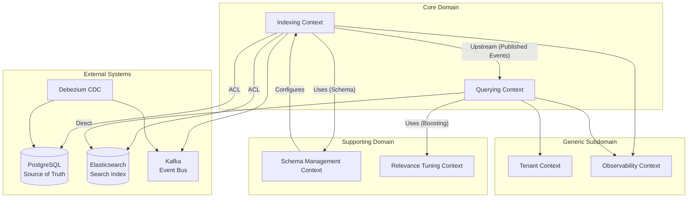
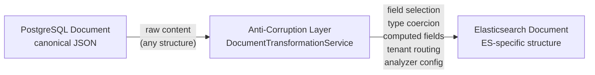

# 03 — DDD Bounded Contexts: Mini Search Engine

## Objective

Define the bounded contexts of the search platform, establish their relationships via a context map, and explain how Elasticsearch maps onto DDD concepts. Define the anti-corruption layer between the PostgreSQL domain model and Elasticsearch mappings.

---

## 1. Bounded Contexts Overview

The search platform is decomposed into four primary bounded contexts:

| Context | Primary Responsibility | Core Language |
|---------|----------------------|---------------|
| **Indexing Context** | Accept, validate, transform, and persist documents into ES | Document, IndexingJob, IndexingPipeline |
| **Querying Context** | Translate user search intent into ES queries; return ranked results | SearchQuery, SearchResult, QueryDSL |
| **Schema Management Context** | Manage ES index structure, field mappings, analyzer configs, aliases | Index, Mapping, Alias, ReindexJob |
| **Relevance Tuning Context** | Manage boosting rules, synonyms, stop words, ranking signals | BoostRule, SynonymSet, RankingConfig |

Supporting contexts:
- **Tenant Context** — multi-tenant isolation, per-tenant configuration, quota enforcement
- **Observability Context** — search quality metrics, indexing lag monitoring, alerting

---

## 2. Context Map

**Context Map Relationships:**

| Relationship | Type | Notes |
|-------------|------|-------|
| Indexing → Schema Management | **Conformist** (Indexing conforms to schema defined by SM) | Indexing consumer reads schema config to know how to transform documents |
| Querying → Relevance Tuning | **Customer-Supplier** (Querying consumes boost rules from RT) | RT publishes boost configs; Querying reads them at query time |
| Indexing → PostgreSQL | **Anti-Corruption Layer** | PG domain model ≠ ES document model; ACL translates |
| Querying → Elasticsearch | **Partnership** (direct ES API usage) | Query DSL is tightly coupled to ES; abstracted via Query Builder |
| Tenant → all contexts | **Shared Kernel** | Tenant ID is a shared concept; must agree on format (UUID) |
| Observability → all contexts | **Open-Host Service** | All contexts publish events; Observability consumes passively |

---

## 3. Indexing Bounded Context

### Language (Ubiquitous)

| Term | Meaning in this context |
|------|------------------------|
| **Document** | A unit of content to be indexed; has a unique ID, belongs to one index |
| **IndexingJob** | A unit of work: one document, one operation (create/update/delete) |
| **Pipeline** | The ordered sequence: validate → transform → enrich → index |
| **Transform** | Apply analyzer config, field mapping, type coercion |
| **Bulk Batch** | A group of IndexingJobs submitted to ES in one bulk API call |
| **DLQ** | Dead Letter Queue — jobs that failed beyond retry threshold |

### Aggregate Roots

- `Document` (owns lifecycle)
- `IndexingJob` (owns retry state)

### Domain Services

- `DocumentTransformationService` — applies ACL, field mapping, type coercion
- `BulkIndexingService` — batches IndexingJobs into ES bulk API calls
- `RetryOrchestrator` — manages exponential backoff and DLQ promotion

### External System Interactions

- **Reads from:** PostgreSQL (document payload on full reindex), Kafka (document-events)
- **Writes to:** Elasticsearch (document index operations), PostgreSQL (status updates), Kafka (indexing-results)

---

## 4. Querying Bounded Context

### Language (Ubiquitous)

| Term | Meaning in this context |
|------|------------------------|
| **SearchQuery** | User's search intent expressed as parameters |
| **QueryDSL** | Elasticsearch's JSON query language; internal representation |
| **SearchHit** | One document result with score, highlights, fields |
| **SearchResult** | The complete response: hits, total count, aggregations, suggestions |
| **Facet** | A bucket aggregation result (e.g., count by category) |
| **Autocomplete** | Prefix-based suggestion; may use Completion Suggester or prefix query |
| **Relevance Score** | BM25-based + field boost score for ranking |
| **Cache Key** | Deterministic hash of query parameters for Redis lookup |

### Aggregate Roots

- `SearchQuery` (owns query telemetry)

### Domain Services

- `QueryBuilderService` — translates internal SearchQuery to ES Query DSL
- `ResultShapingService` — formats ES response into API response contract
- `AutocompleteService` — handles prefix queries with Redis cache fallback
- `FacetService` — constructs and interprets bucket aggregations

### External System Interactions

- **Reads from:** Elasticsearch (search), Redis (query cache)
- **Writes to:** PostgreSQL (SearchQuery log — async), Kafka (SearchQueryExecuted event for analytics)

---

## 5. Schema Management Bounded Context

### Language (Ubiquitous)

| Term | Meaning in this context |
|------|------------------------|
| **Index** | A logical collection of documents with a defined schema |
| **Mapping** | The schema definition — field types, analyzers, options |
| **Physical Index** | An actual Elasticsearch index (e.g., `products_v3`) |
| **Alias** | An ES alias pointing to the current physical index |
| **Analyzer** | Text processing pipeline: char filter → tokenizer → token filter |
| **Reindex Job** | A background job that creates new physical index, copies documents, switches alias |
| **Zero-downtime Migration** | Reindex flow using aliases to switch traffic without downtime |
| **Breaking Change** | A schema change that requires reindex (e.g., field type change) |
| **Additive Change** | A schema change that can be applied in-place (new field added) |

### Aggregate Roots

- `Index` (owns alias, physical index reference, mapping versions)
- `ReindexJob` (owns reindex state machine)

### Domain Services

- `MappingValidator` — validates whether a new mapping is additive or breaking
- `AliasManager` — atomically switches ES aliases
- `ReindexOrchestrator` — manages the full reindex pipeline lifecycle
- `AnalyzerConfigManager` — manages custom tokenizers and filters

---

## 6. Relevance Tuning Bounded Context

### Language (Ubiquitous)

| Term | Meaning in this context |
|------|------------------------|
| **BoostRule** | A rule that increases relevance of documents matching certain criteria |
| **SynonymSet** | A group of synonymous terms expanded at query time |
| **StopWordList** | Terms ignored during analysis (language-specific) |
| **RankingConfig** | The aggregate of all rules affecting relevance for an index |
| **Pinning** | Forcing specific documents to top positions for specific queries |

### Aggregate Roots

- `RankingConfig` (owns boost rules, synonyms, stop words for one index)

### Domain Services

- `SynonymExpander` — expands query terms using synonym sets at query time
- `BoostRuleEvaluator` — translates boost rules into ES function_score queries

---

## 7. How Elasticsearch Maps to DDD

Elasticsearch is an **infrastructure concern** — it is not a domain object. It is the persistence mechanism for the Querying Context.

| DDD Concept | Elasticsearch Equivalent |
|------------|--------------------------|
| Aggregate Root | ES Document (`_id` = document_id) |
| Repository | ES Index (collection of documents) |
| Query | ES Query DSL (JSON) |
| Projection | ES Document (derived from PG canonical model) |
| Event Store | Not applicable (ES is not an event store) |
| Bounded Context boundary | ES Index (one index per logical context/tenant) |

**Key insight:** Elasticsearch is a read model (CQRS projection). It should never be treated as a write-side store or source of truth. All writes go to PostgreSQL; ES reflects those writes eventually.

---

## 8. Anti-Corruption Layer (ACL): PostgreSQL → Elasticsearch

The ACL lives in the Indexing Consumer. It prevents ES-specific concepts from leaking into the core domain.

### ACL Responsibilities

| Concern | ACL Transformation |
|---------|-------------------|
| Field selection | Only indexed fields from Mapping configuration are emitted |
| Type coercion | `TIMESTAMPTZ` → ISO-8601 string for ES date field |
| Nested objects | Flatten JSONB arrays into ES nested type arrays |
| Computed fields | Generate `title_suggest` (edge-n-gram), `search_all` (copy_to) |
| Tenant isolation | Inject `tenant_id` as routing value and filter field |
| Version mapping | Map PG `updated_at` epoch to ES `_version` |
| Analyzer hints | Annotate fields with target analyzer from Mapping config |

### ACL Diagram

### What the ACL Prevents

- Business logic tied to ES field names leaking into the domain model
- ES mapping changes requiring domain model changes
- Query DSL syntax infiltrating service layer
- ES versioning semantics conflated with business document versioning

---

## 9. Context Boundaries and Data Ownership

| Data | Owned By | Read By |
|------|----------|---------|
| Document canonical content | Indexing Context (PG) | Schema Management (schema), Indexing Consumer (transform) |
| ES document structure | Schema Management (defines mapping) | Indexing Context (applies), Querying Context (reads) |
| IndexingJob state | Indexing Context (PG) | Observability |
| SearchQuery log | Querying Context (PG) | Relevance Tuning, Observability |
| RankingConfig (synonyms, boosts) | Relevance Tuning Context | Querying Context |
| Tenant configuration | Tenant Context | All contexts |
| Alerting thresholds | Observability Context | (self-contained) |

---

## 10. Startup vs FAANG Bounded Context Design

| Concern | Startup | FAANG |
|---------|---------|-------|
| Context count | 2 contexts (indexing + querying) in one service | 4+ contexts, independently deployed |
| Relevance Tuning | Hardcoded boost rules | Dedicated ML team, LTR pipeline |
| Schema Management | Manual via API | Self-service tenant portal, automated migration |
| Tenant Context | Shared index with tenant field | Separate cluster per large tenant |
| ACL complexity | Simple field mapper | Complex enrichment pipeline (NLP, entity extraction) |

---

## 11. Interview Discussion Points

- **Why does the Querying Context read from ES directly without going through the Indexing Context?** In CQRS, the read side (Query) directly accesses the read model (ES). The Indexing Context is the write side. They share no code path — decoupled by Kafka events and the ES index.
- **How does the ACL protect the domain from ES internals?** If ES changes a mapping (field renamed, type changed), only the ACL needs updating. The PostgreSQL domain model and service layer remain stable.
- **What happens when a Relevance Tuning change (new synonym set) needs to propagate?** The RankingConfig aggregate publishes a `SynonymSetUpdated` event. The Querying Context reloads its synonym cache. No reindex needed — synonyms expand at query time, not index time.
- **When should you extract a bounded context to a separate service?** When it has independent scaling needs, separate deployment cadence, or a different team owns it. At 10k QPS, the Query Context is the first to need independent scaling (stateless, HPA-friendly).
