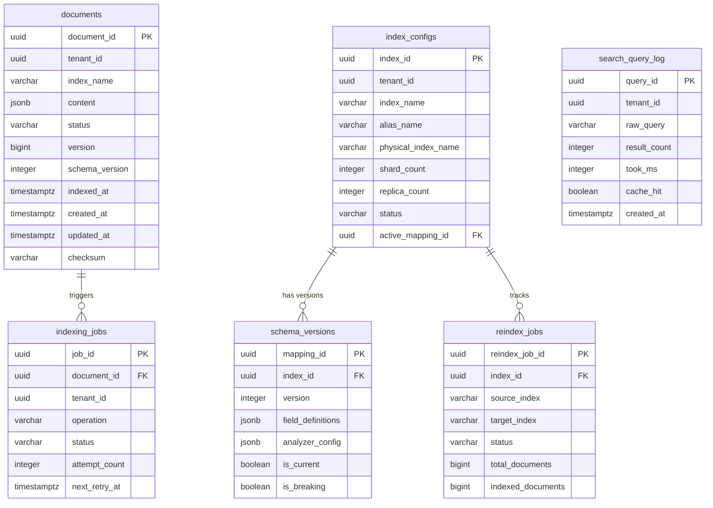
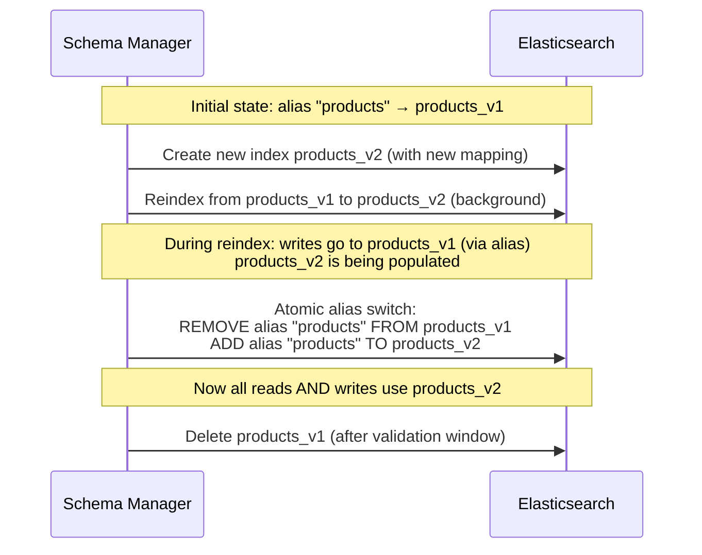

# 05 — Database Design: Mini Search Engine

## Objective

Design the PostgreSQL schema (source of truth), the Elasticsearch index structure (search projection), define sharding and replication strategy, index aliases for zero-downtime schema evolution, and explain when multiple indices are needed vs one.

---

## 1. PostgreSQL Schema (Source of Truth)

### 1.1 documents

The canonical document store. All documents pass through here before being indexed.

```sql
CREATE TABLE documents (
    document_id     UUID PRIMARY KEY DEFAULT gen_random_uuid(),
    tenant_id       UUID NOT NULL,
    index_name      VARCHAR(128) NOT NULL,
    content         JSONB NOT NULL,                     -- raw document payload
    status          VARCHAR(32) NOT NULL DEFAULT 'PENDING_INDEX',
                    -- PENDING_INDEX | INDEXED | FAILED | DELETED | PENDING_DELETE
    version         BIGINT NOT NULL DEFAULT 1,          -- optimistic lock
    schema_version  INTEGER NOT NULL DEFAULT 1,
    indexed_at      TIMESTAMPTZ,
    created_at      TIMESTAMPTZ NOT NULL DEFAULT NOW(),
    updated_at      TIMESTAMPTZ NOT NULL DEFAULT NOW(),
    deleted_at      TIMESTAMPTZ,                        -- soft delete
    created_by      UUID,                               -- user_id
    checksum        VARCHAR(64)                         -- SHA-256 of content for drift detection
);

-- Indexes
CREATE INDEX idx_documents_tenant_index ON documents(tenant_id, index_name);
CREATE INDEX idx_documents_status ON documents(status) WHERE status != 'INDEXED';
CREATE INDEX idx_documents_updated_at ON documents(updated_at);
CREATE INDEX idx_documents_tenant_status ON documents(tenant_id, status, updated_at);

-- Partitioning (at scale): partition by tenant_id hash or by index_name
-- Partition by range on created_at for archival (cold storage for old documents)
```

**Design notes:**
- `content JSONB` stores the full raw payload; no column per field (avoids migration for every new document type)
- `checksum` enables drift detection between PostgreSQL and Elasticsearch (scheduled reconciliation job)
- Soft delete via `deleted_at`; `status=DELETED` propagates to Elasticsearch
- Partition by `(tenant_id, index_name)` at scale to localize hot queries

### 1.2 index_configs

Metadata about each logical search index.

```sql
CREATE TABLE index_configs (
    index_id            UUID PRIMARY KEY DEFAULT gen_random_uuid(),
    tenant_id           UUID NOT NULL,
    index_name          VARCHAR(128) NOT NULL,
    alias_name          VARCHAR(128) NOT NULL,
    physical_index_name VARCHAR(256) NOT NULL,           -- e.g., products_v3
    shard_count         INTEGER NOT NULL,
    replica_count       INTEGER NOT NULL DEFAULT 1,
    status              VARCHAR(32) NOT NULL DEFAULT 'PROVISIONING',
                        -- PROVISIONING | ACTIVE | REINDEXING | DEPRECATED | DELETED
    active_mapping_id   UUID,                            -- FK to schema_versions
    settings            JSONB,                           -- ES settings (refresh_interval, etc.)
    created_at          TIMESTAMPTZ NOT NULL DEFAULT NOW(),
    updated_at          TIMESTAMPTZ NOT NULL DEFAULT NOW(),

    UNIQUE (tenant_id, index_name)
);

CREATE INDEX idx_index_configs_tenant ON index_configs(tenant_id);
CREATE INDEX idx_index_configs_status ON index_configs(status);
```

### 1.3 schema_versions

Tracks mapping history for each index. Supports zero-downtime schema evolution.

```sql
CREATE TABLE schema_versions (
    mapping_id          UUID PRIMARY KEY DEFAULT gen_random_uuid(),
    index_id            UUID NOT NULL REFERENCES index_configs(index_id),
    version             INTEGER NOT NULL,
    field_definitions   JSONB NOT NULL,                  -- FieldMapping[] serialized
    analyzer_config     JSONB,                           -- custom analyzers
    is_current          BOOLEAN NOT NULL DEFAULT FALSE,
    is_breaking         BOOLEAN NOT NULL DEFAULT FALSE,  -- whether this version required reindex
    created_at          TIMESTAMPTZ NOT NULL DEFAULT NOW(),
    created_by          UUID,

    UNIQUE (index_id, version)
);

CREATE INDEX idx_schema_versions_index ON schema_versions(index_id);
CREATE INDEX idx_schema_versions_current ON schema_versions(index_id) WHERE is_current = TRUE;
```

**Invariant enforced by application:** Only one `is_current = TRUE` row per `index_id`.

### 1.4 indexing_jobs

Tracks the lifecycle of every indexing operation.

```sql
CREATE TABLE indexing_jobs (
    job_id          UUID PRIMARY KEY DEFAULT gen_random_uuid(),
    document_id     UUID NOT NULL,
    tenant_id       UUID NOT NULL,
    index_name      VARCHAR(128) NOT NULL,
    operation       VARCHAR(32) NOT NULL,                -- INDEX | DELETE | REINDEX_PARTIAL | REINDEX_FULL
    status          VARCHAR(32) NOT NULL DEFAULT 'PENDING',
                    -- PENDING | IN_PROGRESS | SUCCESS | FAILED | DLQ
    attempt_count   INTEGER NOT NULL DEFAULT 0,
    error_message   TEXT,
    kafka_offset    BIGINT,                              -- for exactly-once tracking
    kafka_partition INTEGER,
    created_at      TIMESTAMPTZ NOT NULL DEFAULT NOW(),
    updated_at      TIMESTAMPTZ NOT NULL DEFAULT NOW(),
    completed_at    TIMESTAMPTZ,
    next_retry_at   TIMESTAMPTZ,

    -- Partial indexes for hot query paths
    CONSTRAINT chk_status CHECK (status IN ('PENDING','IN_PROGRESS','SUCCESS','FAILED','DLQ'))
);

CREATE INDEX idx_indexing_jobs_status_retry ON indexing_jobs(status, next_retry_at)
    WHERE status IN ('PENDING', 'FAILED');
CREATE INDEX idx_indexing_jobs_document ON indexing_jobs(document_id);
CREATE INDEX idx_indexing_jobs_tenant ON indexing_jobs(tenant_id, created_at DESC);
```

### 1.5 reindex_jobs

Tracks full reindex operations (separate from per-document indexing_jobs).

```sql
CREATE TABLE reindex_jobs (
    reindex_job_id      UUID PRIMARY KEY DEFAULT gen_random_uuid(),
    index_id            UUID NOT NULL REFERENCES index_configs(index_id),
    source_index        VARCHAR(256) NOT NULL,           -- old physical index
    target_index        VARCHAR(256) NOT NULL,           -- new physical index
    target_mapping_id   UUID NOT NULL,
    status              VARCHAR(32) NOT NULL DEFAULT 'PENDING',
                        -- PENDING | RUNNING | ALIAS_SWITCH_PENDING | COMPLETED | FAILED
    total_documents     BIGINT,
    indexed_documents   BIGINT NOT NULL DEFAULT 0,
    failed_documents    BIGINT NOT NULL DEFAULT 0,
    started_at          TIMESTAMPTZ,
    completed_at        TIMESTAMPTZ,
    error_message       TEXT,
    created_at          TIMESTAMPTZ NOT NULL DEFAULT NOW()
);
```

### 1.6 search_query_log

Search telemetry — written asynchronously to avoid impacting query latency.

```sql
CREATE TABLE search_query_log (
    query_id        UUID PRIMARY KEY DEFAULT gen_random_uuid(),
    tenant_id       UUID NOT NULL,
    user_id         UUID,
    session_id      VARCHAR(128),
    index_name      VARCHAR(128) NOT NULL,
    raw_query       TEXT NOT NULL,
    parsed_query    JSONB,
    result_count    INTEGER,
    top_doc_ids     UUID[],
    took_ms         INTEGER,
    cache_hit       BOOLEAN DEFAULT FALSE,
    created_at      TIMESTAMPTZ NOT NULL DEFAULT NOW()
) PARTITION BY RANGE (created_at);

-- Monthly partitions for retention management
CREATE TABLE search_query_log_2024_01 PARTITION OF search_query_log
    FOR VALUES FROM ('2024-01-01') TO ('2024-02-01');

CREATE INDEX idx_query_log_tenant_created ON search_query_log(tenant_id, created_at DESC);
CREATE INDEX idx_query_log_raw_query ON search_query_log(raw_query) WHERE result_count = 0;
-- Zero-result queries index for relevance debugging
```

---

## 2. Entity Relationship Diagram



---

## 3. Elasticsearch Index Design

### 3.1 Index Naming Convention

| Pattern | Example | Purpose |
|---------|---------|---------|
| `{tenant}_{index}_{version}` | `acme_products_v3` | Physical index name |
| `{tenant}_{index}` | `acme_products` | Alias (points to current physical) |

### 3.2 Field Types and Mapping Strategy

```json
{
  "mappings": {
    "_source": { "enabled": true },
    "properties": {
      "document_id":   { "type": "keyword" },
      "tenant_id":     { "type": "keyword" },
      "title": {
        "type": "text",
        "analyzer": "english",
        "fields": {
          "keyword": { "type": "keyword", "ignore_above": 256 },
          "suggest": { "type": "completion", "analyzer": "simple" }
        }
      },
      "description":   { "type": "text", "analyzer": "english" },
      "price":         { "type": "float",   "doc_values": true },
      "category":      { "type": "keyword", "doc_values": true },
      "brand":         { "type": "keyword", "doc_values": true },
      "in_stock":      { "type": "boolean" },
      "created_at":    { "type": "date", "format": "strict_date_optional_time" },
      "tags":          { "type": "keyword" },
      "search_all":    { "type": "text", "analyzer": "standard" },
      "version":       { "type": "long" },
      "schema_version":{ "type": "integer" }
    }
  },
  "settings": {
    "number_of_shards": 5,
    "number_of_replicas": 1,
    "refresh_interval": "1s",
    "index.routing.allocation.require.box_type": "hot",
    "analysis": {
      "analyzer": {
        "autocomplete_analyzer": {
          "tokenizer": "autocomplete_tokenizer",
          "filter": ["lowercase"]
        },
        "autocomplete_search_analyzer": {
          "tokenizer": "standard",
          "filter": ["lowercase"]
        }
      },
      "tokenizer": {
        "autocomplete_tokenizer": {
          "type": "edge_ngram",
          "min_gram": 2,
          "max_gram": 10,
          "token_chars": ["letter", "digit"]
        }
      }
    }
  }
}
```

### 3.3 Multi-Field Design Pattern

The `title` field demonstrates the multi-field pattern:
- `title` (text, english analyzer) → for full-text search with stemming
- `title.keyword` (keyword) → for exact match, sorting, term aggregations
- `title.suggest` (completion) → for autocomplete via Completion Suggester

This avoids creating separate fields for the same data with different indexing needs.

### 3.4 search_all Catch-All Field

```json
{
  "title":       { "type": "text", "copy_to": "search_all" },
  "description": { "type": "text", "copy_to": "search_all" },
  "brand":       { "type": "keyword", "copy_to": "search_all" },
  "search_all":  { "type": "text", "analyzer": "standard", "store": false }
}
```

`search_all` is a denormalized field that combines all searchable text. Simple keyword searches target `search_all` for efficiency (one field vs many). Does not store original values (reconstructed from source).

---

## 4. Sharding Strategy

### 4.1 Shard Sizing Rules

| Rule | Guideline | Rationale |
|------|-----------|-----------|
| Target shard size | 10–50 GB | Below 10 GB is too many shards; above 50 GB causes slow recovery |
| Shards per node | Max 20 shards per GB of heap | ES overhead per shard |
| Shard count for 100M docs | 5 primary shards | 100M × 5 KB × 2.5x = 1.2 TB / 5 = 240 GB / shard (slightly high; use 8 shards) |
| Recommended | **8 primary shards** | ~150 GB per shard; leaves room for growth |

### 4.2 Shard Routing

Default routing: `shard = hash(document_id) % num_primary_shards`

**Custom routing by tenant:**
```json
PUT /index/_doc/{doc_id}?routing={tenant_id}
```

Benefits:
- All documents for a tenant land on the same shard set
- Tenant-filtered queries execute on fewer shards (reduced scatter-gather)
- Isolates tenant load to specific nodes

Risks:
- Uneven shard distribution if tenant sizes vary greatly (hot shard problem)
- Requires consistent routing on reads — must pass `routing=tenant_id` on search

**Decision:** Use custom routing for large tenants (> 10M documents); use default routing for small/medium tenants.

---

## 5. Index Aliases for Zero-Downtime Reindex

### 5.1 Flow



### 5.2 Write Alias vs Read Alias

During reindex, writes should also go to the new index to avoid re-indexing newly created docs:

```json
POST /_aliases
{
  "actions": [
    { "remove": { "index": "products_v1", "alias": "products_write" } },
    { "add":    { "index": "products_v2", "alias": "products_write", "is_write_index": true } },
    { "add":    { "index": "products_v1", "alias": "products_read" } },
    { "add":    { "index": "products_v2", "alias": "products_read" } }
  ]
}
```

During the reindex window, reads span both indices (union). After reindex completes, collapse to single alias.

---

## 6. Hot-Warm-Cold Index Lifecycle

For time-series or archival data (e.g., news articles, logs):

| Tier | Node Type | Storage | Use Case |
|------|-----------|---------|---------|
| Hot | High-CPU, NVMe SSD | < 30 days | Active indexing + querying |
| Warm | Moderate CPU, HDD | 30–365 days | Historical search; read-only |
| Cold | Low CPU, object storage | > 1 year | Compliance; occasional access |

Controlled by ILM (Index Lifecycle Management) policies:
```
Phase hot:  age=0, rollover when size > 50GB or docs > 10M
Phase warm: age=7d, shrink to 1 shard, force merge to 1 segment, set replicas=0
Phase cold: age=30d, searchable snapshots (S3-backed)
Phase delete: age=365d (configurable per tenant)
```

---

## 7. Multiple Indices vs One Index

| Scenario | Use Multiple Indices | Use Single Index |
|----------|---------------------|-----------------|
| Multiple document types with different schemas | Yes | No |
| Large tenant isolation (data residency) | Yes | No |
| Time-series data with ILM | Yes (one per period) | No |
| Same schema, multiple tenants | No (use routing + filter) | Yes |
| Schema changes (reindex) | Yes (old + new simultaneously) | No |
| Different retention policies | Yes | No |

**Decision for this system:** One index per `(tenant_id, logical_index_name)`. This gives schema flexibility per tenant, clear data isolation, and independent ILM per index. Shared infrastructure with separate physical indices.

---

## 8. Indexing Strategy Comparison

| Strategy | Throughput | Freshness | Complexity |
|----------|-----------|-----------|------------|
| Per-document NRT | Moderate (1k/s) | < 5s | Low |
| Bulk batch (Kafka → buffer → bulk API) | High (50k/s) | 10–60s | Medium |
| Full reindex (scroll + reindex API) | Very high (100k/s) | N/A (one-time) | High |

**Production approach:** Kafka consumers batch ES bulk requests (100–1000 docs per ES bulk call) while respecting the NRT freshness SLA.

---

## 9. Interview Discussion Points

- **Why use JSONB for document content rather than normalized columns?** Documents have heterogeneous schemas across indices (product catalog vs news article). JSONB avoids the need for a schema migration every time a client adds a new field. The ES mapping enforces structure on the read side.
- **Shard count is immutable — how do you plan shard sizing upfront?** Use the formula: `shards = ceil(total_data_GB / 30)`. Add 30% buffer for growth. For 100M docs at 5 KB = 500 GB × 2.5 = 1.25 TB; 1,250 GB / 30 = ~42 shards; round to 8 primary shards (balanced with 3–5x future growth). When you're wrong, you reindex with a new shard count — that's the accepted recovery path.
- **Why not just increase replicas to scale read throughput?** Replicas distribute search load but also increase storage. More importantly, replicas don't help if the bottleneck is shard-level query complexity (aggregations, deep pagination). Replicas are for HA and throughput, not query optimization.
- **How do you handle tenant-specific analyzer requirements (e.g., Japanese vs English tokenization)?** Each tenant's index can specify its own analyzer config. The Schema Management context stores analyzer configs per mapping. A Japanese tenant uses kuromoji tokenizer; an English tenant uses standard + snowball. The ES index settings embed the analyzer definition at creation time.
