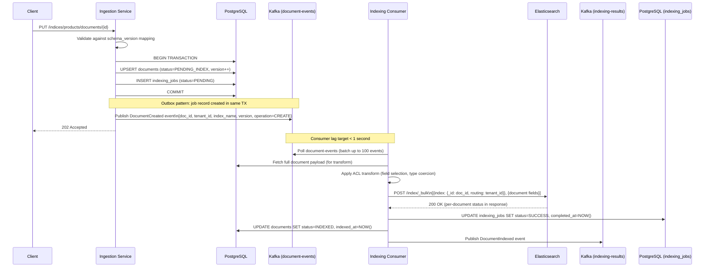
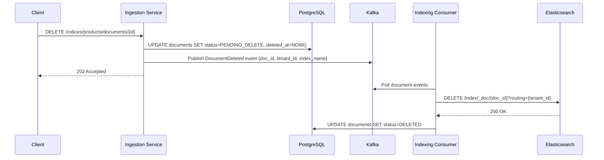
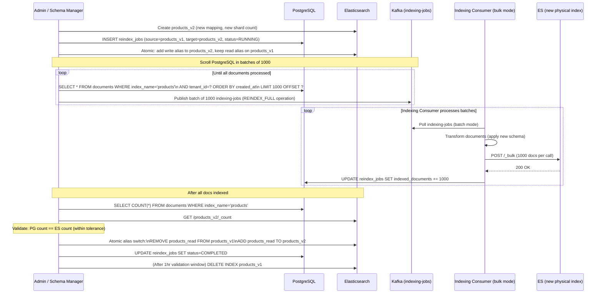

# 06 — Event Flow: Mini Search Engine

## Objective

Define the complete event-driven architecture for the indexing pipeline: CDC from PostgreSQL to Kafka, event consumers, full reindex pipeline, partial update flow, delete propagation, and near-real-time vs batch indexing tradeoffs.

---

## 1. Event Flow Overview

The search platform uses an event-driven indexing pipeline built on Kafka. Two mechanisms feed the pipeline:

1. **Application-level events** — Ingestion Service publishes `document-events` to Kafka on every write
2. **CDC events** — Debezium captures PostgreSQL WAL changes and publishes to Kafka as a fallback/reconciliation mechanism

```mermaid
graph TB
    subgraph Write_Path["Write Path (NRT Indexing)"]
        Client[Client API Call]
        IS[Ingestion Service]
        PG[(PostgreSQL\ndocuments table)]
        KF1[Kafka\ndocument-events topic]
        IC[Indexing Consumer\nSpring Boot]
        ES[(Elasticsearch)]
    end

    subgraph CDC_Path["CDC Path (Reconciliation / Alternative Feed)"]
        DEB[Debezium\nPostgreSQL Connector]
        KF2[Kafka\ncdc-document-events topic]
        CDCC[CDC Consumer\n(dedup + merge with app events)]
    end

    subgraph Reindex_Path["Full Reindex Pipeline"]
        RM[Reindex Manager]
        PG2[(PostgreSQL\nScroll Query)]
        KF3[Kafka\nindexing-jobs topic]
        IC2[Indexing Consumer\n(bulk mode)]
        ESN[(Elasticsearch\nnew physical index)]
    end

    subgraph Results["Result Tracking"]
        KF4[Kafka\nindexing-results topic]
        DLQ[Kafka\ndlq-indexing topic]
        PG3[(PostgreSQL\nindexing_jobs table)]
    end

    Client --> IS
    IS --> PG
    IS --> KF1
    KF1 --> IC
    IC --> ES
    IC --> KF4
    IC --> DLQ

    DEB --> PG
    DEB --> KF2
    KF2 --> CDCC
    CDCC --> KF1

    RM --> PG2
    RM --> KF3
    KF3 --> IC2
    IC2 --> ESN

    KF4 --> PG3
    DLQ --> PG3
```

---

## 2. Application-Level Event Flow (NRT Indexing)

### 2.1 Document Create / Update



### 2.2 Document Delete



**Hard delete (GDPR):** After soft delete confirmed in ES, a scheduled GDPR job runs:
```
1. DELETE FROM documents WHERE document_id = ? AND status = 'DELETED'
2. Publish HardDeleteConfirmed event
3. Verify ES document no longer searchable
```

---

## 3. CDC Path: Debezium PostgreSQL Connector

### 3.1 Why CDC as a Complement

| Concern | App-level Events | CDC (Debezium) |
|---------|-----------------|----------------|
| Source | Application code | PostgreSQL WAL |
| Coupling | Tight (app must publish) | Loose (no app change) |
| Reliability | May miss events if Kafka publish fails before TX commit (outbox pattern fixes this) | Cannot miss — WAL captures all changes |
| Latency | < 1 second | 1–5 seconds |
| Use case | Primary NRT indexing | Reconciliation, DR recovery |
| Schema changes | Requires app update | Auto-detected |

**Decision:** Use app-level events as the primary pipeline (lower latency, simpler event structure). Use Debezium CDC as a **reconciliation feed** — runs in parallel, deduplicates against app events, catches any missed events.

### 3.2 CDC Event Structure (Debezium format)

```json
{
  "before": null,
  "after": {
    "document_id": "uuid",
    "tenant_id": "uuid",
    "index_name": "products",
    "content": "{...}",
    "status": "PENDING_INDEX",
    "version": 1,
    "updated_at": "2024-01-15T10:00:00Z"
  },
  "op": "c",    // c=create, u=update, d=delete, r=read(snapshot)
  "ts_ms": 1705312800000,
  "source": {
    "table": "documents",
    "lsn": 12345678
  }
}
```

### 3.3 CDC Consumer Deduplication

The CDC consumer compares event `lsn` (log sequence number) and `version` against processed events:

```
For each CDC event:
  1. Check Redis: SISMEMBER processed_events:{tenant_id} "{doc_id}:{version}"
  2. If present → skip (already processed via app-level event)
  3. If absent → publish to document-events topic (as reconciliation event)
  4. SADD processed_events:{tenant_id} "{doc_id}:{version}" (TTL: 10 minutes)
```

---

## 4. Full Reindex Pipeline

Full reindex is triggered by:
- Breaking schema change (field type change, analyzer change)
- Index shard count change (new physical index required)
- Data corruption recovery
- Performance baseline reset (force merge, optimize)

### 4.1 Reindex Flow



### 4.2 Reindex Throttling

Unthrottled reindex can saturate ES cluster I/O, degrading live search latency:

- **Batch size:** 1,000 documents per ES bulk call
- **Throttle delay:** 100ms between bulk calls (configurable)
- **Concurrent batches:** 2 simultaneous bulk requests (configurable)
- **CPU circuit breaker:** If ES rejected requests rate > 5%, pause for 10 seconds
- **Monitoring:** Track indexing lag of NRT pipeline during reindex; alert if lag > 30s

---

## 5. Partial Update Flow

Partial updates (price change, stock status) are common and need efficient handling:

### 5.1 ES Update by Script vs Full Document Replace

| Approach | Pros | Cons |
|----------|------|------|
| Full document replace (index full doc) | Simple, predictable | Fetches full doc from PG; more network |
| ES `_update` (partial doc merge) | Only sends changed fields | Requires fetching existing ES doc; concurrency risk |
| ES `update_by_query` (script) | Can update many docs at once | Expensive, holds version lock |

**Decision:** Always index the full document (fetch from PostgreSQL, transform, index to ES). Partial updates at API level are partial from the client's perspective — internally, the full current document is re-indexed. This avoids partial state issues and merge conflicts.

**Optimization:** For high-frequency partial updates (price ticks), buffer changes in Redis for 500ms and emit one ES index call per document per buffer window.

---

## 6. Event Schema Versioning

All Kafka events include a schema version header:

```
Headers:
  event-type: DocumentCreated
  event-version: 1
  tenant-id: uuid
  schema-version: 1
  correlation-id: uuid
  timestamp: ISO-8601
```

**Compatibility rules:**
- New optional fields: backward compatible, no version bump
- Renamed fields: add new field + keep old field (transition period), then remove old field
- Removed required fields: breaking change; bump event version; maintain parallel consumers during migration

---

## 7. Near-Real-Time vs Batch Indexing Tradeoffs

| Dimension | NRT (per-document, < 5s) | Batch (bulk, > 60s) |
|-----------|--------------------------|---------------------|
| Freshness | High | Low |
| ES write pressure | High (many small bulk calls) | Low (few large bulk calls) |
| Kafka consumer complexity | Low | Medium (buffering logic) |
| Error handling | Simple (per-document retry) | Complex (partial batch failure) |
| Throughput | ~1,000 docs/sec | ~50,000 docs/sec |
| Use case | User-visible content | Analytics refresh, bulk imports |

**Hybrid approach:** NRT pipeline for all normal operations. Batch mode only for reindex and bulk import jobs. Consumer configuration switches between modes based on consumer group configuration.

---

## 8. Delete Propagation and Tombstones

Deletes are harder than creates in event-driven systems:

1. **Kafka tombstone:** Publish `null` value to the document-events topic with document_id as key. Log-compacted topic will eventually remove all prior events for this key.
2. **ES delete:** Consumer detects tombstone (null value), issues `DELETE /index/_doc/{id}` to ES
3. **Idempotency:** ES returns 200 even if document doesn't exist — delete is idempotent
4. **Lag-aware delete:** If the tombstone races with a CREATE event (rare but possible in out-of-order Kafka consumption), use ES `_version` to detect stale operations

---

## 9. Exactly-Once Indexing Semantics

Kafka consumers are inherently at-least-once (reprocessing on failure). ES indexing by `document_id` is idempotent for INSERT/UPDATE (last-write-wins via version). True exactly-once achieved via:

1. **Idempotent consumer:** Index to ES using deterministic `_id = document_id`; duplicate events produce same ES document state
2. **Version-based rejection:** If consumer processes event with older version than ES `_version`, skip (stale event)
3. **Kafka offset commit after ES ack:** Never commit offset before ES confirms; guarantees at-least-once with idempotent consumer = effectively exactly-once

---

## 10. Interview Discussion Points

- **Why use Debezium CDC alongside app-level events?** CDC provides a safety net. If the Kafka publish in the application fails transiently and the outbox job hasn't caught it, CDC will capture the WAL change. This creates defense-in-depth for the NRT SLA.
- **How does the outbox pattern prevent lost events?** The IndexingJob row is written in the same PostgreSQL transaction as the document write. A separate outbox poller reads unprocessed rows and publishes them to Kafka. Even if Kafka is temporarily unavailable, the events are durable in PostgreSQL.
- **What happens if the reindex job fails halfway?** The reindex_job row in PostgreSQL tracks `indexed_documents` count. On restart, the reindex scrolls PostgreSQL from offset `indexed_documents` (not from the beginning). The new ES index accumulates idempotent re-indexing safely.
- **How do you handle the read-write alias duality during reindex?** The write alias points to the new index from the moment reindex starts (new documents go directly to new index). The read alias spans both indices during reindex (ES handles union automatically). After reindex completes, read alias collapses to new index only.
