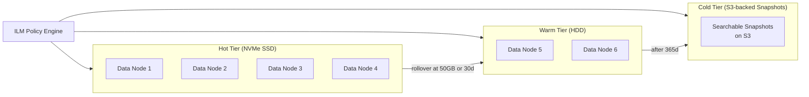

# 07 — Scaling Strategy: Mini Search Engine

## Objective

Define horizontal and vertical scaling strategies for each component: Elasticsearch cluster scaling (hot-warm-cold tiering, replica management), Kafka partitioning for indexing throughput, stateless query service scaling, and strategies for handling indexing spikes and hot shard problems.

---

## 1. Scaling Philosophy

| Principle | Application |
|-----------|-------------|
| Separate read and write scaling paths | Query service scales independently from Indexing Consumer |
| Stateless services scale horizontally | Query Service, Indexing Consumer — no node affinity |
| ES scales via data nodes (storage-bound) | Add data nodes as corpus grows; not CPU-bound at moderate QPS |
| Cache absorbs read amplification | Redis reduces ES QPS by 40–60% for popular queries |
| Kafka partitions drive indexing parallelism | More partitions = more consumer instances = higher throughput |

---

## 2. Elasticsearch Scaling

### 2.1 Node Roles and Dedicated Node Architecture

| Role | Count | Spec | Purpose |
|------|-------|------|---------|
| Dedicated Master | 3 | 8 vCPU, 16 GB RAM, 100 GB SSD | Cluster coordination, no data or search |
| Data (Hot) | 8–10 | 16 vCPU, 64 GB RAM, 2 TB NVMe SSD | Active indexing + searching |
| Data (Warm) | 4–6 | 8 vCPU, 32 GB RAM, 8 TB HDD | Historical data, read-only |
| Coordinating | 4 | 16 vCPU, 32 GB RAM, minimal disk | Query fan-out, aggregation merge |
| ML | 2 (optional) | 8 vCPU, 32 GB RAM | LTR model inference (V3+) |

**Why dedicated masters?** Master nodes hold cluster state (index metadata, shard allocation). If data nodes double as masters, a data node GC pause can trigger master election, causing cluster instability. Dedicated masters isolate this risk.

**Why coordinating nodes?** Large aggregations (faceted search) require merging results from all shards. If data nodes handle both shard-level execution AND merge, they're double-loaded. Coordinating nodes take the merge burden, protecting data node memory.

### 2.2 Horizontal Scaling: Adding Data Nodes

ES automatically rebalances shards when nodes are added. Process:

1. Add new data node to cluster (announce via `elasticsearch.yml` + discovery)
2. ES master detects new node, begins shard rebalancing
3. Shards migrate via recovery protocol (peer recovery — node-to-node copy)
4. Rebalancing is throttle-controlled (`cluster.routing.allocation.node_concurrent_recoveries`)
5. Monitor: `GET /_cluster/health` → `status: green` indicates rebalancing complete

**Scaling trigger:** Data node disk usage > 70% OR query latency p99 > 80ms.

### 2.3 Replica Management for Read Scaling

```
Base state: 1 primary + 1 replica per shard
Search scale: 1 primary + 2 replicas per shard (3x read throughput per shard)
HA-only: 1 primary + 1 replica (minimum for zero-downtime node failure)
```

ES routes search requests round-robin across primaries and replicas. Adding replicas linearly increases read throughput for shard-level query execution.

**Cost:** Each replica doubles storage cost. Evaluate: if 40% of queries are cache hits (Redis), adding replicas may not be needed.

### 2.4 Hot-Warm-Cold Architecture



**ILM Phase Actions:**

| Phase | Trigger | Actions |
|-------|---------|---------|
| Hot | Default | Accept writes, replicas=1, NVMe |
| Warm | Age > 7 days | force-merge to 1 segment, set replicas=0, migrate to warm nodes |
| Cold | Age > 30 days | searchable snapshot (index stays searchable via S3, no local disk) |
| Delete | Age > 365 days | Delete index (or archive to Glacier) |

**Storage savings:** Searchable snapshots (cold tier) eliminate local disk cost for archived indices while keeping them searchable (with higher latency on cold access).

### 2.5 Query Cache Configuration

| Cache Type | Scope | What it Caches | Eviction |
|------------|-------|----------------|----------|
| Request cache | Per-shard | Aggregation results for identical queries | LRU, invalidated on shard refresh |
| Query cache | Per-shard | Individual Lucene query results (filter context) | LRU, segment-level |
| Field data cache | Per-node | Fielddata for text fields (avoid — use doc_values) | LRU, memory-bound |

**Best practice:** Run filters in `filter` context (not `query` context) to leverage query cache. Filters have no relevance scoring, are cacheable, and are much faster.

---

## 3. Kafka Scaling for Indexing Throughput

### 3.1 Partition Sizing

| Topic | Current Partitions | Max Throughput | Scale Trigger |
|-------|-------------------|----------------|---------------|
| document-events | 32 | ~32 × 5 MB/s = 160 MB/s | Consumer lag > 10s |
| indexing-jobs | 16 | ~16 consumers (bulk mode) | Reindex duration too high |
| indexing-results | 8 | Low volume | Rarely needs scaling |

**Kafka partitions cannot be reduced.** Plan with headroom (3–5x expected peak). Adding partitions increases concurrency but may break ordering guarantees (events for the same document_id must go to the same partition, keyed by document_id).

### 3.2 Consumer Group Parallelism

```
Consumer Group: indexing-consumer-group
Instances: N = number of partitions consumed
At 32 partitions: 32 consumer instances max (1:1 partition assignment)
Practical: 16 instances (2 partitions each) for operational simplicity
```

Auto-scaling rule: `consumer_instances = ceil(consumer_lag_messages / target_lag_per_instance)`

### 3.3 Kafka Consumer Batching for ES Bulk API

```
Consumer polls up to 100 messages per poll cycle (max.poll.records=100)
Buffer: accumulate messages until 100 docs OR 500ms timeout (whichever first)
Submit: one ES _bulk request per buffer flush
Result: ES _bulk overhead amortized; 100x better throughput than per-document indexing
```

**Trade-off:** 500ms additional latency budget consumed by batching. Still within 5s NRT SLA.

---

## 4. Query Service Scaling

### 4.1 Stateless Query Service

The Query Service (Spring Boot) holds no state. All state is in ES (search results) and Redis (cache). This makes it trivially horizontally scalable.

```
Kubernetes HPA configuration:
  minReplicas: 4
  maxReplicas: 40
  targetCPUUtilizationPercentage: 70
  targetCustomMetric: search_latency_p99 > 80ms → scale up
  scaleDown: stabilizationWindowSeconds: 300 (avoid flapping)
```

**Connection pool sizing per instance:**
- ES connections: 50 per instance (ES coordinating nodes handle concurrency)
- Redis connections: 20 per instance

### 4.2 Load Balancing

```
Client → API Gateway (Kong) → Query Service instances
  Algorithm: Least connections (better than round-robin for variable-latency ES responses)
  Session affinity: None (stateless)
  Health check: GET /actuator/health (200 = healthy)
  Circuit breaker: If ES cluster unavailable → 503 + Redis fallback for cached queries
```

---

## 5. Hot Shard Problem

### 5.1 Detection

Symptoms:
- One shard's CPU is 10x others
- Query latency increases despite overall cluster health
- `GET /_cat/shards?v` shows uneven document count per shard

Root causes:
1. **Custom routing without load balance awareness** — all documents for one tenant on one shard
2. **High-cardinality term aggregation on a single shard** — all queries fan-out to hot shard
3. **Uneven document size** — one shard has 50 GB, others have 5 GB

### 5.2 Mitigation Strategies

| Strategy | Mechanism | Trade-off |
|----------|-----------|-----------|
| Default routing (no custom) | Hash-based distribution | Breaks tenant isolation efficiency |
| Routing with shard-level balancing | Custom routing key = `{tenant_id}_{shard_index % N}` | Documents for one tenant span multiple shards |
| Reindex with new shard count | New index with more shards | Downtime risk; full reindex cost |
| Shrink API (inverse) | Reduce shard count on over-sharded indices | Warm/cold indices only |
| Index splitting | Split one hot index into multiple | Complex alias management |

**Detection alert:** Monitor `GET /_cat/nodes?v&h=name,cpu,ram.percent,load_1m,disk.used_percent`. Alert when any node CPU > 85% while others < 40%.

---

## 6. Indexing Spike Handling

### 6.1 Spike Sources

- Flash sales: product data updated at midnight for thousands of products simultaneously
- Bulk imports: client imports 10 million new documents at once
- Reindex + NRT simultaneous: reindex job competes with live indexing

### 6.2 Mitigation Approaches

**Kafka as buffer (primary):**
```
Producer spike → Kafka absorbs (unbounded buffer)
Consumer rate-limits ES writes via batching throttle
ES cluster never directly exposed to spike amplitude
```

**ES bulk API backpressure:**
- Monitor ES `rejected_requests` rate on thread pools
- If `write` thread pool queue depth > 1000 → pause Kafka consumer offset commit (pause consumption)
- Kafka consumer pauses → Kafka accumulates on broker (Kafka is the shock absorber)
- Resume when ES queue depth drops < 100

**Configuring ES thread pools:**
```
thread_pool.write.queue_size: 1000    (default 200 — increase for spike tolerance)
thread_pool.search.queue_size: 1000   (separate from write pool)
```

**Separate consumer groups for reindex vs NRT:**
```
NRT consumer group: indexing-nrt (high priority)
Reindex consumer group: indexing-bulk (low priority, throttled)
```

---

## 7. Autocomplete Scaling

Autocomplete is the highest QPS endpoint (~20,000 QPS). Special scaling considerations:

### 7.1 ES Completion Suggester

- FST (Finite State Transducer) stored in JVM heap — fast but memory-heavy
- 100M docs with completion suggester field: ~5–10 GB heap per data node
- Scales with heap size, not disk

### 7.2 Redis Sorted Set Alternative

For extreme scale, move autocomplete out of ES entirely:

```
Pre-compute: top 100K search prefixes → Redis ZADD by frequency
At query time: ZRANGEBYLEX {index}:autocomplete [appl [appl\xff LIMIT 0 10
Result: O(log N + M) per query from Redis; ~0.5ms latency
```

**Cache warming:** Nightly job pre-computes prefix-to-suggestions mapping from `search_query_log` (top queries). Stored in Redis with TTL = 24 hours.

---

## 8. Scaling Evolution Timeline

| Stage | Documents | QPS | Architecture |
|-------|-----------|-----|--------------|
| MVP | < 1M | 100 | PostgreSQL pg_trgm; no ES |
| V1 | 1–10M | 1,000 | Single-node ES; 3-shard index |
| V2 | 10–50M | 5,000 | 3-node ES cluster; Redis cache; Kafka |
| V3 | 50–200M | 10,000 | 8-node hot + 4-node warm; coordinating nodes; HPA |
| V4 | 200M–1B | 50,000 | Multi-cluster (geo); cross-cluster search; dedicated ML nodes |

---

## 9. Interview Discussion Points

- **How do you scale search to 100k QPS without proportionally scaling ES?** Redis caches popular queries (top 10% of queries account for 60%+ of volume). Adding replicas triples shard-level read capacity. Coordinating nodes prevent data node overload. At 100k QPS, you need all three levers simultaneously.
- **When does adding more ES shards hurt performance?** Each search request fans out to all shards. 50 shards = 50 shard queries per search. Merging 50 results sets is CPU-intensive on the coordinating node. More shards increases parallelism for indexing but increases overhead for search. Optimal: shard size 20–40 GB; minimize shard count within that constraint.
- **How does Kafka protect ES from write spikes?** Kafka decouples the write rate (indexing ingestion) from the read rate (ES bulk calls). A spike of 100,000 documents in 1 second hits Kafka (durable). Consumers drain at a controlled rate (1,000 docs/sec). ES sees a smooth write rate; never the spike.
- **What's the fastest path to reduce search latency from 100ms to 20ms?** (1) Ensure hot data is in OS page cache (no disk I/O). (2) Enable request cache for aggregation-heavy queries. (3) Add Redis for popular query caching. (4) Pre-warm ES segment cache after node restart. (5) Force merge indices to 1 segment (eliminates per-segment overhead). Each step independently shaves latency.
