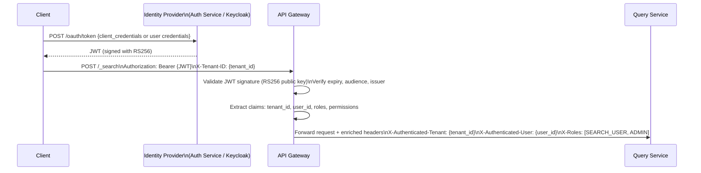

# 08 — Security Design: Mini Search Engine

## Objective

Define the security architecture for the search platform: API authentication and authorization, field-level security, multi-tenant index isolation, encryption strategy, secrets management, GDPR compliance for search indexes, and audit logging.

---

## 1. Authentication Architecture

### 1.1 JWT-Based Authentication

All API requests authenticate via JWT (JSON Web Token) issued by a central Identity Provider (IdP).



**JWT claims structure:**
```json
{
  "sub": "user-uuid",
  "tenant_id": "tenant-uuid",
  "roles": ["SEARCH_USER"],
  "permissions": ["search:read", "documents:write"],
  "index_allowlist": ["products", "articles"],
  "iat": 1705312800,
  "exp": 1705316400,
  "iss": "https://auth.example.com",
  "aud": "search-api"
}
```

### 1.2 JWT vs Session Tokens

| Concern | JWT | Session |
|---------|-----|---------|
| Stateless | Yes | No (requires session store) |
| Revocation | Hard (until expiry) | Instant |
| Microservice-friendly | Yes | No (all services need session store access) |
| Token size | ~1 KB | ~32 bytes (ID only) |
| Performance | Verify locally | Remote lookup required |

**Decision:** JWT with short expiry (1 hour) + refresh token pattern. Token revocation via short-lived JWTs + refresh token blacklist in Redis (UUID → blacklisted flag, TTL = refresh token lifetime).

### 1.3 API Key Authentication for Service-to-Service

Internal services (e.g., Indexing Consumer → ES) use API keys:
```
ES API Key: generated via POST /_security/api_key
Stored in: HashiCorp Vault / AWS Secrets Manager
Rotated: every 90 days via automated rotation job
```

---

## 2. Authorization: RBAC

### 2.1 Role Definitions

| Role | Permissions | Use Case |
|------|-------------|---------|
| `SEARCH_USER` | `search:read` on allowed indices | End users, public search |
| `INDEXING_SERVICE` | `documents:write`, `documents:delete` on owned indices | Ingestion Service |
| `SCHEMA_ADMIN` | `indices:manage`, `mappings:write` | Schema management team |
| `TENANT_ADMIN` | All operations within tenant | Tenant superuser |
| `PLATFORM_ADMIN` | All operations across tenants | Platform operations team |
| `READONLY_AUDITOR` | `audit_logs:read`, `search_queries:read` | Compliance team |

### 2.2 Index-Level Authorization

Enforced at the Query Service layer before any ES call:

```
For each search request:
  1. Extract tenant_id from validated JWT
  2. Verify index_name is in JWT's index_allowlist OR user has TENANT_ADMIN role
  3. Inject mandatory filter: { "term": { "tenant_id": "{tenant_id}" } }
  4. Never execute ES query without tenant filter (defense in depth)
```

Even if a malicious client bypasses the application layer and hits ES directly, Elasticsearch's Document-Level Security (DLS) enforces the same tenant filter at the ES engine level.

---

## 3. Elasticsearch Native Security (Defense in Depth)

### 3.1 Elasticsearch RBAC

ES 8.x has built-in security (enabled by default — no longer optional).

**ES roles defined for application principals:**

```json
// Role: search-service-role (for Query Service)
{
  "indices": [
    {
      "names": ["*"],
      "privileges": ["read", "view_index_metadata"],
      "query": {
        "term": { "tenant_id": "{{username}}" }
      }
    }
  ]
}

// Role: indexing-service-role (for Indexing Consumer)
{
  "indices": [
    {
      "names": ["*"],
      "privileges": ["create", "index", "delete", "write"],
      "field_security": {
        "grant": ["*"],
        "except": ["_internal_*"]
      }
    }
  ]
}
```

### 3.2 Document-Level Security (DLS)

ES DLS enforces per-document access control using a Lucene-level filter:

```json
{
  "indices": [
    {
      "names": ["*"],
      "privileges": ["read"],
      "query": "{ \"term\": { \"tenant_id\": \"{{_user.metadata.tenant_id}}\" } }"
    }
  ]
}
```

DLS is enforced on every shard-level query execution — even if the application forgets to inject the tenant filter. Overhead: ~5% additional latency (extra Lucene filter per query).

### 3.3 Field-Level Security (FLS)

Prevents sensitive fields from appearing in search results for unauthorized users:

```json
{
  "indices": [
    {
      "names": ["users_*"],
      "privileges": ["read"],
      "field_security": {
        "grant": ["public_name", "created_at"],
        "except": ["email", "phone", "ssn", "payment_info"]
      }
    }
  ]
}
```

**Use cases:**
- Internal admin sees all fields; external search user sees only public fields
- GDPR: PII fields (email, phone) hidden from search results API
- Analytics role: sees aggregation fields but not source content

---

## 4. Multi-Tenant Index Isolation

### 4.1 Isolation Models

| Model | Description | Isolation Level | Cost |
|-------|-------------|----------------|------|
| **Index per tenant** | `acme_products`, `globex_products` | Strong | High (many indices) |
| **Shared index + DLS** | One index; DLS filters per tenant | Moderate | Low |
| **Cluster per tenant** | Separate ES cluster per large tenant | Strongest | Very high |

**Decision matrix:**

| Tenant Type | Strategy | Rationale |
|-------------|----------|-----------|
| Small tenants (< 100K docs) | Shared index + DLS | Operationally simple; acceptable isolation |
| Medium tenants (100K–5M docs) | Index per tenant | DLS overhead adds up; dedicated index gives better performance |
| Large tenants (> 5M docs, SLA guarantees) | Dedicated cluster | Noisy neighbor elimination; contractual isolation |

**Our decision:** Index per tenant (format: `{tenant_id}_{index_name}_{version}`). DLS as defense-in-depth layer.

### 4.2 Noisy Neighbor Prevention

Even with separate indices, data nodes are shared:

- **Shard allocation awareness:** Assign large tenants' shards to specific nodes via allocation filtering
- **Rate limiting:** Enforce per-tenant QPS limits at API Gateway (Redis token bucket)
- **Bulk write throttling:** Per-tenant indexing rate limits in Kafka consumer (pause consumer if token bucket exhausted)

---

## 5. Encryption

### 5.1 Encryption at Rest

| Layer | Encryption | Notes |
|-------|------------|-------|
| Elasticsearch indices | Filesystem-level encryption (dm-crypt/LUKS or cloud disk encryption) | AWS: EBS encryption with KMS |
| PostgreSQL | Transparent Data Encryption (TDE) | AWS RDS: encryption enabled at creation |
| Kafka | Encrypted disk on broker nodes | Confluent Cloud: default |
| Redis | Encryption at rest (AWS ElastiCache: enabled) | |
| S3 (snapshots) | SSE-S3 or SSE-KMS | KMS for customer-managed keys |

### 5.2 Encryption in Transit

```
All services: TLS 1.2+ (prefer TLS 1.3)
ES inter-node: TLS enabled (elasticsearch.yml: xpack.security.transport.ssl)
ES-to-client: HTTPS enforced
Kafka: TLS (SASL_SSL listener)
Redis: TLS (Redis 6+ supports TLS natively)
Internal service-to-service: mTLS (mutual TLS via service mesh — Istio/Linkerd)
```

### 5.3 PII in Search Indices

**Problem:** Documents may contain PII (email, phone, name) in indexed text fields. PII in ES presents GDPR risk.

**Options:**

| Approach | Description | Trade-off |
|----------|-------------|-----------|
| Field-level encryption | Encrypt PII fields before indexing | Cannot search on encrypted values |
| Tokenization | Replace PII with non-reversible token | PII searchable only via token lookup |
| Exclusion from index | Store PII in PostgreSQL only; exclude from ES | Cannot search by PII in ES |
| Pseudonymization | Map real PII to pseudonym (UUID); store mapping in vault | Searchable via pseudonym; reversible |

**Decision:** Exclude PII from the search index by default. If PII must be searchable (e.g., CRM search by email), use pseudonymization. Never store plaintext PII in Elasticsearch.

---

## 6. Secrets Management

### 6.1 Secret Types

| Secret | Storage | Rotation |
|--------|---------|----------|
| ES API keys | HashiCorp Vault | 90 days (automated) |
| PostgreSQL credentials | Vault dynamic secrets | On demand (Vault generates short-lived creds) |
| Kafka service accounts | Vault | 30 days |
| Redis AUTH password | Vault | 90 days |
| JWT signing keys (RS256 private key) | Vault (key management secrets engine) | 180 days |
| S3 access keys | IAM roles (no static keys) | N/A — instance profile |

### 6.2 Vault Integration

Spring Boot services use Spring Cloud Vault:
- Credentials injected at startup from Vault
- Dynamic secrets: Vault generates unique PostgreSQL credentials per service instance
- Lease renewal: automatic via Vault agent sidecar (K8s)
- Secret rotation: service restarts or dynamically refreshes without downtime

---

## 7. Rate Limiting

### 7.1 Rate Limit Configuration

| Client Type | Limit | Window | Burst |
|-------------|-------|--------|-------|
| Public search (unauthenticated) | 10 req/sec | 1 minute | 50 |
| Authenticated user | 100 req/sec | 1 minute | 500 |
| Service account (bulk indexing) | 1,000 req/sec | 1 minute | 5,000 |
| Admin operations | 50 req/sec | 1 minute | 100 |

**Implementation:** API Gateway (Kong) with Redis-backed token bucket algorithm. Per-tenant rate limits override defaults for large customers.

**Response on limit exceeded:**
```
HTTP 429 Too Many Requests
Retry-After: 10
X-Rate-Limit-Limit: 100
X-Rate-Limit-Remaining: 0
X-Rate-Limit-Reset: 1705312860
```

---

## 8. Audit Logging (GDPR Compliance)

### 8.1 Events Audited

| Event | Logged Fields | Retention |
|-------|--------------|-----------|
| Search query executed | user_id, tenant_id, raw_query, result_count, took_ms | 90 days |
| Document indexed | user_id, tenant_id, doc_id, operation, timestamp | 1 year |
| Document deleted | user_id, tenant_id, doc_id, delete_type (soft/hard), timestamp | 7 years |
| Schema changed | user_id, index_name, old_mapping, new_mapping | 7 years |
| Index created/deleted | user_id, index_name, timestamp | 7 years |
| Authentication failure | ip_address, user_id (if known), failure_reason | 30 days |
| Rate limit exceeded | ip_address, tenant_id, endpoint, timestamp | 30 days |
| PII access (field-level) | user_id, doc_id, fields_accessed | 1 year |

### 8.2 Audit Log Architecture

Audit events are written to a **separate, append-only, tamper-evident** log:
- Written to PostgreSQL `audit_log` table (append-only — no UPDATE/DELETE permissions for app service accounts)
- Streamed to Kafka topic `audit-events` → forwarded to SIEM (Splunk, Datadog)
- Audit log table cannot be queried via the search API (separate access path)

### 8.3 GDPR Right to Erasure (Article 17)

When a user requests data deletion:

1. **Identify:** Query `documents` table for `user_id` (created_by field)
2. **Delete from PostgreSQL:** Soft delete (mark deleted_at), then schedule hard delete after 30-day dispute window
3. **Delete from Elasticsearch:** `DELETE /index/_doc/{doc_id}` for each affected document
4. **Delete from Redis cache:** Invalidate all cache entries containing this user's content
5. **Delete from Kafka:** Cannot delete from Kafka log directly; tombstone record published; log compaction will remove over time (Kafka retention: 7 days for this topic)
6. **Delete from backups:** Mark for exclusion from backup restores (not immediately possible for S3 snapshots — document this limitation in compliance policy)
7. **Audit:** Record erasure confirmation in audit log

---

## 9. API Gateway Security (Kong)

```
Plugins enabled per route:
  - jwt: Validate JWT signature, expiry
  - rate-limiting-advanced: Token bucket per client
  - request-validator: Schema validation on request body
  - response-transformer: Remove internal headers before client response
  - ip-restriction: Block known malicious IPs (updated via threat feed)
  - bot-detection: Block scraping bots on search endpoints
  - cors: Restrict origins to known frontend domains
```

---

## 10. SQL Injection and Query Injection Prevention

**PostgreSQL:** All queries use parameterized statements (JPA/Spring Data). No raw string concatenation in SQL.

**Elasticsearch Query Injection:** ES Query DSL is JSON. If user-supplied text is embedded in ES query JSON, malicious users could escape the string and inject additional query clauses.

Prevention:
- User-supplied text is always placed in the `value` field of a `match` or `term` query (never in the query structure keys)
- ES Query DSL is constructed programmatically via typed Java ES client (never string-concatenated)
- Input validation: reject query strings > 1,000 characters; strip control characters

---

## 11. Interview Discussion Points

- **Why use both application-level tenant filtering AND ES DLS?** Defense in depth. If the application layer has a bug (missing tenant_id injection), ES DLS prevents data leakage at the engine level. Security critical systems should never rely on a single enforcement point.
- **How do you handle GDPR right to erasure when documents are in Kafka?** Kafka is append-only — you can't delete individual messages. Publish a tombstone (null value with same key). Topic compaction will eventually remove all prior versions. For immediate compliance, consider encrypting the document payload with a per-user key — erasure means deleting the key, making all encrypted payloads unreadable instantly.
- **Field-level security in ES — what's the performance impact?** ES FLS applies a Lucene field filter at the shard level. For queries with FLS, ES still retrieves the full document internally but strips disallowed fields before returning. Overhead is ~10–15% additional latency and memory (full doc fetched, then masked). Acceptable for most use cases; problematic at extreme QPS.
- **How do you protect against autocomplete attacks (data extraction via prefix enumeration)?** Rate limit the suggest endpoint aggressively (10 req/sec per unauthenticated client). Return at most 10 suggestions. Do not return document IDs in suggestions — only text strings. Monitor for clients systematically enumering the alphabet.
