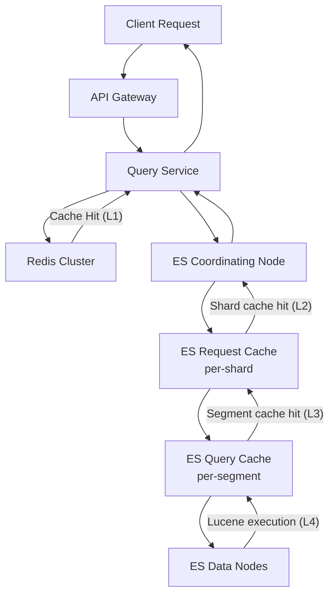

# 09 — Caching Strategy: Mini Search Engine

## Objective

Define the multi-layer caching strategy for the search platform: Redis caching for query results, autocomplete prefixes, and aggregations; Elasticsearch's built-in request and query caches; cache invalidation on document updates; TTL strategy; and cache warming for popular terms.

---

## 1. Caching Architecture Overview



**Cache Layers:**

| Layer | Location | What | Latency Hit | Latency Miss |
|-------|----------|------|------------|--------------|
| L1: Redis | Application tier | Full query results, autocomplete, aggregations | ~1ms | ~15ms (ES) |
| L2: ES Request Cache | Coordinating/Data nodes | Shard-level full aggregation results | ~2ms | ~20ms (Lucene) |
| L3: ES Query Cache | Data nodes (per segment) | Individual Lucene query bitsets (filters) | ~0.5ms | ~5ms (Lucene) |
| L4: OS Page Cache | Data nodes | Lucene segment files in memory | ~1ms (memory) | ~10ms (disk) |

---

## 2. Redis Caching Strategy

### 2.1 Query Result Cache

**Purpose:** Cache complete search API responses for popular, repeated queries.

**Cache Key Design:**
```
search:{tenant_id}:{index_name}:{query_hash}:{page_token}

where:
  query_hash = SHA-256(canonical JSON of: query body + filters + sort + page_size)
  page_token = SHA-256(search_after cursor) or "first_page"
```

**Why SHA-256 hash?** Query DSL can be multi-KB. Hashing reduces key size. Canonical JSON normalization ensures equivalent queries (different field ordering) produce the same key.

**TTL Strategy:**

| Query Type | TTL | Rationale |
|------------|-----|-----------|
| General keyword search | 60 seconds | Balance freshness vs cache efficiency |
| Filter-only search (no text) | 300 seconds | Deterministic results; less affected by new docs |
| Aggregations / facets | 120 seconds | Aggregation staleness is acceptable |
| Zero-result queries | 300 seconds | If nothing matched, unlikely to change quickly |
| Highly personalized queries | No cache | User-specific context invalidates sharing |

**Cache value:** Serialized SearchResult JSON (compressed with Snappy — ~60% size reduction).

**Max cache size:** 10 GB Redis memory → ~500,000 cached results (at 20 KB average compressed response).

### 2.2 Autocomplete Prefix Cache

**Purpose:** Cache autocomplete suggestions for popular prefixes (top 100K prefixes).

**Cache Key:**
```
suggest:{tenant_id}:{index_name}:{prefix_lowercase}
```

**Value:** List of (suggestion_text, weight) pairs, serialized.

**TTL:** 1 hour. Suggestions change slowly (new popular terms emerge over days, not minutes).

**Pre-computation (Cache Warming):**

```
Nightly batch job (2 AM):
  1. Query search_query_log for top 100K queries in last 30 days (by frequency)
  2. Extract all prefixes (length 2–10) from these queries
  3. For each prefix: execute ES completion suggest
  4. Store results in Redis: SET suggest:{tenant}:{prefix} {results} EX 86400
  5. Total keys: ~500K (50K queries × 10 avg prefixes)
  6. Redis memory: ~500K × 500 bytes = 250 MB (minimal)
```

**Cache hit rate target:** 80%+ for autocomplete (users type popular prefixes repeatedly).

### 2.3 Aggregation Cache

**Purpose:** Cache facet/aggregation results for popular queries. Aggregations are expensive — they scan all matching documents, not just top-K.

**Cache Key:**
```
agg:{tenant_id}:{index_name}:{aggregation_hash}
where aggregation_hash = SHA-256(query + filter context + aggregation definitions)
```

**TTL:** 120 seconds (facet counts tolerate short staleness — new document added won't shift category counts significantly in most cases).

**Cache invalidation trigger:** If indexing throughput for this index exceeds 1,000 docs/min, reduce TTL to 30 seconds (index is changing rapidly).

### 2.4 Cache Invalidation on Document Updates

**Strategies compared:**

| Strategy | Mechanism | Accuracy | Complexity |
|----------|-----------|----------|------------|
| TTL expiry | Let cache expire naturally | Eventually consistent | Low |
| Tag-based invalidation | Track which docs affect which cache keys | High | Very high |
| Index-level invalidation | On any update to index, flush all cache for that index | Perfect | Medium (thundering herd risk) |
| Selective invalidation | Invalidate only queries affected by changed fields | Very high | Extremely high |

**Decision:** TTL-based expiry for general search. Index-level invalidation only for schema changes and reindex operations (rare, high-impact events).

**Index-level invalidation flow:**
```
On ReindexCompleted event:
  Redis SCAN 0 MATCH search:{tenant_id}:{index_name}:* COUNT 100
  → Delete all matching keys in batches
  Estimated time: < 5 seconds for 10K matching keys
```

**Thundering herd prevention:** When popular cache entries expire simultaneously:
- Use probabilistic early expiration (PER): re-compute slightly before expiry using `expires_at - rand(0, 0.1 × TTL)`
- Or: cache stampede lock — one request recomputes, others wait (Redis SETNX lock per cache key)

---

## 3. Elasticsearch Built-in Caches

### 3.1 Request Cache (Coordinating/Shard Level)

- **Caches:** Aggregation results for entire shard, for queries where `_source` is false and the shard contents haven't changed
- **Scope:** Per-shard; aggregation-only (not full hits)
- **Size:** 1% of JVM heap per node (configurable; default ~320 MB at 32 GB heap)
- **Invalidation:** Automatic on shard refresh (when new documents are indexed)
- **Key:** Hash of the query JSON

**Best practice:** Enable request cache for aggregation-heavy queries:
```json
GET /index/_search?request_cache=true
{
  "size": 0,
  "aggs": { ... }
}
```

Setting `size=0` (no hits, only aggregations) maximizes request cache efficiency.

### 3.2 Query Cache (Segment Level)

- **Caches:** Lucene query bitsets (which documents match a filter) per segment
- **Scope:** In-memory bitsets; very fast
- **Best used for:** Filter context queries (term, range, exists filters) — not query context (full-text)
- **Size:** 10% of JVM heap (default)
- **Invalidation:** When segment is merged (new segments after indexing)

**Critical insight:** Always put filters in `filter` context, not `query` context:
```json
// Good: filter context (cacheable)
{
  "query": {
    "bool": {
      "must": { "match": { "title": "apple" } },
      "filter": [
        { "term": { "category": "electronics" } },
        { "range": { "price": { "gte": 100 } } }
      ]
    }
  }
}

// Bad: query context (not cacheable, scored unnecessarily)
{
  "query": {
    "bool": {
      "must": [
        { "match": { "title": "apple" } },
        { "match": { "category": "electronics" } }  // no scoring needed here
      ]
    }
  }
}
```

### 3.3 OS Page Cache (Implicit)

The most important Elasticsearch performance lever:
- Lucene stores inverted indices as segment files on disk
- Linux OS page cache keeps frequently accessed segments in RAM
- Cold segments (rarely queried) are evicted; hot segments stay in memory
- **Target:** 100% of hot index segments in page cache

**Sizing:** Data node needs sufficient RAM for:
```
JVM heap: 32 GB (ES recommendation: half of RAM, max 32 GB)
OS page cache: 32 GB (remaining RAM for segment file caching)
Total RAM needed per data node: 64 GB
```

Never swap Elasticsearch. Configure `bootstrap.memory_lock: true` and disable swap:
```bash
echo "vm.swappiness = 1" >> /etc/sysctl.conf
ulimit -l unlimited  # for mlockall
```

---

## 4. CDN for Public Search Results

For public (unauthenticated) search results (e.g., e-commerce product search):

| URL Pattern | CDN TTL | Use Case |
|-------------|---------|----------|
| `/search?q=iphone&category=electronics` | 30 seconds | Popular queries change frequently |
| `/suggest?q=iph` | 60 seconds | Autocomplete suggestions |
| `/search?q=iphone&page=2` | 60 seconds | Paginated results less popular |

**CDN consideration:** Only cache unauthenticated (public) search results. Authenticated requests (with `Authorization` header) must bypass CDN (Vary: Authorization header in response).

---

## 5. Cache Warming Strategy

### 5.1 Startup Cache Warming

On Query Service startup, pre-warm Redis with the most popular queries:

```
1. Query search_query_log for top 1,000 queries in last 24 hours (per tenant)
2. Execute each query against ES
3. Store results in Redis
4. Duration: < 2 minutes for 1,000 queries at 10 QPS concurrent warming
```

**Why?** After a pod restart or Redis flush, all queries would miss cache simultaneously, causing a latency spike. Warming prevents this.

### 5.2 Pre-Index Cache Warming (After Reindex)

After alias switch (reindex complete), immediately warm caches:
1. Warm ES request cache: replay top-100 aggregation queries against new index
2. Warm Redis: replay top-1,000 popular query cache keys
3. Total warming window: 5 minutes

---

## 6. Cache Key Design Anti-Patterns

| Anti-Pattern | Problem | Fix |
|-------------|---------|-----|
| Using raw query string as key | Different encoding, whitespace = different keys for same query | Canonical JSON + SHA-256 hash |
| Not including tenant_id in key | Tenant A sees Tenant B's results | Always prefix with tenant_id |
| Not including schema_version in key | Schema change returns stale results with old field structure | Include current mapping version in key |
| Caching error responses | Errors cached → clients see stale errors | Only cache 200 responses |
| Caching with infinitely large keys | Redis memory waste | Cap key size at 512 bytes; hash large query bodies |

---

## 7. Redis Cluster Configuration

```
Topology: Redis Cluster (3 primary + 3 replica nodes)
Memory per node: 20 GB
Total memory: 60 GB (30 GB usable after replication)
Eviction policy: allkeys-lru (evict least recently used keys on memory pressure)
Persistence: AOF enabled (every second fsync) — tolerate < 1s data loss
Serialization: JSON + Snappy compression (field: compressed_data)
Connection pool: 50 connections per Query Service instance
```

---

## 8. Monitoring Cache Effectiveness

| Metric | Target | Alert Threshold |
|--------|--------|-----------------|
| Redis cache hit rate (search) | > 40% | < 20% |
| Redis cache hit rate (autocomplete) | > 80% | < 60% |
| Redis memory utilization | < 80% | > 85% |
| ES request cache hit rate | > 60% (aggregations) | < 30% |
| ES query cache evictions/sec | < 100/sec | > 500/sec |
| Cache latency (Redis GET) | < 2ms p99 | > 10ms |

---

## 9. Interview Discussion Points

- **Why use Redis in front of Elasticsearch when ES has its own caches?** ES caches operate at the shard level and are invalidated on every refresh (1 second). For popular repeated queries, Redis provides a higher-level, application-controlled cache with longer TTLs and consistent behavior. ES cache hit rate is limited by its 1-second invalidation window; Redis can hold results for 60+ seconds.
- **How do you prevent a cache stampede after Redis flush?** Three mechanisms: (1) Startup warming pre-fills cache before traffic arrives. (2) Probabilistic early expiration regenerates cache slightly before expiry (avoids simultaneous expiry of many keys). (3) Mutex lock (Redis SETNX) on cache misses — one request recomputes, others wait rather than all hammering ES simultaneously.
- **How do you invalidate cache on document updates without complex tracking?** For NRT indexing, TTL expiry (60s) is the primary mechanism — acceptable for search. For bulk operations (reindex, schema change), trigger index-level cache flush (SCAN + DEL all keys for that index). The tradeoff is a short period of stale results vs the complexity of per-document invalidation tracking.
- **What's the right TTL for autocomplete?** Autocomplete suggestions derive from historical query logs and index content. Popular suggestions (top 1000) change weekly, not hourly. A 1-hour TTL with nightly warming is appropriate. For very dynamic content (e.g., trending topics on Twitter), reduce to 5 minutes.
