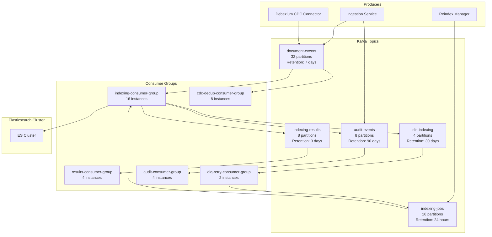
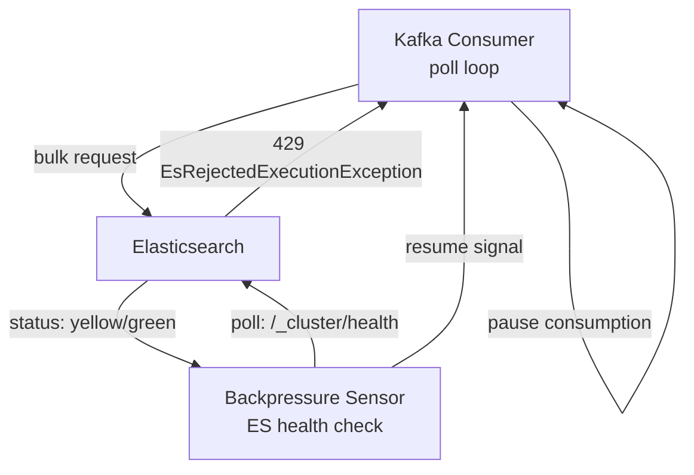

# 10 — Message Queue Design: Mini Search Engine

## Objective

Design the Kafka-based message queue architecture for the indexing pipeline: topic design, consumer group strategy, exactly-once semantics, backpressure handling when Elasticsearch is overloaded, and batch vs per-document indexing tradeoffs.

---

## 1. Kafka Architecture Overview



---

## 2. Topic Design

### 2.1 document-events

**Purpose:** Primary event stream for all document lifecycle events (create, update, delete).

| Parameter | Value | Rationale |
|-----------|-------|-----------|
| Partitions | 32 | 1,000 docs/sec × 5 KB × safety factor = ~8 MB/sec; 32 partitions @ 250 KB/sec each |
| Replication factor | 3 | Tolerate 2 broker failures |
| Retention | 7 days | Allow reprocessing window; NRT consumers should be < 5 seconds behind |
| Compression | LZ4 | Fast; ~40% reduction for JSON |
| Cleanup policy | delete | Events expire after retention period |
| `max.message.bytes` | 10 MB | Allow large documents; ES limit is higher |
| Partition key | `document_id` (hashed) | Ensures events for same document go to same partition → ordering preserved |

**Event schema:**
```json
{
  "event_id": "uuid",
  "event_type": "DocumentCreated | DocumentUpdated | DocumentDeleted",
  "event_version": "1",
  "tenant_id": "uuid",
  "index_name": "products",
  "document_id": "uuid",
  "operation": "INDEX | DELETE",
  "document_version": 3,
  "timestamp": "2024-01-15T10:00:00Z",
  "correlation_id": "uuid",
  "payload": {
    "fields": { ... }   // included for CREATE; null for DELETE (payload fetched from PG)
  }
}
```

**Design note on payload inclusion:**
- Including full payload in event: faster consumer (no PG lookup); risk of large messages; schema coupling
- Excluding payload (event reference only): requires PG lookup per event; network hop; cleaner separation

**Decision:** Include payload for CREATE events (latency optimization). For UPDATE and DELETE, consumer fetches current state from PostgreSQL (to get latest version, not potentially stale event payload).

### 2.2 indexing-jobs

**Purpose:** Work queue for bulk and reindex operations (separate from NRT stream).

| Parameter | Value | Rationale |
|-----------|-------|-----------|
| Partitions | 16 | Reindex: 50K docs/sec → 16 consumers × 3,125 docs/sec each |
| Retention | 24 hours | Reindex jobs complete within hours |
| Cleanup policy | delete | Short-lived work queue |
| Priority | Low (separate consumer group) | Does not compete with NRT indexing |

**Event schema:**
```json
{
  "job_id": "uuid",
  "batch_id": "uuid",
  "tenant_id": "uuid",
  "index_name": "products",
  "operation": "REINDEX_FULL | REINDEX_PARTIAL | BULK_INDEX",
  "document_ids": ["uuid1", "uuid2", ...],  // batch of up to 1000
  "target_physical_index": "products_v2",
  "schema_version": 2,
  "created_at": "2024-01-15T10:00:00Z"
}
```

### 2.3 indexing-results

**Purpose:** Outcome tracking for completed indexing operations.

| Parameter | Value | Rationale |
|-----------|-------|-----------|
| Partitions | 8 | Low volume — 1 result per batch |
| Retention | 3 days | For monitoring and reconciliation |

**Event schema:**
```json
{
  "result_id": "uuid",
  "batch_id": "uuid",
  "document_id": "uuid",
  "tenant_id": "uuid",
  "status": "SUCCESS | FAILED | PARTIAL",
  "attempt_count": 1,
  "took_ms": 23,
  "error": null,
  "indexed_at": "2024-01-15T10:00:00Z"
}
```

### 2.4 dlq-indexing (Dead Letter Queue)

**Purpose:** Documents that failed indexing after maximum retry attempts.

| Parameter | Value | Rationale |
|-----------|-------|-----------|
| Partitions | 4 | Low volume — failures are rare |
| Retention | 30 days | Manual review and replay window |
| Alert | On any message | Every DLQ message is an SLA breach |

**DLQ event schema:**
```json
{
  "original_event": { ... },        // original document-events payload
  "failure_reason": "ES_TIMEOUT | MAPPING_CONFLICT | CIRCUIT_BREAKER_OPEN | UNKNOWN",
  "attempt_count": 5,
  "last_error": "ConnectionException: ES node unreachable",
  "first_failed_at": "2024-01-15T09:50:00Z",
  "last_failed_at": "2024-01-15T10:00:00Z"
}
```

**DLQ retry policy:**
- DLQ Consumer reads messages continuously
- On manual inspection + approval: republish to `document-events` topic
- On automated retry (transient failure pattern): schedule replay after 1 hour
- On permanent failure (schema incompatibility): page on-call, skip document, record in `indexing_jobs` as FAILED

### 2.5 audit-events

**Purpose:** Immutable audit trail for all user actions and system events.

| Parameter | Value | Rationale |
|-----------|-------|-----------|
| Partitions | 8 | ~1,000 audit events/sec peak |
| Retention | 90 days on Kafka | Forwarded to long-term storage (S3 + ElasticSearch audit index) |
| Cleanup policy | delete | Forwarded to permanent store |

---

## 3. Consumer Group Design

### 3.1 NRT Indexing Consumer Group

```
Group ID: indexing-nrt-consumer-group
Instances: 16 (matching 32 partitions / 2 partitions per instance)
Auto-scaling: Kafka lag-based HPA (KEDA — Kubernetes Event-Driven Autoscaling)
  - min: 8 instances
  - max: 32 instances
  - scale-up trigger: consumer lag > 10,000 messages
  - scale-down trigger: consumer lag < 1,000 messages for 5 minutes

per-consumer config:
  max.poll.records: 100       // batch size for ES _bulk
  max.poll.interval.ms: 30000 // 30s max between polls (ES indexing can be slow)
  session.timeout.ms: 10000
  heartbeat.interval.ms: 3000
  enable.auto.commit: false   // manual commit after ES confirmation
  isolation.level: read_committed  // transactional producers only
```

### 3.2 Bulk Reindex Consumer Group

```
Group ID: indexing-bulk-consumer-group
Topic: indexing-jobs
Instances: 8 (can scale to 16 for faster reindex)
Throttle: 100ms sleep between ES bulk calls (configurable)
Priority: lower than NRT (deployed as separate K8s Deployment with lower resource limits)
```

### 3.3 Consumer Offset Management

```
Offset commit strategy: Manual, synchronous commit after ES bulk confirmation
Flow:
  1. Poll batch from Kafka (up to 100 records)
  2. Transform documents (ACL transform)
  3. Submit ES _bulk request
  4. Wait for ES response (parse per-document status)
  5. Re-enqueue failed documents to dlq-indexing
  6. Commit Kafka offset only after step 5
  7. If consumer crashes before step 6: Kafka re-delivers the batch → idempotent ES index by _id
```

This is at-least-once with idempotent consumer = effectively exactly-once for document indexing.

---

## 4. Exactly-Once Indexing Semantics

True Kafka exactly-once requires Kafka transactions (EOS — Exactly Once Semantics). For indexing, we achieve the same result without Kafka EOS:

| Concern | Solution |
|---------|---------|
| Duplicate Kafka delivery (at-least-once) | ES `_id = document_id` — duplicate index is an idempotent upsert |
| Stale event delivery (old event after new one) | Check ES `_version` — if incoming event version < ES current version, skip |
| Offset committed before ES confirmation | Manual commit: offset committed only after ES 200 OK |
| ES partial bulk failure | Parse per-document response; retry failed items; idempotent on retry |

**Kafka Transactions (Optional, V2+):** If events span multiple topics (e.g., document-events + audit-events must be atomically published), use Kafka producer transactions:
```
producer.beginTransaction()
producer.send(documentEventsTopic, event)
producer.send(auditEventsTopic, auditEvent)
producer.commitTransaction()  // atomic across both topics
```

---

## 5. Backpressure When ES is Overloaded

### 5.1 ES Overload Signals

| Signal | Detection | Threshold |
|--------|-----------|-----------|
| Write thread pool rejection | `GET /_nodes/stats?filter_path=*.thread_pool.write` | rejected > 100/sec |
| Search thread pool rejection | `GET /_nodes/stats` | rejected > 50/sec |
| ES heap pressure (GC) | JVM GC time > 5% | From JVM metrics |
| Indexing rate circuit breaker | `EsRejectedExecutionException` in consumer logs | Any occurrence |

### 5.2 Backpressure Implementation



**Implementation steps:**

1. **ES returns 429 / EsRejectedExecutionException:**
   - Consumer catches exception
   - Do NOT commit Kafka offset (message will be re-delivered)
   - Call `consumer.pause(partitions)` — stops fetching new messages
   - Sleep with exponential backoff: 1s, 2s, 4s, 8s, max 30s

2. **Health check loop:**
   - Background thread polls `GET /_cluster/health` every 5 seconds
   - When status returns `green` or `yellow` AND thread pool queue < 500: call `consumer.resume(partitions)`

3. **Circuit breaker (Resilience4j):**
   - ES client wrapped in circuit breaker
   - Open after 5 consecutive failures in 30s window
   - Half-open after 60s (try one request)
   - Closed on 3 consecutive successes

4. **Alerting:**
   - Consumer lag > 30 seconds → page on-call
   - Circuit breaker open > 5 minutes → page on-call

### 5.3 Kafka as Shock Absorber

This design is why Kafka is essential:

```
Without Kafka (synchronous indexing):
  ES overloaded → HTTP 429 to ingestion service → 429 to client → indexing fails

With Kafka:
  ES overloaded → consumer pauses → Kafka accumulates → no client impact
  ES recovers → consumer resumes → lag drains → eventual consistency restored
  Client always gets 202 Accepted
```

---

## 6. Batch vs Per-Document Indexing

### 6.1 ES Bulk API Design

The ES `_bulk` API is the cornerstone of high-throughput indexing:

```
Batch configuration:
  min_batch_size: 1 document (for DLQ retry)
  optimal_batch_size: 500–1,000 documents (empirically optimal for ES bulk)
  max_batch_size: 5,000 documents (diminishing returns; GC pressure)
  max_batch_size_bytes: 50 MB (ES bulk request size limit)
  flush_interval: 500ms (maximum latency added by batching)
```

**Throughput comparison:**
- 1 doc per request: 100 requests/sec × 10ms latency = 1,000 docs/sec
- 1,000 docs per request: 10 requests/sec × 50ms latency = 10,000 docs/sec (10x improvement)

### 6.2 Adaptive Batching

Consumer dynamically adjusts batch size based on current ES throughput:

```
If ES bulk response time < 100ms: increase batch size by 10% (next batch)
If ES bulk response time > 500ms: decrease batch size by 20% (reduce memory pressure)
If ES bulk response time > 2s: trigger backpressure pause
```

---

## 7. Message Ordering and Idempotency

**Ordering guarantee:** Kafka guarantees ordering within a partition. Partitioning by `document_id` ensures all events for a given document arrive in order to the same consumer.

**Edge case — document updated then deleted in rapid succession:**
- Event 1: DocumentUpdated (version 2) → partition 7, offset 100
- Event 2: DocumentDeleted (version 3) → partition 7, offset 101
- Consumer processes 100 (indexes doc), then 101 (deletes doc) → correct

If consumer crashes after 101 is deleted but before offset commit → re-delivers 101 → idempotent DELETE (already deleted, ES returns 200).

**Cross-partition ordering (non-guarantee):**
- Events for different documents may arrive out of wall-clock order across partitions
- This is acceptable — documents are independent units

---

## 8. Monitoring and Kafka Metrics

| Metric | Source | Alert Threshold |
|--------|--------|-----------------|
| Consumer group lag (records) | Kafka consumer group | > 50,000 records |
| Consumer group lag (time) | Burrow (Kafka lag monitor) | > 30 seconds |
| Topic byte rate (producer) | Kafka broker metrics | > 80% capacity |
| Message error rate | Consumer logs / Micrometer | > 1% |
| DLQ message count | Kafka consumer offset | > 0 (any DLQ message is alertable) |
| Batch processing time p99 | Consumer Micrometer timer | > 2,000ms |
| ES bulk request failures | Consumer error counter | > 5/min |
| Partition rebalances per hour | Kafka metrics | > 10/hour (sign of unstable consumers) |

---

## 9. Startup vs FAANG Considerations

| Concern | Startup | FAANG |
|---------|---------|-------|
| Kafka topology | Confluent Cloud (managed) | Self-hosted on K8s or bare metal |
| DLQ handling | Manual monitoring | Automated DLQ replay pipeline |
| Consumer group scaling | Manual HPA config | KEDA with custom lag-based metrics |
| Message serialization | JSON | Avro + Schema Registry (type safety, evolution) |
| Kafka partition count | Fixed at creation | Dynamic with partition reassignment tooling |
| EOS (exactly-once) | At-least-once + idempotent | Full Kafka transactions where needed |

---

## 10. Interview Discussion Points

- **Why use document_id as the Kafka partition key?** Ordering matters — if a document is updated then deleted, the delete must be processed after the update. Partitioning by document_id ensures these events land in the same partition, guaranteeing order. Without this, a delete event could be processed before the update on a different partition.
- **How do you handle a consumer that processes an event slower than Kafka expects?** `max.poll.interval.ms` defines the maximum time between polls. If ES indexing takes too long (large document, slow cluster), the consumer can exceed this limit, triggering a rebalance. Solution: increase `max.poll.interval.ms` to match worst-case ES latency; reduce `max.poll.records` to reduce per-poll processing time.
- **Why not use Kafka transactions for exactly-once?** Kafka transactions have performance overhead (~10ms per transaction commit). For idempotent document indexing (where ES `_id`-based upsert already provides idempotency), the complexity cost of full EOS is not justified. We achieve effectively-once behavior without the overhead.
- **What happens if the DLQ fills up?** DLQ filling indicates a systemic failure (ES down, schema incompatibility, bad data). Alerts trigger immediately on first DLQ message. Operations team investigates: if systemic (ES down), they wait for ES recovery then replay. If data quality (bad document), they fix the document and replay. If schema mismatch, they roll back the schema change and replay.
