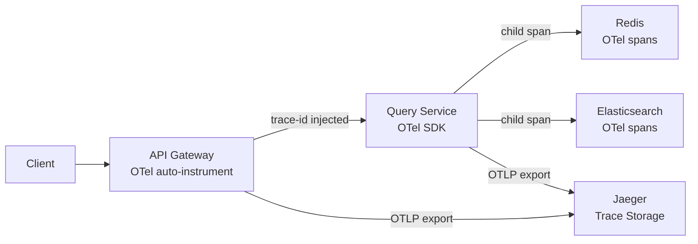

# 12 — Observability: Mini Search Engine

## Objective

Define the complete observability strategy: metrics (indexing throughput, search latency, ES heap/GC, shard health), distributed tracing from API to ES, alerting with SLI/SLO/SLA definitions, and search quality metrics (CTR, zero-result rate).

---

## 1. Observability Pillars

| Pillar | Tool | Purpose |
|--------|------|---------|
| Metrics | Prometheus + Grafana | Numeric time-series; dashboards; alerting |
| Logs | ELK Stack (Elasticsearch + Logstash + Kibana) | Structured log search; slow query analysis |
| Traces | OpenTelemetry + Jaeger | Distributed request tracing; latency attribution |
| Search Quality | Custom metrics + Grafana | CTR, zero-result rate, relevance feedback |
| Alerting | Prometheus Alertmanager + PagerDuty | On-call escalation |

---

## 2. SLI / SLO / SLA Definitions

### 2.1 Search API SLI/SLO

| SLI | SLO | Measurement |
|-----|-----|-------------|
| Search p50 latency < 20ms | 95% of 5-minute windows | Prometheus histogram `search_latency_ms` |
| Search p99 latency < 100ms | 99% of 5-minute windows | Prometheus histogram |
| Search availability | 99.99% (monthly) | HTTP 5xx rate < 0.01% |
| Zero-result rate < 5% | 95% of daily windows | `search_zero_result_count / search_total_count` |
| Search error rate < 1% | 99% of 5-minute windows | HTTP 5xx / total requests |

### 2.2 Indexing Pipeline SLI/SLO

| SLI | SLO | Measurement |
|-----|-----|-------------|
| Indexing lag < 5s | 99% of 1-minute windows | `kafka_consumer_lag_seconds` |
| Indexing lag < 30s | 99.9% of 1-minute windows | `kafka_consumer_lag_seconds` |
| Indexing success rate > 99% | 99% of 1-hour windows | `indexing_success_count / indexing_total_count` |
| DLQ message rate = 0 | N/A — any DLQ message is an incident | `dlq_message_count` |

### 2.3 Autocomplete SLI/SLO

| SLI | SLO | Measurement |
|-----|-----|-------------|
| Autocomplete p99 latency < 30ms | 99% of 5-minute windows | `autocomplete_latency_ms` |
| Autocomplete cache hit rate > 80% | 95% of 1-hour windows | `redis_cache_hit_rate{endpoint="suggest"}` |

---

## 3. Key Metrics

### 3.1 Indexing Metrics

| Metric | Type | Labels | Description |
|--------|------|--------|-------------|
| `indexing_throughput_docs_per_second` | Gauge | `tenant_id`, `index_name` | Current indexing rate |
| `indexing_lag_seconds` | Gauge | `consumer_group` | Kafka consumer lag in seconds |
| `indexing_lag_messages` | Gauge | `topic`, `partition` | Kafka consumer lag in messages |
| `indexing_success_total` | Counter | `tenant_id`, `operation` | Successfully indexed documents |
| `indexing_failure_total` | Counter | `tenant_id`, `failure_reason` | Failed indexing attempts |
| `indexing_batch_size` | Histogram | `consumer_group` | Distribution of ES bulk batch sizes |
| `indexing_bulk_duration_ms` | Histogram | `index_name` | Time for ES _bulk call |
| `dlq_message_count` | Gauge | `tenant_id` | Messages in dead letter queue |
| `reindex_progress_percent` | Gauge | `reindex_job_id` | Full reindex completion % |
| `reindex_docs_per_second` | Gauge | `reindex_job_id` | Reindex throughput |

### 3.2 Search Metrics

| Metric | Type | Labels | Description |
|--------|------|--------|-------------|
| `search_latency_ms` | Histogram | `tenant_id`, `query_type`, `cache_hit` | End-to-end search latency |
| `search_request_total` | Counter | `tenant_id`, `index_name`, `status` | Total search requests |
| `search_error_total` | Counter | `tenant_id`, `error_code` | Search failures |
| `search_cache_hit_total` | Counter | `tenant_id`, `cache_level` | Cache hits by layer |
| `search_result_count` | Histogram | `tenant_id`, `index_name` | Distribution of result counts |
| `search_zero_result_total` | Counter | `tenant_id`, `index_name` | Queries returning 0 results |
| `autocomplete_latency_ms` | Histogram | `tenant_id` | Autocomplete response time |
| `es_query_took_ms` | Histogram | `index_name`, `query_type` | ES internal execution time (from `took` field) |

### 3.3 Elasticsearch Cluster Metrics

| Metric | Source | Alert |
|--------|--------|-------|
| `es_cluster_status` | ES `/_cluster/health` | RED = P0, YELLOW > 15 min = P1 |
| `es_active_shards` | Cluster health | < expected shard count → alert |
| `es_unassigned_shards` | Cluster health | > 0 for > 5 min → alert |
| `es_heap_used_percent` | Node stats | > 85% → alert |
| `es_gc_collection_time_seconds_total` | JVM stats | > 5% wall time → alert |
| `es_indexing_rate` | Index stats | Monitor for indexing saturation |
| `es_search_rate` | Index stats | Track QPS against capacity |
| `es_search_latency_ms` | Index stats (`query.time_in_millis`) | p99 > 100ms → alert |
| `es_thread_pool_rejected_total` | Thread pool stats | write/search rejected > 0 → alert |
| `es_disk_used_percent` | Node stats | > 80% → alert (watermark at 85%) |
| `es_segment_count` | Index stats | Excessive segments (> 100/shard) → force merge |
| `es_store_size_bytes` | Index stats | Track growth against capacity |

### 3.4 Kafka Metrics

| Metric | Source | Alert |
|--------|--------|-------|
| `kafka_consumer_group_lag` | Kafka/Burrow | > 50,000 messages |
| `kafka_consumer_lag_seconds` | Custom (lag_messages / throughput) | > 30 seconds |
| `kafka_producer_request_error_rate` | Producer metrics | > 1% |
| `kafka_broker_under_replicated_partitions` | Broker metrics | > 0 |
| `kafka_controller_active_count` | Broker metrics | != 1 → alert |

---

## 4. Distributed Tracing

### 4.1 Trace Architecture



### 4.2 Span Structure for Search Request

```
Trace: search-request (16-char trace ID)
  Span: api-gateway.route (5ms)
  Span: query-service.handle-search (80ms)
    Span: query-builder.build-dsl (2ms)
    Span: redis.get-cache (1ms) → MISS
    Span: elasticsearch.search (70ms)
      Tag: es.index = "acme_products"
      Tag: es.took_ms = 68
      Tag: es.total_hits = 4523
      Tag: es.shards_queried = 8
    Span: result-shaper.format (3ms)
    Span: redis.set-cache (2ms)
  Span: api-gateway.respond (2ms)
```

### 4.3 OpenTelemetry Configuration

All services instrument with OpenTelemetry SDK:

```
Auto-instrumentation:
  - Spring Web: HTTP request/response spans
  - Spring Data JPA: SQL query spans
  - Spring Kafka: producer/consumer spans
  - Lettuce (Redis client): Redis command spans
  - ES Java client: ES operation spans (ES 8.x has built-in OTel support)

Manual instrumentation:
  - Query builder logic (custom span: "dsl-construction")
  - Cache key hashing (custom span: "cache-key-hash")
  - ACL transform (custom span: "document-transform")

Sampling strategy:
  - Head-based: 10% of all requests (representative sample)
  - Tail-based: 100% of requests with error or latency > 500ms (captures all anomalies)
```

### 4.4 Correlation IDs

Every request carries a correlation ID from client → all downstream:
```
Client request: X-Request-ID: client-uuid
API Gateway: injects X-Trace-ID (if not present) = X-Request-ID
All services: log X-Trace-ID + X-Tenant-ID in every log line
ES slow query log: enriched with correlation ID via HTTP header
```

---

## 5. Logging Strategy

### 5.1 Structured Log Format

All logs emitted as JSON to stdout (K8s collects via fluentd → Logstash → Elasticsearch):

```json
{
  "timestamp": "2024-01-15T10:00:00.123Z",
  "level": "INFO",
  "service": "query-service",
  "pod": "query-service-7d9f8b-xyz",
  "trace_id": "abc123def456",
  "span_id": "7890ab",
  "tenant_id": "uuid",
  "user_id": "uuid",
  "event": "search_completed",
  "index_name": "products",
  "query_type": "keyword",
  "took_ms": 23,
  "result_count": 1523,
  "cache_hit": false,
  "es_took_ms": 18,
  "es_shards": 8
}
```

### 5.2 Elasticsearch Slow Query Log

ES built-in slow query log (enabled per index):
```yaml
index.search.slowlog.threshold.query.warn: 2s
index.search.slowlog.threshold.query.info: 1s
index.search.slowlog.threshold.fetch.warn: 1s
index.indexing.slowlog.threshold.index.warn: 2s
index.indexing.slowlog.level: info
```

Slow query logs forwarded to Kibana for analysis. Top slow queries reviewed weekly by team.

### 5.3 Log Retention

| Log Type | Retention | Storage |
|----------|-----------|---------|
| Application logs | 30 days | Elasticsearch |
| Slow query logs | 90 days | Elasticsearch |
| Audit logs | 7 years | S3 Glacier + read-only ES index |
| Access logs (API Gateway) | 90 days | Elasticsearch |

---

## 6. Dashboards

### 6.1 Search Operations Dashboard (Primary)

```
Row 1: Health Status
  - ES cluster status (RED/YELLOW/GREEN gauge)
  - Search API availability (uptime %)
  - Indexing lag (seconds — large number, red if > 5s)
  - Active alerts count

Row 2: Search Performance
  - Search latency p50/p95/p99 (time series)
  - Search QPS by tenant (stacked area)
  - Cache hit rate by layer (bar chart)
  - Error rate (time series, threshold line at 1%)

Row 3: Indexing Performance
  - Indexing throughput (docs/sec time series)
  - Kafka consumer lag (by topic/consumer group)
  - Indexing success/failure rate
  - DLQ message count (table — any value = red)

Row 4: Elasticsearch Cluster
  - Heap usage by node (heatmap)
  - GC pause time by node
  - Shard count (assigned vs unassigned)
  - Thread pool rejected requests
  - Disk usage by node
```

### 6.2 Search Quality Dashboard

```
Row 1: Result Quality
  - Zero-result rate (% of queries returning 0 results)
  - Average result count per query
  - Click-through rate (if click tracking enabled)
  - Query volume by type (keyword / faceted / autocomplete / fuzzy)

Row 2: Top Queries
  - Top 20 queries by volume (table)
  - Top 20 zero-result queries (these need investigation)
  - Top 20 slow queries (> 200ms)

Row 3: Relevance Signals
  - Queries where user clicked result #1 vs #5 (CTR by rank)
  - Queries with relevance feedback "not helpful"
  - Synonym expansion hit rate

Row 4: Tenant-Level Quality
  - Zero-result rate by tenant (heatmap)
  - Average search latency by tenant
  - Indexing lag by tenant
```

---

## 7. Alerting

### 7.1 P0 Alerts (Immediate Page — PagerDuty)

| Alert | Condition | Escalation |
|-------|-----------|------------|
| ES Cluster RED | `es_cluster_status = 0` for > 2 min | On-call SRE |
| Search API down | `search_availability < 99%` for 5 min | On-call SRE + Search team lead |
| Query timeout cascade | `search_error_rate > 5%` for 2 min | On-call SRE |
| Data loss detected | `es_document_count` drops > 1% in 5 min | On-call SRE + Engineering Manager |

### 7.2 P1 Alerts (Page within 15 minutes)

| Alert | Condition | Escalation |
|-------|-----------|------------|
| ES Cluster YELLOW | > 15 minutes | On-call SRE |
| Search p99 > 200ms | Sustained 10 min | Search team |
| Indexing lag > 30s | Sustained 5 min | Search team |
| ES heap > 85% | Any node | On-call SRE |
| DLQ any message | `dlq_message_count > 0` | On-call SRE |

### 7.3 P2 Alerts (Slack notification — business hours response)

| Alert | Condition |
|-------|-----------|
| ES disk usage > 75% | Proactive capacity warning |
| Cache hit rate < 30% | Search team to investigate |
| Zero-result rate > 10% | Relevance team to investigate |
| Consumer lag > 10s | Indexing team to investigate |
| ES segment count > 100/shard | Force merge needed |

---

## 8. Search Quality Metrics

### 8.1 Zero-Result Rate

```sql
-- Daily zero-result rate per tenant
SELECT
  tenant_id,
  DATE(created_at) as date,
  COUNT(*) FILTER (WHERE result_count = 0) / COUNT(*) * 100.0 as zero_result_rate,
  COUNT(*) as total_queries
FROM search_query_log
WHERE created_at > NOW() - INTERVAL '7 days'
GROUP BY tenant_id, DATE(created_at)
ORDER BY zero_result_rate DESC;
```

**Zero-result rate analysis:**
- Identify top zero-result query strings
- Map to: misspelling (fuzzy search coverage issue) | missing content (gap in index) | synonym gap
- Drive improvements: add synonyms, enable fuzzy, ingest missing data

### 8.2 Click-Through Rate (CTR)

Requires click tracking integration (beyond search service):
```
POST /api/v1/events/search-click
{
  "query_id": "uuid",
  "document_id": "uuid",
  "rank": 3,
  "tenant_id": "uuid",
  "user_id": "uuid",
  "timestamp": "..."
}
```

CTR by rank position (position-CTR curve):
- Good: CTR drops steeply after rank 3 (users find results at top)
- Bad: CTR is flat (users scan all results — relevance is poor)

### 8.3 Search Quality Scoring

Weekly relevance report:
```
- Zero-result rate: target < 3%
- CTR on top result: target > 40%
- Average time on page after click: target > 30s (proxy for relevance)
- Bounce rate after click: target < 30%
- Repeat searches (same user, same query within 30s): target < 5%
```

---

## 9. Interview Discussion Points

- **What's the difference between SLI, SLO, and SLA?** SLI (Service Level Indicator) is the metric: "search p99 latency." SLO (Service Level Objective) is the internal target: "p99 < 100ms 99% of the time." SLA (Service Level Agreement) is the contractual commitment: "p99 < 200ms or we issue credits." SLO is stricter than SLA to provide a buffer.
- **How do you detect that search quality has degraded after a schema change?** Monitor zero-result rate and CTR on the quality dashboard. If zero-result rate jumps after a schema change (e.g., analyzer changed), it means the new analyzer produces different tokens that don't match query tokens. Fix: reindex with query-time analyzer matching index-time analyzer.
- **Why use tail-based sampling for tracing instead of 100% sampling?** At 10,000 QPS, 100% trace sampling = 10,000 traces/sec → storage and processing cost. Head-based 10% sampling misses rare errors. Tail-based sampling captures all errors and slow requests (the interesting ones) while sampling normal requests at 10%. Best of both worlds.
- **How do you correlate a high error rate alert with its root cause?** Trace correlation ID links the alert (Prometheus) → the log (ELK, filtered by trace_id) → the trace (Jaeger). In practice: alert fires → check Grafana for spike start time → filter Kibana logs at that timestamp with level=ERROR → find common error message → check Jaeger for traces with errors → identify which ES shard or query pattern is causing failures.
