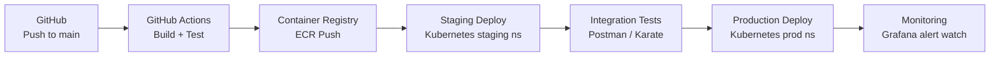

# 13 — Deployment Architecture: Mini Search Engine

## Objective

Define the Kubernetes deployment topology, Elasticsearch cluster node placement, multi-AZ data distribution, rolling upgrades, CI/CD pipeline, local development setup, and the ES-on-VMs vs ES-on-K8s decision.

---

## 1. Elasticsearch: VMs vs Kubernetes

### The Core Debate

| Concern | ES on VMs | ES on Kubernetes |
|---------|-----------|-----------------|
| Operational simplicity | Higher — familiar for ES ops | Lower — requires K8s ES operator expertise |
| Stability | High — no K8s scheduler interference | Risk of pod eviction during node pressure |
| Storage | Local SSD / network-attached EBS | PersistentVolumeClaims (EBS/EFS) |
| Network performance | Dedicated NICs; no overlay network | K8s overlay network (slight latency overhead) |
| Rolling upgrades | Manual (rolling restart scripts) | Automated via ECK operator |
| Scaling | Manual VM provisioning | `kubectl scale` + PVC provisioning |
| Cost | Dedicated VMs even when underutilized | Share K8s node pool with other services |
| Monitoring | Prometheus ES exporter | ECK integrates with K8s monitoring |
| Recovery | VM replacement (minutes) | Pod replacement (seconds, new PVC attach) |

### Decision: Hybrid Approach

- **ES data nodes and master nodes: on dedicated VMs** (not K8s) — stability is non-negotiable; local NVMe SSD on VMs avoids EBS overhead; avoids K8s scheduler evicting ES pods
- **ES coordinating nodes: on K8s** — stateless; can tolerate eviction; scale with HPA
- **All application services (Query Service, Indexing Consumer, Ingestion Service, Schema Manager): on K8s** — stateless, HPA-ready

**FAANG exception:** At Google/Amazon scale, ES runs on dedicated bare-metal clusters with custom operators. K8s ES via ECK is production-proven at many FAANG companies for non-extreme scale.

---

## 2. Kubernetes Deployment Topology

```mermaid
graph TB
    subgraph Internet["Internet"]
        Client[Client Apps]
    end

    subgraph AWS_Region["AWS Region (us-east-1)"]
        subgraph ALB["Application Load Balancer"]
            LB[ALB + WAF]
        end

        subgraph AZ_A["Availability Zone A"]
            subgraph K8s_A["K8s Node Group A"]
                QS1[Query Service\nPod x2]
                IS1[Ingestion Service\nPod x2]
                IC1[Indexing Consumer\nPod x4]
                SM1[Schema Manager\nPod x1]
                CO1[ES Coordinating\nPod x2]
            end

            subgraph VM_A["Dedicated VMs - AZ A"]
                ESDN1[ES Data Node 1\nHot - 64GB RAM, 2TB NVMe]
                ESDN2[ES Data Node 2\nHot - 64GB RAM, 2TB NVMe]
                ESMN1[ES Master Node 1\n16GB RAM]
                RD1[Redis Primary]
            end
        end

        subgraph AZ_B["Availability Zone B"]
            subgraph K8s_B["K8s Node Group B"]
                QS2[Query Service\nPod x2]
                IS2[Ingestion Service\nPod x2]
                IC2[Indexing Consumer\nPod x4]
                CO2[ES Coordinating\nPod x2]
            end

            subgraph VM_B["Dedicated VMs - AZ B"]
                ESDN3[ES Data Node 3\nHot - 64GB RAM, 2TB NVMe]
                ESDN4[ES Data Node 4\nHot - 64GB RAM, 2TB NVMe]
                ESMN2[ES Master Node 2\n16GB RAM]
                RD2[Redis Replica]
            end
        end

        subgraph AZ_C["Availability Zone C"]
            subgraph VM_C["Dedicated VMs - AZ C"]
                ESDN5[ES Data Node 5\nWarm - 32GB RAM, 8TB HDD]
                ESDN6[ES Data Node 6\nWarm - 32GB RAM, 8TB HDD]
                ESMN3[ES Master Node 3\n16GB RAM]
                RD3[Redis Replica]
            end

            subgraph Managed["Managed Services - AZ C"]
                PG[PostgreSQL RDS\nMulti-AZ]
                KF[Kafka MSK\n3-broker cluster]
            end
        end
    end

    Client --> LB
    LB --> QS1
    LB --> QS2
    LB --> IS1
    LB --> IS2

    QS1 --> CO1
    QS2 --> CO2
    CO1 --> ESDN1
    CO1 --> ESDN3
    CO1 --> ESDN5
    CO2 --> ESDN2
    CO2 --> ESDN4
    CO2 --> ESDN6

    IC1 --> KF
    IC2 --> KF
    IC1 --> ESDN1
    IC2 --> ESDN3
```



---

## 3. Kubernetes Resource Specifications

### 3.1 Query Service

```yaml
apiVersion: apps/v1
kind: Deployment
metadata:
  name: query-service
spec:
  replicas: 4
  selector:
    matchLabels:
      app: query-service
  template:
    spec:
      affinity:
        podAntiAffinity:
          requiredDuringSchedulingIgnoredDuringExecution:
            - topologyKey: topology.kubernetes.io/zone  # spread across AZs
      containers:
        - name: query-service
          resources:
            requests:
              cpu: "2"
              memory: "4Gi"
            limits:
              cpu: "4"
              memory: "8Gi"
          readinessProbe:
            httpGet:
              path: /actuator/health/readiness
              port: 8080
            initialDelaySeconds: 30
            periodSeconds: 10
          livenessProbe:
            httpGet:
              path: /actuator/health/liveness
              port: 8080
            initialDelaySeconds: 60
---
apiVersion: autoscaling/v2
kind: HorizontalPodAutoscaler
metadata:
  name: query-service-hpa
spec:
  scaleTargetRef:
    apiVersion: apps/v1
    kind: Deployment
    name: query-service
  minReplicas: 4
  maxReplicas: 40
  metrics:
    - type: Resource
      resource:
        name: cpu
        target:
          type: Utilization
          averageUtilization: 70
    - type: External
      external:
        metric:
          name: search_latency_p99_ms
        target:
          type: Value
          value: "80"
  behavior:
    scaleDown:
      stabilizationWindowSeconds: 300
```

### 3.2 Indexing Consumer (KEDA-based autoscaling)

```yaml
apiVersion: keda.sh/v1alpha1
kind: ScaledObject
metadata:
  name: indexing-consumer-scaler
spec:
  scaleTargetRef:
    name: indexing-consumer
  minReplicaCount: 8
  maxReplicaCount: 32
  triggers:
    - type: kafka
      metadata:
        bootstrapServers: kafka-broker:9092
        consumerGroup: indexing-nrt-consumer-group
        topic: document-events
        lagThreshold: "10000"    # scale when lag > 10k messages
        offsetResetPolicy: latest
```

---

## 4. Multi-AZ Elasticsearch Shard Placement

ES shard allocation awareness ensures primary and replica never share the same AZ:

```yaml
# elasticsearch.yml on each data node
node.attr.zone: us-east-1a   # (or 1b, 1c per node)
node.attr.box_type: hot       # (or warm)

# Cluster-level settings
cluster.routing.allocation.awareness.attributes: zone
cluster.routing.allocation.awareness.force.zone.values: us-east-1a,us-east-1b,us-east-1c
```

**Effect:**
- Primary shard of `products_v3` shard 0 → AZ A
- Replica shard of `products_v3` shard 0 → AZ B or C (never AZ A)
- If AZ A fails: all replicas in AZ B/C are promoted → zero data loss, continued availability

---

## 5. Rolling Elasticsearch Upgrades

### 5.1 Minor Version Upgrade (8.x → 8.y)

ES supports rolling upgrades within the same major version:

```
Procedure:
1. Disable shard allocation: PUT /_cluster/settings {"transient": {"cluster.routing.allocation.enable": "none"}}
2. Stop one data node
3. Upgrade ES binary (apt upgrade / yum upgrade)
4. Start data node → wait for it to join cluster and sync
5. Re-enable allocation: PUT /_cluster/settings {"transient": {"cluster.routing.allocation.enable": "all"}}
6. Wait for cluster GREEN
7. Repeat for each node
8. Upgrade coordinating nodes last (no data loss risk)
9. Upgrade master nodes (one at a time, with quorum maintained)
```

**Automation:** ECK operator handles this automatically when running ES on K8s. For VMs, use Ansible playbooks with health check gates.

### 5.2 Major Version Upgrade (7.x → 8.x)

Requires coordinated upgrade (cannot do rolling across major versions):
1. Perform full cluster snapshot to S3
2. Spin up new 8.x cluster (empty)
3. Full reindex from PostgreSQL to new cluster
4. Validate counts and spot-check queries
5. Atomic alias switch at API layer (environment variable pointing to new cluster)
6. Monitor for 24 hours; decommission old cluster

---

## 6. CI/CD Pipeline



### 6.1 Pipeline Stages

| Stage | Tool | Duration | Gate |
|-------|------|----------|------|
| Build | Gradle + Docker | 3 min | Build failure → stop |
| Unit tests | JUnit 5 | 2 min | < 100% unit test pass → stop |
| Integration tests | Testcontainers (ES + PG + Kafka) | 10 min | Any test failure → stop |
| Container scan | Trivy (CVE scan) | 2 min | Critical CVE → stop |
| Push to ECR | GitHub Actions | 1 min | Always |
| Deploy to staging | ArgoCD | 2 min | Canary: 10% traffic |
| Smoke tests (staging) | Postman + Newman | 3 min | Failure → rollback |
| Load test (staging) | k6 (search QPS test) | 5 min | p99 > 100ms → stop |
| Deploy to production | ArgoCD | 2 min | Blue-green or rolling |
| Canary monitoring | Grafana + Alertmanager | 15 min | Auto-rollback on error rate spike |

### 6.2 Deployment Strategy

**Query Service:** Canary deployment
- 10% traffic to new version → monitor 15 minutes → 50% → monitor 15 minutes → 100%
- Auto-rollback: if error rate increases > 0.1% or p99 latency > 150ms during canary

**Indexing Consumer:** Rolling update
- Deploy 2 new pods, drain 2 old pods
- Monitor: Kafka consumer lag must not increase during rollout

**Schema Manager:** Blue-green
- Highest risk service (controls ES index structure)
- Full green deployment → health check → traffic switch → monitor → decommission blue

---

## 7. Local Development Setup

### 7.1 docker-compose.yml

```yaml
services:
  elasticsearch:
    image: docker.elastic.co/elasticsearch/elasticsearch:8.11.0
    environment:
      - discovery.type=single-node
      - xpack.security.enabled=false   # disabled for local dev
      - ES_JAVA_OPTS=-Xms1g -Xmx1g
    ports:
      - "9200:9200"
    volumes:
      - es-data:/usr/share/elasticsearch/data

  postgres:
    image: postgres:15
    environment:
      POSTGRES_DB: searchdb
      POSTGRES_USER: search
      POSTGRES_PASSWORD: localpass
    ports:
      - "5432:5432"
    volumes:
      - pg-data:/var/lib/postgresql/data

  redis:
    image: redis:7-alpine
    ports:
      - "6379:6379"

  kafka:
    image: confluentinc/cp-kafka:7.5.0
    environment:
      KAFKA_NODE_ID: 1
      KAFKA_PROCESS_ROLES: broker,controller
      KAFKA_CONTROLLER_QUORUM_VOTERS: 1@kafka:9093
      KAFKA_LISTENERS: PLAINTEXT://:9092,CONTROLLER://:9093
      KAFKA_ADVERTISED_LISTENERS: PLAINTEXT://localhost:9092
      KAFKA_AUTO_CREATE_TOPICS_ENABLE: true
    ports:
      - "9092:9092"

  kibana:
    image: docker.elastic.co/kibana/kibana:8.11.0
    environment:
      ELASTICSEARCH_HOSTS: http://elasticsearch:9200
    ports:
      - "5601:5601"

volumes:
  es-data:
  pg-data:
```

### 7.2 Local Development Shortcuts

- **No Kafka for unit tests:** Testcontainers spins up embedded Kafka per test class
- **Embedded PostgreSQL:** Testcontainers or H2 in-memory for pure unit tests
- **ES test index:** Each integration test gets a unique index name (prefixed with `test-` + UUID); cleaned up after test
- **Local auth bypass:** Development Spring profile disables JWT validation (uses mock claims)

---

## 8. Environment Configuration

| Environment | ES | PostgreSQL | Kafka | Redis | Scale |
|-------------|-----|-----------|-------|-------|-------|
| Local | docker-compose single node | docker-compose | docker-compose | docker-compose | 1 instance each |
| Staging | 3-node cluster (VMs) | RDS Multi-AZ | MSK 3-broker | ElastiCache | 2 replicas each service |
| Production | 8+ node hot + 4 warm + 3 master | RDS Multi-AZ + read replicas | MSK 6-broker | ElastiCache cluster | HPA 4–40 |

### Environment-Specific Feature Flags

Managed via LaunchDarkly or environment variables:
- `FEATURE_VECTOR_SEARCH_ENABLED`: off everywhere until V3
- `FEATURE_ML_RANKING_ENABLED`: off until V3
- `FEATURE_SEMANTIC_SEARCH_ENABLED`: off until V3
- `INDEX_REFRESH_INTERVAL_MS`: `1000` (prod) / `500` (staging test) / `100` (local for fast feedback)

---

## 9. Interview Discussion Points

- **Why run ES data nodes on VMs, not K8s?** ES data nodes are stateful and storage-bound. K8s scheduler can evict pods under node pressure, causing shard rebalancing and recovery overhead. Local NVMe SSDs on VMs provide 3–5x lower latency than EBS-backed K8s PVCs. Dedicated VMs also prevent noisy neighbor interference from other K8s workloads.
- **How do you handle K8s pod termination gracefully for the Indexing Consumer?** K8s sends SIGTERM on pod termination. Consumer catches SIGTERM signal, stops polling new messages, finishes processing current batch, commits Kafka offsets, then exits. PreStop hook adds 30-second delay before SIGTERM to allow in-flight requests to complete (`terminationGracePeriodSeconds: 60`).
- **How does KEDA differ from standard HPA for Kafka-based scaling?** Standard K8s HPA scales on CPU/memory (resource metrics). KEDA adds external metric triggers — specifically, Kafka consumer group lag. KEDA scales consumers based on the number of unprocessed messages, which is the correct scaling signal for a throughput-bounded consumer. CPU doesn't reliably reflect lag.
- **What's the canary rollout strategy for a new ES query feature?** Feature-flag the new query behavior. Enable for 5% of tenants in production. Monitor search quality metrics (zero-result rate, CTR, p99 latency) for 24 hours. Gradual rollout: 5% → 25% → 50% → 100%. Rollback flag remains available for 7 days after full rollout.
