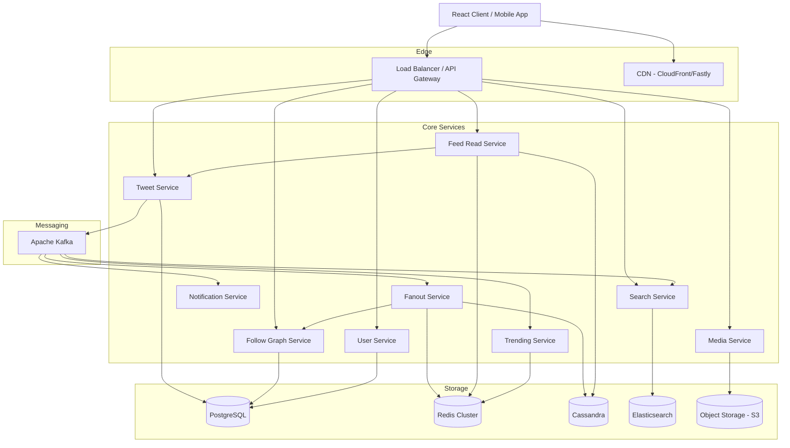
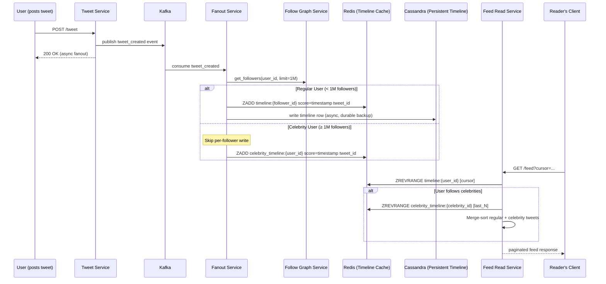
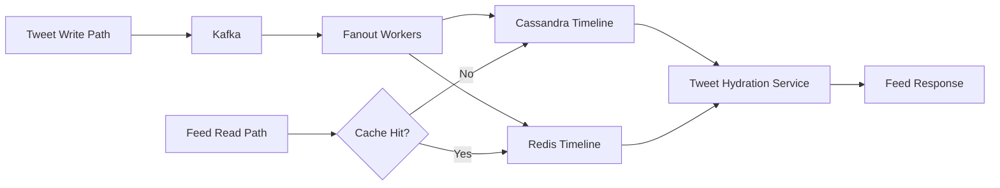

# 01 — High-Level Architecture: Social Media Feed System

## Objective

Define the top-level architectural style, service decomposition, communication patterns, and the rationale for a hybrid push-pull fanout model. This document serves as the architectural north star for all subsequent design decisions.

---

## Architecture Style Decision

### Selected: Event-Driven Microservices with Hybrid Fanout

**Why not a Modular Monolith?**

A monolith is the correct starting point for most systems. However, social media feed systems have fundamentally different scaling axes per service:

| Service | Bottleneck |
|---|---|
| Tweet Ingestion | Write throughput, durability |
| Feed Fanout | CPU-bound, high fan-out parallelism |
| Feed Read | Cache hit rate, read latency |
| Follow Graph | Read-heavy, graph traversal |
| Trending | Windowed aggregation, stream processing |
| Media | Bandwidth, CDN offload |

These different resource profiles make co-location harmful at scale. A tweet surge should not impact read latency. A fanout storm should not block new tweet writes.

**Why not pure microservices from day one?**

Overengineering risk. A startup building Twitter should start with a modular monolith that can be extracted. The architecture described here represents the FAANG-scale end state, not a day-1 recommendation.

---

## Service Map

---

## The Core Design Problem: Fanout

The entire architecture orbits one question: **when a user tweets, how does that tweet appear in the feeds of all their followers?**

There are three models:

### Fanout on Write (Push Model)
When a user tweets, immediately write the tweet ID to the timeline cache of every follower.

**Pros**: Feed reads are O(1) — just read the pre-built list  
**Cons**: A celebrity with 10M followers causes 10M Redis writes per tweet. At 10 tweets/hour, that's ~28K writes/sec just for one account.

### Fanout on Read (Pull Model)
When a user opens their feed, query the follow graph, fetch recent tweets from each followed account, merge and sort.

**Pros**: Zero write amplification  
**Cons**: Feed read is O(N) where N = number of follows. For a user following 5,000 accounts, this requires 5,000 Cassandra reads + merge sort on every feed load. p99 latency becomes unacceptable.

### Hybrid Model (Selected)
- **Regular users** (< 1M followers): Fanout on write. Pre-build their followers' timelines.
- **Celebrity users** (≥ 1M followers): Do NOT fanout on write. On feed read, inject celebrity tweets from a separate "celebrity timeline" into the pre-built feed.

This is the approach used by Twitter internally (documented in their engineering blog posts).

---

## Hybrid Fanout Architecture

---

## Communication Patterns

| Communication Type | Pattern | Justification |
|---|---|---|
| Client → Services | REST / HTTP/2 | Simple, widely supported, easy to cache |
| Tweet write → Fanout | Kafka (async) | Decouples write acknowledgment from fanout latency |
| Feed read | Synchronous REST | User is waiting; must be fast |
| Fanout → Follow Graph | gRPC (internal) | Low-latency service-to-service; typed contract |
| Notifications | Kafka → WebSocket | Real-time push without polling |
| Search indexing | Kafka → Elasticsearch | Async indexing; eventual consistency acceptable |

---

## Data Flow Summary

---

## Startup vs FAANG Differences

| Dimension | Startup | FAANG |
|---|---|---|
| Architecture | Modular monolith | Full microservices |
| Fanout | Pull model (simpler) | Hybrid push-pull |
| Timeline storage | PostgreSQL | Redis + Cassandra |
| Fanout workers | Single-threaded | 1000s of parallel workers |
| Celebrity detection | Manual threshold | Dynamic ML-based classification |
| Feed ranking | Chronological | Multi-signal ML ranking model |

---

## Overengineering Risks

- **Implementing ML ranking at MVP**: Chronological feeds are simpler to debug and A/B test. ML adds significant infrastructure complexity.
- **Building a full follow-graph service before you need it**: PostgreSQL with a proper index handles follow graph reads easily up to ~50M users.
- **Cassandra before Redis is saturated**: Start with Redis only. Cassandra adds operational burden and is only needed for durability and cold-path reads.
- **Kafka before the write volume justifies it**: A well-tuned PostgreSQL with async workers handles 10K tweets/sec. Kafka becomes necessary at ~50K+ events/sec.

---

## Interview-Level Discussion Points

1. **Why not GraphQL for feeds?**: GraphQL is useful for flexible queries. Feed reads are highly structured and benefit from HTTP caching (ETag, Cache-Control). REST is the right choice here.

2. **The celebrity threshold is a knob, not a constant**: Twitter dynamically adjusts this threshold based on server load. During a celeb tweet storm, they lower the threshold. During quiet periods, they push it up to improve feed freshness.

3. **Fanout acknowledgment vs durability**: The tweet write returns success before fanout completes. This means a brief window where a tweet exists but hasn't reached all timelines. This is a deliberate product decision, not a bug.

4. **The "home timeline" vs "user timeline" distinction**: User timelines (all tweets by one person) are read directly from Cassandra/Postgres — no fanout needed. Only home timelines (merged feed from all follows) require the fanout machinery.

5. **API Gateway role**: The gateway handles auth token validation, rate limiting, and request routing. This keeps each downstream service stateless with respect to auth.
