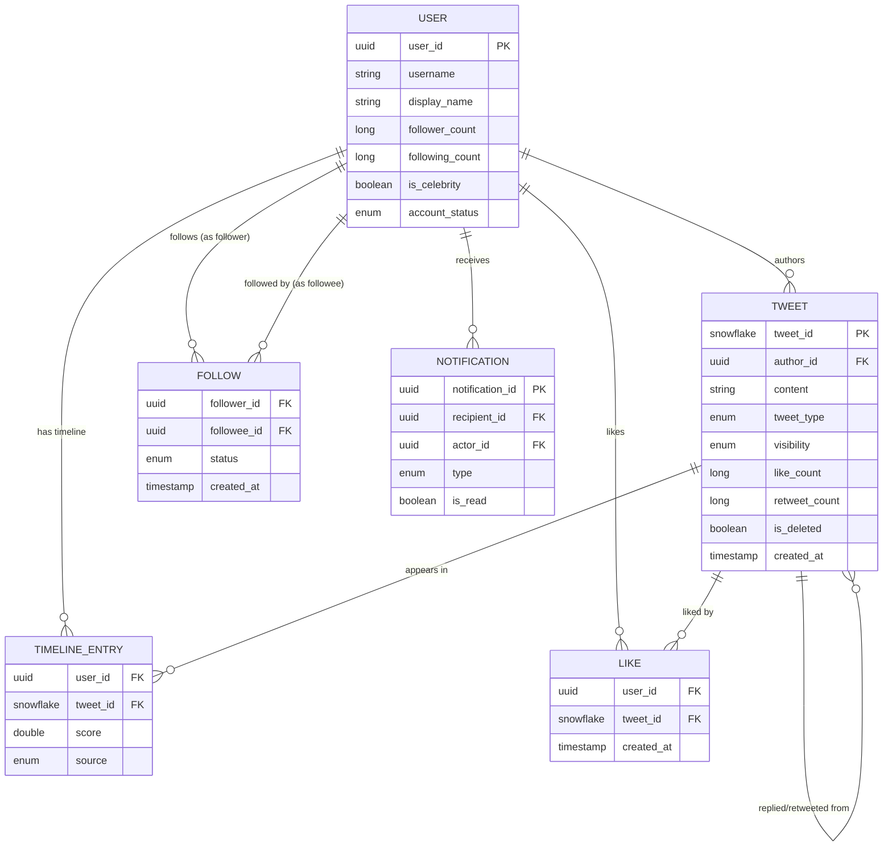
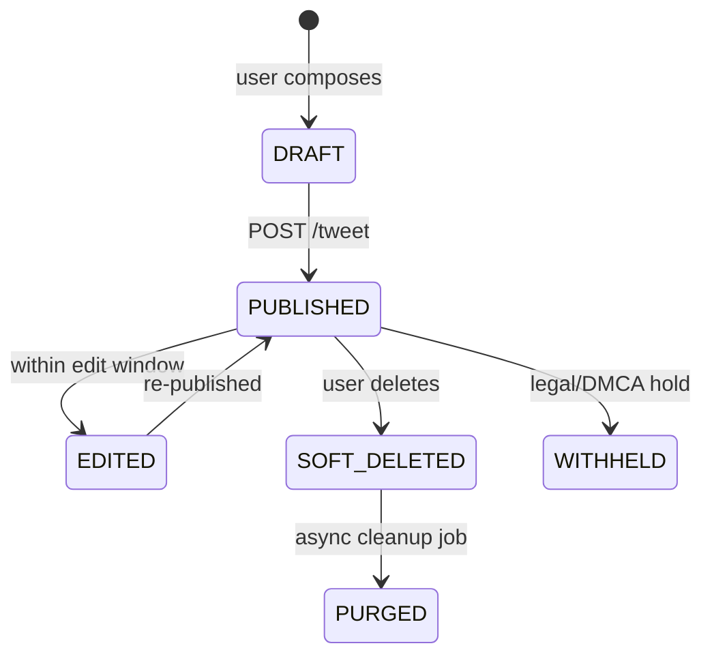
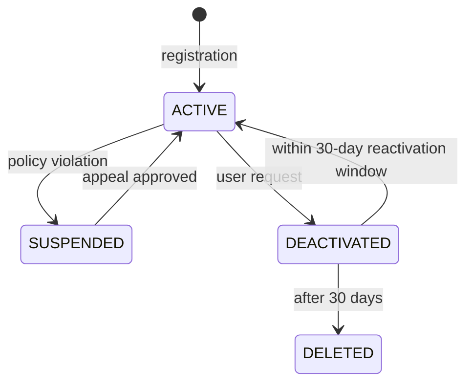

# 02 — Domain Modeling: Social Media Feed System

## Objective

Define the core domain entities, their attributes, relationships, and lifecycle states. This model forms the vocabulary shared across all services and the foundation for database schema, API contracts, and event definitions.

---

## Core Domain Entities

### 1. User

Represents a registered account on the platform.

| Attribute | Type | Notes |
|---|---|---|
| user_id | UUID | Immutable, globally unique |
| username | String | Unique handle (e.g., @piyush) |
| display_name | String | Non-unique display name |
| email | String | For auth, not shown publicly |
| bio | String | Up to 160 chars |
| profile_image_url | String | CDN URL |
| follower_count | Long | Denormalized counter |
| following_count | Long | Denormalized counter |
| is_verified | Boolean | Blue checkmark |
| is_celebrity | Boolean | Derived; follower_count > threshold |
| account_status | Enum | ACTIVE, SUSPENDED, DEACTIVATED |
| created_at | Timestamp | |
| last_active_at | Timestamp | Used for dormant user detection |

**Design Decision**: `follower_count` and `following_count` are denormalized counters stored directly on the User entity for O(1) reads. These are incremented/decremented via atomic operations. The trade-off is eventual consistency — counts may be slightly off under extreme concurrency, but exact precision is not a product requirement.

---

### 2. Tweet

The atomic unit of content in the system.

| Attribute | Type | Notes |
|---|---|---|
| tweet_id | Snowflake ID | Time-ordered, globally unique |
| author_id | UUID | FK to User |
| content | String | Max 280 chars |
| media_ids | List<UUID> | References to Media objects |
| reply_to_tweet_id | Snowflake | Null for original tweets |
| retweet_of_tweet_id | Snowflake | Null for original tweets |
| quoted_tweet_id | Snowflake | For quote tweets |
| hashtags | List<String> | Extracted at write time |
| mentions | List<UUID> | Extracted at write time |
| like_count | Long | Denormalized |
| retweet_count | Long | Denormalized |
| reply_count | Long | Denormalized |
| language | String | ISO 639-1, auto-detected |
| tweet_type | Enum | ORIGINAL, REPLY, RETWEET, QUOTE |
| visibility | Enum | PUBLIC, FOLLOWERS_ONLY, PRIVATE |
| is_deleted | Boolean | Soft delete flag |
| created_at | Timestamp | |

**Snowflake ID Design**: Tweet IDs use a Twitter Snowflake-style scheme: 41 bits timestamp + 10 bits machine ID + 12 bits sequence. This gives time-ordering for free, which is critical for sorting feeds without storing explicit scores.

---

### 3. Follow Relationship

Directed edge in the social graph.

| Attribute | Type | Notes |
|---|---|---|
| follower_id | UUID | Who is following |
| followee_id | UUID | Who is being followed |
| created_at | Timestamp | When the follow happened |
| status | Enum | ACTIVE, MUTED, BLOCKED |

**Design Decision**: Follows are stored as directed edges. A mutual follow is two separate rows. This simplifies queries: "who does user X follow?" is a simple index scan on `follower_id`.

---

### 4. Timeline Entry

A materialized record in a user's home timeline (the precomputed feed).

| Attribute | Type | Notes |
|---|---|---|
| user_id | UUID | Whose timeline |
| tweet_id | Snowflake | The tweet appearing in feed |
| author_id | UUID | Denormalized for filtering |
| score | Double | Ranking score (chronological = timestamp) |
| source | Enum | FOLLOW, RETWEET, RECOMMENDATION |
| inserted_at | Timestamp | When fanout delivered this |

**Design Decision**: Timeline entries store only tweet IDs and metadata — not full tweet content. Feed read hydrates tweet content from a tweet cache/store. This keeps timeline storage small and allows tweet edits/deletions to take effect without rewriting timeline rows.

---

### 5. Like

Engagement action — user likes a tweet.

| Attribute | Type | Notes |
|---|---|---|
| like_id | UUID | |
| user_id | UUID | Who liked |
| tweet_id | Snowflake | Which tweet |
| created_at | Timestamp | |

**Design Decision**: Likes are a separate table, not embedded in tweets. This enables efficient queries: "did I like this tweet?" and "who liked this tweet?". The `tweet.like_count` is a denormalized counter updated via atomic increment.

---

### 6. Hashtag / Trend

Tracks hashtag usage for trending detection.

| Attribute | Type | Notes |
|---|---|---|
| hashtag | String | Lowercase normalized |
| tweet_count | Long | Total usage |
| window_count | Long | Count in trending window (15 min) |
| last_used_at | Timestamp | |
| is_trending | Boolean | Derived by trend detector |

---

### 7. Notification

Persisted notification for a user.

| Attribute | Type | Notes |
|---|---|---|
| notification_id | UUID | |
| recipient_id | UUID | Who receives it |
| actor_id | UUID | Who triggered it |
| type | Enum | LIKE, RETWEET, FOLLOW, MENTION, REPLY |
| entity_id | String | tweet_id or user_id depending on type |
| is_read | Boolean | |
| created_at | Timestamp | |

---

## Domain Relationships

---

## Entity Lifecycle States

### Tweet Lifecycle

### User Account Lifecycle

---

## Domain Events

These are the events emitted by domain entities that drive the rest of the system:

| Event | Producer | Consumers |
|---|---|---|
| `tweet.created` | Tweet Service | Fanout Service, Search, Trending, Notification |
| `tweet.deleted` | Tweet Service | Fanout Service (cleanup), Search |
| `tweet.liked` | Engagement Service | Notification Service, Analytics |
| `tweet.retweeted` | Tweet Service | Fanout Service, Notification |
| `user.followed` | Follow Service | Fanout Service, Notification, Follow Graph |
| `user.unfollowed` | Follow Service | Fanout Service, Follow Graph |
| `user.suspended` | Moderation Service | Feed Service (suppress), All services |

---

## Value Objects

| Value Object | Description |
|---|---|
| `TweetContent` | Validated, 280-char-max text with extracted hashtags and mentions |
| `MediaAttachment` | A CDN URL + dimensions + content type |
| `CursorToken` | Opaque pagination cursor (base64-encoded tweet_id + timestamp) |
| `FeedPage` | Immutable list of hydrated tweet objects + next cursor |

---

## Design Decisions

### Why Snowflake IDs for Tweets?

1. **Time-ordered**: Sorting by ID gives chronological order without an additional `ORDER BY created_at` — major index efficiency gain.
2. **No central sequence**: Each service can generate IDs independently without a single-point-of-failure ID generator.
3. **Globally unique**: No coordination needed for distributed inserts.
4. **Alternative considered**: UUIDv7 (also time-ordered). Rejected because Snowflake IDs are smaller (64-bit int vs 128-bit) and sort natively as integers.

### Why denormalize counts (likes, followers)?

Reading like_count from a separate aggregation query on every feed load would be catastrophic at scale. Denormalized counters with atomic increments are the industry-standard approach. The trade-off: counts can briefly be stale during high concurrency (two simultaneous unlikes could race). Exact accuracy is not a product requirement for these counters.

---

## Interview-Level Discussion Points

1. **The "deleted tweet" problem**: A soft-deleted tweet's ID still exists in millions of timeline caches. The Feed Read Service must check `is_deleted` on hydration and filter those entries out. An async cleanup job eventually removes stale IDs from Redis/Cassandra.

2. **Why not embed tweet content in the timeline?**: If you store full content in the timeline, a tweet edit requires rewriting potentially 10M timeline entries. By storing only tweet IDs and hydrating on read, you update one row in the tweet store and all feeds immediately see the change.

3. **The `is_celebrity` flag is a derived property**: It should be recalculated asynchronously by a background job, not maintained transactionally with the follow count. A sudden surge in followers (viral moment) should trigger a re-evaluation within minutes, not instantly.

4. **Visibility rules on tweets**: `FOLLOWERS_ONLY` tweets should only fanout to followers. The fanout service must check visibility before writing to each follower's timeline. This adds filtering overhead to the fanout path.
