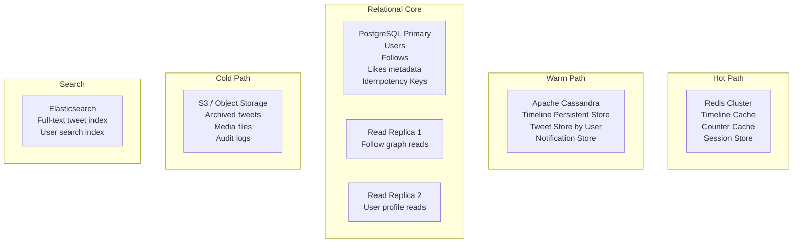

# 05 — Database Design: Social Media Feed System

## Objective

Design the data storage layer across multiple database systems — PostgreSQL, Cassandra, and Redis — with explicit reasoning for what goes where, indexing strategy, partitioning, and data lifecycle management. Each storage choice must be justified against concrete scale numbers.

---

## Storage Architecture Overview



---

## PostgreSQL Schema Design

### Why PostgreSQL?

PostgreSQL handles the **relational core** of the system: users, follows, likes, and operational data where ACID guarantees matter. For example:
- A follow must atomically update both `follow` table and trigger a Kafka event
- A user deletion must cascade or soft-delete consistently
- Idempotency keys require atomic check-and-insert

PostgreSQL scales to ~50-100M users before requiring sharding. Beyond that, you would move to a distributed SQL database (CockroachDB, Vitess) or shard by user_id.

### Users Table

```sql
TABLE users (
  user_id         UUID            PRIMARY KEY DEFAULT gen_random_uuid(),
  username        VARCHAR(50)     NOT NULL UNIQUE,
  display_name    VARCHAR(100)    NOT NULL,
  email           VARCHAR(255)    NOT NULL UNIQUE,
  password_hash   VARCHAR(255),
  bio             VARCHAR(160),
  profile_image_url TEXT,
  follower_count  BIGINT          DEFAULT 0 NOT NULL,
  following_count BIGINT          DEFAULT 0 NOT NULL,
  tweet_count     BIGINT          DEFAULT 0 NOT NULL,
  is_verified     BOOLEAN         DEFAULT FALSE,
  is_celebrity    BOOLEAN         DEFAULT FALSE,
  account_status  VARCHAR(20)     DEFAULT 'ACTIVE',
  created_at      TIMESTAMPTZ     DEFAULT NOW(),
  updated_at      TIMESTAMPTZ     DEFAULT NOW(),
  last_active_at  TIMESTAMPTZ,
  deleted_at      TIMESTAMPTZ
)
```

**Indexes**:
```
CREATE UNIQUE INDEX idx_users_username ON users(username) WHERE deleted_at IS NULL;
CREATE UNIQUE INDEX idx_users_email ON users(email) WHERE deleted_at IS NULL;
CREATE INDEX idx_users_celebrity ON users(is_celebrity) WHERE is_celebrity = TRUE;
CREATE INDEX idx_users_last_active ON users(last_active_at);
```

### Follows Table

```sql
TABLE follows (
  follower_id   UUID        NOT NULL REFERENCES users(user_id),
  followee_id   UUID        NOT NULL REFERENCES users(user_id),
  status        VARCHAR(20) DEFAULT 'ACTIVE',  -- ACTIVE, MUTED, BLOCKED
  created_at    TIMESTAMPTZ DEFAULT NOW(),
  PRIMARY KEY (follower_id, followee_id)
)
```

**Indexes**:
```
-- "Who follows user X?" — used by Fanout Service
CREATE INDEX idx_follows_followee ON follows(followee_id, follower_id) WHERE status = 'ACTIVE';

-- "Who does user X follow?" — used by Feed Read Service for pull model
CREATE INDEX idx_follows_follower ON follows(follower_id, followee_id) WHERE status = 'ACTIVE';
```

**Partitioning Strategy**: At 100B rows, this table must be partitioned. Partition by `follower_id % 1024` (hash partitioning) to distribute load evenly. Read operations always filter by `follower_id` or `followee_id`, making them partition-local.

**Scale Limit**: A single PostgreSQL instance handles ~5B rows comfortably. At 100B rows, move to Vitess (MySQL sharding layer) or a dedicated follow graph service with a distributed KV store.

### Likes Table

```sql
TABLE likes (
  user_id     UUID            NOT NULL REFERENCES users(user_id),
  tweet_id    BIGINT          NOT NULL,
  created_at  TIMESTAMPTZ     DEFAULT NOW(),
  PRIMARY KEY (user_id, tweet_id)
)
```

**Indexes**:
```
-- "Who liked tweet X?" — for likes list endpoint
CREATE INDEX idx_likes_tweet ON likes(tweet_id, user_id, created_at DESC);
```

**Scale Note**: The likes table can grow to trillions of rows over time. Implement time-based partitioning by month:
```
PARTITION BY RANGE (created_at)
-- Monthly partitions, archived to S3 after 2 years
```

### Tweets Table (PostgreSQL — Source of Truth, Small Scale)

At small scale, tweets live here. Above ~1B tweets, the primary store moves to Cassandra. PostgreSQL retains a metadata-only view for relational queries (moderation, audit).

```sql
TABLE tweets (
  tweet_id          BIGINT          PRIMARY KEY,  -- Snowflake ID
  author_id         UUID            NOT NULL REFERENCES users(user_id),
  content           VARCHAR(280)    NOT NULL,
  tweet_type        VARCHAR(20)     NOT NULL DEFAULT 'ORIGINAL',
  reply_to_id       BIGINT,
  retweet_of_id     BIGINT,
  quoted_tweet_id   BIGINT,
  like_count        BIGINT          DEFAULT 0,
  retweet_count     BIGINT          DEFAULT 0,
  reply_count       BIGINT          DEFAULT 0,
  visibility        VARCHAR(20)     DEFAULT 'PUBLIC',
  moderation_status VARCHAR(20)     DEFAULT 'APPROVED',
  language          VARCHAR(10),
  is_deleted        BOOLEAN         DEFAULT FALSE,
  deleted_at        TIMESTAMPTZ,
  created_at        TIMESTAMPTZ     NOT NULL
)
```

**Indexes**:
```
CREATE INDEX idx_tweets_author ON tweets(author_id, created_at DESC) WHERE is_deleted = FALSE;
CREATE INDEX idx_tweets_created ON tweets(created_at DESC) WHERE is_deleted = FALSE;
```

---

## Cassandra Schema Design

### Why Cassandra for Timelines?

Cassandra provides:
1. **Horizontal write scalability**: 3.5M fanout ops/sec requires parallel writes across many nodes
2. **Wide row model**: A user's timeline is a natural wide row (one partition per user, columns = tweet entries)
3. **Tunable consistency**: Write at ONE, read at ONE — acceptable for feed use case
4. **No single point of failure**: Ring topology, no master

Cassandra does NOT support: joins, aggregations, ad-hoc queries, transactions. It is purely a time-series / access-pattern-driven store.

### Timeline Table (Cassandra)

```cql
TABLE home_timelines (
  user_id       UUID,
  tweet_id      BIGINT,        -- Snowflake, time-ordered
  author_id     UUID,
  score         DOUBLE,        -- ranking score (timestamp for chronological)
  source        TEXT,          -- 'FOLLOW', 'RETWEET', 'RECOMMENDATION'
  inserted_at   TIMESTAMP,
  PRIMARY KEY (user_id, tweet_id)
) WITH CLUSTERING ORDER BY (tweet_id DESC)
  AND default_time_to_live = 2592000  -- 30 days TTL
```

**Access Patterns**:
- Read user's feed: `SELECT * FROM home_timelines WHERE user_id = ? AND tweet_id < cursor LIMIT 20`
- Write (fanout): `INSERT INTO home_timelines (user_id, tweet_id, ...) USING TTL 2592000`
- Delete (tweet removed): `DELETE FROM home_timelines WHERE user_id = ? AND tweet_id = ?` — but this requires knowing which users had this tweet, which is expensive. Better to mark tweets as deleted in the tweet store and filter at read time.

**Partition Design**: Each user is a partition. With 300M active users each having up to 800 timeline entries, partition size stays manageable (max ~800 rows per partition at 1KB each = ~800KB per partition).

**TTL Strategy**: 30-day TTL on all timeline entries. Older entries are not typically scrolled to by real users. This keeps partition sizes bounded.

### Celebrity Timeline Table (Cassandra)

```cql
TABLE celebrity_timelines (
  celebrity_id  UUID,
  tweet_id      BIGINT,
  created_at    TIMESTAMP,
  PRIMARY KEY (celebrity_id, tweet_id)
) WITH CLUSTERING ORDER BY (tweet_id DESC)
  AND default_time_to_live = 604800  -- 7 days TTL
```

This table stores the last N tweets from each celebrity account. On feed read, the service queries this table for all celebrities the requesting user follows, then merges results with the precomputed home timeline.

### User Tweets Table (Cassandra — User Timeline)

```cql
TABLE user_tweets (
  author_id   UUID,
  tweet_id    BIGINT,
  created_at  TIMESTAMP,
  PRIMARY KEY (author_id, tweet_id)
) WITH CLUSTERING ORDER BY (tweet_id DESC)
```

Supports the "user profile timeline" view — all tweets by a specific user.

---

## Redis Data Structures

### Home Timeline Cache

```
Key: timeline:{user_id}
Type: Sorted Set (ZSET)
Members: tweet_id (as integer)
Score: timestamp in milliseconds (or ranking score)
TTL: 24 hours (active users) / not cached (inactive users)

Operations:
  ZADD timeline:{user_id} {score} {tweet_id}
  ZREVRANGEBYSCORE timeline:{user_id} +inf {cursor} LIMIT 0 20
  ZCARD timeline:{user_id}           ← check cache size
  ZREMRANGEBYRANK timeline:{user_id} 0 -801   ← trim to 800 entries
```

**Memory Estimate**:
```
Each ZSET member: ~16 bytes (8-byte tweet_id + 8-byte score)
800 entries per user: 12,800 bytes = 12.5 KB per user
Active users (100M): 100M × 12.5KB = 1.25 TB Redis memory
With 3x replication: ~3.75 TB across Redis cluster
```

This is the dominant cost driver for Redis. Use Redis cluster with memory-optimized instances.

### Celebrity Timeline Cache

```
Key: celebrity_timeline:{celebrity_id}
Type: Sorted Set
Members: tweet_id
Score: timestamp
TTL: 2 hours
Size: Last 200 tweets per celebrity
```

### Engagement Caches

```
Like set — "Has user X liked tweet Y?":
  Key: likes:{user_id}
  Type: Set
  Members: tweet_id
  TTL: 24 hours
  
  Check: SISMEMBER likes:{user_id} {tweet_id}
  Add: SADD likes:{user_id} {tweet_id}

Counter cache — tweet like/retweet counts:
  Key: tweet:counts:{tweet_id}
  Type: Hash
  Fields: likes, retweets, replies
  
  Increment: HINCRBY tweet:counts:{tweet_id} likes 1
  TTL: 48 hours (hot tweets); evicted for cold tweets
```

### Trending Topics Cache

```
Key: trending:global:15m
Type: Sorted Set
Members: hashtag
Score: usage count in window
TTL: 15 minutes (refresh by trending service)
```

### Rate Limit Counters

```
Key: ratelimit:{user_id}:{endpoint}:{window}
Type: String (integer)
Ops: INCR + EXPIRE
TTL: 15 minutes (matches rate limit window)
```

---

## Indexing Strategy Summary

| Table | Index | Query Pattern |
|---|---|---|
| follows | (followee_id, follower_id) | Get all followers of user X |
| follows | (follower_id, followee_id) | Get all followees of user X |
| tweets | (author_id, created_at DESC) | Get user's timeline |
| tweets | (created_at DESC) | Chronological global feed (admin only) |
| likes | (tweet_id, user_id) | Get all likers of a tweet |
| home_timelines | PRIMARY KEY (user_id, tweet_id DESC) | Cassandra partition read |

---

## Partitioning and Sharding

| Store | Strategy | Shard Key |
|---|---|---|
| PostgreSQL users | Range by user_id prefix when needed | user_id |
| PostgreSQL follows | Hash partitioning by follower_id | follower_id % 1024 |
| Cassandra timelines | Natural Cassandra partitioning by user_id | user_id (consistent hash ring) |
| Redis | Redis Cluster with hash slots | Key-based hash slot distribution |

---

## Data Lifecycle and Archival

| Data Type | Hot (Redis) | Warm (Cassandra) | Cold (S3) |
|---|---|---|---|
| Timeline entries | Last 800 tweets, 24h TTL | 30 days | 30+ days (rare access) |
| Tweets | Counter cache 48h | All tweets < 2 years | > 2 years |
| Likes | Liked-set 24h | All likes < 1 year | > 1 year |
| Follows | Not cached | All follows (active) | Deleted follows |

---

## Consistency and Durability Tradeoffs

| Operation | Consistency Level | Justification |
|---|---|---|
| Tweet creation | Strong (Postgres WAL) | Must not lose tweets |
| Timeline update | Eventual (Cassandra ONE) | Brief delay in feed is acceptable |
| Like counter | Eventual (Redis async to DB) | Exact count precision not critical |
| Follow update | Strong (Postgres transaction) | Affects fanout correctness |
| User deletion | Strong | Legal/GDPR requirement |

---

## Interview-Level Discussion Points

1. **The N+1 query problem in feed hydration**: Fetching a page of 20 tweet IDs and then querying each tweet individually = 20 database reads. Instead, batch-fetch: `SELECT * FROM tweets WHERE tweet_id IN (id1, id2, ..., id20)`. Cache misses are handled in bulk.

2. **Hot partitions in Cassandra**: A celebrity's timeline partition (as a source, not destination) in the `user_tweets` table receives all writes for that celebrity. With 100 tweets/day, this is manageable. For very high-volume accounts (live event commentary), bucket by time: `(author_id, day_bucket)`.

3. **The follow table size**: 500M users × 200 avg follows = 100B rows. This is the most challenging table to scale. At this size, PostgreSQL with partitioning works but query latency degrades. Twitter's solution was a custom in-memory graph service (Flock) holding the entire social graph in RAM across a cluster.

4. **Why not use a graph database (Neo4j) for follows?**: Graph databases excel at multi-hop traversal (friends-of-friends recommendations). For simple one-hop queries (who follows X), a well-indexed relational table or key-value store outperforms Neo4j in throughput at this scale.

5. **Soft deletes and GDPR**: `deleted_at` columns enable soft deletes. GDPR "right to erasure" requires hard deletion of PII. Implement a two-phase process: soft delete immediately (data hidden), hard purge after 30 days (all PII removed). The 30-day window allows for account recovery appeals.
