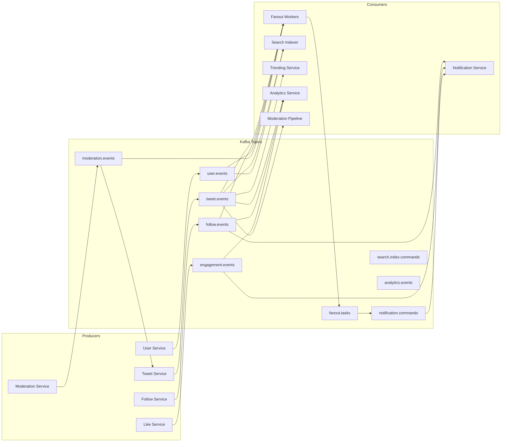
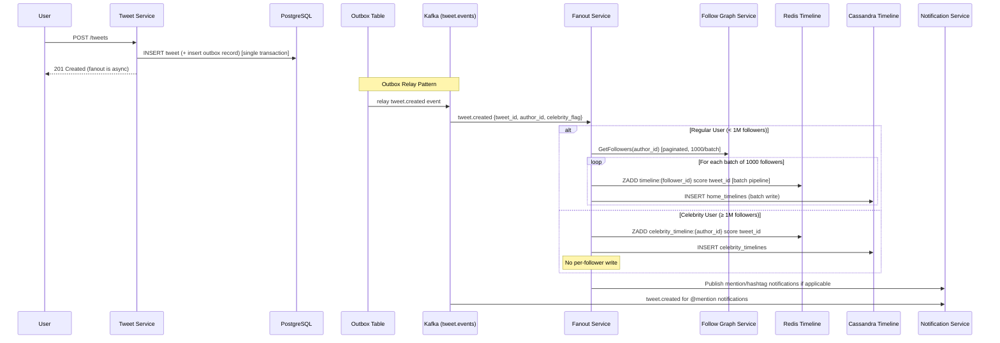
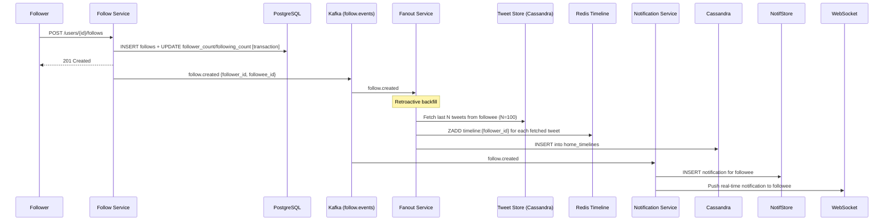
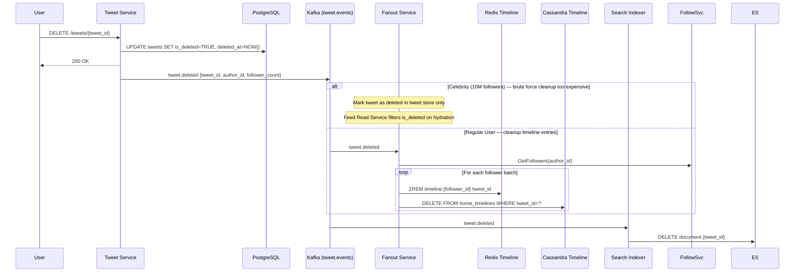
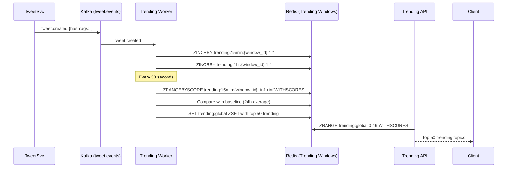

# 06 — Event Flow: Social Media Feed System

## Objective

Map all asynchronous event flows through the system — from tweet creation to feed delivery, from follow action to timeline backfill, and from engagement events to notifications. Define Kafka topic design, consumer groups, event schemas, and the precise sequence of operations for each critical path.

---

## Event Architecture Overview

The system uses Kafka as the central nervous system for all asynchronous communication. Every significant state change produces an event. Downstream systems react to events independently without coupling to the producer's business logic.



---

## Critical Event Flow: Tweet Creation to Feed Delivery



**Key Timing Characteristics**:
- Tweet creation to write acknowledgment: < 100ms
- Regular user fanout completion (200 followers): < 500ms
- Celebrity tweet visible to all followers: immediately (pulled on read)
- 10M-follower regular user fanout: ~30 seconds (parallelized across 100 workers)

---

## Event: User Follows Another User



**Retroactive Backfill Logic**:
When User A follows User B, User A's feed should immediately show User B's recent tweets. The Fanout Service fetches the last 100 tweets from User B (or the last week, whichever is smaller) and inserts them into User A's timeline. This is the "follow backfill" problem.

Backfill size is capped at 100 tweets to prevent a user following a prolific account from overwhelming their feed.

---

## Event: Tweet Deletion



**The Celebrity Delete Problem**: Removing a celebrity tweet from 10M follower timelines would take hours and consume enormous resources. The pragmatic solution: mark the tweet deleted in the source of truth, and filter it out at read time. The Feed Read Service always checks `is_deleted` during hydration. The stale ID in Redis is eventually cleaned up by a background TTL expiry.

---

## Kafka Topic Design

### Topic Catalog

| Topic | Partitions | Retention | Consumers | Notes |
|---|---|---|---|---|
| `tweet.events` | 512 | 7 days | Fanout, Search, Trending, Moderation | Highest throughput |
| `follow.events` | 128 | 7 days | Fanout, Notification | Lower volume |
| `engagement.events` | 256 | 3 days | Notification, Analytics | Likes, retweets |
| `user.events` | 64 | 30 days | All services | Account lifecycle |
| `moderation.events` | 64 | 7 days | Tweet Service, Fanout | Moderation verdicts |
| `fanout.tasks` | 1024 | 24 hours | Fanout Workers | Internal use only |
| `notification.commands` | 256 | 24 hours | Notification Service | Push commands |
| `analytics.raw` | 1024 | 30 days | Analytics | High volume raw events |

### Partition Strategy

**`tweet.events`** — partitioned by `author_id % num_partitions`. All tweets from the same author land on the same partition, preserving ordering for the same user's tweet stream. This is critical for retweet ordering.

**`fanout.tasks`** — partitioned by `target_user_id % num_partitions`. This ensures all fanout writes for the same user timeline go to the same consumer, preventing concurrent write races on the same timeline.

**`analytics.raw`** — partitioned by `event_type`, allowing different analytics consumers to subscribe to only their relevant event types.

### Event Schemas (Avro)

All events use Avro with the Confluent Schema Registry for schema evolution.

**`tweet.created` event**:
```
{
  "tweet_id": "long",
  "author_id": "string",
  "content": "string",
  "hashtags": ["string"],
  "mentions": ["string"],
  "tweet_type": "string",
  "visibility": "string",
  "is_celebrity_tweet": "boolean",
  "author_follower_count": "long",
  "created_at": "long"  // epoch millis
}
```

**`follow.created` event**:
```
{
  "follower_id": "string",
  "followee_id": "string",
  "is_followee_celebrity": "boolean",
  "followee_follower_count": "long",
  "created_at": "long"
}
```

---

## Consumer Group Design

### Fanout Consumer Group

```
Group ID: fanout-workers
Topic: tweet.events
Instances: 100 pods (auto-scaled based on consumer lag)
Processing: Parallel per partition, sequential within partition
Error handling: Retry 3× with exponential backoff → Dead Letter Topic
```

Each fanout worker processes tweet.events and publishes individual per-follower fanout tasks to `fanout.tasks`. The `fanout.tasks` consumers then do the actual Redis/Cassandra writes.

This two-stage approach prevents a single slow Cassandra write from blocking the consumption of new tweet events.

### Moderation Pipeline Consumer

```
Group ID: moderation-pipeline
Topic: tweet.events
Processing: Async — run ML classifier, update tweet status
SLA: < 5 seconds for automated moderation decision
```

---

## The Outbox Pattern

Why it matters: Without the outbox pattern, there is a race condition:

1. Tweet Service inserts tweet to PostgreSQL — SUCCESS
2. Tweet Service publishes to Kafka — NETWORK FAILURE
3. Result: Tweet is in DB but no fanout ever happens

With the outbox pattern:
1. Tweet Service atomically inserts tweet + outbox record to PostgreSQL — one transaction
2. Outbox relay daemon reads unprocessed outbox records and publishes to Kafka
3. On successful Kafka publish, mark outbox record as processed

This guarantees at-least-once delivery. Consumers must be idempotent (handle duplicate events).

```mermaid
sequenceDiagram
    participant TweetSvc
    participant PG
    participant OutboxRelay
    participant Kafka

    TweetSvc->>PG: BEGIN; INSERT tweet; INSERT outbox_events; COMMIT;
    OutboxRelay->>PG: SELECT * FROM outbox_events WHERE processed=FALSE ORDER BY id LIMIT 100
    OutboxRelay->>Kafka: Publish events
    Kafka-->>OutboxRelay: ACK
    OutboxRelay->>PG: UPDATE outbox_events SET processed=TRUE
```

---

## Real-Time Feed Updates

### Long Polling vs WebSockets vs SSE

| Approach | Use Case | Latency | Server Cost |
|---|---|---|---|
| Polling (10s interval) | Legacy mobile apps | 0–10 sec | High (wasted requests) |
| Long Polling | New tweet notification | 0–30 sec | Medium |
| Server-Sent Events (SSE) | Feed updates, one-directional | ~1 sec | Low (stateful connections) |
| WebSockets | Chat, bidirectional | < 500ms | Medium (bidirectional) |

**Decision**: Use SSE for feed update notifications. When a user is actively viewing their feed, the client holds an SSE connection. When a new tweet arrives in their timeline, the server pushes a `new_tweet_available` signal. The client then re-fetches from the feed API.

The SSE signal does NOT carry tweet content — it just says "fetch new content." This keeps the SSE connection lightweight and allows the full feed response to be cached at the CDN layer.

WebSockets are used for DMs (bidirectional) and live event features, not for feed delivery.

---

## Trending Topics Event Flow



**Trending Algorithm**:
1. Count hashtag usage in rolling 15-minute windows stored in Redis sorted sets
2. Compare current window count against 7-day average usage (stored in a separate counter)
3. A hashtag is "trending" if `current_count > baseline × multiplier (e.g., 2.5×)`
4. Rank by `(current_count - baseline) / sqrt(baseline)` — normalizes for large vs small accounts

---

## Interview-Level Discussion Points

1. **Why at-least-once vs exactly-once delivery?**: Kafka supports exactly-once semantics (EOS) but it adds complexity and reduces throughput. At-least-once is sufficient if consumers are idempotent. The fanout consumer uses `(user_id, tweet_id)` as a natural idempotency key — a duplicate fanout write is a no-op (ZADD on an existing member just updates the score).

2. **Consumer lag as an SLA metric**: The time between a tweet being created and it appearing in all follower feeds is determined by consumer lag on the `tweet.events` topic. If consumer lag grows above 30 seconds, auto-scale fanout workers. This is a key operational metric.

3. **The "thundering herd" on celebrity tweet**: When a celebrity with 10M followers tweets, the celebrity_timeline cache update is instant. But the millions of concurrent feed reads that happen in the next 30 seconds all trigger the same celebrity timeline lookup. Mitigate with Redis pipelining and read-through cache warming.

4. **Event ordering guarantees**: Kafka preserves order within a partition. All tweets from the same author land on the same partition (partitioned by author_id). This means their relative order is preserved. However, tweets from different partitions may arrive at the fanout consumer out of order. The timeline's sorted set uses tweet_id (Snowflake) as the score, which preserves global time ordering regardless of event delivery order.

5. **Schema evolution with Avro**: Adding a new field to an event schema with a default value is backward compatible. Removing a field is a breaking change that requires a new schema version. The Confluent Schema Registry enforces compatibility rules and prevents accidental breaking changes.
