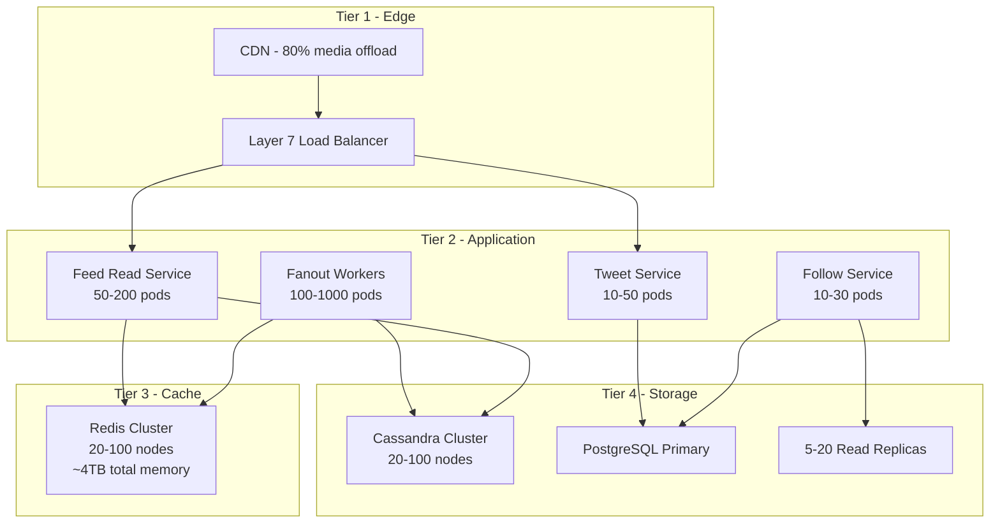
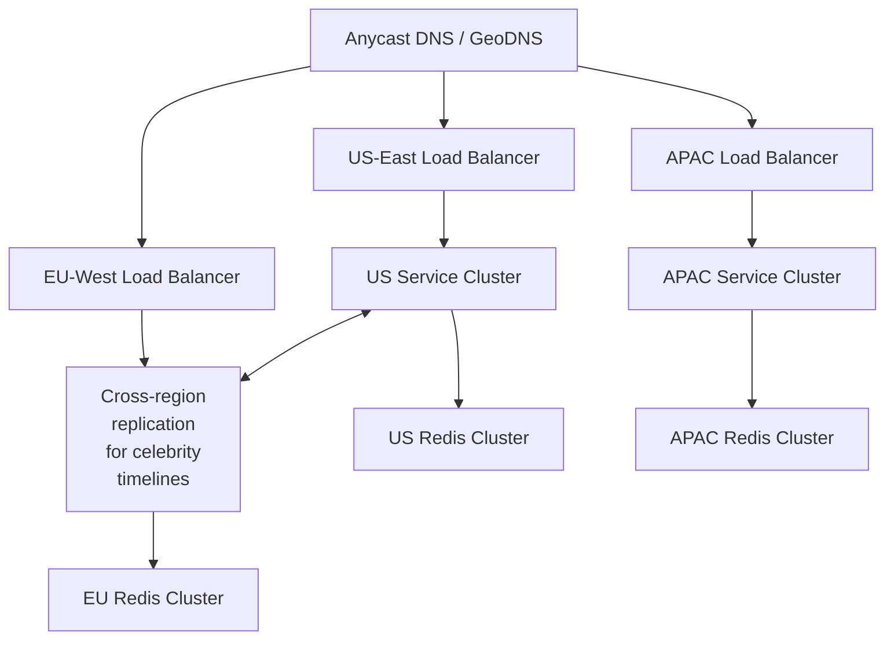

# 07 — Scaling Strategy: Social Media Feed System

## Objective

Define the horizontal and vertical scaling strategy for each component in the system, including load balancing, auto-scaling policies, database scaling, caching tiers, and the evolution of scaling strategies from startup to FAANG-scale. Identify specific bottlenecks and their mitigations.

---

## Scaling Overview by Component



---

## Feed Read Service Scaling

The Feed Read Service is the highest-traffic service. With 100K reads/sec at peak:

### Scaling Approach
1. **Stateless pods** — all state lives in Redis/Cassandra, not in the application tier
2. **Horizontal auto-scaling** — scale out based on CPU utilization and request queue depth
3. **Connection pooling** — use PgBouncer for PostgreSQL and Lettuce for Redis to cap connection count
4. **Response caching** — identical feed requests within 1 second return a cached response (ETag-based)

### Load Balancing Strategy
```
Layer 7 (NGINX / AWS ALB):
  - Round-robin for stateless Feed Read pods
  - Consistent hashing for cache-affinity if local in-process caching is used
  - Health check: GET /health → 200 within 50ms
  - Drain time: 30 seconds (allow in-flight requests to complete)
```

### Request Routing Optimization
- Route authenticated users to the same pod cluster region (reduces cross-region Redis calls)
- Route celebrity timeline reads to a dedicated pod pool to prevent celebrity traffic from affecting regular user feeds

---

## Fanout Service Scaling

The Fanout Service is the CPU-intensive write-heavy bottleneck.

### Scaling Metrics
```
Trigger scale-out:  Kafka consumer lag > 10,000 messages
Trigger scale-in:   Consumer lag < 1,000 messages AND CPU < 40%
Min pods:           20 (always-on for burst readiness)
Max pods:           1,000 (hard limit to prevent thundering herd on Cassandra)
```

### Fanout Parallelism
A single tweet with 200,000 followers requires 200 batched Kafka messages (1,000 followers/batch). With 100 fanout workers, each handling 10 partitions at 1,000 msgs/sec, this completes in ~200ms.

For 10M-follower celebrities: bypass per-follower writes. Write to celebrity_timeline only. 0 fanout writes needed.

### Fanout Bottlenecks

| Bottleneck | Symptom | Mitigation |
|---|---|---|
| Follow graph lookup | High latency in GetFollowers() | Cache follow graph in-memory within Fanout worker |
| Cassandra write contention | Write timeouts | Tune batch size; use async writes with ACK ONE |
| Redis connection pool exhaustion | Connection refused errors | Increase pool size; use connection multiplexing |
| Celebrity tweet detection race | New celebrity not detected | Background job re-evaluates `is_celebrity` every 5 minutes |

---

## Caching Scaling Strategy

### Redis Cluster Design

```
Cluster topology:
  - 20 shard nodes (primary + 1 replica each = 40 total)
  - Each shard handles ~5% of keyspace (hash slots)
  - Total memory: 4TB (20 shards × 200GB each)
  - Replication factor: 2 (one replica per shard)

Memory allocation:
  - Timeline caches: 60% (~2.4TB)
  - Celebrity timelines: 10% (~400GB)
  - Engagement caches (likes, counts): 15% (~600GB)
  - Rate limiting, sessions, idempotency keys: 15% (~600GB)
```

### Cache Eviction Policy

```
maxmemory-policy: allkeys-lru
```

LRU eviction ensures the most-recently-accessed timelines survive memory pressure. Inactive users' timelines are naturally evicted. When an inactive user returns, their timeline is rebuilt from Cassandra (cold start path).

### Redis Scaling Triggers
- Scale out shard count when memory utilization > 70%
- Add read replicas when CPU > 80% on primary shards
- Use Redis Cluster resharding (CLUSTER REBALANCE) to redistribute slots

---

## Database Scaling

### PostgreSQL Scaling Path

| Scale | Strategy |
|---|---|
| 0–10M users | Single primary + 2 read replicas |
| 10–50M users | Primary + 5 read replicas; route reads to replicas via PgBouncer |
| 50–200M users | Vertical scale primary; add more read replicas; partition follows table |
| 200M+ users | Vitess for horizontal sharding OR migrate follow graph to dedicated service |

**Read Replica Routing**:
- Follow graph reads → Replica 1, 2 (high read volume)
- User profile reads → Replica 3, 4
- Analytics queries → Replica 5+ (dedicated analytics replicas)
- All writes → Primary only

### Cassandra Scaling Path

Cassandra scales linearly with node additions. Adding a node automatically receives a portion of the keyspace via token ring rebalancing.

```
Scale trigger: Read/write latency p99 > 100ms
Scale action: Add N nodes to cluster
Rebalancing: Automatic via Cassandra nodetool
Replication factor: 3 (tolerates 1 node failure without data loss)
Consistency level: LOCAL_QUORUM for production reads/writes
```

At 300M active users with 30-day TTL and 800 entries/user:
```
Row count: 300M × 800 = 240B rows
Average row size: ~200 bytes (tweet_id + metadata)
Total data: ~48TB
Cassandra nodes needed: 48TB / 1TB per node = 48 nodes minimum
With 3× replication: ~144 node-equivalents of storage
Practical node count: 50-60 nodes with headroom
```

---

## Load Balancing Strategy

### Geographic Load Balancing



**Data residency**: EU user timelines must be stored in EU Redis cluster (GDPR). If a US user follows an EU celebrity, the celebrity timeline is replicated to the US cluster for serving US users.

---

## Rate Limiting at Scale

### Distributed Rate Limiting Design

Single-node rate limiting breaks in multi-pod environments. Use Redis-based distributed rate limiting:

```
Algorithm: Token bucket with Redis Lua scripts (atomic)
Key: ratelimit:{user_id}:{endpoint}:{15min_window}
Ops: INCR + EXPIRE (atomic via Lua script)
Cluster: Dedicated Redis cluster for rate limiting (separate from timeline cache)
```

At 100K requests/sec, the rate limiting Redis must handle 100K Lua script executions/sec. A 3-node Redis cluster dedicated to rate limiting handles this comfortably.

**IP-based rate limiting** at the API Gateway level handles unauthenticated traffic and DDoS mitigation without hitting application Redis.

---

## Auto-Scaling Policies

### Kubernetes HPA Configuration

```yaml
Feed Read Service:
  min_replicas: 20
  max_replicas: 200
  scale_up_trigger: CPU > 70% OR p99_latency > 150ms
  scale_up_cooldown: 30 seconds
  scale_down_trigger: CPU < 30% AND p99_latency < 50ms
  scale_down_cooldown: 5 minutes

Fanout Service:
  min_replicas: 20
  max_replicas: 1000
  scale_up_trigger: kafka_consumer_lag > 10000
  scale_up_cooldown: 60 seconds
  scale_down_trigger: kafka_consumer_lag < 500
  scale_down_cooldown: 10 minutes

Tweet Service:
  min_replicas: 10
  max_replicas: 100
  scale_up_trigger: CPU > 60%
```

### Pre-Scaling for Predictable Events

During known high-traffic events (presidential debates, World Cup final):
1. Detect trending hashtags 30 minutes before (social graph activity analysis)
2. Pre-scale Fanout Workers to max capacity 15 minutes before
3. Pre-warm Redis caches for likely-trending celebrities
4. Alert on-call team to stand by

---

## CDN Strategy

### What to Cache at CDN

| Content | CDN Cache? | TTL | Notes |
|---|---|---|---|
| Profile images | Yes | 24 hours | Purge on update |
| Tweet media (images) | Yes | 7 days | Immutable after upload |
| Tweet media (video) | Yes | 7 days | Chunked streaming |
| API responses | Selective | 5 seconds | Only for non-personalized data |
| Trending topics API | Yes | 30 seconds | Same for all users |
| User profile API | Yes | 60 seconds | Vary by user_id header |
| Home feed API | No | 0 | Personalized, cannot be shared |

**CDN offload target**: 80% of media traffic, saving ~160MB/sec of origin bandwidth.

### Edge Caching for Semi-Public Data

Tweet detail pages (not personalized) can be edge-cached for 30 seconds. The `viewer_has_liked` and `viewer_has_retweeted` fields are added client-side from local state rather than being in the cached response.

---

## Scaling Evolution: Startup → FAANG

### Phase 1: Startup (< 1M users)

```
Architecture: Monolith + PostgreSQL + Redis
Fanout: Pull model on read (simple merge of follows)
Timeline: Computed on read from PostgreSQL
Caching: Single Redis instance
Kafka: Not needed yet
Team: 3–5 engineers
```

### Phase 2: Growth (1M–50M users)

```
Architecture: Modular monolith → extracting Feed and Tweet services
Fanout: Push model for regular users introduced
Timeline: Redis sorted sets + Cassandra for persistence
Kafka: Introduced for tweet events and notifications
Caching: Redis cluster (3 nodes)
Team: 10–20 engineers
```

### Phase 3: Scale (50M–500M users)

```
Architecture: Full microservices
Fanout: Hybrid push-pull (celebrity threshold introduced)
Timeline: Large Redis cluster + Cassandra cluster
Kafka: 500+ partition clusters, multiple topics
Follow graph: Custom in-memory service
ML ranking: Introduced for feed ranking
Team: 50–200 engineers
```

---

## Performance Bottlenecks Analysis

| Component | Bottleneck | Symptom | Fix |
|---|---|---|---|
| Feed Read | Cold start for inactive users | High Cassandra read latency | Lazy precompute on login |
| Fanout | Follow graph DB reads | Slow GetFollowers queries | Cache follow graph in Fanout workers |
| Tweet Hydration | N+1 queries | High DB CPU | Batch hydration with Redis pipeline |
| Celebrity merge | Fan-in of many celebrity timelines | High CPU for merge sort | Limit celebrities per user; batch celebrity reads |
| Like counter | Hot row contention | Write conflicts on viral tweets | Redis INCR + async DB persistence |
| Trending | Hash tag cardinality explosion | Redis memory growth | Limit tracked hashtags per window to top 10K |

---

## Interview-Level Discussion Points

1. **The "cost cliff" of push fanout**: Fanout-on-write is cheap for users with 200 followers but catastrophically expensive for users with 10M followers. The hybrid model's celebrity threshold is an economic decision as much as a technical one.

2. **Backpressure in Fanout Workers**: If Cassandra writes slow down (node failure, GC pause), Fanout workers should slow their consumption rate from Kafka rather than flooding Cassandra with retries. Implement adaptive batch sizing based on Cassandra write latency.

3. **Redis memory as the primary cost driver**: The ~1.25TB of Redis memory for timeline caches costs approximately $50K–$100K/month in cloud infrastructure. This is one of the largest infrastructure costs. Reducing timeline depth from 800 to 400 entries cuts this cost in half.

4. **Database connection pool sizing**: With 200 Feed Read pods each needing a Redis connection pool, naive implementation creates 200 × pool_size connections to Redis. At pool_size=50, that's 10,000 connections per Redis shard. Use PgBouncer-style connection pooling for Redis (KeyDB proxy or Envoy sidecar).

5. **The "hot key" problem in Redis**: A celebrity with 10M followers suddenly tweeting causes 10M concurrent reads of the same `celebrity_timeline:{id}` key. Redis is single-threaded per shard; a hot key can saturate a single shard. Mitigate by replicating celebrity timelines across multiple "hot key" replica nodes and routing reads round-robin.
