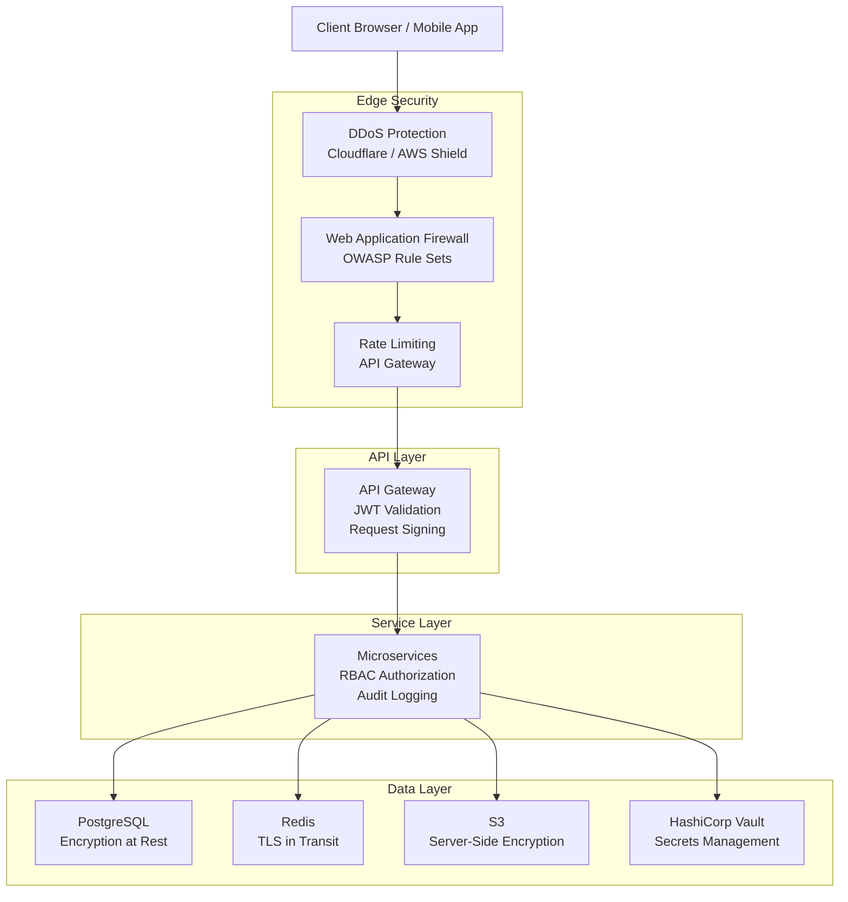
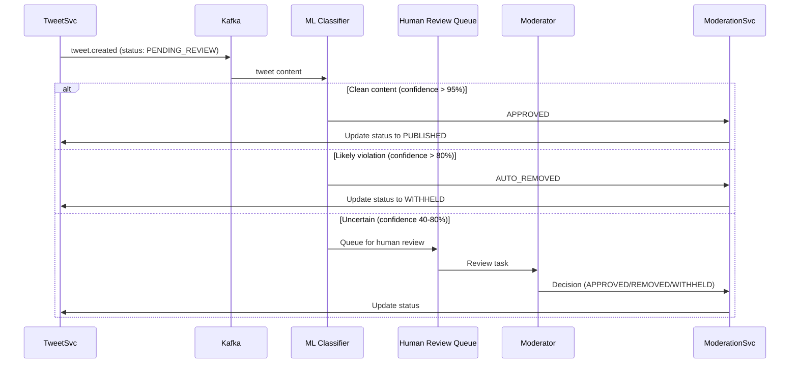

# 08 — Security Design: Social Media Feed System

## Objective

Define the comprehensive security architecture for the social media feed system — covering authentication, authorization, API security, data protection, content security, and compliance. Security must be designed as a first-class concern, not retrofitted after launch.

---

## Security Architecture Overview



---

## Authentication Design

### JWT-Based Authentication

**Token Structure**:
```
Header: { "alg": "RS256", "kid": "key-id-2026-05" }
Payload: {
  "sub": "user-uuid",
  "username": "piyush",
  "roles": ["USER"],
  "iat": 1716019200,
  "exp": 1716105600,   // 24-hour access token
  "jti": "unique-token-id"  // for revocation
}
Signature: RS256 signature using Auth Service private key
```

**Why RS256 (asymmetric) over HS256 (symmetric)?**
- Services only need the public key to verify tokens — they cannot issue tokens
- Private key lives only in the Auth Service
- Key rotation is easier: publish new public key to JWKS endpoint, old tokens expire naturally
- Compromised downstream service cannot forge tokens

### Token Lifecycle

```
Access Token:  24 hours (short-lived, stored in memory/httpOnly cookie)
Refresh Token: 30 days (stored in secure httpOnly cookie, not localStorage)
                        Rotated on each use (refresh token rotation)
```

**Why not localStorage?**: XSS attacks can steal tokens from localStorage. HttpOnly cookies are inaccessible to JavaScript, preventing this attack vector.

### OAuth2 / Social Login

- Support Google, Apple sign-in via OAuth2 authorization code flow
- PKCE (Proof Key for Code Exchange) required for mobile clients
- State parameter for CSRF protection during OAuth flow
- After OAuth, issue our own JWT — do not use Google tokens for API calls

### Session Revocation

JWT tokens are stateless and cannot be revoked before expiry. Handle this via:
1. **Blocklist in Redis**: `SADD revoked_tokens {jti}` with TTL matching token expiry
2. **Short expiry**: 24-hour access tokens limit the damage window
3. **Refresh token rotation**: Compromised refresh token detected when two uses are seen — invalidate entire token family
4. **Per-user token invalidation**: On password change or account suspension, store `user_token_invalidated_at` timestamp. Tokens issued before this timestamp are rejected.

---

## Authorization Design

### Role-Based Access Control (RBAC)

| Role | Permissions |
|---|---|
| `USER` | Create/delete own tweets, follow/unfollow, like, read public feeds |
| `VERIFIED_USER` | All USER permissions + longer tweet limits (if applicable) |
| `ADMIN` | Read/suspend/delete any content, access moderation queues |
| `MODERATOR` | Read/hide/flag content, process moderation queue |
| `READ_ONLY` | Read public feeds only, no write operations |
| `API_CLIENT` | Application-level access (OAuth apps), scoped to specific endpoints |

### Attribute-Based Access Control (ABAC) for Complex Rules

Some authorization decisions require context beyond roles:

- **Tweet visibility**: `FOLLOWERS_ONLY` tweets require checking if the requesting user follows the author
- **Block/Mute suppression**: A blocked user must not see the blocker's tweets
- **Private account**: Only followers can see tweets from private accounts
- **Geographic content restrictions**: Certain tweets may be geo-restricted by court order

These rules are implemented in a centralized `AuthorizationService` rather than scattered across each API handler.

### Authorization Enforcement Points

```
Layer 1: API Gateway (JWT validation, rate limit, basic role check)
Layer 2: Service Controller (resource ownership check — can this user modify this tweet?)
Layer 3: Data Layer (row-level security in PostgreSQL for admin-only tables)
```

---

## API Security

### Input Validation and Sanitization

| Attack Vector | Mitigation |
|---|---|
| SQL Injection | Parameterized queries only; no string concatenation in SQL |
| XSS in tweet content | Sanitize HTML on write; encode on display; Content-Security-Policy header |
| CSRF | SameSite=Strict cookie flag; Origin header validation for state-changing requests |
| Path traversal | Validate all file path inputs; reject `../` sequences |
| Large payload DoS | Max request body size: 1MB; reject oversized requests at gateway |
| Content-Type confusion | Strict Content-Type enforcement; reject unrecognized media types |

### Request Signing for Internal Services

Internal service-to-service calls (gRPC) use mutual TLS (mTLS):
- Each service has a TLS certificate issued by an internal CA
- Services verify both server AND client certificates
- Certificate rotation via cert-manager in Kubernetes

This prevents a compromised service from impersonating another service.

### API Gateway Security Rules

```
- JWT validation: Required for all /api/v1/* routes
- Rate limiting: Token bucket per user_id and per IP
- Request size limit: 1MB
- Allowed methods: Explicit allowlist per endpoint
- CORS: Allowlist of trusted origins only
- Security headers injection: HSTS, X-Frame-Options, X-Content-Type-Options, CSP
```

---

## Data Protection

### Encryption at Rest

| Data Store | Encryption | Key Management |
|---|---|---|
| PostgreSQL | AES-256 via transparent data encryption (or pg_crypto for column-level) | AWS KMS / Vault |
| Cassandra | Transparent encryption via JCE provider | Vault |
| Redis | Disk encryption at OS level; data is ephemeral | N/A |
| S3 (media, archives) | SSE-S3 or SSE-KMS | AWS KMS |
| Kafka (messages in transit) | TLS + disk encryption on brokers | Vault |

### Encryption in Transit

- All external traffic: TLS 1.3 minimum
- Internal service communication: mTLS
- Kafka producer/consumer: TLS
- Redis client connections: TLS (via stunnel or native Redis TLS)
- Database connections: TLS with certificate verification

### Sensitive Field Handling

| Field | Treatment |
|---|---|
| Password | bcrypt with cost factor 12 (never stored in plaintext) |
| Email | Stored encrypted (AES-256) at rest; used only for auth, never returned in API responses |
| Phone number | Stored encrypted; used for 2FA only |
| IP addresses in logs | Anonymized after 30 days (GDPR) |
| Location data | Never stored at precision greater than city-level in logs |

---

## Secrets Management

**HashiCorp Vault** as the centralized secrets store:
- Database credentials: Dynamic secrets (Vault generates unique creds per service, auto-rotated)
- API keys: Stored in Vault; injected as environment variables at pod startup via Vault Agent
- JWT signing keys: Vault PKI secrets engine; automatic rotation every 90 days
- No secrets in code, environment files, or Kubernetes ConfigMaps — only Vault references

**Secret Rotation Policy**:
```
JWT signing keys: 90 days
Database passwords: 30 days (dynamic secrets auto-expire)
API integration keys (Stripe, SendGrid): 180 days with manual rotation
TLS certificates: 90 days (automated via cert-manager)
```

---

## Content Security and Moderation

### Content Moderation Pipeline



### Abuse Detection

| Signal | Action |
|---|---|
| 50+ tweets in 15 minutes | Temporary rate limit + flag for review |
| Same content hash within 1 hour | Duplicate/spam detection |
| Follow velocity > 400/day | Bot detection, captcha challenge |
| Multiple reports on same tweet | Priority queue for human review |
| Known hash match (CSAM, DMCA) | Immediate auto-removal, legal reporting |

### PhotoDNA / CSAM Detection

All image uploads are hashed with PhotoDNA (Microsoft) or NCMEC hash database before storage. A match triggers:
1. Immediate suppression of media
2. Account suspension
3. Automatic NCMEC CyberTipline report (legally required in the US)

---

## GDPR and Data Privacy Compliance

| GDPR Right | Implementation |
|---|---|
| Right to Access | User data export endpoint: `GET /api/v1/users/me/data-export` — generates async download |
| Right to Erasure | Two-phase: soft delete immediately, hard purge of PII after 30 days |
| Data Minimization | Collect only what is necessary; log anonymization after 30 days |
| Consent | Explicit consent flow for analytics data collection; opt-out available |
| Data Portability | Export in machine-readable format (JSON) |
| Data Residency | EU users' data stored only in EU regions (controlled via user signup region) |

---

## Security Monitoring and Incident Response

### Security Event Detection

| Event | Detection | Response |
|---|---|---|
| Brute force login | > 10 failed logins in 5 minutes | Temporary account lock + CAPTCHA |
| Credential stuffing | Unusual login success pattern from new IPs | Multi-factor auth challenge |
| Mass scraping | Unusually high read rate from single API token | Rate limit + investigate |
| Account takeover | Password change + login from new device | Email notification + optional lock |
| Admin action anomaly | Bulk deletion or suspension outside normal hours | Immediate alert to security team |

### Audit Logging

All privileged operations are audit-logged:
```
{
  "timestamp": "2026-05-18T10:30:00Z",
  "actor_id": "admin-user-uuid",
  "action": "TWEET_DELETED_BY_ADMIN",
  "resource_type": "TWEET",
  "resource_id": "tweet-id",
  "reason": "Policy violation #1234",
  "ip_address": "10.x.x.x",
  "session_id": "..."
}
```

Audit logs are written to an append-only store (WORM — Write Once Read Many) that even admins cannot modify. This is a SOC2 requirement.

---

## Interview-Level Discussion Points

1. **JWT vs opaque session tokens**: JWTs allow stateless verification but cannot be revoked before expiry. Opaque tokens require a DB lookup on every request but can be instantly revoked. The hybrid approach (JWT with short TTL + Redis revocation blocklist) balances both concerns.

2. **The "shadow ban" debate**: Some platforms silently reduce the visibility of flagged content (shadow ban) rather than explicit suspension. This is a product and legal decision with significant user trust implications. Architecturally, it requires a `visibility_override` field in the timeline fanout logic.

3. **API scraping at scale**: A determined scraper can extract the full public tweet graph even with rate limiting. Mitigation: entropy-based detection (detecting non-human access patterns), honeypot accounts, and legal terms of service. Technical rate limiting alone is insufficient.

4. **GDPR right to erasure vs content moderation**: When a user deletes their account, their tweets should be deleted. But tweets that were used as evidence in a moderation decision (harassment, threats) may need to be retained for legal purposes. This creates a conflict between GDPR and trust & safety requirements. Resolution: retain content in a legally quarantined store, inaccessible to the public, for a defined legal hold period.

5. **The "verified badge" security implications**: Verified checkmarks on accounts create a trust signal that attackers exploit. Account takeover of a verified account causes more harm than a regular account. Apply stricter security requirements (forced 2FA) for verified accounts.
