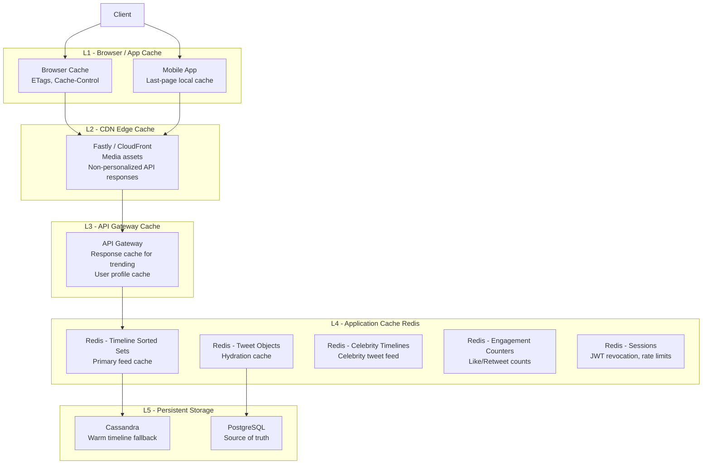
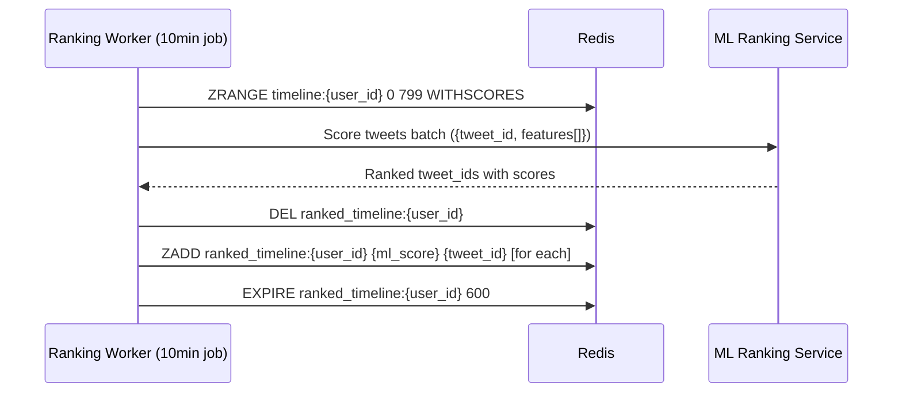

# 09 — Caching Strategy: Social Media Feed System

## Objective

Design a multi-layered caching strategy that achieves >95% cache hit rate for feed reads, eliminates database hot-path reads, and defines precise cache invalidation policies. Caching is not an optimization — at this scale, it is a correctness requirement for meeting latency SLAs.

---

## Caching Layer Overview



---

## Timeline Cache (Core Design)

### Redis Sorted Set as Timeline

```
Key: timeline:{user_id}
Type: Sorted Set (ZSET)
Member: tweet_id (64-bit integer, Snowflake)
Score: Epoch milliseconds (for chronological) or ML ranking score (for ranked feed)
TTL: 24 hours (active users); no cache entry for dormant users
Max size: 800 entries per user (ZREMRANGEBYRANK trims overflow)
```

**Operations Profile**:
```
Write (fanout):    ZADD timeline:{user_id} NX {score} {tweet_id}
                   O(log N) per operation

Read (feed):       ZREVRANGEBYSCORE timeline:{user_id} +inf {cursor_score}
                   LIMIT 0 20
                   O(log N + M) where M = page size

Trim (maintenance): ZREMRANGEBYRANK timeline:{user_id} 0 -801
                    Called after each ZADD to keep size bounded

Size check:         ZCARD timeline:{user_id}
                    O(1)
```

**Memory Optimization**:
- Store tweet_id as integer (8 bytes) not string ("1234567890123456789" = 19 bytes)
- Redis ZSET uses ziplist encoding for sets < 128 members — effectively free compression
- For sets > 128 members, uses skiplist — ~16 bytes per member overhead

---

## Tweet Object Cache

Timelines store only tweet IDs. The Feed Read Service must hydrate these IDs into full tweet objects.

```
Key: tweet:{tweet_id}
Type: Hash
Fields: author_id, content, like_count, retweet_count, reply_count, 
        created_at, tweet_type, visibility, is_deleted, media_ids
TTL: 48 hours (hot tweets)
     No TTL for pinned/viral tweets (explicit TTL extension)
     No entry for cold tweets (cache miss → DB lookup)
```

**Hydration Strategy**:
1. Feed Read Service receives a page of 20 tweet IDs
2. Batch pipeline `HMGET tweet:{id}` for all 20 tweet IDs in a single Redis round trip
3. Identify cache misses (null results)
4. Batch fetch misses from Cassandra: `SELECT * FROM tweets WHERE tweet_id IN (...)`
5. Populate cache for misses: `HSET tweet:{id} ...` with 48h TTL
6. Return assembled tweet objects

**Cache Miss Rate Target**: < 5% on the hot path (tweets from last 48 hours)

---

## Celebrity Timeline Cache

```
Key: celebrity_timeline:{celebrity_id}
Type: Sorted Set
Member: tweet_id
Score: Epoch milliseconds
TTL: 2 hours
Max size: 200 most recent tweets
```

**Celebrity feed merge algorithm on read**:
1. Read user's precomputed timeline from `timeline:{user_id}` (regular follows)
2. Identify which accounts the user follows that are celebrities (from follow cache or DB)
3. Read `celebrity_timeline:{celebrity_id}` for each celebrity followed (up to 50 max)
4. Merge-sort all tweet streams by score
5. Return paginated result

**Limiting celebrity follows**: If a user follows 200 celebrities, the merge step is expensive (200 sorted set reads + merge). Cap "celebrity injection" to the top 50 most-engaged celebrities followed by the user. Others fall back to the pull model only when explicitly viewing their profile.

---

## Engagement Counter Cache

```
Key: tweet:counts:{tweet_id}
Type: Hash
Fields: likes, retweets, replies, quote_tweets, views
TTL: 48 hours (hot); evicted via LRU for cold tweets

Key: likes:{user_id}
Type: Set (bloom filter at extreme scale)
Members: tweet_ids liked by this user
TTL: 24 hours
Max size: 10,000 entries (SREM oldest when exceeded)
```

**Like Counter Update Flow**:
1. User likes a tweet
2. Like Service: `SADD likes:{user_id} {tweet_id}` (immediate, for has-liked check)
3. Like Service: `HINCRBY tweet:counts:{tweet_id} likes 1` (immediate, for display count)
4. Like Service: Async write to PostgreSQL likes table via Kafka
5. If Redis is unavailable: write directly to DB and rebuild cache lazily

**Why not persist counters in Redis**? Redis is not a durable store. The source of truth is PostgreSQL. Redis counters are rebuilt from DB on cache miss. The maximum staleness is the time since last DB sync (~seconds), which is acceptable.

---

## Follow Graph Cache

The follow graph is needed by the Fanout Service on every tweet creation. Caching it reduces the load on the Follow Service.

```
Key: following:{user_id}
Type: Set (SMEMBERS for small follow lists)
      OR
Type: ZSet sorted by last-interaction-score (for ranked follow lists)
Members: followee_ids
TTL: 10 minutes
```

**Bloom Filter for Celebrity Check**:
```
Key: celebrity_ids
Type: Redis Bloom Filter (RedisBloom module)
Error rate: 0.1%
Capacity: 200,000 celebrities

Check: BF.EXISTS celebrity_ids {user_id}
Add: BF.ADD celebrity_ids {user_id}
```

A false positive (non-celebrity treated as celebrity) means one legitimate tweet misses the push fanout. The pull path will still include it on read. Low impact. A false negative (celebrity not identified) causes a massive fanout — more dangerous. Set a low false positive rate.

---

## Cache Invalidation Policies

The hardest problem in caching is invalidation. Each cache entry has a defined invalidation trigger:

| Cache Key | Update Trigger | Invalidation Strategy |
|---|---|---|
| `timeline:{user_id}` | New tweet from followed account | Append via fanout worker (ZADD) |
| `timeline:{user_id}` | Followed account deletes tweet | ZREM by fanout worker |
| `timeline:{user_id}` | User unfollows account | Remove tweets from that author (background job) |
| `tweet:{tweet_id}` | Tweet edited | SET new value + update TTL |
| `tweet:{tweet_id}` | Tweet deleted | SET is_deleted=true OR DEL and serve "deleted" response |
| `tweet:counts:{tweet_id}` | Like/retweet action | HINCRBY (atomic, no invalidation needed) |
| `celebrity_timeline:{id}` | Celebrity posts tweet | ZADD immediately |
| `likes:{user_id}` | User likes/unlikes | SADD / SREM immediately |

### TTL as Eventual Correctness

For edge cases not covered by explicit invalidation (e.g., network partition causes missed invalidation), TTL serves as the safety net. The maximum staleness is bounded by the TTL.

---

## Cache Warm-Up Strategies

### New User Registration
On account creation, precompute an empty timeline. On first follow, trigger backfill of followee's last 100 tweets.

### Dormant User Return (Cold Start)
When an inactive user (no timeline cache) opens their feed:
1. Serve "loading" state immediately
2. Background job: Fetch follow list from DB, fetch recent tweets from each followee
3. Build timeline from Cassandra `home_timelines` table
4. Populate Redis sorted set
5. Return feed (typically < 2 seconds)

Alternatively: Cassandra serves as the L5 cache for this scenario — read directly from persistent timeline table without Redis warm-up.

### Event-Driven Pre-Warming
When a celebrity announces something major (detected via sudden engagement spike):
- Pre-warm celebrity_timeline cache to full 2-hour TTL
- Pre-scale Redis cluster capacity for the anticipated read spike

---

## Feed Ranking and Cache Interaction

### Chronological Feeds (MVP)
- Score = tweet_id (Snowflake timestamp component)
- Cache is always in chronological order
- No re-ranking needed; feed is just a ZREVRANGE

### ML-Ranked Feeds (V2+)
- Score = ML ranking score (float, 0-1)
- Cache invalidation becomes complex: ranking score can change as engagement changes
- Solution: Cache ranked feed as a separate sorted set with a short TTL (10 minutes)
  - `ranked_timeline:{user_id}` separate from `timeline:{user_id}`
  - Rebuilt every 10 minutes by a ranking worker
  - Chronological `timeline:{user_id}` always maintained as the source for the ranking worker



---

## Cache Performance Targets

| Metric | Target |
|---|---|
| Timeline cache hit rate | > 95% |
| Tweet object cache hit rate | > 90% |
| Celebrity timeline cache hit rate | > 99% (TTL = 2 hours) |
| Redis p99 latency | < 2ms |
| Cache build time on cold start | < 2 seconds |
| Maximum cache staleness | 30 seconds (counting TTL) |

---

## Cache Cluster Sizing

```
Timeline sorted sets (300M active users × 800 entries × 16 bytes):  ~3.8 TB
Celebrity timelines (50K celebrities × 200 entries × 16 bytes):      ~160 MB
Tweet object cache (100M hot tweets × 500 bytes avg):                 ~50 GB
Engagement counters (100M hot tweets × 100 bytes avg):                ~10 GB
Likes sets (100M users × 200 liked tweets × 8 bytes):                 ~160 GB
Follow lists (50M active users × 200 follows × 8 bytes):              ~80 GB
Sessions, rate limits, misc:                                           ~100 GB

Total: ~4.3 TB
With 40% headroom: ~6 TB provisioned Redis memory
With 2x replication: ~12 TB total Redis capacity
```

---

## Interview-Level Discussion Points

1. **Cache stampede / thundering herd on cold start**: When a user's timeline cache expires and 1,000 concurrent requests try to rebuild it simultaneously, they all hit Cassandra at once. Mitigation: use a distributed lock (Redis SETNX) on `building_timeline:{user_id}`. First request builds and populates the cache; others wait and then read the warmed cache.

2. **Write-through vs write-behind for tweet objects**: Write-through (update DB first, then cache) is simpler but adds latency to the write path. Write-behind (update cache immediately, async DB write) is faster but risks data loss on cache failure. For tweet creation: write-through to PostgreSQL (durable), then asynchronously populate cache. For like counters: write-behind (Redis atomic INCR, async DB) because slight inaccuracy is acceptable.

3. **The Bloom filter for celebrity detection**: At 200K celebrities, a Bloom filter uses ~240KB (at 0.1% false positive rate) vs ~1.6MB for a full set. The size saving is minor, but the O(1) lookup speed and memory efficiency make it worth using.

4. **Cache coherence across regions**: If a tweet is liked in the US, the like counter cache in the EU region is stale. Cross-region cache coherence is expensive. Accept eventual consistency: EU users may see a count that's a few seconds behind. Counts are eventually reconciled via DB replication.

5. **Why not use Memcached instead of Redis for tweet objects?**: Memcached is faster for pure key-value workloads, but Redis sorted sets are essential for timelines. Using one system (Redis) for both avoids operational complexity. The performance difference is negligible at this scale.
