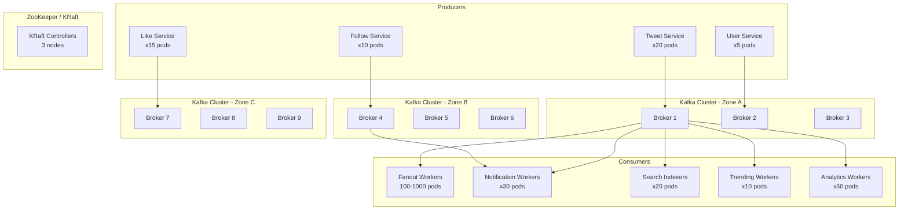

# 10 — Message Queue Design: Social Media Feed System

## Objective

Define the Kafka-based messaging infrastructure that decouples services, enables reliable asynchronous processing, and handles the enormous event throughput generated by a 500M user social platform. This document covers topic design, partition strategy, consumer group architecture, reliability patterns, and operational concerns.

---

## Why Kafka Over Alternatives

| System | Throughput | Persistence | Replay | Consumer Groups | Fit |
|---|---|---|---|---|---|
| **Apache Kafka** | Millions/sec | Yes (log) | Yes (by offset) | Yes (parallel) | Selected |
| RabbitMQ | ~100K/sec | Optional | Limited | Yes | Too low throughput |
| Amazon SQS | ~300K/sec | Yes | No (once consumed) | No | No replay capability |
| Redis Pub/Sub | Very high | No | No | No | No persistence — messages lost if consumer offline |
| Google Pub/Sub | High | Yes | Yes | Yes | Viable alternative, less control |

Kafka is selected because:
1. **Throughput**: 3.5M fanout events/sec requires Kafka's sequential disk I/O model
2. **Replay**: Ability to reprocess events from the beginning is critical for rebuilding timelines after bugs
3. **Decoupling**: Producers and consumers are fully independent
4. **Consumer groups**: Multiple independent consumers (Fanout, Notification, Analytics) can process the same event stream at their own pace

---

## Kafka Cluster Architecture



---

## Topic Design

### Topic Catalog and Configuration

```
Topic: tweet.events
  Partitions:        512
  Replication:       3 (one per zone for AZ failure tolerance)
  Retention:         7 days
  Cleanup policy:    delete
  Min ISR:           2
  Partition key:     author_id (all tweets from same author on same partition)
  Expected throughput: 100K messages/sec peak
  Consumer groups:   fanout-workers, search-indexers, trending-workers,
                     moderation-pipeline, analytics-ingestion

Topic: follow.events
  Partitions:        128
  Replication:       3
  Retention:         7 days
  Partition key:     follower_id
  Expected throughput: 5K messages/sec peak

Topic: engagement.events  (likes, retweets, replies)
  Partitions:        256
  Replication:       3
  Retention:         3 days
  Partition key:     tweet_id (all engagement for same tweet on same partition)
  Expected throughput: 50K messages/sec peak

Topic: user.events
  Partitions:        64
  Replication:       3
  Retention:         30 days  (longer for compliance)
  Partition key:     user_id
  Expected throughput: 1K messages/sec peak

Topic: fanout.tasks  (internal — pre-computed follower batches)
  Partitions:        1024
  Replication:       3
  Retention:         24 hours  (transient processing)
  Partition key:     target_user_id % num_partitions
  Expected throughput: 3.5M messages/sec peak

Topic: moderation.events
  Partitions:        64
  Replication:       3
  Retention:         90 days  (legal requirements)
  Partition key:     tweet_id

Topic: notification.commands
  Partitions:        256
  Replication:       3
  Retention:         24 hours  (stale notifications are useless)
  Partition key:     recipient_user_id

Topic: analytics.raw
  Partitions:        1024
  Replication:       2  (analytics tolerates some loss)
  Retention:         30 days
  Partition key:     event_type
  Expected throughput: 500K messages/sec peak

Topic: dlq.fanout  (dead letter queue for fanout failures)
  Partitions:        32
  Replication:       3
  Retention:         14 days
```

---

## Partition Strategy Deep Dive

### Fanout Topic Partition Key: `target_user_id % 1024`

The `fanout.tasks` topic contains individual per-follower write tasks. Partitioning by `target_user_id` ensures:
- All writes to the same user's timeline go to the same partition
- The same consumer processes all writes for a given user's timeline — no concurrent write races
- Consumers can maintain a local write buffer per user to batch Cassandra writes

### Tweet Events Partition Key: `author_id`

Partitioning by `author_id` ensures:
- All tweets from the same user arrive in order at the consumer
- The Fanout Service processes tweets from the same user sequentially — prevents out-of-order timeline entries
- A single "hot author" (celebrity tweeting rapidly) can dominate one partition — monitor and alert

### Hot Partition Mitigation

If a celebrity tweets 100 tweets in 10 minutes, all 100 land on the same partition. With 512 partitions and 100K messages/sec, each partition handles ~195 messages/sec on average. A hot author could spike one partition to 10x the average.

Mitigation options:
1. **Sticky partitioning with bounded load**: If partition is already at 5x average, hash to an overflow partition
2. **Separate topic for celebrity tweets**: Route celebrity tweet events to a dedicated high-priority topic with more partitions
3. **Consumer auto-rebalancing**: Kafka Streams or KSQL can dynamically reroute processing

---

## Consumer Group Architecture

### Fanout Consumer Group

```
Group ID:           fanout-workers
Topic:              tweet.events
Parallelism:        512 partitions × 1 consumer each (max parallelism = 512)
Pod count:          100–1000 (auto-scaled by consumer lag)
Processing model:   Batch processing
                    1. Consume tweet.created event
                    2. Call Follow Service: GetFollowers(author_id, cursor)
                    3. Publish N batches of 1000 followers to fanout.tasks
                    4. Commit offset
Idempotency:        fanout.tasks uses (target_user_id, tweet_id) deduplication
Retry policy:       Retry 3× with exponential backoff (1s, 2s, 4s)
DLQ:               After 3 retries, publish to dlq.fanout
Lag alert:          > 50,000 messages (approx 30 seconds of backlog)
```

### Notification Consumer Group

```
Group ID:           notification-workers
Topics:             follow.events, engagement.events, tweet.events (mentions)
Parallelism:        Bounded by partition count of smallest topic (64)
Processing model:   Per-event notification creation
                    1. Create notification record in DB
                    2. Push to user's notification SSE connection (if online)
                    3. Increment unread badge count in Redis
```

### Analytics Consumer Group

```
Group ID:           analytics-ingestion
Topic:              analytics.raw
Processing model:   Micro-batch (every 5 seconds)
                    1. Consume batch of events
                    2. Buffer in memory
                    3. Flush to data warehouse (BigQuery / Redshift) in bulk
Lag tolerance:      High — analytics can be 5 minutes behind
```

---

## Reliability Patterns

### At-Least-Once vs Exactly-Once Delivery

| Pattern | Use Case | Tradeoff |
|---|---|---|
| At-least-once | Fanout, search indexing, notifications | Simple; consumers must be idempotent |
| Exactly-once | Financial events (not needed here) | Complex; 20-30% throughput reduction |
| At-most-once | Trending analytics (some loss OK) | Fastest; commit before processing |

**Decision**: Use at-least-once delivery everywhere. All consumers are designed to be idempotent.

### Fanout Idempotency

```
Fanout task: {target_user_id: "abc", tweet_id: 123456}

On processing:
  ZADD timeline:abc NX 1716019200000 123456
  
The NX flag means "only add if not exists"
If this task is processed twice, the second ZADD is a no-op
→ Naturally idempotent
```

### Consumer Failure and Rebalance

When a Fanout Worker pod crashes:
1. Kafka detects consumer heartbeat timeout (default 10 seconds)
2. Triggers consumer group rebalance
3. Partitions from crashed consumer are redistributed to remaining consumers
4. Consumers restart from last committed offset
5. Some tweets may be re-processed (at-least-once)

**Key design**: Commit offsets AFTER successful write to Redis/Cassandra, not before. This ensures no tweets are lost on consumer crash.

### Dead Letter Queue Processing

When a fanout write fails after 3 retries:
1. Publish to `dlq.fanout` with failure reason and original message
2. Alert on-call team
3. Manual investigation: is Cassandra down? Is Redis OOM?
4. After fix: replay DLQ messages into original topic
5. DLQ consumers should have lower throughput limits to avoid re-overwhelming the system

---

## Schema Registry and Schema Evolution

All Kafka messages use Avro serialization with Confluent Schema Registry.

### Schema Compatibility Rules

```
tweet.events schema v1 → v2 evolution rules:
  - BACKWARD compatible: can add new optional fields with defaults
  - Not allowed: removing required fields, changing field types

Producer: registers schema v2 before deploying
Consumer: can read v1 messages with v2 schema (backward compatibility)
Registry: enforces BACKWARD compatibility on all schema updates
```

### Schema Registry Architecture

```
Confluent Schema Registry:
  - 3 instances behind load balancer
  - Stores schemas in Kafka internal topic (_schemas)
  - Clients cache schemas locally (refresh every 5 minutes)
  - Schema ID embedded in every message (first 5 bytes)
```

---

## Backpressure Handling

If Cassandra becomes slow (e.g., compaction running), Fanout Workers should slow down:

### Adaptive Batch Processing

```
If Cassandra write p99 > 50ms:
  → Reduce batch size from 1000 to 100
  → Increase pause between batches from 0ms to 100ms
  → This reduces Cassandra load, allowing recovery

If consumer lag > 100,000 messages:
  → Scale out consumer pods (HPA trigger)
  → Alert on-call team

If consumer lag > 500,000 messages (3 minutes of backlog):
  → Page on-call team immediately
  → Activate celebrity-only mode: skip regular user fanout temporarily
  → Users will see slightly delayed feeds (pull from Cassandra on read)
```

---

## Monitoring Kafka Health

### Key Metrics

| Metric | Alert Threshold | Meaning |
|---|---|---|
| Consumer lag (per group) | > 50,000 | Processing falling behind |
| Under-replicated partitions | > 0 | Broker failure or network issue |
| Messages per second (per topic) | > 200% of baseline | Unexpected traffic spike |
| Producer failure rate | > 0.1% | Tweet creation silent failures |
| DLQ message count | > 100 | Systematic consumer failures |
| Broker disk usage | > 80% | Approaching retention limit |
| Request latency (produce) | p99 > 100ms | Kafka cluster under stress |

---

## Kafka Operational Concerns

### Topic Compaction vs Deletion

Most topics use **deletion** (oldest messages deleted when retention period expires). However, consider log compaction for:
- `user.events`: Keep the latest state per user_id (compacted topic = current state of all users)
- This allows new consumers to bootstrap current state without reading the full history

### Broker Configuration Tuning

```
Key settings for high-throughput:
  num.io.threads: 16          (match CPU cores)
  num.network.threads: 8
  socket.send.buffer.bytes: 1MB
  socket.receive.buffer.bytes: 1MB
  message.max.bytes: 10MB     (large batch support)
  log.flush.interval.ms: 1000  (batch disk writes)
  replica.fetch.max.bytes: 10MB
```

### Producer Configuration

```
acks: all              (wait for all ISR replicas to confirm)
linger.ms: 5           (batch up to 5ms to improve throughput)
batch.size: 16KB       (batch multiple messages per request)
compression.type: lz4  (reduce network bandwidth ~60%)
enable.idempotence: true  (exactly-once producer semantics per partition)
```

---

## Interview-Level Discussion Points

1. **Why 512 partitions for tweet.events?**: The maximum parallelism of a consumer group equals the number of partitions. With 512 partitions and 100K messages/sec, each partition handles ~195 messages/sec — well within a single consumer thread's capacity. Starting smaller (128) is fine; you can increase partitions but cannot decrease them without downtime.

2. **The "offset commit" timing problem**: Committing Kafka offsets before processing = at-most-once (can lose events). Committing after processing = at-least-once (can duplicate). Committing exactly-once requires Kafka transactions + atomic writes to the output store. At-least-once + idempotent consumers is the recommended pattern.

3. **Kafka vs Kinesis for this system**: Kinesis (AWS) has a 24-hour max retention (extendable to 7 days), 1MB/sec per shard limit, and is serverless. Kafka has unlimited retention, higher throughput, and requires operational management. For FAANG scale, Kafka is the right choice. For startups on AWS, Kinesis reduces operational overhead.

4. **The multi-region Kafka topology**: In a multi-region setup, use MirrorMaker 2 to replicate tweets.events from US to EU. EU fanout workers process the replicated topic, writing to EU Redis/Cassandra. This ensures EU users see tweets with low latency, served from EU infrastructure.

5. **What happens to in-flight messages during a Kafka broker rolling restart?**: Kafka handles this gracefully via partition leadership failover. When a broker restarts, its partition leaders are temporarily assigned to other brokers. Producers automatically detect and reconnect. Total consumer lag spike: typically < 30 seconds per broker.
