# 11 — Failure Scenarios: Social Media Feed System

## Objective

Enumerate all realistic failure modes — component failures, network partitions, data corruption, and adversarial scenarios — and define the precise recovery mechanisms, degraded-mode behaviors, and prevention strategies. Production systems must be designed for failure, not designed assuming success.

---

## Failure Taxonomy

```mermaid
graph TD
    Failures[System Failures]
    
    Failures --> Infra[Infrastructure Failures]
    Failures --> App[Application Failures]
    Failures --> Data[Data Failures]
    Failures --> Adversarial[Adversarial Failures]
    
    Infra --> NodeFailure[Node/Pod Crash]
    Infra --> NetworkPartition[Network Partition]
    Infra --> AZFailure[Availability Zone Failure]
    Infra --> RegionFailure[Region Failure]
    
    App --> BugDeploy[Bad Deployment]
    App --> MemoryLeak[Memory Leak / OOM]
    App --> SlowConsumer[Slow Consumer - Kafka Lag]
    App --> CircuitBreaker[Downstream Timeout]
    
    Data --> CorruptCache[Cache Corruption / Stale Data]
    Data --> DuplicateEvent[Duplicate Event Processing]
    Data --> TweetLoss[Lost Tweet]
    Data --> CelebStorm[Celebrity Tweet Storm]
    
    Adversarial --> DDoS[DDoS Attack]
    Adversarial --> TweetStorm[Coordinated Tweet Storm]
    Adversarial --> ScrapeAttack[Mass Scraping]
```



---

## Failure Scenario 1: Redis Cluster Node Failure

**Impact**: Timeline reads fail for ~1/N users (N = shard count). Fanout writes for those users fail.

**Detection**: Redis sentinel heartbeat; pod crash detected by Kubernetes in < 10 seconds.

**Recovery Sequence**:
1. Redis replica automatically promoted to primary (< 30 seconds)
2. Kubernetes spawns replacement node, begins sync from new primary
3. During the 30-second window: requests for that shard fail
4. Feed Read Service catches Redis exceptions → falls through to Cassandra
5. Cassandra serves the feed at higher latency (50–200ms vs 2–5ms)
6. Once Redis primary is healthy: feed reads resume at normal latency
7. Cache warm-up: first N reads after recovery will repopulate the timeline cache

**Degraded Behavior**: Feed reads served from Cassandra at higher latency. No data loss.

**Prevention**:
- 2 replicas per shard (1 primary + 2 replicas) — tolerates 2 simultaneous failures per shard
- Keep shards in separate Availability Zones

---

## Failure Scenario 2: Kafka Consumer Lag Spike (Fanout Storm)

**Context**: A global event (World Cup final) causes 10× normal tweet volume. Fanout consumer lag grows from 0 to 5 million messages in 10 minutes.

**Impact**: New tweets appear in follower feeds with 10–30 minute delay instead of < 5 seconds.

**Detection**: Consumer lag metric alerts at 50,000 messages.

**Recovery Sequence**:
1. Auto-scaler adds Fanout Worker pods (up to 1,000 max)
2. On-call team notified at 500,000 lag
3. Emergency measure: "celebrity-only mode" activated
   - Celebrity tweets (pulled on read) immediately visible — no fanout needed
   - Regular user fanout continues processing but at lower priority
4. Rate limiting tweaks: temporarily lower tweet rate limit from 300 to 100 per 15 minutes
5. Once lag drops to < 10,000: return to normal mode

**Root Cause Prevention**:
- Increase Kafka partitions before large predictable events
- Pre-scale Fanout Workers before events via scheduled scaling
- Implement "emergency pull mode": if fanout lag > threshold, Feed Read Service switches to pulling directly from Cassandra for active users

---

## Failure Scenario 3: Bad Fanout — Celebrity Threshold Bug

**Scenario**: A code bug misclassifies regular users (with 10K followers) as celebrities. Result: their tweets are not fanned out to followers. Affected users' followers see a stale feed.

**Detection**: 
- Spike in "pull path" fallback metrics (followers manually visiting tweeter's profile)
- Decrease in feed engagement rates
- Manual reports from users ("I'm not seeing X's tweets")

**Recovery**:
1. Rollback the deployment that introduced the bug
2. Identify affected time range (from deployment to rollback)
3. Trigger "retroactive fanout" job:
   - Scan tweet.events Kafka topic for tweets from the affected time range
   - Re-run fanout for all affected tweet IDs
   - Uses Kafka offset replay capability — seek to the timestamp of the bad deployment
4. Fanout workers process the replay with lower priority than live traffic

**Kafka Replay Power**: This scenario demonstrates why Kafka's replay capability is critical. Without it, the lost fanout events cannot be recovered without a full DB scan.

---

## Failure Scenario 4: Cassandra Node Failure During High Write

**Impact**: If 2 nodes in a 3-node replica set fail simultaneously, writes with `QUORUM` consistency fail.

**Detection**: Cassandra driver throws WriteTimeoutException; Kafka consumer begins retrying.

**Recovery**:
1. Cassandra replication factor 3 with `LOCAL_QUORUM` consistency — tolerates 1 node failure
2. If 2 nodes fail: temporarily downgrade to `LOCAL_ONE` consistency (risk: some writes may be lost if the remaining node also fails)
3. Alternatively: pause Kafka consumption (backpressure) until Cassandra recovers
4. Auto-replace failed nodes via Cassandra's bootstrapping mechanism

**CAP Theorem Position**: Cassandra with `LOCAL_ONE` becomes AP (Available, Partition-tolerant) — it accepts writes even if they may be lost. With `LOCAL_QUORUM`, it moves toward CP — it refuses writes rather than risk inconsistency.

**For timeline data**: Choose AP. A slightly stale timeline is better than a 503 error to the user.

---

## Failure Scenario 5: Tweet Loss (Outbox Relay Failure)

**Scenario**: Tweet inserted to PostgreSQL successfully. The outbox relay service crashes before publishing the Kafka event. No fanout ever happens.

**Detection**: 
- Outbox relay monitoring: alert if any unprocessed outbox record is older than 60 seconds
- User reports ("I tweeted but nobody saw it")

**Recovery**:
1. Outbox relay restarts and resumes processing unprocessed records
2. Tweets from the gap are published to Kafka
3. Fanout happens normally — no data loss

**Prevention**: 
- Outbox relay has its own health check and auto-restart policy
- Monitor `MAX(created_at) WHERE processed = FALSE` — alert if > 30 seconds
- Outbox table is in the same PostgreSQL transaction as the tweet insert — atomicity guaranteed

---

## Failure Scenario 6: PostgreSQL Primary Failure

**Impact**: All write operations fail (tweet creation, follow, like). Read operations continue via replicas.

**Detection**: PostgreSQL health check fails; Patroni detects primary failure.

**Recovery**:
1. Patroni (PostgreSQL HA manager) promotes a read replica to primary (< 30 seconds)
2. Applications reconnect to new primary via PgBouncer (transparent to application)
3. During failover window (30 seconds): tweet creation fails with 503
4. Tweet Service catches the exception and returns a retry-able error to the client
5. Mobile clients retry with the idempotency key — no duplicate tweets

**Data Loss Risk**: Replica promotion may not have all writes from the old primary (replication lag). Typically < 1 second of writes may be lost. For a social platform, losing 1 second of tweet writes in a disaster failover is acceptable.

**Prevention**:
- Synchronous replication to at least 1 replica for critical writes
- Set `synchronous_commit = on` for tweet and follow tables
- Set `synchronous_commit = off` for analytics tables (performance optimization)

---

## Failure Scenario 7: The "Thundering Herd" on Service Restart

**Scenario**: All Fanout Worker pods are restarted simultaneously during a deployment. They all connect to Kafka at the same time, triggering a rebalance storm. They all start processing backlogged messages simultaneously, creating a write tsunami to Redis/Cassandra.

**Detection**: 
- Cassandra write latency spikes immediately after deployment
- Redis connection pool exhaustion

**Prevention**:
1. **Rolling deployment**: Replace pods one at a time (maxUnavailable=1, maxSurge=1 in Kubernetes)
2. **Staggered startup**: Add a random jitter to each pod's startup delay (0–30 seconds)
3. **Circuit breaker**: If Redis/Cassandra write latency exceeds threshold, pause consumption

---

## Failure Scenario 8: Circular Retweet Storm

**Scenario**: A bot network creates a loop — Account A retweets Account B, B retweets A, which causes infinite fanout events that fill Kafka and Redis with duplicates.

**Detection**:
- Tweet ID seen more than once in the same user's timeline (timeline deduplication check)
- Retweet depth counter exceeds threshold (e.g., > 10 hops)
- Kafka partition saturation from single author_id

**Recovery**:
1. Fanout Worker checks retweet chain depth before processing
2. If depth > 10: discard event, publish to moderation topic
3. Rate limit retweets per user per hour
4. Automatic account suspension for accounts generating anomalous retweet volumes

---

## Failure Scenario 9: Data Corruption — Wrong Tweets in Feed

**Scenario**: A bug in the Fanout Service causes some tweets to appear in incorrect users' feeds. User A sees User B's tweets (who they don't follow).

**Detection**: 
- Feed correctness monitoring job: randomly sample N users, verify their timeline against their follow list
- User reports

**Recovery**:
1. Roll back the deployment
2. Identify affected users (from Kafka event replay or timeline sampling)
3. For affected users: delete and rebuild their Redis timeline from Cassandra home_timelines table
4. Cassandra home_timelines were written by the same buggy service — rebuild from follow graph + tweet store instead

**Lesson**: This scenario is why Cassandra home_timelines should also be verified by replaying from the follow graph, not just trusted blindly.

---

## Circuit Breaker Pattern

Every service-to-service call uses a circuit breaker:

```
States: CLOSED (normal) → OPEN (failing) → HALF_OPEN (testing recovery)

CLOSED:     All requests pass through
            If failure rate > 50% in last 10 seconds: OPEN
            
OPEN:       Requests fail fast with fallback response
            After 30 seconds: try HALF_OPEN
            
HALF_OPEN:  Allow 10% of requests through as probes
            If probes succeed: CLOSED
            If probes fail: OPEN (reset timer)
```

**Feed Read Service → Follow Service**:
- Fallback: use cached follow list (potentially stale by < 10 minutes)
- Impact: user may see tweets from accounts they recently unfollowed

**Fanout Service → Follow Service**:
- Fallback: skip fanout for this tweet
- Replay when service recovers (Kafka offset replay)

---

## Disaster Recovery (DR) Strategy

### Recovery Time Objective (RTO) and Recovery Point Objective (RPO)

| Component | RTO | RPO | Strategy |
|---|---|---|---|
| Tweet Service | 30 seconds | 0 (synchronous replication) | Active-active multi-region |
| Feed Read Service | 10 seconds | N/A (stateless) | Auto-scaling |
| Redis Timeline Cache | 30 seconds | Rebuild from Cassandra | Cluster with replicas |
| Cassandra | 5 minutes | 0 (3x replication) | Multi-AZ cluster |
| PostgreSQL | 30 seconds | < 1 second (sync replica) | Patroni + streaming replication |
| Kafka | 1 minute | 0 (replication factor 3) | Multi-AZ brokers |

### Full Region Failure

If US-East region fails:
1. DNS failover routes traffic to US-West (secondary region)
2. Kafka MirrorMaker2 has been replicating tweet.events to US-West in near real-time
3. PostgreSQL streaming replica in US-West is promoted to primary
4. Redis is rebuilt from Cassandra (which has US-West data via cross-region replication)
5. Users experience degraded feed quality (slightly stale) for 5–15 minutes during switchover

**RTO for full region failure**: 15–30 minutes  
**RPO for full region failure**: < 60 seconds of tweet data  

---

## Interview-Level Discussion Points

1. **"What would break first under 10× traffic?"**: The Fanout Kafka consumer would lag first. At 10× tweet volume, fanout tasks spike from 3.5M/sec to 35M/sec. The bottleneck moves to Cassandra write capacity. This is the "what breaks first" analysis interviewers love.

2. **The "split brain" problem in Redis**: In a network partition, a Redis primary and its replica both believe they are the primary. Both accept writes. When the partition heals, writes are reconciled — but there may be conflicts. Redis Sentinel uses a quorum (majority vote) to prevent split brain. The minority partition loses write capability.

3. **Chaos Engineering**: Run regular chaos experiments (kill random pods, inject network latency, cause Cassandra nodes to fail) to verify degraded-mode behavior works as designed. Netflix's Chaos Monkey is the famous example. Without testing failure modes, they are untested assumptions.

4. **The "follow graph inconsistency" problem**: A user unfollows someone, but the follow graph cache in Fanout Workers is stale. That author's next tweet is still fanned out to the unfollower. Impact: one extra tweet appears in someone's feed. Low harm — the next cache refresh (10 minutes) corrects this.

5. **Why you can't achieve 100% uptime**: The mathematics of dependency failures. If each dependency has 99.9% availability and you have 10 dependencies, the combined availability is 99.9%^10 = 99.0%. This is why redundancy (eliminating single points of failure) is more important than making individual components more reliable.
