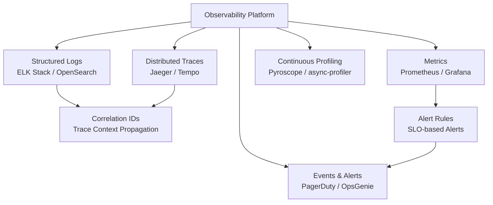

# 12 — Observability: Social Media Feed System

## Objective

Define the full observability strategy — structured logging, distributed tracing, metrics, alerting, SLI/SLO/SLA definitions, and dashboards. Observability is the ability to understand system behavior from its outputs. Without it, a large distributed system is a black box.

---

## Observability Pillars



---

## Structured Logging

### Log Format (JSON)

All services emit structured JSON logs — no free-text log statements:

```json
{
  "timestamp": "2026-05-18T10:30:00.123Z",
  "level": "INFO",
  "service": "feed-read-service",
  "instance": "feed-read-service-pod-7d8f9c-xyz",
  "trace_id": "4bf92f3577b34da6a3ce929d0e0e4736",
  "span_id": "00f067aa0ba902b7",
  "user_id": "user-uuid-abc",
  "request_id": "req-xyz-123",
  "event": "feed_read_served",
  "latency_ms": 45,
  "cache_hit": true,
  "tweet_count": 20,
  "cursor": "eyJ0d2VldF9pZCI6IjEyMzQ1NiJ9",
  "region": "us-east-1",
  "version": "v2.3.1"
}
```

**Why no free-text logs?**: Structured logs enable:
- Efficient log querying (`level:ERROR AND service:fanout-service`)
- Automatic metric extraction from logs
- Log aggregation without custom parsing
- Correlation between logs from different services via `trace_id`

### Log Levels and Policy

| Level | When to use | Example |
|---|---|---|
| ERROR | System state is degraded; action required | Cassandra write failed after 3 retries |
| WARN | Unusual condition, not immediately harmful | Cache miss rate > 10% |
| INFO | Normal operational events | Feed served to user, tweet created |
| DEBUG | Diagnostic detail (disabled in production) | Fanout batch of 1000 written to Redis |

**Production log level**: INFO. DEBUG is enabled only per-service via dynamic config (no redeployment needed) for incident investigation.

### Sensitive Data in Logs

- Never log: email addresses, passwords, phone numbers, full JWT tokens
- Anonymize: user IDs are logged as-is (needed for debugging); IP addresses are truncated to /24 subnet
- Truncate: tweet content logged only to first 50 chars in logs

---

## Distributed Tracing

### Why Distributed Tracing?

A single feed read touches: API Gateway → Feed Read Service → Redis → (cache miss) → Cassandra → Tweet Hydration Service → Response. A slow request could be slow at any of these 6 hops. Without tracing, identifying where latency originates requires log correlation across 5 services.

### OpenTelemetry Implementation

All services instrument with the OpenTelemetry SDK:
- Automatic instrumentation for HTTP requests, gRPC calls, Redis operations, Cassandra queries
- Manual spans for business operations (fanout batch, timeline merge, celebrity injection)
- Context propagation via W3C `traceparent` header across all HTTP/gRPC calls

### Trace Example: Slow Feed Load

```
Trace ID: 4bf92f3577b34da6a3ce929d0e0e4736
Total duration: 342ms (p99 threshold: 200ms) ← SLOW

├── API Gateway (10ms)
│   └── JWT validation (8ms)
├── Feed Read Service (320ms)
│   ├── Redis timeline read (3ms) ← cache hit
│   ├── Celebrity timeline read ×5 (15ms) ← 5 celebrities followed
│   ├── Merge sort (2ms)
│   ├── Tweet hydration - Redis (12ms) ← 18/20 tweets in cache
│   ├── Tweet hydration - Cassandra (280ms) ← 2 CACHE MISSES → slow
│   └── Response serialization (8ms)
└── API Gateway response (2ms)

Root cause: 2 cache misses hitting Cassandra added 280ms
Action: Increase tweet object cache TTL from 48h to 72h
```

### Sampling Strategy

At 100K requests/sec, tracing every request would overwhelm the tracing backend.

```
Sampling strategy: Tail-based sampling
- Sample 100% of requests with p99 latency > 200ms (slow requests)
- Sample 100% of requests that returned errors (5xx)
- Sample 1% of all other requests (normal traffic)
- Always trace requests from internal testing users
```

Tail-based sampling (decision made after request completes) captures all interesting requests without the 100% overhead.

---

## Metrics and Dashboards

### Key Service Level Indicators (SLIs)

**Feed Read Service**:
```
Availability SLI:    (successful_requests / total_requests) × 100
                     Success = HTTP 200/201/202
                     Failure = HTTP 5xx

Latency SLI:         p99 latency < 200ms
                     measured as: 
                     histogram_quantile(0.99, rate(http_request_duration_seconds[5m]))

Cache Hit Rate SLI:  (cache_hits / (cache_hits + cache_misses)) × 100
                     Target: > 95%
```

**Fanout Service**:
```
Fanout Lag SLI:      kafka_consumer_group_lag < 50,000 messages
Fanout Error Rate:   (failed_fanouts / total_fanouts) × 100 < 0.01%
```

### SLO Definitions

| Service | SLO | Burn Rate Alert |
|---|---|---|
| Feed Read | 99.9% requests return in < 200ms | Alert when error budget burns at 5× normal rate |
| Tweet Creation | 99.95% success rate | Alert when error budget burns at 10× normal rate |
| Feed Availability | 99.99% successful responses | Alert immediately at any elevated error rate |
| Fanout Lag | 95% of tweets appear in feed within 5 seconds | Alert when lag > 50K messages |

### Error Budget Concept

If Feed Read has a 99.9% SLO for latency, the error budget is 0.1% of requests.
At 100K requests/sec = 8.64 billion requests/day:
- Allowed slow requests: 8.64M per day
- At current burn rate (say 0.05%): using half the budget — safe
- If burn rate suddenly spikes to 2%: burning 20× faster than allowed — immediate alert

### Prometheus Metrics Catalog

**Feed Read Service metrics**:
```
feed_read_requests_total{status, region, version}
feed_read_latency_seconds{quantile}  (histogram)
feed_read_cache_hits_total{cache_type}   (timeline|tweet|celebrity)
feed_read_cache_misses_total{cache_type}
feed_read_celebrity_merge_duration_seconds (histogram)
feed_read_tweet_hydration_batch_size (histogram)
```

**Fanout Service metrics**:
```
fanout_tasks_processed_total{status}
fanout_tasks_failed_total{reason}
fanout_redis_write_latency_seconds (histogram)
fanout_cassandra_write_latency_seconds (histogram)
fanout_followers_per_tweet (histogram)
kafka_consumer_group_lag{group, topic, partition}
```

**Tweet Service metrics**:
```
tweet_creation_requests_total{status}
tweet_creation_latency_seconds (histogram)
tweet_outbox_queue_depth (gauge)
tweet_moderation_queue_depth (gauge)
```

---

## Alerting Strategy

### Alert Priority Levels

| Level | Response Time | Example |
|---|---|---|
| P1 - Critical | Immediate page | Feed Read success rate < 99%, Tweet writes failing |
| P2 - High | 15 minutes | Fanout lag > 500K messages, Redis shard failure |
| P3 - Medium | 1 hour | Cache hit rate < 90%, slow query warnings |
| P4 - Low | Next business day | Disk usage > 70%, minor latency regression |

### Alert Fatigue Prevention

**Good alert**: "Feed Read p99 latency exceeded 200ms for 5 consecutive minutes"  
**Bad alert**: "Feed Read responded in 250ms" (single spike, not sustained)

All alerts require:
1. Duration threshold (sustained for N minutes, not a momentary spike)
2. Clear runbook link in the alert description
3. Owner assignment (which team responds)
4. Auto-resolution when condition clears

### SLO-Based Burn Rate Alerts

Prefer SLO burn rate alerts over individual metric alerts:

```
Alert: "FeedRead error budget burn rate is 5× normal"
Condition: rate of error budget consumption = 5× the acceptable rate
Meaning: At this pace, the monthly error budget will be exhausted in 6 days
Action: Investigate proactively, before users are impacted at scale
```

---

## Dashboards

### Dashboard 1: Production Health Overview

```
Row 1: Service Health
  - Feed Read: RPS, Success Rate, p50/p99 Latency
  - Fanout: Events/sec, Lag, Error Rate
  - Tweet Creation: RPS, Success Rate

Row 2: Cache Health
  - Redis: Hit Rate per cache type, Memory Usage, Connected Clients
  - Cache Miss Rate Trend (last 24h)

Row 3: Database Health
  - Cassandra: Read/Write Latency, Pending Operations, Node Status
  - PostgreSQL: Active Connections, Replication Lag, Query Latency p99

Row 4: Kafka Health
  - Consumer Lag per Group (timeline)
  - Messages In/Out per Topic
  - Under-replicated Partitions
```

### Dashboard 2: Feed Quality Dashboard

```
Row 1: Feed Metrics
  - Average tweets delivered per feed request
  - Celebrity injection rate (% of feeds with celebrity tweets)
  - Pull path fallback rate (% of feeds served from Cassandra cold path)
  - Cursor error rate (expired/invalid cursors)

Row 2: Fanout Metrics
  - Time from tweet creation to fan-out completion (p50, p99)
  - Fanout write errors by type (Redis, Cassandra)
  - Celebrity vs Regular fanout ratio

Row 3: User Experience
  - Feed load latency by region
  - Error rate by API endpoint
  - Mobile vs Web latency comparison
```

### Dashboard 3: Trending and Discovery

```
- Trending hashtag velocity (hashtags per minute breaking into trending)
- Search query volume and latency
- Recommendation click-through rate
```

---

## Observability Stack

| Component | Tool | Purpose |
|---|---|---|
| Log aggregation | ELK Stack (Elasticsearch + Logstash + Kibana) | Log storage, search, visualization |
| Metrics collection | Prometheus | Pull-based metrics scraping |
| Metrics visualization | Grafana | Dashboards, alerts |
| Distributed tracing | Jaeger + OpenTelemetry | End-to-end request tracing |
| Alert routing | PagerDuty | On-call rotation, escalation |
| Continuous profiling | Pyroscope | CPU/memory profiling in production |
| Synthetic monitoring | Checkly | External uptime monitoring every 30 seconds |
| Error tracking | Sentry | Application exception aggregation |

---

## Correlation IDs

Every request entering the system receives a unique `request_id` (UUID). This ID is:
- Propagated to all downstream service calls via HTTP headers (`X-Request-ID`)
- Embedded in all log lines for the request's lifecycle
- Embedded in the OpenTelemetry trace context

When debugging a user complaint ("my feed was slow at 10:30am"), the support team can search logs for the request_id → immediately see every log line across all services for that request.

---

## Interview-Level Discussion Points

1. **The difference between monitoring and observability**: Monitoring checks predefined metrics (is service up? is latency normal?). Observability is the ability to ask arbitrary questions about system behavior without predefined dashboards. Structured logs + distributed traces enable observability.

2. **Why SLO-based alerts are better than threshold alerts**: A single slow request is noise. Burning 5× the error budget is actionable. SLO-based alerts reduce alert fatigue and focus attention on things that actually affect users.

3. **Cardinality explosion in Prometheus**: Adding `user_id` as a Prometheus label would create 500M unique time series — Prometheus would OOM. Labels must be low-cardinality (region, status_code, service). User-level data goes in logs and traces, not metrics.

4. **The "works on my machine" problem**: Continuous profiling in production catches performance issues that only appear under real load. async-profiler (Java) can sample CPU and allocation profiles from production JVMs with < 1% overhead.

5. **On-call rotation and runbooks**: Every P1/P2 alert must have a runbook: a step-by-step guide for the on-call engineer. The runbook should be automatable — if a human follows the same steps every time, it should become a self-healing automated action.
