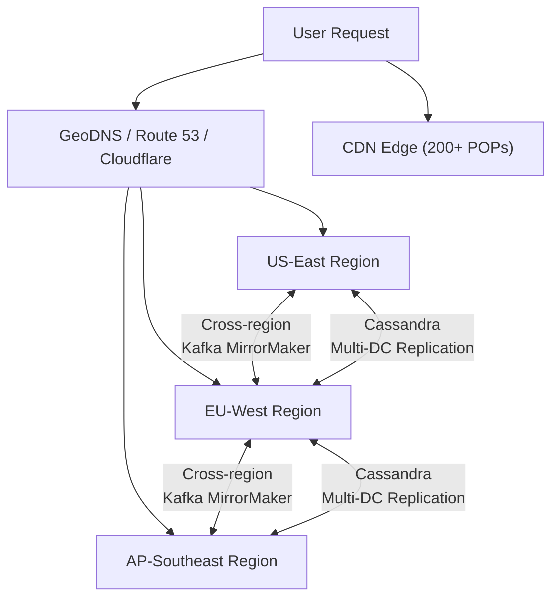
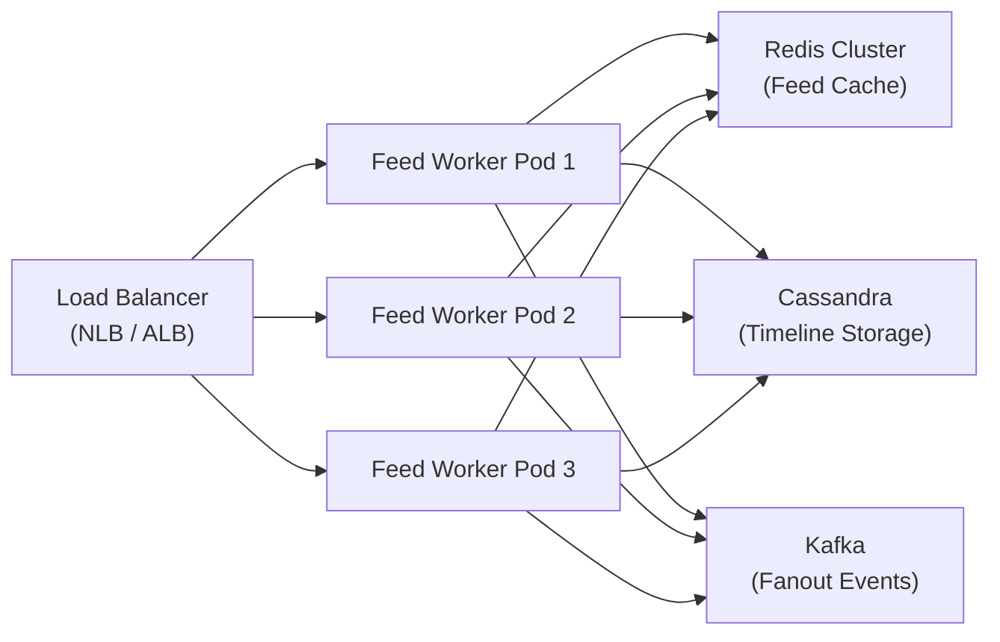
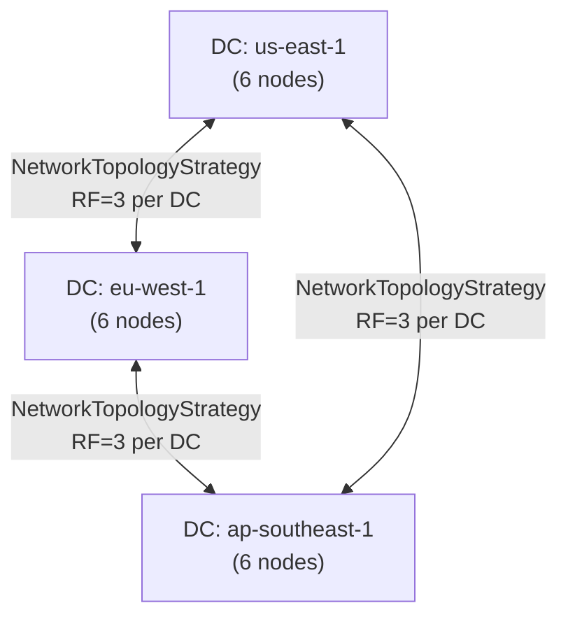
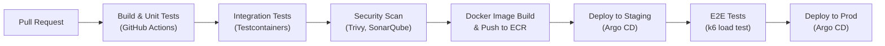
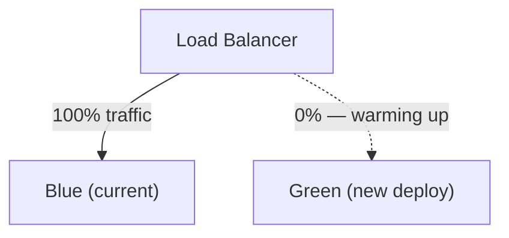

# 13 — Deployment Architecture

## Objective

Define the production deployment topology for a Social Media Feed system serving 500M users and 300M DAU across multiple global regions. This document covers multi-region strategy, container orchestration, CDN integration, data replication, CI/CD pipelines, disaster recovery, and local development setup.

---

## Multi-Region Topology

### Region Selection

| Region | Location | Primary Responsibility | Users Served |
|---|---|---|---|
| us-east-1 | Virginia, USA | Primary writes, US traffic | ~140M DAU |
| eu-west-1 | Ireland, EU | EU traffic, GDPR isolation | ~80M DAU |
| ap-southeast-1 | Singapore, Asia-Pacific | APAC traffic | ~80M DAU |

### Traffic Routing Strategy

- **GeoDNS** routes users to the nearest region by default.
- **Latency-based routing** overrides GeoDNS for edge cases where a closer region has degraded performance.
- **Anycast** is used for CDN POPs — media assets are served from 200+ edge locations globally, not just the three primary regions.



---

## Kubernetes Architecture

### Cluster Design Per Region

Each region runs dedicated Kubernetes clusters split by concern:

```
Region: us-east-1
├── k8s-cluster-feed         (feed read/write services)
├── k8s-cluster-media        (media upload, transcoding)
├── k8s-cluster-data         (Kafka, Cassandra operators, Redis)
└── k8s-cluster-platform     (Istio, observability, CI runners)
```

**Why separate clusters?** Blast radius isolation. A bad deploy to the feed cluster cannot take down the media pipeline. Kafka and Cassandra operators are stateful and require different node pools (high-memory, local NVMe SSDs) than stateless feed workers.

### Node Pool Strategy

| Node Pool | Instance Type | Workloads | Autoscaling |
|---|---|---|---|
| feed-workers | c6i.2xlarge (CPU-optimized) | Feed fanout workers, API pods | HPA on CPU/RPS |
| ml-ranking | g4dn.2xlarge (GPU) | Ranking inference pods | HPA on queue depth |
| cache-ops | r6i.4xlarge (memory-optimized) | Redis Sentinel controllers | Manual, no autoscale |
| kafka-brokers | i3en.2xlarge (storage-optimized) | Kafka broker pods | Manual capacity planning |
| cassandra-nodes | i3en.6xlarge (NVMe SSD) | Cassandra StatefulSets | Manual ring expansion |

### Stateless Feed Workers

Feed API pods are fully stateless. All state lives in Cassandra (timelines), Redis (precomputed feeds, follow graph cache), or Kafka (event stream).



**HPA Configuration**: Feed workers autoscale on two signals — CPU utilization (target: 70%) and custom metric `feed_request_queue_depth` from Kafka consumer lag. Minimum replicas = 20 per region; maximum = 200.

---

## Redis Cluster Topology Per Region

### Architecture

Each region runs a Redis Cluster (not Redis Sentinel) for the precomputed feed cache:

- **6 primary shards**, each with **2 replicas** = 18 Redis nodes per region.
- Shards are distributed across 3 availability zones (2 primaries + 4 replicas per AZ).
- Total memory per region: ~2.4 TB (18 × ~140 GB nodes using r6g.4xlarge).

### Data Segregation

| Redis Cluster | Purpose | Eviction Policy |
|---|---|---|
| feed-timeline | Precomputed feed sorted sets per user | allkeys-lru |
| follow-graph | Cached follow/follower sets | allkeys-lru |
| rate-limiting | Token bucket counters per user/IP | volatile-ttl |
| trending-cache | Top-K trending topics | volatile-ttl |

**Why separate clusters?** Different eviction policies and memory profiles. Mixing LRU timeline cache with rate-limiting TTL keys causes eviction policy conflicts and unpredictable memory behavior under pressure.

### Cross-Region Consideration

Redis is NOT replicated cross-region. Each region maintains its own feed cache. On a region failover, feeds are rebuilt from Cassandra (cold cache rebuild). This is acceptable — stale or empty feed on failover is a UX degradation, not a data loss event.

---

## Cassandra Multi-DC Replication



- **Replication Factor**: 3 per DC (total 9 replicas per row globally).
- **Consistency Level for reads**: `LOCAL_QUORUM` — reads from 2 of 3 nodes in local DC. Avoids cross-region latency on reads.
- **Consistency Level for writes**: `LOCAL_QUORUM` — write confirmed by 2 of 3 in local DC, then async-replicated cross-region.
- **Tradeoff**: Cross-region replication is asynchronous. A user's timeline written in us-east may take 50–200ms to appear in eu-west. This is acceptable for a social feed use case.

---

## Kafka Cross-Region Mirroring

### MirrorMaker 2 Topology

Kafka clusters run independently per region. MirrorMaker 2 (MM2) replicates select topics cross-region:

| Topic | Mirrored? | Reason |
|---|---|---|
| tweet.created | Yes — all regions | Feed fanout workers in every region need new tweets |
| user.followed | Yes — all regions | Follow graph must be consistent globally |
| feed.fanout.requests | No — regional only | Fanout is handled locally per region |
| moderation.queue | Yes — to us-east-1 | Central moderation team operates from us-east |

**Why not full mirror?** Cross-region bandwidth is expensive. Topics like `feed.fanout.requests` generate 100K+ messages/second and are region-local. Mirroring them cross-region would cost ~$50K/month in egress with zero benefit.

---

## CDN Architecture

### Media Delivery

- **Provider**: Cloudflare CDN (primary) with AWS CloudFront as fallback.
- **Origin**: S3-compatible object storage (S3 in us-east, replicated via CRR to eu-west and ap-southeast).
- **Cache TTL**: Profile images — 7 days. Tweet images — 30 days. Videos — 24 hours (re-fetch for updates).
- **Signed URLs**: Media is served via signed URLs with 1-hour expiry to prevent hotlinking.

### Static Assets

Frontend React bundles, fonts, and icons are served entirely from CDN. No origin requests for static assets after initial cache warm.

### CDN Purge Strategy

On tweet deletion or content moderation takedown, a purge job fires against all CDN edges. Cloudflare's purge API can clear 1000 URLs in <500ms. For large purges (viral tweet with millions of cached variants), a tag-based purge is used.

---

## CI/CD Pipeline



### Tooling

| Stage | Tool | Notes |
|---|---|---|
| Source Control | GitHub | Trunk-based development |
| CI Runner | GitHub Actions | Self-hosted runners on k8s |
| Image Registry | AWS ECR | Per-region mirroring |
| GitOps | Argo CD | Declarative K8s deployments |
| Secrets | HashiCorp Vault | Injected at pod startup via sidecar |
| Load Testing | k6 | Run on staging before every prod deploy |

---

## Deployment Strategies

### Blue-Green for Feed Service

The feed read service uses **blue-green deployment**:

- Two identical production environments (blue and green) run in parallel.
- Load balancer switches 100% of traffic from blue → green in one atomic operation.
- Rollback = flip the load balancer back to blue. Takes <30 seconds.
- **Why blue-green for feed service?** Feed reads are the most latency-sensitive path. Any partial rollout with degraded performance affects all users. Blue-green gives a clean cutover with instant rollback.



### Canary for Ranking Service

The ML ranking service uses **canary deployment**:

- 1% → 5% → 20% → 50% → 100% traffic shift over 24 hours.
- Automated rollback triggers on: p99 latency > 200ms, error rate > 0.1%, ranking quality score drop > 5%.
- **Why canary for ranking?** Ranking changes affect user experience in subtle ways that are impossible to detect in staging. A canary lets real user engagement metrics (CTR, dwell time) validate the new model before full rollout.

---

## Disaster Recovery

### RTO and RPO Targets

| Component | RTO | RPO | Strategy |
|---|---|---|---|
| Feed Service | < 2 min | 0 (stateless) | K8s self-healing, multi-AZ |
| Cassandra | < 5 min | < 30 sec | Multi-DC, LOCAL_QUORUM writes |
| Redis Cache | < 10 min | Acceptable loss | Cold rebuild from Cassandra |
| Kafka | < 5 min | < 1 min | Multi-AZ ISR, cross-region MM2 |
| Media (S3) | < 1 min | 0 | S3 Cross-Region Replication |

### Region Failover Runbook

1. GeoDNS health check detects us-east-1 failure (30-second probe interval).
2. Traffic automatically reroutes to eu-west-1 and ap-southeast-1.
3. Cassandra LOCAL_QUORUM continues serving from remaining DCs.
4. Redis cache in surviving regions is warm (no cross-region dependency).
5. Kafka MM2 ensures no tweet events are lost — surviving regions consume from replicated topics.
6. Alert fires to on-call team. Manual verification before declaring region healthy again.

---

## Local Development Setup

### Docker Compose Stack

Local dev runs a trimmed stack using Docker Compose:

| Service | Local Replacement | Notes |
|---|---|---|
| Cassandra (3-DC cluster) | Single-node Cassandra | No replication, same schema |
| Redis Cluster (18 nodes) | Redis single-node | Same commands, no cluster |
| Kafka (multi-broker) | Single-broker Kafka + Zookeeper | Full topic structure |
| Feed workers (K8s) | Docker Compose services | Same JARs, different config |
| CDN | Local Nginx | Static file serving only |

### Dev vs Prod Config

All environment-specific config is externalized via Spring Boot profiles:

- `application-local.yml` — H2 or local Postgres, no Kafka, no Redis cluster.
- `application-staging.yml` — Real Cassandra/Redis/Kafka, staging credentials from Vault.
- `application-prod.yml` — Prod credentials, strict rate limits, full observability.

---

## Tradeoffs

| Decision | Benefit | Cost |
|---|---|---|
| Blue-green for feed service | Zero-downtime, instant rollback | Doubles infra cost during deployment |
| Redis not replicated cross-region | Avoids complexity, saves cost | Cold start on region failover |
| LOCAL_QUORUM for Cassandra | Low read/write latency | Cross-region data lag up to 200ms |
| Separate K8s clusters per concern | Blast radius isolation | More clusters to manage, higher ops cost |
| Canary for ranking | Safe ML rollout with real metrics | Slower rollout, more rollout tooling needed |

---

## Interview Discussion Points

- **Why not active-active writes globally?** Cassandra LOCAL_QUORUM means writes succeed in one DC first, replicated async. True active-active with strong consistency would require GLOBAL_QUORUM, tripling write latency. Not worth it for a feed system where eventual consistency is acceptable.
- **How do you handle split-brain between regions?** For feed data (Cassandra), last-write-wins with timestamps. For financial data (not in feed system), this would be unacceptable — saga pattern or single-region writes required.
- **What breaks first in this deployment?** Redis cache eviction under extreme write load. If a celebrity posts a viral tweet and 50M users fetch their feed simultaneously, Redis sorted sets for 50M users may evict hot entries. Mitigated by pull-on-miss from Cassandra with circuit breaker to prevent thundering herd.
