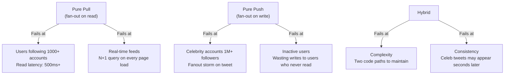

# 14 — Interview Discussion Points

## Objective

Prepare for senior and staff-level system design interviews on the Social Media Feed problem. This document covers expected interviewer follow-up questions, deep-dive tradeoff discussions, common candidate mistakes, and staff-level talking points that distinguish senior from principal/staff answers.

---

## The Celebrity / Hot User Problem — Full Tradeoff Discussion

This is the most important question in any social feed interview. The interviewer will probe this at length.

### The Problem

A user with 50M followers posts a tweet. With a pure **push fanout** model, your system must write to 50M Redis sorted sets within seconds. At 50M writes × ~500 bytes = 25 GB of data, written in seconds. This overwhelms your fanout workers.

### The Three Models

| Model | How It Works | Breaks When | Best For |
|---|---|---|---|
| **Pull (fan-out on read)** | Feed assembled at read time by fetching tweets from all followees | User follows 5,000 accounts — query merges 5,000 tweet lists at read time | Read-heavy at scale; p99 latency explodes |
| **Push (fan-out on write)** | On tweet, write to every follower's precomputed feed | Celebrity with 50M followers — 50M writes per tweet | Normal users with < 10K followers |
| **Hybrid** | Push for normal users, pull for celebrities at read time | Inconsistent UX: some users see the celebrity's tweet seconds later than others | Twitter-scale systems |

### How Twitter Actually Solved It

Twitter uses a hybrid model with a **celebrity threshold** (approximately 1M followers in public descriptions, though exact threshold varies). The mechanics:

1. A celebrity posts a tweet.
2. The tweet is written to the **celebrity's own tweet timeline** in Cassandra (not pushed to followers).
3. For non-celebrity accounts, fanout workers push tweet IDs to followers' Redis sorted sets immediately.
4. When a user loads their feed, the system takes their precomputed Redis feed (from non-celebrity followees) and **merges it at read time** with the latest tweets from any celebrities they follow.
5. The merge is a sorted merge of at most N celebrity timelines — bounded and fast.

**Key insight**: If a user follows 10 celebrities, the read-time merge fetches 10 timelines and merges them. This is O(10 × recent_tweets) — trivially fast. The problematic case (pure pull over 5,000 followees) is eliminated.

### Follow-Up Questions the Interviewer Will Ask

**Q: What's your celebrity threshold? How do you handle accounts growing from 900K to 1.1M followers?**

Answer: The threshold is a soft boundary. Accounts above the threshold are tagged in a user metadata store (Redis or Postgres). When a user crosses the threshold, their account type changes and future tweets skip fanout workers. Existing pushed entries remain in follower feeds — no retroactive cleanup needed. The transition has a brief inconsistency window (some followers still have old pushed entries, new followers pull dynamically). This is acceptable.

**Q: What if a celebrity follows another celebrity?**

Answer: This is the "Lady Gaga follows Justin Bieber" problem. If both celebrities follow each other, their mutual tweets need to appear in each other's feeds. Since neither uses push fanout, reads must handle the celebrity-follows-celebrity case in the merge step. The read path checks: for each celebrity the requesting user follows, fetch their recent tweets. This handles the chain.

**Q: What about a power user (not a celebrity) who follows 10,000 accounts?**

Answer: The hybrid model doesn't help here — the user has 10,000 followees, not 10,000 followers. Their feed is assembled from 10,000 push-written Redis entries, which is fine (read is O(1) against a sorted set). The bottleneck was the write fan-out for celebrities, not the read fan-in for power users.

---

## Push vs Pull vs Hybrid — When Each Breaks

---

## Feed Consistency Tradeoffs

### Eventual vs Strong Consistency for Feeds

| Consistency Model | Latency | User Experience | Use Case |
|---|---|---|---|
| Strong | High (multi-node quorum) | All users see same feed state | Financial ledgers, not feeds |
| Eventual (our choice) | Low (LOCAL_QUORUM per DC) | Users may see slightly different feeds | Social feeds — acceptable |
| Causal | Medium | User sees their own writes immediately | Comments, replies — critical |

**The "read your own writes" problem**: If a user tweets and immediately reloads their feed, they must see their own tweet. This is a causal consistency requirement, not a global consistency requirement. Solution: on feed assembly, always check the requesting user's own tweet history and merge it in, bypassing the potentially-stale cached feed.

---

## "What Would Break First at 10x Scale?" Analysis

Starting scale: 300M DAU, 100K tweets/second.
10x scale: 3B DAU, 1M tweets/second.

| Component | Current Headroom | What Breaks at 10x |
|---|---|---|
| Redis fanout writes | 100K tweets/sec × avg 200 followers = 20M writes/sec | At 200M writes/sec, Redis write throughput ceiling hit. Need more shards. |
| Cassandra write path | Handles ~500K writes/sec per DC | At 5M writes/sec, need 10x more nodes. Manageable, but expensive. |
| Kafka fanout topic | 100K msgs/sec, 50 partitions | At 1M msgs/sec, need 500 partitions. Consumer group lag becomes issue. |
| Celebrity merge at read time | 10 celebrities × 100 tweets = fast | If celebrity tweet velocity increases 10x, merge reads become heavier. |
| Trending computation | Count-Min Sketch in memory | At 10x tweet volume, sketch error rate increases. Need more hash functions/wider table. |
| Feed ranking inference | 100ms p99 per request | ML model inference doesn't scale linearly — need GPU-backed inference fleet. |

**Answer to "what breaks first"**: Redis fanout write throughput is the most immediate bottleneck. At 10x, the write amplification from fanout (200M writes/sec) requires either (1) lowering the celebrity threshold to reduce fanout scope, (2) adding Redis shards, or (3) introducing a write-coalescing layer that batches Redis writes before flushing.

---

## Ranking Algorithm Tradeoffs

### Chronological vs ML Ranking

| Dimension | Chronological | ML Ranking |
|---|---|---|
| Latency | O(1) — sorted by timestamp | 50–200ms inference overhead |
| Explainability | Perfect — user knows why | Black box — hard to explain |
| Engagement | Lower — users miss relevant content | Higher — 30-40% more engagement (Twitter data) |
| Gaming | Hard to game | Easily gamed if features are known |
| Infrastructure | Zero extra infra | Needs feature store, training pipeline, inference fleet |
| Cold start | Works for day-1 users | Poor for users with no history |
| Recourse | None needed | Users want "why am I seeing this?" |

**Staff-level answer**: The right approach is a **dual mode**. Offer users chronological as a choice (Twitter/X's "For You" vs "Following" tabs). Default new users to chronological until enough interaction data exists to build a ranking signal. ML ranking only activates when the user has sufficient history (e.g., 100+ interactions). This avoids the cold-start problem while maximizing long-term engagement.

---

## Common Candidate Mistakes

| Mistake | Why It's Wrong | Correct Approach |
|---|---|---|
| Designing microservices on day 1 | Premature decomposition before understanding domain boundaries | Start with modular monolith, split when team/scale demands it |
| Using a single Redis instance | Single point of failure, memory ceiling at ~128GB | Redis Cluster with 6+ shards from the start |
| Forgetting inactive users | Pushing to 50M followers includes 40M inactive users — wasted writes | Mark users inactive after 30 days, skip fanout for them |
| Missing cursor-based pagination | Offset pagination breaks on sorted feeds (inserts shift positions) | Always use cursor/token pagination for feeds |
| Strong consistency for all writes | Adds 3–5x latency overhead for no benefit on a social feed | LOCAL_QUORUM per DC; eventual consistency cross-region |
| Using Postgres for timelines | Relational DB not optimized for append-heavy, wide-row time-series | Cassandra or DynamoDB for timeline storage |
| No back-of-envelope calculation | Interviewer can't assess if design is right-sized | Always start with RPS, storage, bandwidth estimates |
| Ignoring GDPR deletion | "We'll just soft-delete" — insufficient for GDPR | Right to erasure requires cascading deletes from all feeds, Kafka tombstones |

---

## Senior Engineer Talking Points

### Fanout Optimization

- **Batching**: Fanout workers process tweet events in micro-batches (100ms windows) using Kafka consumer groups. Instead of 1 Redis command per follower, pipeline 1000 ZADD commands in a single batch. Reduces per-tweet network roundtrips by 99%.
- **Lazy fanout for offline users**: Check user's last-active timestamp before writing to their feed Redis key. If the user has been offline for 48 hours, skip the Redis write. On next login, rebuild their feed from Cassandra. Reduces unnecessary writes by 30–40%.
- **Feed truncation**: Redis sorted sets for feed timelines are capped at 1000 entries (configurable). ZREMRANGEBYRANK trims old entries on each write. Prevents unbounded memory growth.

### Cache Eviction Strategy

- LRU eviction on the feed cache means recently-inactive users' feeds are evicted first. This is correct behavior — active users always have hot cache.
- **Thundering herd on cache miss**: If a viral event causes 1M users to have their cache miss simultaneously, 1M concurrent Cassandra reads could overwhelm the database. Mitigated by: (1) request coalescing — first request rebuilds, others wait on the same future, (2) probabilistic early expiration (PER) — proactively refresh feed before TTL expires.

---

## Staff Engineer Talking Points

### ML Ranking Pipeline

A production ML ranking pipeline for feeds has multiple stages:

1. **Candidate generation** (retrieval): Narrow 1000+ eligible tweets down to 500 candidates using fast approximate models (embedding similarity, follow graph BFS).
2. **Feature computation** (feature store): Enrich each candidate with user engagement history, account trust score, content features (media type, topic classification). Features served from a low-latency feature store (Redis + Feast).
3. **Scoring** (inference): Two-tower model or gradient-boosted trees score each candidate. GPU inference with ONNX Runtime. p99 < 100ms.
4. **Business rules** (post-ranking): Hard rules applied after ML scoring — diversity injection (no more than 3 consecutive tweets from same account), promoted content injection at fixed positions, blocked account filtering.

### Anti-Spam and Bot Detection at Scale

- **Behavioral signals**: Bot accounts exhibit machine-like patterns — fixed inter-tweet intervals, high reply velocity, no organic engagement. Signal computed in streaming fashion via Flink or Kafka Streams.
- **Graph analysis**: Coordinated inauthentic behavior (CIB) detected by analyzing follow graph clusters. Accounts that follow each other in lock-step within a short time window are flagged.
- **Velocity limits**: Accounts tweeting more than 200 times/hour are rate-limited and flagged for review. Implemented as a sliding window counter in Redis.

### Trending Topic Detection

- **Count-Min Sketch** for approximate frequency counting of hashtags/keywords over a sliding 1-hour window. Memory-efficient — can track millions of terms in a few MB of memory.
- **Heavy hitters algorithm** (SpaceSaving or Lossy Counting) identifies top-K trending topics. Applied on top of Count-Min Sketch output.
- **Locality**: Trending is geo-localized. A topic trending in Tokyo may not be trending in New York. Separate sketches per geographic cell (country or metro area).
- **Spam trending**: Bad actors attempt to artificially trend a hashtag by coordinating thousands of accounts. Mitigated by weighting tweets by account trust score in the counting algorithm (trusted accounts' tweets count more than new/low-trust accounts).

---

## GDPR: User Deletion from All Feeds

This is a common gotcha at Staff-level interviews.

### The Challenge

When a user exercises their right to erasure (GDPR Article 17), their data must be deleted from:

1. Their own profile and tweet database records.
2. Every other user's precomputed feed that contains their tweets.
3. Kafka topic event log (tweets they posted that were fanned out).
4. Cassandra timeline rows in other users' timelines.
5. CDN-cached media files.
6. Search indexes.
7. Analytics pipelines.

### Approach

| Layer | Deletion Strategy | Complexity |
|---|---|---|
| Postgres (user record) | Hard delete with FK cascades | Low |
| Cassandra (timelines) | Write tombstone with user_id as partition key | Medium — Cassandra tombstones have TTL |
| Redis (feed cache) | Background job scans and removes tweet IDs from sorted sets | High — Redis SCAN to find affected keys |
| Kafka | Kafka tombstone records (null payload with user_id key); compacted topics honor tombstones | Medium |
| S3 / CDN | S3 delete + CDN purge API | Low |
| Search index | Delete by user_id query | Low |

**Practical reality**: Full immediate deletion from all caches is operationally infeasible at scale. The pragmatic approach is to delete from the primary data store immediately (making tweets unretrievable), then run a background deletion job that cleans up cached copies over 72 hours. GDPR allows "undue delay" interpretation — this is defensible.

---

## "How Would You Evolve This System?"

### Interviewer Framing

"You've built this for 300M DAU. Now we need to support 3B DAU in 3 years. What do you change?"

### Staff-Level Answer

1. **Global write routing**: Today, writes go to the nearest region. At 3B DAU, read-your-own-writes latency becomes a problem for users whose home region and content-origin region differ. Introduce a **write router** that sends writes to the user's designated home region, with async replication outward.

2. **Feed personalization via user segmentation**: At 3B DAU, one ML model for all users is insufficient. Segment users by engagement style (passive consumers, power posters, news followers, entertainment users) and train separate ranking models per segment.

3. **Disaggregate the fanout service**: At 10x scale, the fanout service becomes a standalone distributed system with its own capacity planning. Separate fanout workers by follower count tier — celebrity fanout (pull), power user fanout (small batch), normal fanout (bulk pipeline).

4. **Edge compute for feed assembly**: Move feed assembly closer to users using edge computing (Cloudflare Workers or Lambda@Edge). Cache rendered feed payloads at CDN edge for users who haven't interacted recently.

5. **Semantic deduplication**: At 3B users, trending events cause thousands of nearly-identical tweets about the same topic. Introduce semantic deduplication in the feed using lightweight embedding similarity to avoid showing a user 10 tweets about the same news item.
