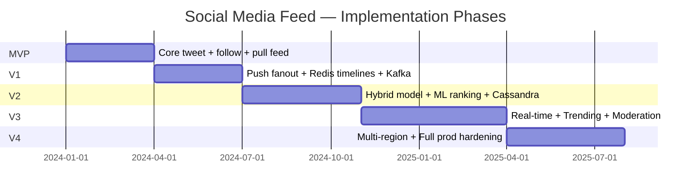
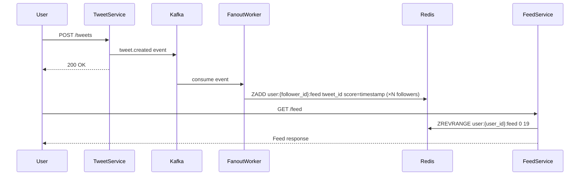
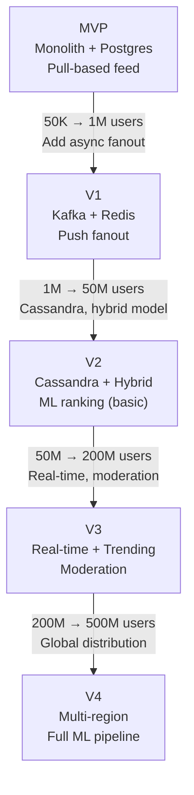

# 15 — Implementation Roadmap

## Objective

Define a phased implementation plan for the Social Media Feed system — from a working MVP to a globally-scaled, ML-ranked, multi-region production system. Each phase is designed to be shippable independently, with clear acceptance criteria, architecture evolution, infrastructure changes, risks, and team scaling considerations.

---

## Phase Overview

---

## MVP — Pull-Based Feed, PostgreSQL, Chronological Order

### Target Scale

- 50K users, 5K DAU
- Single region, single AZ
- No caching, no message queue

### Features Delivered

- User registration and authentication (JWT)
- Follow / unfollow other users
- Post tweets (text only, 280 chars)
- Pull-based home feed: query latest tweets from all followees on each page load
- Chronological ordering only
- Infinite scroll with cursor-based pagination (tweet_id as cursor)
- Basic profile page

### Architecture

- **Modular monolith**: all features in a single Spring Boot application with clear package boundaries (feed domain, user domain, tweet domain).
- **PostgreSQL** for all storage — users, tweets, follows, sessions.
- **No Redis, no Kafka, no Cassandra**.
- Feed assembled at read time: `SELECT tweets WHERE author_id IN (followee_ids) ORDER BY created_at DESC LIMIT 20`.

### Why Pull for MVP?

Write-simplicity. No fanout infrastructure. Lets the team ship a working product quickly. The N+1 query risk is real but manageable at 5K DAU. The first bottleneck will appear at ~50K DAU, giving time to migrate before it hurts.

### Infrastructure

- Single EC2 instance (m5.large) or AWS ECS task for the application.
- Single RDS Postgres (db.t3.medium) with automated backups.
- Docker Compose for local development.
- GitHub Actions for CI (lint, test, build).

### Risks

| Risk | Likelihood | Mitigation |
|---|---|---|
| Pull feed query performance | Medium | Add composite index `(author_id, created_at DESC)` on tweets table |
| PostgreSQL follow table scaling | Low | Fine for MVP scale; note migration needed at V1 |
| No rate limiting | Medium | Add basic per-user rate limiting (Spring Boot filter, in-memory token bucket) before launch |

### Team Size

2–3 engineers. One backend (Spring Boot + Postgres), one frontend (React), one shared DevOps.

### Acceptance Criteria

- User can follow/unfollow another user.
- Home feed loads within 500ms for users following up to 200 accounts.
- Cursor-based pagination returns consistent next page without duplicates.

---

## V1 — Push Fanout, Redis Timelines, Kafka Async Fanout

### Target Scale

- 1M users, 200K DAU
- Single region, multi-AZ
- Introduce caching and async processing

### Features Delivered

- Push-based fanout for all users (no celebrity threshold yet)
- Redis sorted sets for precomputed timelines
- Kafka for async fanout (tweet events consumed by fanout workers)
- Media upload support (S3 + presigned URLs)
- Basic API rate limiting via Redis token bucket
- WebSockets for real-time new tweet notification badge (not full real-time feed yet)

### Architecture Evolution

**Key change**: Feed is no longer assembled at read time. On tweet creation:
1. Tweet saved to PostgreSQL.
2. `tweet.created` event published to Kafka.
3. Fanout workers (separate service) consume the event, fetch the author's followers from Postgres, and write tweet_id to each follower's Redis sorted set (keyed by user_id, scored by created_at timestamp).
4. Feed read path: fetch top 20 tweet IDs from Redis sorted set, then multi-get tweet details from Postgres.

### Architecture Boundary

- Fanout service is a **separate module** within the monolith (or optionally extracted as a separate Spring Boot app sharing the same Kafka cluster). At V1 scale, keeping it in-process is fine. The module boundary is clean enough to extract later.
- Follow graph still stored in PostgreSQL. Fanout workers read followers via a paginated query (`SELECT follower_id FROM follows WHERE followee_id = ? ORDER BY id LIMIT 1000 OFFSET ?`).

### Infrastructure Changes

| Component | V0/MVP | V1 |
|---|---|---|
| Feed storage | PostgreSQL (read-time join) | Redis sorted sets per user |
| Tweet events | None | Kafka (3-broker, 50 partitions) |
| Media | None | S3 bucket + CloudFront CDN |
| Rate limiting | In-memory | Redis token bucket |
| Deployment | Single container | ECS or K8s with 3+ feed API pods |

### Risks

| Risk | Likelihood | Mitigation |
|---|---|---|
| Redis memory exhaustion | Medium | Cap sorted set at 1000 entries; evict with ZREMRANGEBYRANK |
| Kafka consumer lag during spike | Medium | Scale fanout worker pods; monitor consumer group lag |
| Cold start on Redis restart | Low at V1 | Rebuild from Postgres on miss; acceptable at this scale |
| Follow table becomes a hotspot | Low | Add read replica for follow graph reads |

### Team Size

4–5 engineers. Backend (2 — tweet service + fanout service), frontend (1), infrastructure (1), QA/testing (0.5).

### Acceptance Criteria

- Tweet appears in follower's Redis feed within 2 seconds of posting.
- Feed load time < 200ms (from Redis).
- Fanout worker handles 5K tweets/minute without consumer lag growing.

---

## V2 — Hybrid Fanout Model, ML Ranking, Cassandra Migration

### Target Scale

- 50M users, 10M DAU
- Multi-AZ, approaching multi-region
- Introduce celebrity threshold, Cassandra, ML ranking

### Features Delivered

- Celebrity threshold: accounts with > 100K followers skip push fanout
- Pull + merge at read time for celebrity tweets
- Cassandra for timeline storage (migrate from Redis sorted sets for durable storage)
- ML ranking pipeline (basic version): chronological as default, ML-ranked as optional
- Retweets and quote tweets
- Replies and threads
- Like/bookmark counts (approximate, via Redis HyperLogLog)
- Full-text search (Elasticsearch for tweet content)

### Architecture Evolution

**Cassandra Migration**: Redis sorted sets are ephemeral (lost on restart, bounded by memory). At 50M users, storing timelines durably requires a database built for time-series append workloads. Cassandra's `(user_id, tweet_id)` partition key with wide rows is ideal.

**Migration strategy**:
1. Write to both Redis and Cassandra in parallel (dual-write) for 4 weeks.
2. Reads shifted to Cassandra with Redis as L1 cache.
3. Validate consistency between the two stores.
4. Decommission Redis sorted sets for timelines; keep Redis for hot feed cache only (last 200 tweets per user).

**Celebrity threshold implementation**:
1. Add `is_celebrity` boolean to users table, updated by a background job.
2. Fanout worker checks this flag before writing to follower timelines.
3. Feed assembly merges Cassandra timeline with a real-time fetch from celebrity tweet timelines.

**ML Ranking Pipeline (Basic)**:
- Feature set: recency, author engagement score, content type (media vs text), prior user engagement with author.
- Model: gradient-boosted trees (XGBoost), retrained weekly from engagement logs.
- A/B test: 10% of users on ML-ranked feed, 90% on chronological. Measure 7-day engagement delta.
- Inference: offline batch scoring every 15 minutes, results written to Redis. Not yet real-time.

### Infrastructure Changes

| Component | V1 | V2 |
|---|---|---|
| Timeline storage | Redis sorted sets | Cassandra (6-node cluster) + Redis cache |
| Fanout logic | All users | Push for non-celebrities, pull for celebrities |
| Feed ranking | Chronological only | Chronological + optional ML-ranked |
| Search | None | Elasticsearch (3-node cluster) |
| Follow graph | PostgreSQL | PostgreSQL + Redis cache (for fanout workers) |

### Risks

| Risk | Likelihood | Mitigation |
|---|---|---|
| Cassandra migration data loss | Medium | Dual-write with reconciliation before cutover |
| ML model introducing bias/spam amplification | Medium | Hard rules post-ranking; human review for flagged content |
| Celebrity threshold creates gaming incentive | Low | Threshold is not public; accounts can't see their own classification |
| Elasticsearch hot shard for trending terms | Medium | Route trending term queries to dedicated index shard |

### Team Size

8–10 engineers. Backend (3 — feed service, fanout service, search service), ML (2 — ranking model + infra), infrastructure/SRE (2), frontend (2).

### Acceptance Criteria

- Celebrity tweet appears in follower feeds within 5 seconds (within SLA for pull-at-read).
- Cassandra read p99 < 50ms for timeline fetch.
- ML-ranked feed shows 15%+ engagement improvement in A/B test vs chronological.

---

## V3 — Real-Time Updates, Trending, Content Moderation

### Target Scale

- 200M users, 50M DAU
- Multi-region active-active reads, single-region writes

### Features Delivered

- Real-time feed updates via WebSockets / SSE
- Trending topics (per-country and global)
- Content moderation pipeline (automated classifier + human review queue)
- Notification service (likes, replies, follows, mentions)
- Stories / ephemeral content (24-hour TTL)
- Lists (curated follow groups with separate feeds)
- Anti-spam and bot detection (velocity-based + graph-based)

### Architecture Evolution

**Real-time feed**: A WebSocket gateway service maintains persistent connections per user. When a new tweet is fanned out and written to a user's timeline, a `feed.updated` event is published to Kafka. The WebSocket gateway consumes this event and pushes a notification to the connected user: "New tweets available." (The user must pull to refresh — the actual tweet is not pushed over WebSocket, only the signal.)

**Trending detection**: Flink streaming job consumes `tweet.created` events, maintains Count-Min Sketch per 1-hour sliding window per geography, and surfaces top-50 terms to a trending API backed by Redis. Updated every 5 minutes.

**Content moderation**: A Kafka topic `tweet.created` is consumed by a moderation classifier (Python ML service). Low-confidence predictions go to a human review queue (internal tooling). High-confidence harmful content is auto-removed and the account is flagged.

### Infrastructure Changes

| Component | V2 | V3 |
|---|---|---|
| Real-time | None | WebSocket gateway service, Kafka consumer |
| Trending | None | Flink cluster, Count-Min Sketch, trending Redis cache |
| Moderation | None | ML classifier service, human review queue |
| Notifications | None | Notification service with push (FCM/APNs) |
| Multi-region | Partial (Cassandra replication) | Full active-active reads, active-passive writes |

### Risks

| Risk | Likelihood | Mitigation |
|---|---|---|
| WebSocket connection count explosion | High | Sticky sessions on WS gateway; connection pooling |
| Trending algorithm gaming | High | Weight by account trust score; deduplicate from same source |
| Moderation classifier false positives | Medium | Human review queue; appeals process |
| Flink job lag during traffic spikes | Medium | Autoscaling Flink task managers; lag alerting |

### Team Size

20–25 engineers. 4 backend squads (feed, moderation, notifications, search), ML team (3), SRE (3), frontend (4), data platform (2).

### Acceptance Criteria

- New tweet visible to followers within 3 seconds (real-time signal).
- Trending topics updated within 5 minutes of hashtag spike.
- Moderation classifier processes 100K tweets/second with < 500ms latency.

---

## V4 — Multi-Region Full Production, Scale Hardening

### Target Scale

- 500M users, 300M DAU
- Active-active multi-region
- Full ML ranking pipeline
- Full observability and SRE runbooks

### Features Delivered

- Active-active multi-region with per-region Kafka clusters and MM2 replication
- Global feed delivery: GeoDNS, region-local Redis, Cassandra multi-DC with LOCAL_QUORUM
- Advanced ML ranking: two-tower model, real-time feature computation, GPU inference
- Ads injection into feed (position management, advertiser targeting)
- Graph-based "who to follow" recommendations
- Full GDPR compliance pipeline: right to erasure, data export
- Chaos engineering: regular GameDay exercises, Chaos Monkey on K8s
- SLO-based alerting: feed p99 < 200ms, availability > 99.99%

### Infrastructure Changes

| Component | V3 | V4 |
|---|---|---|
| Regions | 1 primary, partial replication | 3 active regions (US, EU, APAC) |
| Kafka | Single region | 3 regional clusters + MM2 |
| ML ranking | Batch, weekly retraining | Real-time features, daily retraining |
| Observability | Basic metrics | Full OpenTelemetry, SLO dashboards, runbooks |
| Compliance | Ad-hoc | Automated GDPR pipeline |

### Risks

| Risk | Likelihood | Mitigation |
|---|---|---|
| Cross-region data sovereignty (GDPR) | High | EU data never leaves eu-west-1; enforced by routing layer |
| ML ranking optimizing for engagement at expense of wellbeing | Medium | Diversity constraints; anti-addictive design guidelines |
| Cascading failure on Kafka partition leadership re-election | Low | min.insync.replicas=2; producer acks=all |
| Ads system degrading organic feed quality | Medium | Strict caps on ads density; A/B test user satisfaction |

### Team Size

50–80 engineers across squads. Product, platform, SRE, data, ML, growth, trust & safety all have dedicated teams.

---

## Architecture Evolution Summary

---

## Key Decision Points Per Phase

| Phase | Critical Decision | What Happens If You Get It Wrong |
|---|---|---|
| MVP | Cursor pagination from day 1 | Offset pagination cannot be migrated without downtime at scale |
| V1 | Redis sorted set size cap | Unbounded growth exhausts memory silently |
| V2 | Dual-write before Cassandra migration | Missing this causes data loss during cutover |
| V3 | WebSocket vs SSE for real-time | WebSocket requires sticky sessions; SSE is simpler but unidirectional |
| V4 | GDPR isolation before multi-region | Retroactively isolating data across regions is extremely costly |

---

## Overengineering Warning

A common mistake is building V3 infrastructure on day 1 "because Twitter has it." The cost:

- Kafka at MVP scale adds 3x operational complexity with zero benefit.
- Cassandra at 50K users is over-provisioned and expensive to operate.
- ML ranking at 1M users produces low-quality results (insufficient training data).

**Rule**: Introduce each component when the previous solution produces a measurable bottleneck — not in anticipation of future problems. Premature infrastructure investment wastes 6–12 months of engineering time and creates operational burden before the team has the scale to justify it.
