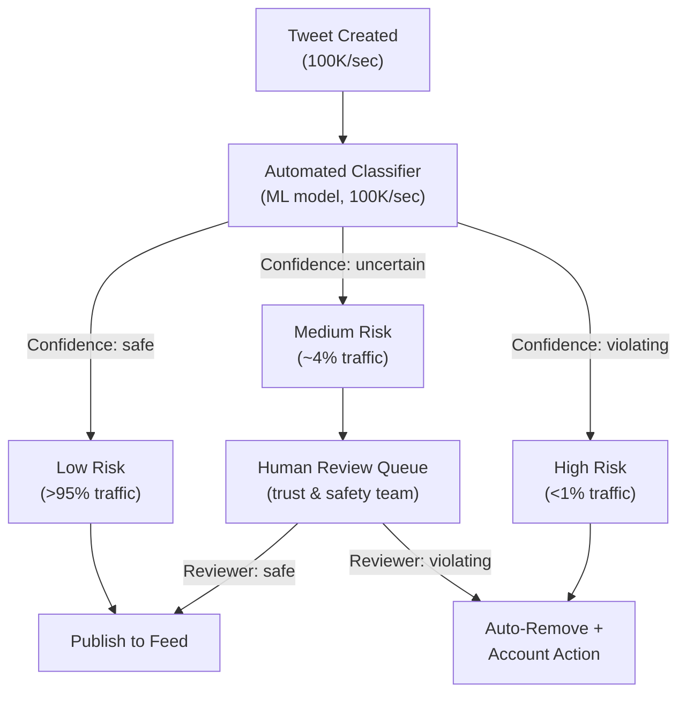

# 16 — Advanced Improvements

## Objective

Document the advanced architectural capabilities that differentiate a senior-level system design from a staff-level one. This file covers ML personalization, real-time trend detection, content moderation pipelines, anti-spam systems, ephemeral content, live audio, graph recommendations, ads injection, and a candid self-critique of the overall architecture.

---

## ML-Based Personalized Feed Ranking

### Two-Tower Model Architecture

The industry-standard approach for feed personalization at scale uses a **two-tower neural network**:

- **User tower**: encodes the user's engagement history, demographics, device type, time-of-day patterns into a dense embedding vector.
- **Item tower**: encodes tweet features — content embedding, author embedding, engagement velocity, topic labels, media type — into a dense embedding vector of the same dimension.
- **Scoring**: dot product between user and item embeddings produces a relevance score. Items ranked by this score.

The two-tower architecture's key advantage: user and item towers can be computed **independently**. User embeddings are precomputed and cached. Item embeddings are precomputed at tweet creation time. At serving time, ranking is a fast dot-product over cached vectors — no deep inference required.

### Feature Store

A feature store sits between the data pipeline and the ranking model:

| Feature Category | Examples | Latency Requirement | Storage |
|---|---|---|---|
| Real-time user features | Last 10 interactions, session context | < 10ms | Redis |
| Pre-computed user embeddings | 128-dim behavioral vector, last updated hourly | < 5ms | Redis |
| Tweet features | Like count, retweet velocity, topic labels | < 10ms | Redis + Cassandra |
| Author features | Trust score, engagement rate, category | < 5ms | Redis |
| Historical features | 30-day engagement by topic | Offline only | S3 + Hive |

**Feature drift**: Features computed offline (user embeddings) may be stale by up to 1 hour. For trending or breaking news contexts, recency features override embedding-based ranking. Real-time signals like "tweet going viral in last 10 minutes" are computed via a Kafka Streams job and pushed directly to the feature store.

### Training Pipeline

- **Offline training**: Daily batch job reads engagement logs from S3, trains gradient-boosted trees or fine-tunes the two-tower model. Training compute on GPU cluster (AWS SageMaker or Vertex AI). New model validated against held-out data and shadow-deployed before promotion.
- **Online learning**: For real-time adaptation, a lightweight model layer (logistic regression on top of frozen embeddings) can be updated continuously from a streaming label pipeline. This updates within minutes of user behavior changes.
- **Label generation**: Positive labels from engagement (like, retweet, reply, dwell time > 10s). Negative labels from skips, hides, "show less of this" actions.

### Tradeoffs

| Concern | Impact | Mitigation |
|---|---|---|
| Model optimizes for engagement, not user wellbeing | Can amplify outrage, addictive content | Diversity constraints; explicit anti-viral dampening for content flagged as divisive |
| Cold-start for new users | No history → no ranking | Fall back to chronological; use onboarding interest selection to seed initial features |
| Model staleness | Embeddings 1 hour old; trends shift in minutes | Override with real-time velocity signals |
| Explainability | Users ask "why am I seeing this?" | Feature attribution (SHAP values) powers "Why shown?" UI |

---

## Real-Time Trending Topic Detection

### Problem Statement

Identify the top-K hashtags/topics gaining significant tweet velocity over the last 1–2 hours, per geographic region, in real time. Must handle 100K tweets/second and be resistant to artificial manipulation.

### Count-Min Sketch

A **Count-Min Sketch (CMS)** is a probabilistic data structure for frequency estimation:

- `d` hash functions × `w` counter arrays (d=5, w=10,000 is typical).
- On each tweet, increment `d` counters for each hashtag in the tweet.
- To query frequency of hashtag H: take the minimum across all `d` counter arrays at positions `hash_i(H)`.
- Memory: `d × w × 4 bytes` = 5 × 10,000 × 4 = 200 KB per sketch. Can track millions of hashtags in 200 KB.

Multiple sketches run in parallel:
- One sketch per **1-hour tumbling window** (identifies trends).
- One sketch per **10-minute sliding window** (identifies spikes).
- Separate sketches per geographic cell (country, metro area).

### Heavy Hitters (Top-K)

CMS gives frequency estimates but not the top-K. The **SpaceSaving algorithm** maintains an exact list of the K most frequent items seen so far. Combined with CMS for frequency estimation, this gives top-K trending topics with bounded error.

### Anti-Gaming

Bad actors attempt to trend a hashtag by coordinating bot accounts. Mitigations:

- **Weight by account trust score**: A tweet from a high-trust account (verified, 5+ years old, organic engagement) contributes 1.0 to the sketch. A tweet from a new/low-trust account contributes 0.1.
- **Velocity anomaly detection**: A hashtag going from 0 to 10,000 mentions in 60 seconds triggers a spike detector. Such hashtags are held in a "review buffer" for 10 minutes before surfacing in trending.
- **Deduplication**: Retweets of the same original tweet do not contribute additional weight to trending calculation.

### Infrastructure

- **Flink streaming job** consumes `tweet.created` topic, maintains CMS and SpaceSaving data structures in Flink TaskManager state.
- Results published to a `trending.topics` Kafka topic every 5 minutes.
- A trending consumer updates a Redis sorted set `trending:country:{cc}` with current top-50 terms.
- Trending API reads from Redis — p99 < 5ms.

---

## Content Moderation at Scale

### The Moderation Funnel

### Classifier Pipeline

- **Multi-label classifier** runs at tweet creation time, producing scores for: spam, adult content, hate speech, violence, misinformation, self-harm.
- Model: fine-tuned transformer (DistilBERT-scale) for text; ResNet for images; ensemble for mixed-media tweets.
- Inference at 100K tweets/second requires horizontal scaling of inference workers on GPU pods. Batch inference (batches of 64 tweets) maximizes GPU throughput.
- **Latency budget**: classifier must complete within 500ms of tweet creation. Tweets are held in a "pending moderation" state during this window; they are not immediately visible in feeds.

### Human Review Queue

- Reviewers work in a dedicated internal tool that shows tweet content, account history, and classifier score.
- Priority queue: higher-severity predictions surface first.
- Appeals: users whose content is removed can appeal; appeals rejoin the human review queue with elevated priority.
- Reviewer fatigue: moderation work causes documented psychological harm. Rotation schedules, mental health support, and time limits per session are operational requirements.

### Scale Considerations

At 100K tweets/second with 1% going to human review, that is 1,000 human reviews/second = 86M per day. No human team can handle this. Practical approaches:

- **Proactive models** reduce false positives to < 0.1% (not 1%). That reduces human queue to 8.6M/day — still large.
- **Account-level context**: if 5 previous tweets from an account were removed for hate speech, the classifier threshold for this account is lowered automatically. Repeat violators face accelerated action.
- **Sampling**: for borderline cases (classifier confidence 0.4–0.6), randomly sample 10% for human review rather than reviewing all. Statistical confidence in enforcement is acceptable.

---

## Anti-Spam and Bot Detection

### Behavioral Signals

- **Inter-tweet timing**: humans tweet at irregular intervals; bots tweet at fixed sub-second intervals. A Kafka Streams job computes the coefficient of variation of inter-tweet intervals per account. Low variance → flag.
- **Content similarity**: bots frequently post near-identical content across many accounts. Locality-sensitive hashing (MinHash) detects similar tweets across accounts in real time.
- **Engagement rate anomalies**: accounts with 100K followers receiving 0 likes and 0 replies on every tweet indicate purchased/fake followers.

### Graph-Based Coordinated Detection

- **Co-follow graph analysis**: a cluster of 10,000 accounts that all follow each other within a 24-hour window (without any organic connection) indicates coordinated fake follow networks.
- **Amplification rings**: accounts that retweet each other in lock-step patterns (A retweets B within 30 seconds of B tweeting, consistently for 30 days) are flagged as a coordinated amplification network.
- Graph analysis is computationally expensive. Run as a **daily batch job** on a graph processing engine (Apache Spark GraphX or Neo4j analytics) rather than real-time.

### Rate Limiting Tiers

| Account Type | Tweets/hour | Follows/day | API calls/15min |
|---|---|---|---|
| New (< 7 days) | 10 | 50 | 100 |
| Normal | 100 | 400 | 900 |
| Verified | 300 | 1,000 | 1,500 |
| API (developer) | 2,000 (per key) | 1,000 | 1,500 |

---

## Stories / Ephemeral Content Architecture

### Design Decisions

Stories are tweets with a 24-hour TTL. Key architectural differences from regular tweets:

- **Storage**: Stories stored in a separate Cassandra table with a TTL column. Cassandra's native TTL feature automatically deletes expired rows without application logic.
- **Feed placement**: Stories appear in a dedicated horizontal scroll at the top of the feed, not in the main timeline. This is a separate feed query — not mixed with tweets.
- **View tracking**: For each story view, a view event is written to a high-throughput write path (Redis HyperLogLog for approximate view counts; exact viewers list in Cassandra for the author's view).
- **Ordering**: Stories ordered by recency and by accounts the user engages with most (ML signal).

### Ephemeral Guarantee

True deletion after 24 hours requires:
1. Cassandra TTL removes the row.
2. CDN cache is purged (story media may be cached for up to 24 hours — TTL must be aligned).
3. Search indexes do not index stories.
4. Backup snapshots containing story data must be handled per retention policy.

---

## Spaces / Live Audio Architecture

### Real-Time Audio Streaming

Spaces is a live audio feature. Architecture differs fundamentally from feed:

- **WebRTC** for peer-to-peer audio between a small group (< 10 speakers). Above 10 speakers, a **selective forwarding unit (SFU)** like mediasoup or LiveKit routes audio from speakers to listeners.
- **SFU scaling**: a single SFU server handles ~1,000 concurrent listeners per room at moderate audio quality. A Space with 100K listeners requires a distributed SFU cluster with a load-balanced media relay.
- **Recording**: audio streams are ingested to S3 via a media recording service. Stored as HLS segments for replay.
- **Discovery**: active Spaces surfaced in the feed via a separate `spaces.live` API, polled every 30 seconds or triggered via WebSocket notification.

### Why Not Kafka for Audio?

Kafka is designed for durable message streams, not real-time audio (millisecond-level latency). Audio requires UDP-based protocols (WebRTC/RTP) with jitter buffers. Kafka would add 50–200ms latency — unacceptable for live conversation.

---

## Graph-Based "Who to Follow" Recommendations

### Problem

Recommend users the requesting user does not yet follow, based on social graph proximity and shared interests.

### Approaches

| Approach | Algorithm | Quality | Compute Cost |
|---|---|---|---|
| Friends-of-friends | BFS to depth 2, ranked by mutual follow count | Medium | Low — Postgres query |
| Interest graph | Users following same accounts as you | Medium-High | Medium — set intersection |
| Graph embeddings | Node2Vec or GraphSAGE embeddings on follow graph | High | High — daily batch training |
| Collaborative filtering | "Users like you also follow X" | High | High — matrix factorization |

### Production Approach

- **Layer 1 (real-time)**: friends-of-friends query at request time. Fast, no ML.
- **Layer 2 (daily batch)**: graph embedding job generates top-100 recommendations per user, cached in Redis.
- **Ranking**: Layer 2 candidates ranked by engagement likelihood (ML model using account quality signals).

---

## Ads Injection into Feed

### Architecture

Ads are injected at feed assembly time, not at storage time. The feed service:

1. Assembles organic feed (N tweets from timeline).
2. Calls ads service to retrieve targeted ad for this user's context (targeting: demographics, interests, device, recent searches).
3. Inserts ad at a fixed position in the feed (e.g., position 3, 8, 15 — interleaved at roughly 1:7 ratio).
4. Logs impression event to analytics pipeline.

### Constraints

- Ads must not appear adjacent to sensitive content (moderation flag check before ad placement).
- Frequency capping: same ad must not appear more than 3 times per day per user. Capped via Redis counter.
- Contextual targeting: ad selection uses real-time context (current session topic) not just historical profile.

---

## Architectural Self-Critique

### Weaknesses

| Weakness | Description | Severity |
|---|---|---|
| Hybrid fanout complexity | Two code paths (push + pull) for celebrity vs normal user are a maintenance burden. Edge cases multiply: user crosses threshold mid-day, user unfollows celebrity, etc. | High |
| Redis is a single point of failure for hot feed cache | If Redis cluster loses quorum, all feed reads degrade to slow Cassandra path. p99 latency spikes from 20ms to 300ms. | High |
| Cassandra tombstone accumulation | User deletions, soft-deleted tweets, and timeline trimming generate Cassandra tombstones. Without regular compaction tuning, read performance degrades. | Medium |
| ML model feedback loop | If the ranking model amplifies certain content, that content gets more engagement, which makes the model amplify it more. A positive feedback loop with no exit condition. | High |
| Follow graph still in PostgreSQL | At 500M users with 500 follows each = 250B rows. PostgreSQL cannot serve this at write scale without heavy partitioning or migration to a dedicated graph database. | High |

### Scaling Limits

| Limit | Current Architecture Ceiling | Solution |
|---|---|---|
| Fanout write throughput | ~100M writes/sec (Redis cluster max) | Lower celebrity threshold; add more Redis shards |
| Cassandra partition size | 1B rows/partition is technically supported but degrades performance | Partition timelines by month/year: `(user_id, month)` |
| WebSocket connections | 1M connections per WebSocket gateway region | Horizontal scaling with sticky sessions via L4 load balancer |
| ML inference throughput | ~10K requests/sec per GPU pod | GPU pod autoscaling; pre-compute ranking where possible |

### Tech Debt Risks

- **Follow graph migration**: postponing the move from PostgreSQL to a graph database (Neo4j or Amazon Neptune) accumulates debt. At 500M users, the migration window narrows.
- **Monolith boundaries eroding**: as the team grows, module boundaries within the monolith drift. Services that should remain decoupled start sharing internal models. Requires active architectural governance.
- **Dual-write periods during migrations**: every Cassandra, Redis, or Postgres migration requires a dual-write period. Managing 3–4 simultaneous dual-write pipelines is operationally risky.
- **Trending algorithm**: Count-Min Sketch parameters (width, depth) were chosen at design time. As tweet volume grows, the error bounds widen. Recalibration requires redeployment of the Flink job.

---

## FAANG Interviewer Challenges and Staff+ Answers

**Challenge**: "Your hybrid model has a celebrity threshold. What happens when someone is at 999,999 followers and gains one more?"

**Staff answer**: The threshold transition is not instant. A background job recalculates celebrity status every hour. During the transition window, tweets may still be fanned out. The key insight is: this is a gradual state change, not an atomic one. The brief inconsistency (some followers getting push, others not) is invisible to users. We do not need a transactional guarantee on this threshold.

---

**Challenge**: "How do you ensure GDPR right to erasure for a user who posted a tweet that was retweeted 1 million times?"

**Staff answer**: The retweets are separate records in the database — each retweet row references the original tweet by ID. On deletion of the original tweet, we set a `deleted_at` flag in the primary tweet record. All retweet records remain, but the feed assembly layer filters out any tweet ID where the source is marked deleted. This is a **soft delete propagation** pattern. CDN purge removes cached media. Kafka compaction tombstones prevent the tweet from being re-indexed. Full removal from all caches completes within 72 hours via background job — defensible under GDPR.

---

**Challenge**: "Your ML ranking optimizes for engagement. What happens if engagement-optimized content is harmful?"

**Staff answer**: This is a real and documented problem. The ranking model must have explicit constraints beyond raw engagement. We apply: (1) a diversity penalty to prevent showing the same type of content repeatedly, (2) a "controversy dampening" score that reduces distribution for content with high negative reaction rates (unfollows, hides, "see less" signals), (3) a prohibition on amplifying content from accounts in the moderation review queue. The ranking objective function must include these business constraints, not just raw engagement CTR. Ultimately, this is not a purely technical problem — it requires editorial policy decisions that the trust and safety and product teams own.

---

**Challenge**: "You chose Cassandra for timeline storage. Why not DynamoDB or a NewSQL database?"

**Staff answer**: Cassandra gives us control over data locality and replication topology — critical for a multi-region system with GDPR data isolation requirements. DynamoDB is a managed service that removes operational burden, but gives less control over cross-region replication behavior and is vendor-locked. At Twitter-scale, Cassandra's operational cost is justified by the control it provides. For a startup, DynamoDB would be the right choice. For a platform that needs to guarantee EU data never leaves eu-west-1, Cassandra's explicit multi-DC NetworkTopologyStrategy is the correct tool.
