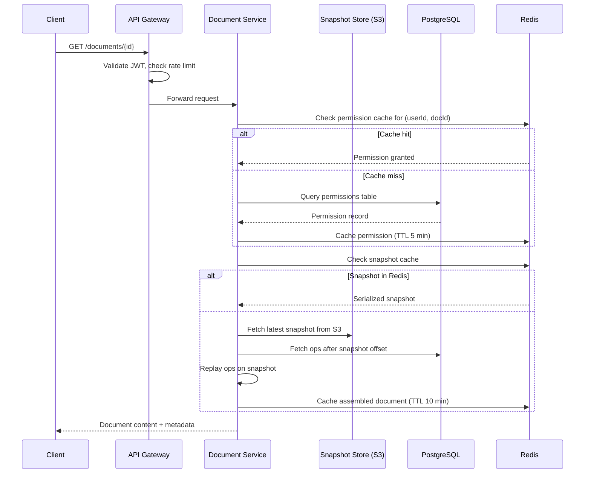
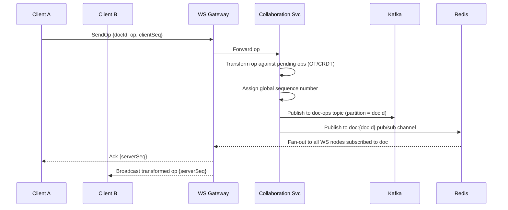

# 01 — High-Level Architecture

## Objective
Define the macro-level architecture, justify the choice of event-sourced microservices, map the primary request flows, and establish the service topology for the Collaborative Document Editor.

---

## Architecture Choice: Event-Sourced Microservices

### Decision
**Event-Sourced Architecture with purpose-built microservices** coordinated through Kafka as the event backbone. Document state is never stored as a mutable blob — it is derived by replaying an immutable log of edit operations.

### Justification

**Why Event Sourcing?**

| Problem | How Event Sourcing Solves It |
|---|---|
| Version history is a first-class requirement | Every edit IS an event; history is free |
| Undo/redo across concurrent users | Replay log to any point-in-time trivially |
| Offline sync | Offline edits are buffered events; merge on reconnect |
| Audit trail | Full causal chain of who changed what and when |
| CRDT/OT merge | Algorithms operate on event sequences naturally |
| Debugging production bugs | Replay exact event sequence to reproduce issues |

**Why Microservices over Modular Monolith?**

At 100 M DAU and 10 M ops/sec the scaling requirements of each concern differ dramatically:
- The **real-time collaboration layer** needs 500+ WebSocket servers; deploying that with the export service is wasteful.
- The **export service** is CPU-intensive and needs GPU/high-CPU nodes.
- The **permission service** needs sub-millisecond reads and scales differently from document storage.
- Independent deployability is critical: a bug in comments must not take down editing.

**When this is overengineered (startup context):** A startup with < 10K users should start with a modular monolith using DDD boundaries. Extract to microservices only when a specific service becomes a scaling bottleneck. The event-sourced log can still be implemented within a monolith.

---

## Service Map

```
┌─────────────────────────────────────────────────────────────────────┐
│                         CLIENT LAYER                                │
│   React SPA / Mobile App / Offline PWA                              │
│   (CRDT client library, offline queue, WS client)                   │
└───────────────┬──────────────────────────────────────┬─────────────┘
                │ HTTPS REST / GraphQL                  │ WebSocket
                ▼                                       ▼
┌───────────────────────────┐         ┌─────────────────────────────┐
│      API Gateway          │         │  WebSocket Gateway           │
│  (Auth, Rate Limiting,    │         │  (Session routing, sticky   │
│   Routing, TLS termination│         │   connections, presence)     │
└───────┬───────────────────┘         └──────────┬──────────────────┘
        │                                         │
        ▼                                         ▼
┌───────────────┐  ┌─────────────┐  ┌────────────────────────────┐
│  Document     │  │  User &     │  │  Collaboration Service      │
│  Service      │  │  Auth Svc   │  │  (OT/CRDT engine, op        │
│  (CRUD, ACL,  │  │  (JWT, RBAC)│  │   sequencing, fan-out)      │
│   snapshots)  │  └──────┬──────┘  └──────────┬─────────────────┘
└──────┬────────┘         │                     │
       │                  │                     │ ops stream
       ▼                  ▼                     ▼
┌────────────────────────────────────────────────────────────────────┐
│                         KAFKA EVENT BUS                            │
│  Topics: doc-ops, doc-snapshots, presence, comments, audit         │
└────────┬──────────────────────────────────┬───────────────────────┘
         │                                  │
         ▼                                  ▼
┌──────────────────┐            ┌───────────────────────┐
│  Snapshot Service│            │  Search & Index Svc   │
│  (checkpoint     │            │  (Elasticsearch)      │
│   compaction)    │            └───────────────────────┘
└──────────────────┘
         │
         ▼
┌────────────────────────────────────────────────────────────────────┐
│                        STORAGE LAYER                               │
│  PostgreSQL (metadata, permissions, comments)                      │
│  Redis (op cache, presence, rate limiting, sessions)               │
│  S3/GCS (document snapshots, images, exports)                      │
│  Kafka Log (durable op event stream — source of truth)             │
└────────────────────────────────────────────────────────────────────┘
```

---

## Core Services

### 1. API Gateway
- TLS termination, JWT validation, rate limiting
- Routes REST/GraphQL to appropriate downstream services
- Does NOT participate in WebSocket lifecycle

### 2. WebSocket Gateway
- Maintains persistent connections with clients
- Sticky routing: all users editing the same document connect to the same collaboration pod (or cluster-local Redis pub/sub bridges cross-pod)
- Publishes received operations to Kafka; subscribes to document channels for fan-out

### 3. Collaboration Service
- Heart of the system: receives raw client operations, applies OT/CRDT transformation, sequences them, and emits the canonical transformed operation to Kafka
- Maintains in-memory document state for active documents (hot cache)
- Publishes presence events (cursor position, selection)

### 4. Document Service
- Manages document lifecycle: create, read, metadata, permissions, sharing
- Reads materialized document state from snapshots + op replay
- Writes snapshot checkpoints triggered by Snapshot Service

### 5. User & Auth Service
- OAuth2 / OIDC identity provider integration
- JWT issuance and rotation
- RBAC permission model storage

### 6. Snapshot Service
- Consumes Kafka op stream and periodically compacts ops into document snapshots
- Stores snapshots in S3; registers snapshot offsets in PostgreSQL
- Enables fast document load without replaying thousands of ops

### 7. Comment Service
- Anchors comments to document text ranges using character offsets
- Maintains anchors through document edits (anchor positions must transform with ops)
- Threaded replies, resolution workflow

### 8. Search Service
- Indexes document content into Elasticsearch after snapshot creation
- Full-text search across user's accessible documents

### 9. Export Service
- Async job executor: converts document snapshot + ops to DOCX, PDF
- CPU-intensive; horizontally scaled on dedicated node pools

---

## Request Flow: Document Open



---

## Request Flow: Real-Time Edit Operation



---

## Tradeoffs

| Decision | Pro | Con |
|---|---|---|
| Event sourcing as source of truth | Free version history, auditability, replay | Higher storage cost; read path requires snapshot + replay |
| Kafka as op backbone | Durable, ordered, replayable | Operational complexity; latency overhead vs direct DB write |
| WebSocket Gateway separate from Collaboration Svc | Independent scaling | Cross-service op routing adds latency |
| Redis pub/sub for fan-out | Very low latency (< 1 ms) | Redis is not durable; if Redis restarts, in-flight ops may be lost (mitigated by Kafka as canonical log) |
| Microservices over monolith | Independent scaling per service | Distributed system complexity, operational burden |

---

## Alternatives Considered

### Alternative 1: CRDT-Only Client-Side Architecture (Yjs/Automerge on client, S3 as storage)
- Pro: No server-side merge logic; server is just a relay
- Con: No server authority; impossible to enforce permissions on content; fork reconciliation at scale is complex; no server-side indexing without re-processing

### Alternative 2: Operational Transform with Central Server (Google Wave approach)
- Pro: Battle-tested (Google Docs uses this); server is the authority
- Con: Single-server bottleneck per document; complex OT implementation; harder to shard across servers

### Alternative 3: Modular Monolith with PostgreSQL only
- Pro: Simpler operations, no Kafka, no distributed transactions
- Con: Cannot scale WebSocket layer independently; PostgreSQL becomes bottleneck at 10 M ops/sec; no built-in version history without custom op log

---

## Interview Discussion Points
- Why is partitioning Kafka by `docId` critical for operation ordering guarantees?
- What happens to in-flight operations when the Collaboration Service pod dies?
- How do you avoid the "split brain" problem where two Collaboration Service pods both process ops for the same document simultaneously?
- At what document operation count does snapshot compaction become necessary, and how do you tune the compaction frequency?
- How does the architecture support data residency requirements (EU docs must stay in EU)?
