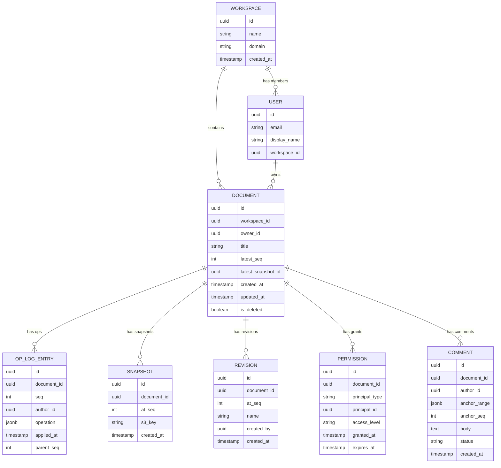

# 02 — Domain Modeling

## Objective
Define the core domain entities, aggregates, value objects, and relationships. Establish a ubiquitous language that all services and teams share, preventing semantic drift across microservice boundaries.

---

## Ubiquitous Language

| Term | Definition |
|---|---|
| **Document** | A versioned, collaboratively editable artifact with a title, content, and ownership |
| **Operation (Op)** | An atomic, transformable change to a document (insert, delete, retain, format) |
| **Op Sequence** | The globally ordered, immutable log of operations applied to a document |
| **Snapshot** | A materialized point-in-time state of a document derived from replaying ops to a specific sequence number |
| **Revision** | A named, explicit checkpoint in a document's op sequence (user-visible version) |
| **Collaborator** | A user actively editing a document in a real-time session |
| **Presence** | The real-time awareness data for a collaborator: cursor position, selection, last-active timestamp |
| **Permission Grant** | An explicit authorization binding a Principal (user/group/link) to an Access Level on a Document |
| **Comment** | A piece of feedback anchored to a text range in the document at a specific sequence number |
| **Suggestion** | A proposed change tracked as a special op type; exists in pending state until accepted or rejected |
| **Workspace** | An organizational unit grouping documents and users, with workspace-level policies |
| **Transform** | The algorithmic process of adjusting an op's position after concurrent ops have been applied |

---

## Core Aggregates

### Aggregate 1: Document

The Document is the central aggregate root. All document mutations flow through it.

**Identity**: `documentId` (UUID, globally unique)

**State (derived from ops, not stored directly):**
- `title` — extracted from first heading op
- `content` — current materialized text tree (rich-text node tree)
- `schemaVersion` — format version for migration
- `ownerId` — creator's userId
- `workspaceId` — owning workspace
- `createdAt`, `lastModifiedAt`

**Invariants:**
- An op must have a sequence number greater than all previous ops on this document
- Ops are append-only; an op can never be modified or deleted
- Permissions must be re-checked before any op is accepted

**Entities within Document:**
- `OpLogEntry` — a single operation with its sequence number, authorId, timestamp, and transform metadata
- `Snapshot` — cached materialized state at a specific op sequence
- `Revision` — named checkpoint referencing an op sequence number

```
Document (Aggregate Root)
├── OpLogEntry[]   (sequence-ordered, immutable)
├── Snapshot[]     (derived, cached in S3)
└── Revision[]     (named checkpoints)
```

---

### Aggregate 2: CollaborationSession

Represents one user's active editing session on one document.

**Identity**: `sessionId` (userId + documentId + connectionId)

**State:**
- `userId`, `documentId`
- `clientSeq` — last acknowledged operation sequence from this client
- `serverSeq` — last applied server sequence number this client has seen
- `presence` — current cursor position and selection range
- `lastHeartbeatAt` — for session liveness detection

**Lifecycle**: Created on WebSocket connect; destroyed on disconnect or timeout.

---

### Aggregate 3: Permission

Controls access to documents.

**Identity**: `permissionId`

**State:**
- `documentId`
- `principal` — UserId | GroupId | LinkToken | WorkspaceId
- `accessLevel` — Owner | Editor | Commenter | Viewer
- `grantedBy`, `grantedAt`
- `expiresAt` (optional, for link-based shares)

**Invariants:**
- A document always has exactly one Owner
- Link tokens are independent of user identity; they can be revoked without affecting user-based grants

---

### Aggregate 4: Comment

A comment is anchored to the document at a specific text range and sequence number.

**Identity**: `commentId`

**State:**
- `documentId`
- `anchorRange` — `{startOffset, endOffset}` at the time of creation (must transform with future ops)
- `anchorSeq` — op sequence number when comment was created
- `authorId`
- `body` — comment text
- `status` — Open | Resolved
- `replies` — `CommentReply[]`

**Invariants:**
- Anchor ranges must be updated whenever ops shift character offsets in the document
- A resolved comment retains its anchor for history purposes

---

## Value Objects

### TextRange
```
TextRange {
  startOffset: int   // character offset from document start
  endOffset: int     // exclusive end offset
}
```

### Operation
The core value object representing a single edit:
```
Operation {
  type: Insert | Delete | Retain | Format
  position: int          // character offset (for OT-based systems)
  content: string        // for Insert ops
  length: int            // for Delete/Retain ops
  attributes: Map        // for Format ops (bold, color, etc.)
  authorId: UserId
  clientSeq: int
  parentSeq: int         // sequence number this op was based on
  timestamp: Instant
}
```

### AccessLevel
Ordered enum: `Owner > Editor > Commenter > Viewer`

### PresenceData
```
PresenceData {
  userId: UserId
  documentId: DocumentId
  cursor: TextRange
  color: HexColor       // stable per user per session
  displayName: string
  updatedAt: Instant
}
```

---

## Entity Relationships



---

## Domain Events

These are the events emitted when domain state changes. They flow through Kafka and drive downstream services.

| Event | Emitted By | Consumed By |
|---|---|---|
| `DocumentCreated` | Document Service | Search, Audit |
| `OperationApplied` | Collaboration Service | WS Gateway (fan-out), Snapshot Service, Search |
| `SnapshotCreated` | Snapshot Service | Document Service (update pointer), Search |
| `RevisionCreated` | Document Service | Audit, Notification |
| `PermissionGranted` | Document Service | Auth Cache invalidation |
| `PermissionRevoked` | Document Service | Auth Cache invalidation, active session termination |
| `CommentAdded` | Comment Service | Notification, Anchor transform pipeline |
| `CommentResolved` | Comment Service | Notification |
| `PresenceUpdated` | Collaboration Service | WS Gateway (ephemeral fan-out only; not persisted to Kafka) |
| `DocumentDeleted` | Document Service | Cleanup jobs, Search de-index |

---

## Tradeoffs in Domain Modeling

### Decision: Op as Value Object (immutable) vs Entity (mutable)
Ops are value objects — they are immutable once applied. The sequence number and document context make them uniquely identifiable, but they are never updated in place. This supports event sourcing and prevents accidental mutation of history.

### Decision: Comment anchor as a derived/transformed value
Comment anchors store the original text range at creation time. The Comment Service must apply future document operations to keep anchors current. This is complex but necessary — alternatives like "anchor by sentence hash" are brittle when the sentence is edited.

### Decision: Permission as a separate aggregate (not part of Document)
Permission changes need to be checked on every operation without loading the full document. Keeping Permission separate allows it to be cached and invalidated independently.

---

## Interview Discussion Points
- Why is the Operation a value object and not an entity, even though we assign it a sequence number?
- What is the semantic difference between a Snapshot and a Revision, and why have both?
- How do you handle comment anchor drift when the document above the comment is heavily edited?
- What invariant violation occurs if two Collaboration Service pods assign the same sequence number to different ops?
- How does the domain model change if you add document branching (Google Docs "Suggested changes" taken to the extreme)?
