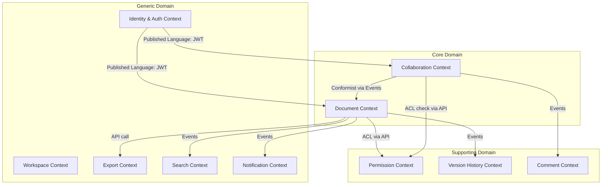

# 03 — DDD Bounded Contexts

## Objective
Define explicit bounded contexts with well-defined interfaces and anti-corruption layers. Prevent domain model leakage between services and establish clear ownership of each subdomain.

---

## Bounded Context Map

---

## Relationship Types

| Upstream | Downstream | Relationship Pattern | Notes |
|---|---|---|---|
| Identity & Auth | All contexts | Published Language (JWT) | All services consume JWT; no direct dependency on IAM internals |
| Document Context | Collaboration Context | Partnership | Both co-own the document aggregate boundaries; changes need coordination |
| Permission Context | Document Context | Customer/Supplier | Doc is the customer; Permission is the supplier. Doc does not own permission logic |
| Collaboration Context | Version History | Conformist via Events | Version History consumes op events; it conforms to Collaboration's op schema |
| Document Context | Search Context | Conformist via Events | Search indexes document events without influencing document model |
| Comment Context | Collaboration Context | Anti-Corruption Layer | Comments consume op events through an ACL to re-anchor comment ranges without coupling to OT internals |

---

## Context 1: Collaboration Context

**Ownership:** Core domain — this is the primary differentiator

**Responsibility:**
- Receives raw operations from clients
- Executes OT/CRDT transformation algorithm
- Assigns authoritative global sequence numbers
- Fan-out of transformed ops to all connected sessions
- Maintains in-memory hot state of active documents
- Publishes `OperationApplied` events

**Ubiquitous Language (internal):** Transform, ServerSeq, ClientSeq, Diamond Problem, Causality Vector, tombstone (for CRDT deletes)

**What it does NOT own:**
- Document persistence (delegates to Document Context via events)
- Permission enforcement (calls Permission Context API; result is cached locally)
- Cursor presence storage (ephemeral Redis only; not event-sourced)

**Published Interface:**
- WebSocket protocol: `{type: "op", docId, clientSeq, operation}`
- Emits Kafka topic: `doc-ops` with schema-versioned Avro records

**Anti-Corruption Layer boundary:**
Client applications send operations in their own format (Delta format for Quill.js, Yjs update binary, etc.). The WebSocket Gateway translates these to the internal `Operation` value object before reaching Collaboration Context.

---

## Context 2: Document Context

**Ownership:** Core domain — manages document lifecycle and metadata

**Responsibility:**
- Create, read, update metadata, soft-delete documents
- Serve document content (snapshot + pending ops)
- Trigger version snapshot creation
- Enforce document-level invariants

**Ubiquitous Language (internal):** Snapshot offset, materialized state, schema migration

**Published Interface:**
- REST API: `GET /documents/{id}`, `POST /documents`, `PATCH /documents/{id}`
- Emits: `DocumentCreated`, `DocumentDeleted`, `SnapshotCreated`

---

## Context 3: Permission Context

**Ownership:** Supporting domain — critical but not differentiating

**Responsibility:**
- Manage permission grants and revocations
- Resolve effective permissions for a principal-document pair
- Link-token lifecycle (create, expire, revoke)
- Workspace-level policy inheritance

**Ubiquitous Language (internal):** Principal, Grant, AccessLevel, Effective Permission, Policy inheritance chain

**Integration Contract:**
All other contexts call `GET /permissions/effective?principalId=X&documentId=Y` and receive a simple `AccessLevel` enum. They never query permission storage directly. This is the ACL integration pattern.

**Cache strategy:** Permission decisions are cached in Redis per `(principalId, documentId)` with a short TTL (60 seconds). `PermissionRevoked` events trigger immediate cache invalidation via Kafka consumer.

---

## Context 4: Version History Context

**Ownership:** Supporting domain

**Responsibility:**
- Consume op stream from Kafka
- Compact ops into snapshots at configurable intervals
- Store snapshots in S3 with metadata in PostgreSQL
- Serve version history list and point-in-time document reconstruction
- Support named revision creation (triggered externally)

**Integration Pattern:** Pure consumer — never mutates document state, only reads.

**Ubiquitous Language (internal):** Compaction window, checkpoint, at-seq, replay, delta snapshot

---

## Context 5: Comment Context

**Ownership:** Supporting domain

**Responsibility:**
- Anchor management: maintain comment ranges through document edits
- Thread management: create, reply, resolve
- Suggestion mode: propose changes as special comment-linked ops

**Anti-Corruption Layer:** Comments receive `OperationApplied` events and must apply the same transformation logic to adjust anchor ranges. The Comment Context has its own lightweight transform engine (ACL that translates Collaboration's op format into position-shift calculations). This prevents Comment Context from depending on Collaboration's internal OT algorithm.

---

## Context 6: Identity & Auth Context (Generic)

**Pattern:** Published Language — all services consume JWT tokens. IAM is treated as an external system integrated via standard OIDC.

**Integration:** Services validate JWTs locally using the JWKS endpoint. No service-to-service call to IAM on every request.

---

## Context 7: Export Context (Generic)

**Ownership:** Generic domain — conversion utility

**Responsibility:** Convert document snapshots to external formats (DOCX, PDF, Markdown)

**Integration:** Document Context triggers async export jobs. Export Context pulls the snapshot, converts, stores in S3, and notifies via `ExportCompleted` event.

**Isolation rationale:** CPU-intensive rendering must be isolated so a surge in PDF exports does not impact real-time editing latency.

---

## Context 8: Search Context (Generic)

**Ownership:** Generic domain

**Responsibility:** Full-text indexing of document content into Elasticsearch. Serves search queries.

**Integration:** Consumes `SnapshotCreated` events. Re-indexes document content from S3 snapshot. Respects permissions — search results filtered by caller's permission grants.

---

## Shared Kernel

The following elements are shared between Collaboration and Document contexts and must be kept in sync via a shared library (not a shared service):
- `Operation` value object schema (Avro schema in schema registry)
- `DocumentId` and `UserId` types
- Sequence number semantics

**Risk:** Shared kernel creates coupling. Any schema change to `Operation` requires coordinated deployment. Mitigation: schema versioning via Avro Schema Registry; both contexts support reading old and new schema versions simultaneously.

---

## Context Integration Patterns Summary

| Pattern | Used Where | Why |
|---|---|---|
| Published Language (JWT) | IAM → All services | Standardized; no coupling to IAM internals |
| Events (Kafka) | Collab → Version History, Search, Notification | Decoupled consumers; replable |
| ACL (Anti-Corruption Layer) | Comment Context | Translates foreign op model to anchor positions |
| Customer/Supplier API | All → Permission | Permission is a shared capability with explicit contract |
| Conformist | Export, Search | These contexts don't drive their own schema; they conform to Document/Collab schemas |
| Shared Kernel | Document ↔ Collaboration | Unavoidable coupling on core op schema; managed via schema registry |

---

## Bounded Context Failure Isolation

If the **Permission Context** is unavailable:
- Collaboration Service falls back to cached permissions (stale by at most TTL)
- New sessions requiring permission resolution are rejected with 503
- Existing sessions with cached grants continue editing

If the **Version History Context** is unavailable:
- Real-time editing continues unaffected
- Snapshot compaction falls behind; Kafka retention must be sufficient to replay when it recovers
- Version history UI shows "temporarily unavailable"

If the **Comment Context** is unavailable:
- Editing continues unaffected
- Comment anchors fall behind; reconciled when service recovers by replaying missed ops

---

## Interview Discussion Points
- How do you prevent the shared kernel from becoming a source of hidden coupling and deployment bottlenecks?
- What does the Anti-Corruption Layer between Comment and Collaboration contexts look like at the data schema level?
- When should you merge two bounded contexts back into one? What are the signals?
- How does permission caching interact with real-time revocation — what is the attack surface of stale permission decisions?
- How would you model document templates as a bounded context — is it Core, Supporting, or Generic domain?
