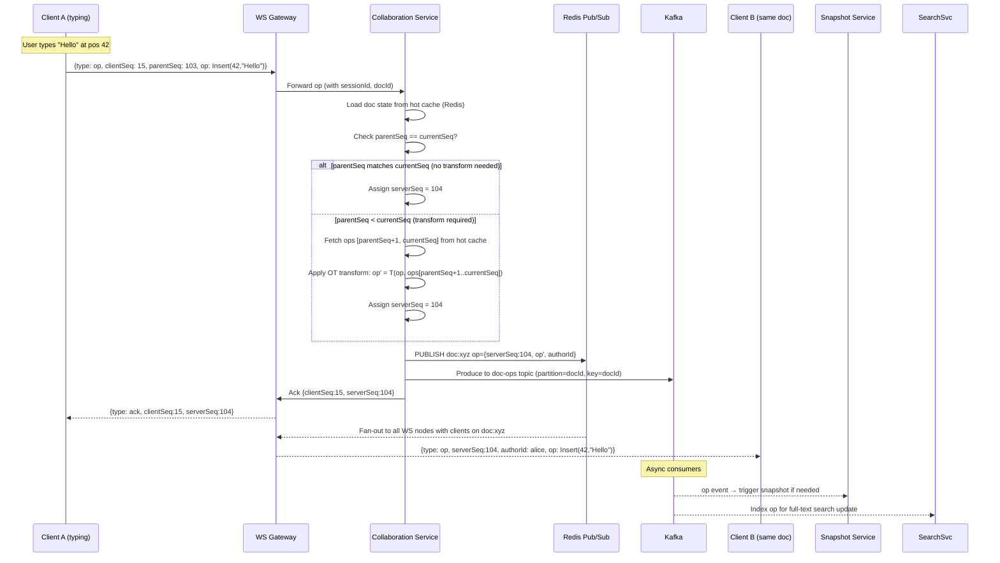
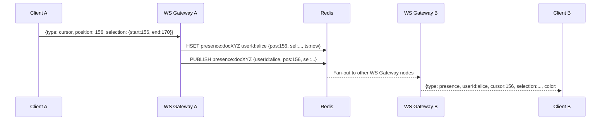
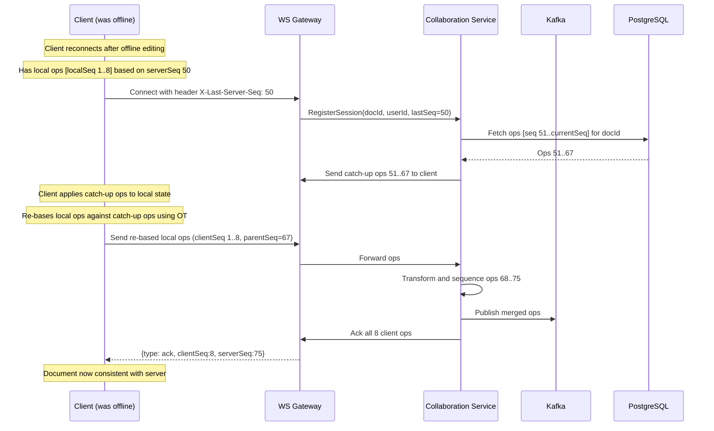
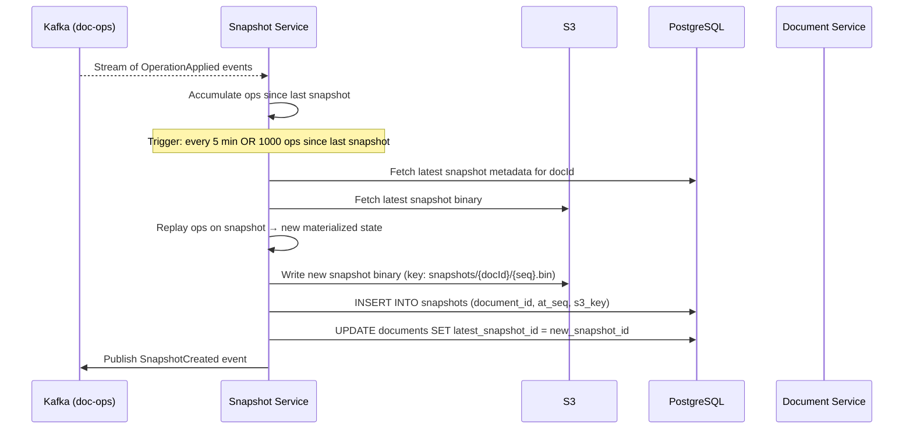

# 06 — Event Flow & OT vs CRDT Deep Dive

## Objective
Detail the end-to-end event flow for real-time collaboration. Provide a deep technical comparison of Operational Transformation (OT) vs CRDT. Define the conflict resolution algorithm, offline sync flow, and presence event lifecycle.

---

## OT vs CRDT: Deep Comparison

This is the most critical algorithmic decision in the system. The choice affects the server architecture, client complexity, storage requirements, and conflict resolution behavior.

### What Problem Are We Solving?
When two users concurrently edit a document, their operations are based on different states of the document. Without transformation, applying both operations naively produces incorrect results.

**Example:**
- Document: `"Hello"`
- User A (at seq 5): Insert `"World"` at position 6 → `"Hello World"`
- User B (at seq 5): Delete character at position 1 → `"ello"`
- Without transformation: applying both gives `"ello World"` or `"elloWorld"` depending on order
- With OT: A's insert position must be shifted left by 1 to account for B's delete → correct result

---

### Operational Transformation (OT)

#### How It Works
1. Every operation has a `parentSeq` — the server sequence number it was based on
2. When the server receives an op with `parentSeq < currentSeq`, it must transform the incoming op against all ops applied since `parentSeq`
3. The transformation function `T(op_a, op_b)` produces a new op_a' that achieves the same user intent after op_b has been applied

#### OT Transformation Functions
For text editing, two core transformations are needed:
- **T_insert_insert**: If op_a inserts at position p and op_b inserts at position q ≤ p, shift op_a's position right by the length of op_b's content
- **T_insert_delete**: If op_b deletes n characters at position q ≤ p, shift op_a's position left by min(n, p-q)
- **T_delete_insert** / **T_delete_delete**: Symmetric cases

#### The Diamond Problem (Critical OT Challenge)
```
        S0 (initial state)
       /  \
      A    B    (concurrent ops based on S0)
       \  /
        S1 (must equal S1' regardless of application order)
```
OT must satisfy the **convergence property**: `apply(apply(S0, A), T(B,A)) == apply(apply(S0, B), T(A,B))`

This is straightforward for simple text. For rich text (formatting, tables), proving convergence requires complex property proofs. Jupiter/OT algorithm (used by Google Docs) solves this by routing all ops through a central server which is the single transformation authority.

#### Server-Centric OT Architecture
```
Client A  ──[op_a, parentSeq=5]──►  Server
                                     │
                                     ├─ Check: currentSeq = 7
                                     ├─ Transform op_a against ops 6,7
                                     ├─ Apply transformed op_a at seq 8
                                     └─ Broadcast op_a' to all clients
Client B  ◄──[op_a', serverSeq=8]────┘
```
The server is the **single source of truth for transformation**. Clients cannot apply ops until the server acknowledges them (or they use a local "speculative" application that gets rebased).

---

### CRDT (Conflict-free Replicated Data Type)

#### How It Works
CRDTs are data structures that are mathematically designed to converge to the same state regardless of operation order or concurrency. No central transformation authority is needed.

#### CRDT Types Relevant to Text Editing

**Sequence CRDT (for text):**
- **RGA (Replicated Growable Array)**: Each character is assigned a globally unique identifier (UID = `{authorId, logicalClock}`). Insert operations reference the UID of the preceding character. Deletes mark characters as tombstones (invisible but present in the data structure).
- **LSEQ**: Uses hierarchical position identifiers between characters; no tombstones needed.
- **Logoot**: Assigns dense identifiers between characters; supports offline editing natively.

**The key insight:** Instead of transforming positions (which are unstable), CRDTs reference stable character identities. A delete of character UID-42 is always unambiguous, even if the document has been heavily rearranged.

#### CRDT Tombstone Problem
When a character is deleted in RGA, its UID is retained as a tombstone so that subsequent inserts that reference it as a predecessor can still be resolved. Over time, documents accumulate large numbers of tombstones.

**Mitigation:** Garbage collection of tombstones requires a global consensus that all clients have seen the delete — a distributed coordination problem. Yjs (a popular CRDT library) handles this with a sweep algorithm that requires all clients to confirm they've received the delete.

---

### OT vs CRDT Comparison Table

| Dimension | Operational Transform | CRDT |
|---|---|---|
| **Server requirement** | Requires central server as transformation authority | Can be peer-to-peer; server is just a relay |
| **Convergence guarantee** | Requires correct implementation of transform functions | Mathematically guaranteed by data structure |
| **Conflict resolution** | Server-decided (last-write-wins on transformation order) | Deterministic by UID ordering (ties broken by author ID) |
| **Offline support** | Complex: must re-base all offline ops against server ops | Natural: merge by UID; offline ops apply cleanly |
| **Storage overhead** | Low: ops are small position-based deltas | Higher: tombstones accumulate; UID metadata per character |
| **Client complexity** | Moderate: needs op buffering and transformation on client | Higher: must implement full CRDT library |
| **Server complexity** | High: transformation engine is complex, hard to get right | Low: server is a dumb relay |
| **Rich-text support** | Difficult: formatting ops have complex interaction rules | Good: attributes are separate CRDTs (OR-Set for format attributes) |
| **Undo/redo** | Natural: reverse and re-apply ops against server sequence | Complex: undone ops leave tombstones; must track undo states |
| **Cursor position stability** | Cursors shift with transforms | Cursors anchor to character UIDs; very stable |
| **Production usage** | Google Docs, Etherpad | Figma, Notion (hybrid), Linear |
| **Latency** | Requires server round-trip before applying (or speculation) | Can apply immediately, merge later |
| **Multi-master** | Not supported natively; server is single master | Natively multi-master |

---

### Architecture Decision: Hybrid OT+CRDT

**Chosen approach:** OT on the server as the canonical sequencer, with a CRDT-compatible client model for offline support.

**Rationale:**
1. Server-side OT gives us a single authoritative transformation engine that is simpler to reason about and audit
2. Client uses a local CRDT-like buffer for offline editing (Yjs-style)
3. When online, client sends Yjs update vectors to server; server converts to canonical OT ops for sequencing
4. This is the approach used by modern collaborative tools (e.g., Notion's hybrid model)

**Why pure CRDT is overengineered at FAANG-scale:**
- Tombstone garbage collection at 10 M ops/sec across 1 B documents is a hard distributed coordination problem
- CRDT storage overhead at scale is significant (UID per character × document size × versions)
- Server-side permission enforcement is harder with peer-to-peer CRDT (no authority to reject forbidden ops)

**Why pure OT fails for offline:**
- OT requires sequential rebasing against all missed server ops on reconnect
- If offline for a long time, the rebase chain can be thousands of ops long
- CRDT-style local buffer with a single merge-on-reconnect is simpler

---

## End-to-End Operation Event Flow



---

## Presence Event Flow

Presence events (cursor moves, selection changes) are fire-and-forget. They are NOT persisted to Kafka or PostgreSQL.



Presence TTL: 30 seconds. Heartbeats every 10 seconds reset the TTL. When the WS connection closes, the key is deleted immediately via `HDEL presence:docXYZ userId:alice`, followed by a `presence_leave` broadcast.

---

## Offline Edit Sync Flow



---

## Snapshot Compaction Flow



---

## Version History Reconstruction

When a user requests document state at seq N:
1. Find the latest snapshot with `at_seq <= N`
2. Fetch ops `(snapshot.at_seq, N]` from op_log
3. Replay ops on snapshot to reconstruct state at seq N
4. Cache result in Redis with TTL 2 minutes (version history reads are bursty)

For full diff between version A and version B:
1. Reconstruct state at seq_A and seq_B (parallel)
2. Compute diff using Myers diff algorithm on the op sequences
3. Return semantic diff (not character-level diff) using the op log directly when possible

---

## Interview Discussion Points
- What is the "diamond problem" in OT, and why does it require a central server to solve?
- How do CRDT tombstones behave when the same character is deleted concurrently by two users?
- What happens to in-flight ops on the server when the Collaboration Service pod crashes? (Answer: ops buffered in client are retransmitted; Kafka retains ops already produced)
- Why is cursor position stability better with CRDT than OT?
- If a client is offline for longer than Kafka's retention window (7 days), how do you handle the reconnect? (Answer: full re-sync from latest snapshot; local offline ops are re-based against the full delta)
- How do you implement "undo" in a multi-user OT system without undoing other users' changes?
