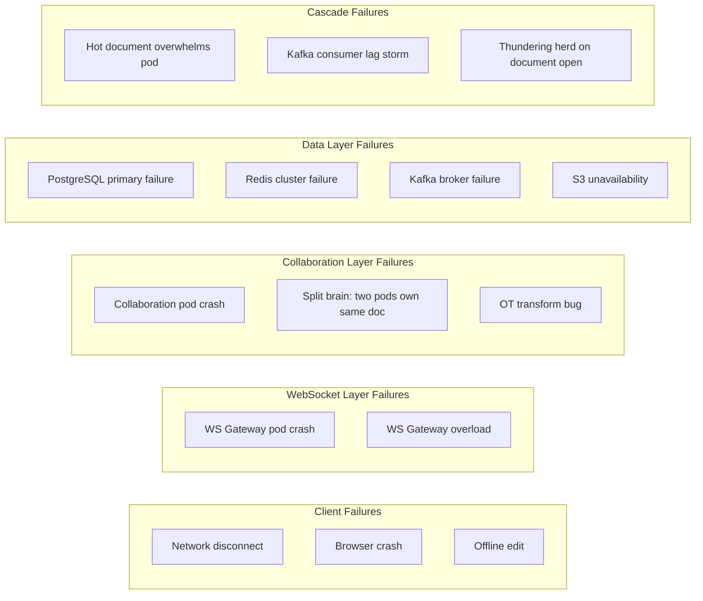

# 11 — Failure Scenarios & Resilience Design

## Objective
Catalog production failure scenarios specific to collaborative editing, define failure domains, and specify the mitigation and recovery strategy for each. Design for graceful degradation, not just prevention.

---

## Failure Domain Map

---

## Failure Scenario 1: Client Network Disconnect

**Scenario:** User loses internet connection while editing for 2 minutes; types 50 characters.

**Impact without mitigation:** Lost edits; document opens to state from 2 minutes ago; user frustration.

**Mitigation:**
1. Client maintains a local op buffer (IndexedDB / in-memory) of all unacknowledged ops
2. On disconnect detection (WS close or ping timeout), client enters "offline mode" — indicator shown in UI
3. Client continues accepting local ops; applies them speculatively to local state
4. On reconnect: client sends `X-Last-Server-Seq` header; server sends catch-up ops
5. Client re-bases local buffered ops against catch-up ops using OT
6. Server applies re-based ops; returns new server seqs

**Maximum offline duration without data loss:** 7 days (Kafka retention). After 7 days offline, client must do a full re-sync from the latest snapshot; local ops are re-submitted from scratch.

**Edge case:** If the re-based op conflicts irreconcilably (e.g., client edited text that server deleted entirely), the Collaboration Service rejects the op with `409 OP_CONFLICT`. Client presents a merge UI: "Your edit conflicts with a change made while you were offline. Keep yours or accept the current version?"

---

## Failure Scenario 2: WebSocket Gateway Pod Crash

**Scenario:** A WS Gateway pod crashes with 50,000 active connections.

**Impact:** All 50,000 connections terminated abruptly. Users see connection loss indicator.

**Mitigation:**
1. Client WebSocket library implements exponential backoff reconnect (immediately → 1s → 2s → 4s → max 30s)
2. Kubernetes readiness probe detects pod failure within 5 seconds; stops routing new connections
3. New pods start within 10–30 seconds (Kubernetes auto-replacement)
4. Reconnecting clients distribute across remaining healthy pods
5. On reconnect, each client sends its `lastSeq`; server sends catch-up ops (from op buffer or Kafka)

**Data loss risk:** Zero. WS Gateway is stateless for document content. All ops accepted by the Gateway were either already published to Kafka (durable) or buffered on the client.

**Availability impact:** ~30-second interruption for affected users. P(any given user affected) = 1/500 per pod crash.

---

## Failure Scenario 3: Collaboration Service Pod Crash

**Scenario:** A Collaboration pod crashes while processing ops for 10,000 documents.

**Impact:** In-flight ops (received but not yet published to Kafka) may be lost. Document state in pod's JVM heap is lost.

**Mitigation:**
1. **In-flight ops:** The client has not received an `ack` for these ops (since ack is sent after Kafka publish). Client retries on reconnect.
2. **Document state (JVM heap):** Pod state is derived from Redis cache + PostgreSQL. New pod loads state from Redis on first op for each document.
3. **Routing update:** Consistent hash ring detects pod failure (ZooKeeper/etcd heartbeat timeout ~5 seconds). Ring is rebalanced; affected documents reassigned to surviving pods.
4. **Reassignment window:** During ~5-second reassignment, ops for affected documents are queued at WS Gateway until a new pod acknowledges ownership.

**Ordering guarantee during failover:** New pod reads last committed `seq` from PostgreSQL (or Redis). Ops submitted during the gap are re-transformed from `parentSeq` against ops that were persisted before the crash.

**Risk of duplicate seq assignment:** New pod reads latest seq from PostgreSQL (authoritative). PostgreSQL write of seq is atomic; even if pod crashed before writing, the UNIQUE constraint on `(document_id, seq)` prevents duplicates.

---

## Failure Scenario 4: Split Brain — Two Pods Own Same Document

**Scenario:** A network partition causes the consistent hash ring's coordination service (ZooKeeper/etcd) to lose quorum. Two Collaboration pods each believe they own the same document.

**Impact:** Both pods independently assign sequence numbers → two ops both get `seq = 105` → document state diverges → permanent data corruption.

**Mitigation:**
1. Sequence number assignment goes through a **fencing token** in Redis: `SET doc:seq:{documentId} {seq} NX` — atomic compare-and-set ensures only one pod successfully increments the seq
2. If Redis is also unavailable (severe partition), the first-writer-wins rule applies via PostgreSQL's UNIQUE constraint on `(document_id, seq)` — the second write will fail with a conflict, and that op is rejected with `409`
3. The ops are not lost — they are retried by clients from the new authoritative pod once the partition heals

**Defense in depth:** Even without fencing, the PostgreSQL UNIQUE constraint is the last line of defense against duplicate sequence assignment.

---

## Failure Scenario 5: Redis Cluster Failure

**Scenario:** Redis cluster suffers a multi-node failure; majority of data unavailable.

**Impact by data type:**

| Data | Impact on Redis failure | Fallback |
|---|---|---|
| Document snapshot cache | Cache miss; serve from S3 + op replay | Increased latency (2–5 sec for doc open) |
| Op buffer cache | Cache miss; serve from Kafka consumer read or PostgreSQL | Fall back to PostgreSQL op_log query |
| Permission cache | Cache miss; hit PostgreSQL on every permission check | Increased latency; possible overload of PostgreSQL |
| Presence | Presence unavailable entirely | UI shows no collaborator cursors; graceful degradation |
| Session tracking | Session-level routing breaks | WS Gateway re-connects without session routing |

**Permission overload mitigation:** If Redis is down, Permission Service enables a local LRU cache in the Collaboration Service JVM (Caffeine cache): 10,000 entries × 60-second TTL. This absorbs most permission reads without Redis.

**Recovery:** Redis cluster auto-failover (Redis Sentinel / Redis Cluster) promotes a replica to primary within 5–15 seconds. Caches are repopulated lazily as requests come in.

---

## Failure Scenario 6: Kafka Broker Failure

**Scenario:** One Kafka broker fails. 100 of the 1,000 partitions become temporarily unavailable.

**Impact:** Producers publishing to affected partitions receive errors. Consumers from affected partitions pause.

**Mitigation:**
1. Kafka replication factor 3 ensures partition replicas exist on 2 other brokers
2. Kafka controller elects a new leader for affected partitions within ~30 seconds (with unclean leader election disabled)
3. During leader election window: Collaboration Service retries op publish with exponential backoff
4. Ops buffered in client during this window; WS ack is delayed until Kafka confirms

**Data loss risk with `acks=all`:** Zero. With `acks=all` (producer waits for all ISR replicas to acknowledge), no committed message is lost when a broker fails.

**Throughput impact:** Clients on affected partitions see ~30-second op latency spike; ops are queued and delivered in order once leader election completes.

---

## Failure Scenario 7: OT Transform Bug (Divergence)

**Scenario:** A bug in the transform function causes two clients to see different document states (convergence failure).

**Impact:** Silent data corruption. User A sees "Hello World"; User B sees "Helo World". Neither realizes the other sees something different.

**Detection:**
- Clients periodically send a **document fingerprint** (hash of current content) to the server
- Server computes expected fingerprint from authoritative state
- If fingerprint mismatch detected, server sends a `sync` message forcing full document re-sync
- Fingerprint check frequency: every 60 seconds or 100 ops

**Recovery:**
1. Server's authoritative state (derived from op log replay) is the ground truth
2. Client receives `sync` message; discards local speculative state; re-fetches canonical state from server
3. User sees a brief "Resyncing document..." indicator

**Prevention:**
- OT transform functions are exhaustively property-tested (property-based testing: Jqwik for Java)
- Fuzzing: generate random concurrent op pairs; verify convergence for thousands of cases
- Canary deployments of transform engine changes; compare fingerprints before/after rollout

---

## Failure Scenario 8: Snapshot Service Crash (Compaction Lag)

**Scenario:** Snapshot Service is down for 6 hours. Op log accumulates 6 hours × 10 M ops/sec = 216 B uncompacted ops.

**Impact:**
- New document opens require replaying up to 6 hours of ops → very slow
- Kafka retention (7 days) must hold the backlog

**Mitigation:**
1. Document opens fall back to last snapshot + PostgreSQL op replay (slower but functional)
2. Redis op buffer (1,000 most recent ops) covers the recent ops for most users; only very-long-document-open ops are slow
3. On recovery, Snapshot Service processes backlog in parallel (increase consumer count); prioritizes documents with most recent access

**Graceful degradation:** Document opens work; they are slower. Real-time editing is completely unaffected (Snapshot Service is not in the write path).

---

## Failure Scenario 9: Hot Document Overwhelms a Collaboration Pod

**Scenario:** A celebrity shares a Google-Docs-like live event document; 50,000 users join; 10,000 ops/sec.

**Mitigation:**
1. Hot document detection: Collaboration Service monitors per-doc op rate
2. At threshold (1,000 ops/sec), document is migrated to the hot-tier pod pool
3. Hot-tier: dedicated Kubernetes nodes with higher memory (64 GB), optimized for single-document high-throughput
4. Presence fan-out: for documents with > 1,000 users, cursor positions are sampled (only sent every 2 seconds) to reduce presence traffic
5. Collaboration layer: batches ops from different authors into a single broadcast (micro-batching) to reduce fan-out message count

**Degraded mode for extreme load (> 100,000 simultaneous editors):**
- Temporary read-only mode for non-editing viewers (they receive a replayed snapshot, not live ops)
- Editorial access restricted to a whitelist of users
- Real-time cursor positions disabled; only op broadcasts maintained

---

## Circuit Breaker Configuration

| Service | Circuit Breaker | Threshold | Timeout |
|---|---|---|---|
| Collaboration → Permission Service | Yes (Resilience4j) | 50% failure rate / 5 sec | 200 ms |
| Document Service → S3 | Yes | 20% failure rate / 10 sec | 2 sec |
| Document Service → Redis | Yes | 30% failure rate / 3 sec | 50 ms |
| WS Gateway → Collaboration Service | Yes | 40% failure rate / 5 sec | 500 ms |
| Notification → Email Provider | Yes | 50% failure rate / 30 sec | 5 sec |

Circuit breaker state: CLOSED → OPEN (after threshold) → HALF-OPEN (retry after recovery timeout) → CLOSED

---

## Disaster Recovery

| RTO (Recovery Time Objective) | RPO (Recovery Point Objective) |
|---|---|
| Real-time editing: 30 min (regional failover) | Op data: 0 (Kafka replication) |
| Document reads: 5 min | Snapshot data: < 5 min (S3 cross-region replication) |
| Full service: 60 min (cross-region DR) | Permission data: < 1 min (PostgreSQL replication) |

**Multi-region failover:** If US-East region fails, DNS failover routes traffic to EU-West. EU-West Kafka has replicated all ops (MirrorMaker 2). Collaboration Service in EU-West starts processing the US-East document partition. RTO is bounded by DNS TTL (1 minute) + service warm-up (5 minutes).

---

## Interview Discussion Points
- How does the fencing token in Redis prevent split-brain without requiring distributed consensus on every op?
- What is the risk of using Redis as the fencing token store if Redis itself is partitioned?
- How do you distinguish between a client network hiccup (should buffer and retry) vs a server-side rejection (should not retry)?
- Why is the OT divergence scenario "silent" corruption, and what is more dangerous about silent failures vs loud failures?
- How does the hot document degraded mode (restricting editors) balance availability vs consistency?
