# 13 — Deployment Architecture

## Objective
Define the containerization, Kubernetes deployment topology, CI/CD pipeline, multi-region strategy, environment management, and release practices for the Collaborative Document Editor.

---

## Containerization Strategy

### Docker Image Design

Each service follows these Dockerization principles:
- Multi-stage builds: separate build stage (Maven/Gradle with full JDK) from runtime stage (JRE only)
- Distroless base images for Spring Boot services (google/distroless/java21-debian12) — no shell, no package manager, minimal attack surface
- Image scanning in CI: Trivy for CVE scanning; build fails on Critical/High vulnerabilities
- Non-root user: all containers run as UID 1000 (non-root)

### Service → Container Mapping

| Service | Base Image | CPU Request/Limit | Memory Request/Limit |
|---|---|---|---|
| API Gateway | nginx:alpine | 0.5 / 2 | 256 MB / 512 MB |
| WS Gateway | distroless/java21 | 1 / 4 | 1 GB / 4 GB |
| Collaboration Service | distroless/java21 | 2 / 8 | 4 GB / 16 GB |
| Document Service | distroless/java21 | 1 / 4 | 512 MB / 2 GB |
| Permission Service | distroless/java21 | 0.5 / 2 | 256 MB / 1 GB |
| Snapshot Service | distroless/java21 | 1 / 4 | 1 GB / 4 GB |
| Comment Service | distroless/java21 | 0.5 / 2 | 256 MB / 1 GB |
| Export Service | distroless/java21 | 4 / 8 | 2 GB / 8 GB |
| Search Service | distroless/java21 | 0.5 / 2 | 256 MB / 1 GB |
| Notification Service | distroless/java21 | 0.5 / 2 | 128 MB / 512 MB |

---

## Kubernetes Cluster Architecture

### Cluster Topology

```
┌────────────────────────────────────────────────────────────┐
│                    AWS EKS / GKE Cluster                   │
│                                                            │
│  ┌─────────────────────────────────────────────────────┐  │
│  │               Node Pools                            │  │
│  │                                                     │  │
│  │  ┌─────────────────┐  ┌────────────────────────┐   │  │
│  │  │  Standard Pool  │  │  WebSocket Pool         │   │  │
│  │  │  (c6i.4xlarge)  │  │  (c6i.8xlarge, network) │   │  │
│  │  │  32 nodes       │  │  20 nodes               │   │  │
│  │  │  API, Doc, Perm │  │  WS Gateway (50K conn)  │   │  │
│  │  └─────────────────┘  └────────────────────────┘   │  │
│  │                                                     │  │
│  │  ┌─────────────────┐  ┌────────────────────────┐   │  │
│  │  │  Collab Pool    │  │  Export Pool            │   │  │
│  │  │  (r6i.4xlarge)  │  │  (c6i.12xlarge, CPU)   │   │  │
│  │  │  100 nodes      │  │  10 nodes (autoscale)   │   │  │
│  │  │  High memory    │  │  CPU-intensive export   │   │  │
│  │  └─────────────────┘  └────────────────────────┘   │  │
│  │                                                     │  │
│  │  ┌─────────────────┐                               │  │
│  │  │  Hot Doc Pool   │                               │  │
│  │  │  (r6i.8xlarge)  │                               │  │
│  │  │  10 nodes       │                               │  │
│  │  │  Hot doc tier   │                               │  │
│  │  └─────────────────┘                               │  │
│  └─────────────────────────────────────────────────────┘  │
└────────────────────────────────────────────────────────────┘
```

### Namespace Structure
```
k8s namespaces:
├── prod-core          (Collaboration, Document, Permission, WS Gateway)
├── prod-supporting    (Snapshot, Comment, Search, Notification)
├── prod-infra         (Kafka, Redis, PostgreSQL operators)
├── prod-export        (Export Service — isolated for resource limits)
├── monitoring         (Prometheus, Grafana, Jaeger)
├── ingress-system     (NGINX Ingress, Cert-Manager)
└── staging            (full replica of prod-core for integration testing)
```

---

## Kubernetes Resource Manifests (Conceptual)

### Collaboration Service Deployment
```yaml
# Key specifications (not a complete manifest):
replicas: 100
strategy:
  type: RollingUpdate
  rollingUpdate:
    maxSurge: 10
    maxUnavailable: 5       ← maintain 95% capacity during rollout
affinity:
  podAntiAffinity:          ← spread across availability zones
    requiredDuringScheduling: one pod per node
resources:
  requests: {cpu: "2", memory: "4Gi"}
  limits: {cpu: "8", memory: "16Gi"}
livenessProbe:
  httpGet: /health/live
  initialDelaySeconds: 30
  periodSeconds: 10
readinessProbe:
  httpGet: /health/ready     ← only ready after loading document state from cache
  initialDelaySeconds: 10
  periodSeconds: 5
terminationGracePeriodSeconds: 60  ← allow in-flight ops to complete
```

### WebSocket Gateway HPA
```yaml
# Horizontal Pod Autoscaler — scales on WebSocket connection count
minReplicas: 20
maxReplicas: 600
metrics:
  - type: External
    external:
      metric:
        name: websocket_connections_per_pod
      target:
        type: AverageValue
        averageValue: 40000    ← scale out before reaching 50K limit
```

### Collaboration Service — Custom Metric HPA
```yaml
# Scales on active document count per pod
minReplicas: 50
maxReplicas: 200
metrics:
  - type: Custom
    custom:
      metric:
        name: collab_active_documents_per_pod
      target:
        type: AverageValue
        averageValue: 10000    ← scale out before hitting memory limit
```

---

## CI/CD Pipeline

### Pipeline Stages

```mermaid
graph LR
    A[Git Push] --> B[Unit Tests + Static Analysis]
    B --> C[Build Docker Image]
    C --> D[Image Scan - Trivy]
    D --> E[Integration Tests - Testcontainers]
    E --> F[Schema Registry Compat Check]
    F --> G[Push to ECR/GCR]
    G --> H[Deploy to Staging]
    H --> I[E2E Tests - k6 + Playwright]
    I --> J{Manual Gate?}
    J -->|Feature flag PR| K[Deploy to Canary - 1% traffic]
    J -->|Hotfix| L[Deploy to Canary - 5% traffic]
    K --> M[Monitor SLOs 30 min]
    L --> M
    M --> N{SLO Healthy?}
    N -->|Yes| O[Progressive rollout: 10% → 50% → 100%]
    N -->|No| P[Automated Rollback]
```



### Key CI Gates
- **Unit tests:** Must pass; code coverage > 80% on new code
- **Static analysis:** SpotBugs, Checkstyle, OWASP Dependency Check
- **OT transform property tests:** Run 10,000 random op pair convergence checks (< 2 min in CI)
- **Schema Registry:** Avro schema compatibility check before deploy
- **Integration tests:** Testcontainers spins up PostgreSQL, Redis, Kafka; runs full op flow
- **E2E tests:** Real React client (Playwright) connects via WS; verifies real-time op propagation

---

## Release Strategies

### Canary Deployment (default for all services)
1. Deploy new version to 1% of pods
2. Monitor SLOs, error rates, and collaboration-specific metrics for 30 minutes
3. If healthy: progressively increase to 10%, 50%, 100%
4. If any SLO breach detected: automated rollback via Argo Rollouts

**Why canary over blue-green:**
- Blue-green doubles infrastructure cost during deployment
- WebSocket Gateway: blue-green is complex for long-lived connections (users on old pods must be drained)
- Canary is gentler on stateful services

### Blue-Green Deployment (for database schema migrations only)
1. Apply additive schema migration (new nullable column, new table)
2. Deploy new code version alongside old — both versions compatible with both schema states
3. Traffic shifts to new pods
4. After old pods drained: run cleanup migration (drop old columns)
5. This ensures zero-downtime for schema changes

### Feature Flags (LaunchDarkly / custom Redis-backed flags)
- New features (e.g., CRDT client library upgrade, new op types) are behind feature flags
- Rolled out by workspace first (internal dog-food workspace), then beta users, then general availability
- Feature flags also gate the WebSocket protocol version (old clients get v1 protocol; new clients get v2)

---

## Multi-Region Deployment

### Active-Active (read) / Active-Passive (write master) Architecture

```
Region: US-East (primary for NA documents)
Region: EU-West (primary for EU documents)
Region: APAC (primary for APAC documents)

Each region:
- Full stack deployment (all microservices)
- Regional PostgreSQL primary
- Regional Redis cluster
- Regional Kafka cluster
- Cross-region Kafka replication (MirrorMaker 2)
- Cross-region PostgreSQL replication (logical replication)
```

**Document master assignment:** At document creation, the user's home region becomes the master for that document. Collaboration Service in other regions acts as a proxy to the master region's Collaboration Service for sequencing.

**Regional failover:** Managed by AWS Route53 health checks or GCP Load Balancer. DNS failover within 60 seconds for WS connections (clients reconnect to new region endpoint).

---

## Environment Strategy

| Environment | Purpose | Scale | Data |
|---|---|---|---|
| Local dev | Developer iteration | Docker Compose: all services locally | Seed data only |
| Integration | CI/CD integration tests | Kubernetes (small cluster) | Test fixtures |
| Staging | Pre-production validation | 10% of prod capacity | Anonymized prod snapshot |
| Canary | Production canary (1%) | Prod nodes | Real prod data |
| Production | Live traffic | Full scale | Real data |

**Staging data:** A scheduled job creates an anonymized copy of production data (user emails masked, document content replaced with Lorem Ipsum). This allows staging to have realistic data volume without privacy risk.

---

## Infrastructure as Code

- **Terraform:** All AWS/GCP resources (EKS cluster, RDS, ElastiCache, MSK, S3, IAM)
- **Helm Charts:** Kubernetes service deployments, with values per environment
- **ArgoCD:** GitOps continuous deployment — production changes only via Git PR to the infra repo
- **Secrets:** External Secrets Operator fetches secrets from Vault at pod startup; secrets never in Git

---

## Interview Discussion Points
- Why does the Collaboration Service have a 60-second `terminationGracePeriodSeconds`, and what happens to in-flight ops if it terminates before that period?
- How does the consistent hash ring for Collaboration Service interact with Kubernetes rolling updates (when a pod is replaced, its documents must migrate)?
- Why is Blue-Green deployment not used for the WebSocket Gateway?
- How does feature flag rollout interact with WebSocket protocol versioning — what happens if a client connects on the old protocol while new pods expect the new protocol?
- What is the risk of running staging against anonymized production data, and what anonymization pitfalls could leak real user behavior?
