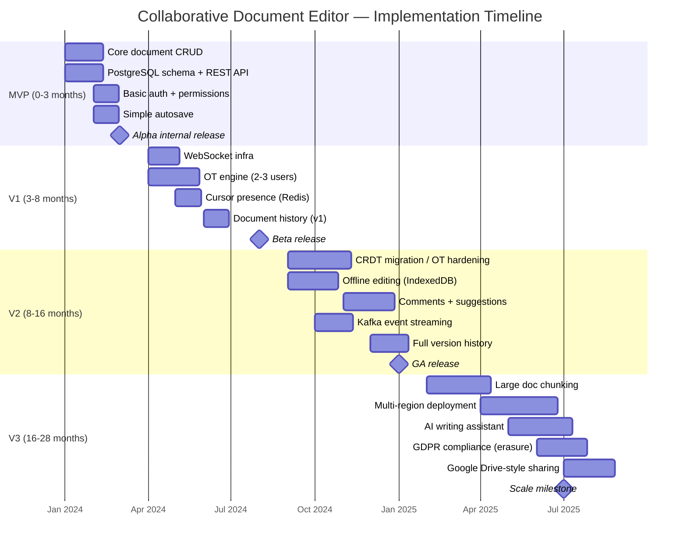
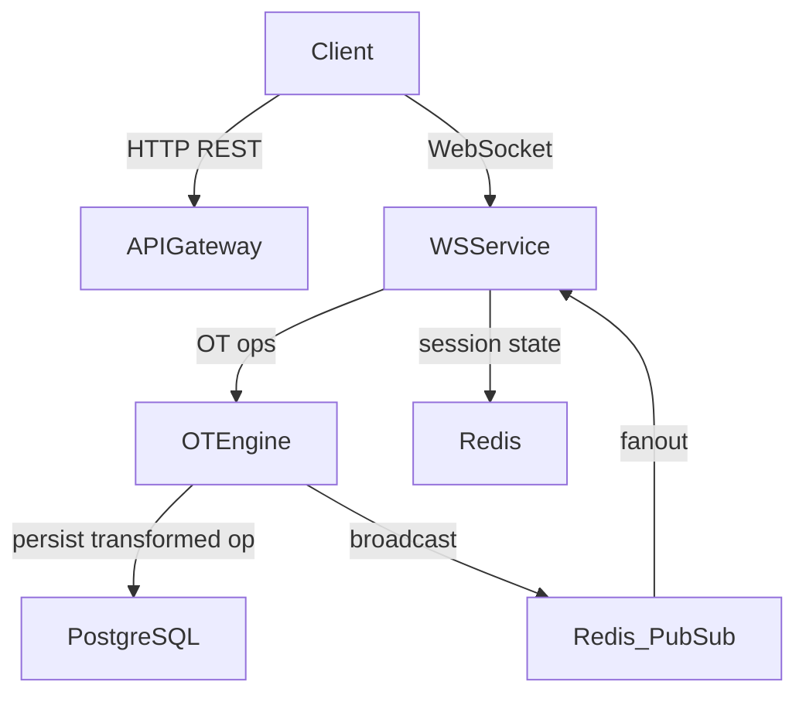
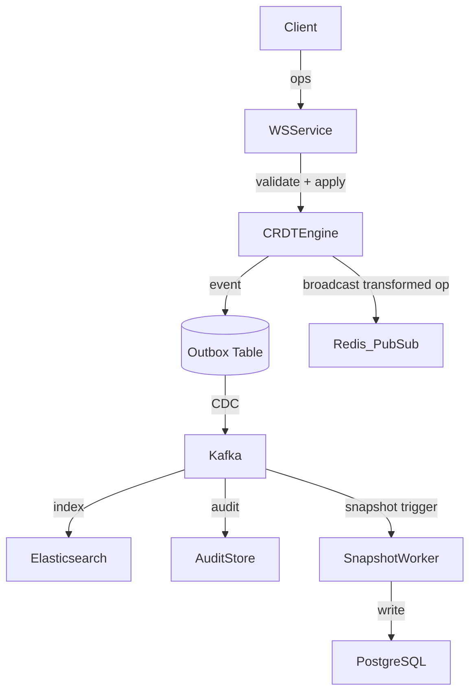

# 15 — Implementation Roadmap

## Objective

Define a phased, production-realistic implementation plan for a collaborative document editor at Google Docs scale (1B documents, 100M DAU). Each phase establishes clear success criteria, architecture evolution, infrastructure evolution, team composition, and explicit overengineering warnings to keep delivery grounded.

---

## Phase Overview

---

## MVP (Months 0–3): Single-User Document Editing

### Features
- Create, read, update, delete documents (rich text stored as JSON delta or HTML)
- Versioned autosave (snapshot every 30 seconds or on idle)
- Basic JWT authentication and role-based access (owner / viewer)
- REST API with OpenAPI spec
- Flat PostgreSQL schema: documents, snapshots, users, permissions
- Simple browser editor (ProseMirror or Quill as frontend library — no custom editor)

### Architecture
- Modular monolith. Single Spring Boot application, single PostgreSQL instance.
- No event bus. Direct synchronous writes. No WebSockets.
- Document stored as a single JSON blob per version. No delta compression.

### Infrastructure
- Single EC2/GKE node or small k8s deployment (1-3 pods)
- PostgreSQL RDS (single instance, small)
- Basic CI/CD (GitHub Actions → Docker → ECR)
- No Redis, no Kafka, no Elasticsearch

### Team
- 2 backend engineers, 1 frontend engineer, 1 QA

### Success Criteria
- A user can create a document, edit it, and reload it with content preserved
- Autosave works under simulated 5 RPS load
- API latency p99 < 200ms for document fetch
- Auth tested with 10 concurrent users

### Risks
- Storing document as a full JSON blob per snapshot will not scale past ~1MB documents — acceptable for MVP
- No conflict model means last-write-wins on concurrent edits — acceptable because real-time collaboration is out of scope

### Overengineering Warning
Do NOT implement OT, CRDT, Kafka, or WebSockets at this phase. The temptation to "design for scale" before validating core UX will burn weeks on infrastructure that may be redesigned anyway once real collaborative editing patterns are observed.

---

## V1 (Months 3–8): Real-Time Collaboration for Small Groups

### Features
- WebSocket connections per document session (Spring WebSocket or dedicated Node.js/Go WebSocket service)
- Operational Transformation (OT) engine supporting 2–5 concurrent editors
- Cursor presence: each connected user sees others' cursor positions in real-time
- Named awareness (user avatar, color coding)
- Document session management via Redis (active editors, operation queue)
- Basic version history: list of named snapshots with restore capability
- Document sharing via link (view / comment / edit roles)

### Architecture Evolution
- Extract WebSocket handling into a dedicated service or sidecar to avoid blocking HTTP threads
- Introduce Redis for: WebSocket session state, operation buffering, cursor position pub/sub
- OT server becomes a stateful component — one authoritative server per document session (no distribution yet)
- REST API remains the authority for persistent document state; WebSocket layer is ephemeral

### Infrastructure
- Dedicated WebSocket service (2–4 pods, stateless via Redis)
- Redis cluster (session, pub/sub)
- PostgreSQL with one read replica for history queries
- Horizontal pod autoscaler on WebSocket tier

### Team
- Add 1 backend engineer (OT specialist or strong distributed systems background)
- Total: 3 backend, 1 frontend, 1 QA, 1 DevOps part-time

### Success Criteria
- 3 concurrent editors on same document, no lost operations under simulated network jitter
- Cursor positions update within 100ms p99
- OT convergence verified with fuzz tests (at least 1000 randomized concurrent-op sequences)
- WebSocket reconnect and state resync within 2 seconds

### Risks
- OT correctness is notoriously difficult. A subtle transformation function bug may only appear with 3+ users on specific operation sequences. Budget dedicated testing time.
- Single authoritative OT server per document is a bottleneck and single point of failure — accept this for V1, plan mitigation in V2
- Redis pub/sub under document fan-out (many editors) can become hot — cap concurrent editors at 10 for V1

### Overengineering Warning
Do NOT attempt to distribute the OT engine across multiple servers in V1. Distributed OT requires vector clocks or causal ordering protocols that add significant operational complexity. A single authoritative server per document with failover is the correct V1 tradeoff.

---

## V2 (Months 8–16): Production-Grade Collaboration

### Features
- CRDT migration OR hardened OT with full convergence guarantees for 10+ concurrent editors
- Offline editing: clients buffer operations locally (IndexedDB), sync on reconnect using causally-ordered rebasing
- Full version history: event log per document, diff viewer between versions, named snapshots
- Comments and suggestion mode: threaded comments anchored to ranges, tracked changes (accept/reject workflow)
- Kafka integration: document operation events published for downstream consumers (analytics, search indexing, audit)
- Elasticsearch indexing for full-text search across document content
- Rate limiting per user/document to prevent op-storm DoS

### Architecture Evolution
- Introduce event sourcing for document state: operation log is the source of truth, snapshots are materialized views
- Kafka becomes the backbone for: operation persistence acknowledgment, search indexing pipeline, audit trail
- Outbox pattern on the OT/CRDT server to guarantee operation durability before broadcast
- CRDT (Yjs or custom LSEQ variant) preferred over OT if team has capacity — eliminates server-side transformation burden

### Infrastructure
- Kafka cluster (3 brokers, replication factor 3)
- Elasticsearch cluster for search
- S3/GCS for document snapshots and binary attachments
- PostgreSQL partitioned by document creation date
- WebSocket service scaled to 50K concurrent connections per pod (target)
- Offline sync worker pods

### Team
- Total: 5 backend, 2 frontend, 2 QA/SDET, 1 DevOps, 1 data engineer (Kafka pipelines)

### Success Criteria
- 10 concurrent editors converge correctly after simulated partition (30-second network disconnect then reconnect)
- Offline edits from two users merge without data loss on reconnect
- Full-text search results within 500ms p95
- Version history loads 100-version list within 200ms

### Risks
- CRDT state size grows unbounded without compaction — implement periodic garbage collection
- Kafka consumer lag on indexing pipeline can cause search staleness — design acceptable SLO (e.g., search reflects edits within 5 seconds)
- Comment anchoring breaks when underlying text is deleted — this is a known hard problem, design explicit anchor drift/invalidation strategy

### Overengineering Warning
GDPR right-to-erasure from event logs is a V3 concern — do not add cryptographic erasure or event log redaction at this phase. Placeholder tombstones are sufficient for V2. Implementing full compliance machinery before scale is confirmed wastes engineering months.

---

## V3 (Months 16–28): Hyperscale and Platform Extensions

### Features
- Large document support: chunk documents into 64KB–256KB segments, lazy-load chunks in frontend (virtual rendering)
- Multi-region deployment: active-active with region-local OT/CRDT engines and cross-region conflict resolution on reconnect
- Google Drive-style folder hierarchy with permission inheritance
- AI writing assistant: grammar correction, autocomplete, summarization injected as non-blocking suggestions
- GDPR compliance: right-to-erasure from version history via cryptographic deletion or event log redaction pipeline
- Compliance audit log (immutable, tamper-evident)
- Export pipeline: async PDF/DOCX/HTML export via dedicated job queue

### Architecture Evolution
- Document chunking requires a chunk-aware CRDT — operations must reference chunk IDs, not absolute document offsets
- Multi-region requires: regional WebSocket entry points, per-region operation logs with async cross-region replication, conflict resolution at region merge
- AI suggestions delivered as a separate ephemeral operation type that does not enter the canonical operation log unless accepted
- Export service as an independent microservice consuming Kafka snapshot events

### Infrastructure
- Multi-region Kubernetes (GKE/EKS) with global load balancer (Anycast)
- Per-region PostgreSQL with async replication to secondary regions
- Per-region Kafka clusters with MirrorMaker2 cross-region replication
- CDN for static document assets and read-heavy document fetches
- GPU inference service (or managed API) for AI suggestions
- Dedicated export worker fleet (CPU-heavy PDF rendering)

### Team
- Total: 12-15 backend, 4 frontend, 3 QA/SDET, 2 DevOps/SRE, 1 ML engineer, 1 compliance engineer

### Success Criteria
- Documents up to 10MB load and render within 3 seconds on median hardware
- Cross-region failover completes within 30 seconds with zero data loss
- GDPR erasure request processed and propagated within 30 days (regulatory SLA)
- AI suggestions appear within 500ms of user pause, do not block editing

### Risks
- Chunk-aware CRDT is a research-level problem. Commercial alternatives (Liveblocks, Automerge) should be evaluated before building custom.
- Multi-region conflict resolution during partition recovery is the hardest distributed systems problem in this stack — underestimate at your peril
- AI integration adds latency dependency on inference service; must be fully async and degradable

### Overengineering Warning
Multi-region active-active is only justified above ~50M DAU with strict latency SLAs per region. Most companies at this scale run active-passive with fast failover. Do not build active-active before you have measured the actual latency complaints from specific regions.

---

## Cross-Phase Tradeoffs Summary

| Dimension | MVP | V1 | V2 | V3 |
|---|---|---|---|---|
| Conflict resolution | None (last-write-wins) | Server-side OT | CRDT or hardened OT | Chunk-aware CRDT |
| Consistency model | Strong (single writer) | Eventual (OT convergence) | Causal (CRDT + offline) | Causal + cross-region |
| Storage model | JSON blob per snapshot | Event log + snapshots | Event-sourced + Kafka | Chunked event log |
| Infra complexity | Low | Medium | High | Very High |
| Team size | 4 | 6 | 11 | 15+ |
| Biggest risk | Scope creep | OT correctness | CRDT compaction | Multi-region split-brain |

---

## Interview Discussion Points

- **Why not start with CRDT at MVP?** CRDT implementations (especially Yjs or Automerge) have significant learning curve and operational overhead. A single-writer MVP proves product value before committing to CRDT complexity.
- **What breaks first at V1 scale?** The single authoritative OT server per document. Under pod restart or failover, in-flight operations can be lost. This motivates the Outbox pattern and event log in V2.
- **How do you handle offline edits that diverge over days?** Causal ordering via vector clocks or CRDT operation IDs allows rebasing even stale local states. The user may see a "merge conflict" UI prompt for irreconcilable semantic conflicts (e.g., both users deleted the same section independently).
- **What is the startup vs FAANG difference here?** A startup ships V1 OT and lives with its limitations for 2 years. FAANG invests in CRDT research (Google's own Peritext research paper) and builds custom conflict-free data types optimized for rich text. The startup tradeoff is correct — don't FAANG-scale a 50-person company.
- **How does GDPR erasure interact with event sourcing?** This is the hardest compliance problem in event-sourced systems. Options: cryptographic deletion (encrypt PII, delete keys), event log redaction (replay log minus deleted events, rewrite snapshots), or tombstone markers with deferred physical deletion. Each has cost and correctness implications.
