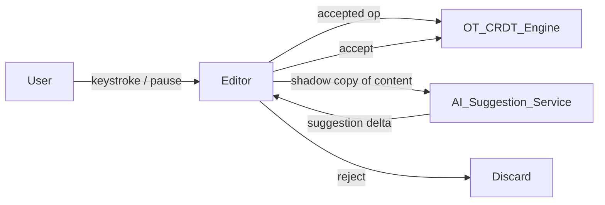
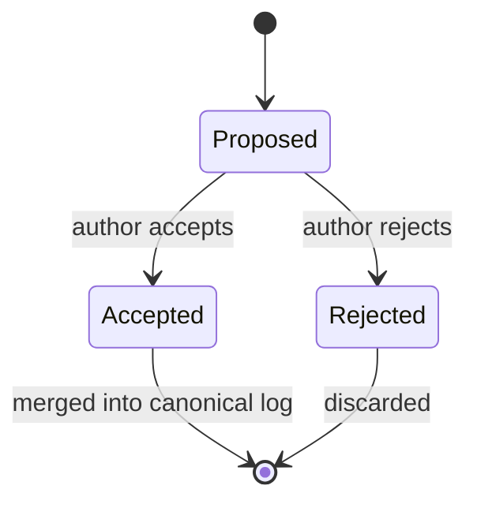
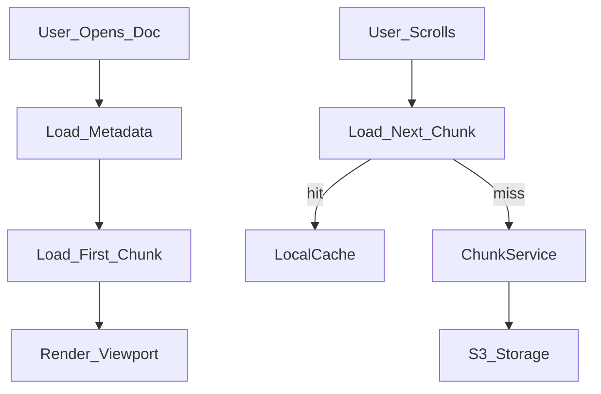
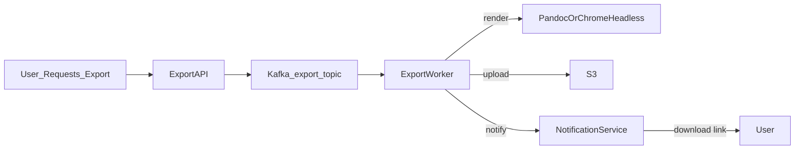

# 16 — Advanced Improvements

## Objective

Examine the hardest architectural problems in a production-grade collaborative document editor: AI integration without breaking consistency guarantees, large document performance, export pipelines, compliance at scale, and an honest self-critique of where this design will buckle under FAANG-level scrutiny. This file is explicitly adversarial — it exists to surface what was left unsaid in the preceding design documents.

---

## AI Writing Assistant Integration

### Architecture Decision

AI suggestions (grammar correction, autocomplete, summarization) must be treated as **ephemeral, non-canonical operations** — they must never enter the primary operation log unless the user explicitly accepts them. This is the central architectural constraint.

**Injection point in the pipeline:**

The AI suggestion service operates on a **read-only shadow copy** of the document state. It never writes to the operation log. Suggestions are delivered as a separate ephemeral UI layer (ghost text) that disappears on the next keystroke if not accepted.

### Real-Time AI Without Breaking Consistency

- AI calls are async and non-blocking. The editor does not wait for AI response before processing user operations.
- If the document state changes before the AI suggestion arrives (another user typed), the suggestion is invalidated by the client — never applied against a stale anchor position.
- Anchor positions must be encoded as CRDT stable IDs (not character offsets), so that concurrent insertions/deletions do not corrupt suggestion positioning.
- Rate limit AI calls: trigger on idle pause (300ms debounce), not on every keystroke. This reduces inference costs by ~90%.

### Startup vs FAANG Difference

A startup integrates a managed API (OpenAI, Anthropic, Gemini) via HTTP. FAANG runs dedicated inference infrastructure co-located with document servers to achieve sub-100ms latency. Both approaches are valid — the architectural pattern (ephemeral suggestion layer) is identical.

---

## Spreadsheet and Table Support as Embedded Rich Content

### Problem

Tables and spreadsheet grids are fundamentally different from prose text: they have two-dimensional structure, formula evaluation, cell-level permissions, and independent scroll behavior. Embedding them in a prose document creates a nested CRDT problem.

### Approach

- Treat tables as **embedded document objects** with their own CRDT instance, referenced by a stable ID in the parent document's operation log.
- The parent CRDT tracks the table's position as a single atomic element. The table's internal CRDT handles cell-level conflicts independently.
- Formula evaluation happens server-side on a dedicated compute tier — formulas reference cell IDs, not positions, so insertions/deletions do not corrupt formula references.
- Spreadsheet ranges with 10K+ cells require pagination and virtual rendering — the full cell graph is never sent to the client at load time.

---

## Comments and Suggestion Mode Architecture

### Tracked Changes (Suggestion Mode)

Suggestion mode introduces a second class of operations: **proposed changes** that are visible but not part of the canonical document until accepted.

- Proposed operations are stored in a separate **suggestion log**, not the main operation log.
- Accepting a suggestion creates a new canonical operation referencing the suggestion ID.
- Rejecting a suggestion tombstones it. The document state is unaffected.
- Conflicts between suggestions and concurrent canonical edits are resolved by rebasing the suggestion against the canonical log state at acceptance time — not at proposal time.

### Comment Anchor Drift

Comments are anchored to text ranges. When the underlying text is edited, the anchor must drift with the text. This is a known hard problem:

- **CRDT approach**: Anchors reference stable CRDT node IDs on either side of the range. As text is inserted/deleted, the anchor range expands or contracts relative to those node IDs.
- **OT approach**: Anchors are transformed by each subsequent operation, same as cursor positions.
- **Edge case**: If the anchored text is entirely deleted, the comment is orphaned. Surface this to the user explicitly rather than silently hiding the comment.

---

## Version Diffing at Scale

### Semantic Diff vs Line Diff

Line-based diff (git-style) is meaningless for rich text — a single paragraph reformat shows as a full-paragraph change. Semantic diff must operate at the operation level:

- Compare two document snapshots by replaying the operation log between them
- Group operations by semantic intent: insertion, deletion, formatting, structural change
- Surface grouped changes in a human-readable diff viewer (similar to Google Docs "See version history")

### Scale Challenge

At 1B documents with frequent edits, full operation log replay for arbitrary version comparisons is O(n) in operation count. Mitigations:

- **Snapshot checkpointing**: Store full snapshots every 100 operations. Diff computation between two versions requires replaying at most 100 operations from the nearest checkpoint.
- **Operation summarization**: Compress consecutive single-character insertions into word-level insertion events in the stored log. This reduces log size by ~80% without losing semantic information.
- Diff computation is a read-heavy async job — never run on the critical write path.

---

## Multi-Language Collaborative Editing

### RTL (Arabic, Hebrew) and BiDi Text

- RTL text direction must be a document-level or block-level attribute, not a character-level attribute
- CRDT operations for RTL insertions must respect visual cursor position vs. logical character position — these diverge in BiDi paragraphs
- Use Unicode BiDi algorithm (UBA) for rendering; do not attempt to re-implement direction logic in the CRDT

### CJK Character Handling

- CJK input via IME (Input Method Editor) creates a "composition session" where uncommitted characters must not enter the CRDT operation log until IME confirms the input
- The editor must buffer IME-in-progress characters as local ephemeral state, not as CRDT operations
- This is a common source of bugs in collaborative editors: premature flushing of IME state causes duplicated characters for other users

---

## Large Document Performance

### Virtual Rendering

- Documents over ~500KB cannot be fully rendered in the DOM without performance degradation
- **Virtual rendering**: only render the viewport + 2-screen buffer above and below
- Chunk the document into ~64KB segments. Each chunk is independently renderable.
- When the user scrolls, load the next chunk asynchronously from the server (or from client-side IndexedDB if already cached)

### Chunk-Aware CRDT

- Character offsets break when documents are chunked — an operation referencing "character 150,000" is meaningless when the document is split across chunks
- Stable CRDT node IDs (UUIDs assigned to each character/block at creation) solve this: operations always reference node IDs, never offsets
- Chunk boundaries are implementation details of the storage layer, invisible to the CRDT

### Lazy Loading Strategy

---

## Export Pipeline

### Architecture

Exports (PDF, DOCX, HTML) are CPU-intensive and should never block the document API path.

- Export workers are stateless, horizontally scalable
- PDF rendering via headless Chrome (Puppeteer) or Pandoc depending on fidelity requirements
- Large document exports (100+ pages) are paginated: render chunks in parallel, merge PDF pages server-side
- Export jobs are idempotent: same document version + format = same output (cacheable in S3 by content hash)

---

## Permissions Inheritance from Folder Hierarchy

### Problem

Google Drive-style permissions require evaluating inherited permissions from parent folders, which creates a tree traversal on every permission check.

### Approach

- Materialize effective permissions at document creation and on every permission change event
- Store effective permissions in a flat lookup table: (user_id, document_id, effective_role)
- Rebuild the materialized permissions when parent folder permissions change — this is a background async job, not a synchronous check
- For real-time checks, the materialized table is the authoritative source (no tree traversal at read time)
- **Consistency tradeoff**: There is a window (seconds to minutes) where a folder permission change has not yet propagated to all child documents. This is acceptable — eventual consistency is standard in Drive-style systems. Make the staleness window explicit in your SLO.

---

## Data Residency Compliance

### EU Data Residency

GDPR requires that personal data of EU residents not leave EU infrastructure without consent. For a document editor:

- Route EU users to EU-region WebSocket endpoints and document storage
- Partition Kafka topics by region — EU operations never flow to US Kafka brokers
- PostgreSQL partitions are region-scoped; cross-region replication is opt-in and consent-gated
- S3 bucket policies enforce region restriction at the infrastructure level

### GDPR Right to Erasure from Event Log

Event sourcing and GDPR erasure are in fundamental tension: the event log is append-only by design, but GDPR requires deletion of personal data.

**Mitigation strategies (choose one):**

| Strategy | Mechanism | Cost | Completeness |
|---|---|---|---|
| Cryptographic deletion | Encrypt PII with per-user key, delete key | Low operational cost | High — data is unreadable |
| Event log redaction | Replay log minus deleted events, rewrite snapshots | High computational cost | Complete physical deletion |
| Tombstone + deferred delete | Mark events as deleted, physically purge in batch | Medium | Complete, with delay |

Cryptographic deletion is the pragmatic production choice. Physical redaction is theoretically complete but requires full event log replay — extremely expensive at scale.

---

## Architectural Self-Critique

### 1. OT/CRDT Complexity as the #1 Operational Burden

Operational Transformation correctness requires that the transformation function satisfy **TP1** and **TP2** (transformation properties). TP2 is extremely difficult to implement correctly for all operation pairs in rich text (insert, delete, format, structural). Most OT implementations in production violate TP2 for rare operation sequences and paper over it with operational heuristics.

CRDT (specifically Yjs or Automerge) eliminates the need for transformation functions but introduces: unbounded state growth, tombstone accumulation, and complex garbage collection. Neither approach is free.

**FAANG interviewer challenge**: "Walk me through what happens when two users simultaneously delete the same paragraph — what does your OT transformation function produce, and how do you verify it's correct?" Most candidates cannot answer this concretely. The correct answer requires understanding causality, operation ordering, and idempotency at the algorithm level.

### 2. WebSocket Connection Scalability Ceiling

A single WebSocket server pod can sustain ~50K–100K concurrent connections with careful tuning (epoll, connection pooling, minimal per-connection state). At 100M DAU with 10% concurrency = 10M concurrent WebSocket connections, you need 100–200 WebSocket server pods.

The ceiling is not connections — it is **broadcast fan-out**. When a document has 100 concurrent editors, one operation triggers 99 outbound WebSocket writes. At 10K ops/second per document × 100 editors, this is 990K outbound writes/second from a single document session. This overwhelms per-document pub/sub without careful sharding.

**Mitigation**: Cap concurrent editors per document at 50 with a queue for additional viewers. Use a dedicated broadcast tree (not all-to-all) for large sessions.

### 3. Event Log Compaction and Storage Growth

An active document accumulating 10K ops/second generates ~864M operations per day. At 100 bytes per operation, this is 86GB per document per day. At 1B active documents, this is petabytes of operation log growth daily.

Compaction is non-negotiable. The compaction strategy must:
- Run asynchronously without blocking reads or writes
- Preserve the ability to reconstruct any historical snapshot (for version history)
- Not violate GDPR tombstone semantics

The compaction design is typically underspecified in system design interviews. Have a concrete answer.

### 4. Early OT Commitment Tech Debt

Teams that implement OT in V1 often cannot migrate to CRDT in V2 because:
- OT operations are serialized and stored in a format incompatible with CRDT state vectors
- Client-side editor libraries (ProseMirror, CodeMirror) have OT plugins that assume server-side transformation — switching to CRDT requires client-side library changes
- Existing document snapshots cannot be trivially converted to CRDT state

**Mitigation**: Design the operation log schema to be conflict algorithm-agnostic from day one. Store raw operations with causal metadata (client ID, logical clock, parent operation ID). This allows future migration without full log rewrite.

### 5. Five Explicit Design Weaknesses

| # | Weakness | Impact | Mitigation |
|---|---|---|---|
| 1 | Single authoritative OT server per document | SPOF; failover loses in-flight ops | Outbox pattern + operation log idempotency |
| 2 | Redis pub/sub for cursor presence at scale | Memory exhaustion on hot documents | Cap editors per document; use lightweight presence protocol |
| 3 | Snapshot-based version history (not full event replay) | History gaps if snapshot misses edits | Treat operation log as source of truth; snapshots are cache only |
| 4 | Naive export pipeline blocking on large documents | Timeouts, OOM on 500-page documents | Chunk-parallel rendering, streaming PDF assembly |
| 5 | Permissions materialization lag | Brief window of stale access control | Accept eventual consistency; log all access for audit |

### 6. Scaling Limits Per Component

| Component | Current Design Limit | Why | Mitigation |
|---|---|---|---|
| WebSocket server | ~100K connections/pod | OS socket limits, memory | Horizontal scaling, connection pooling |
| OT engine (single server) | ~5K ops/sec per document session | CPU-bound transformation | Shard by operation type; CRDT offloads to client |
| Event store (PostgreSQL) | ~50K writes/sec (single primary) | WAL throughput | Partition by document ID; Kafka as write buffer |
| Redis pub/sub (cursor presence) | ~1M messages/sec cluster-wide | Network bandwidth | Cap subscribers per channel; TTL-expire idle presence |
| Elasticsearch indexing | ~10K docs/sec ingestion | Index merge cost | Bulk indexing with 1-5 second commit interval |

---

## Interview Discussion Points

- **Why not use a managed CRDT service (Liveblocks, PartyKit)?** At Google Docs scale, vendor dependency at the core conflict resolution layer is a strategic risk. Below 10M DAU, managed CRDT is likely the correct tradeoff — faster to market, proven correctness. Above 10M DAU, the operational control and cost optimization of owning the CRDT justify the engineering investment.
- **How do you test OT/CRDT correctness?** Property-based testing (e.g., QuickCheck or ScalaCheck-style) with randomly generated concurrent operation sequences. Define convergence as the property: any two clients that receive the same set of operations in any order must reach identical document state. This property must hold for millions of randomized test cases.
- **What does eventual consistency mean for a collaborative editor?** It means two clients who both stop editing will eventually see the same document state, but there is no guarantee about which of two concurrent edits "wins" — only that both are incorporated without silent data loss. Users may be surprised when their deletion is "undone" by a concurrent insertion. Surfacing this in the UI (operation attribution, undo history) is a product problem as much as an engineering one.
- **Where does the design fall short for a 10-person startup?** The Kafka + Elasticsearch + chunking + multi-region stack described in V2/V3 is 18+ months of engineering for a small team. A startup should use Yjs (client-side CRDT), a managed WebSocket service (Ably, Pusher), and PostgreSQL full-text search until they have measurable evidence that these components are the bottleneck.
