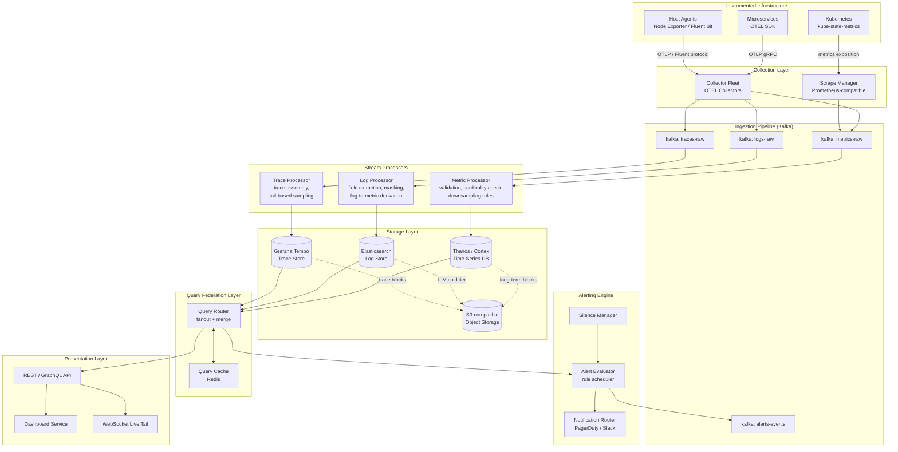
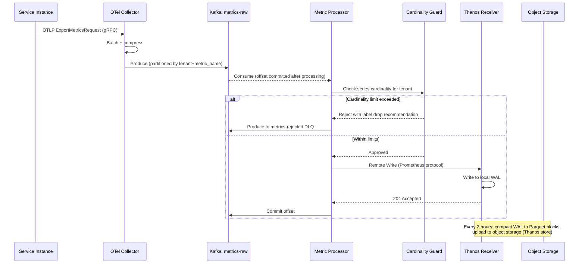
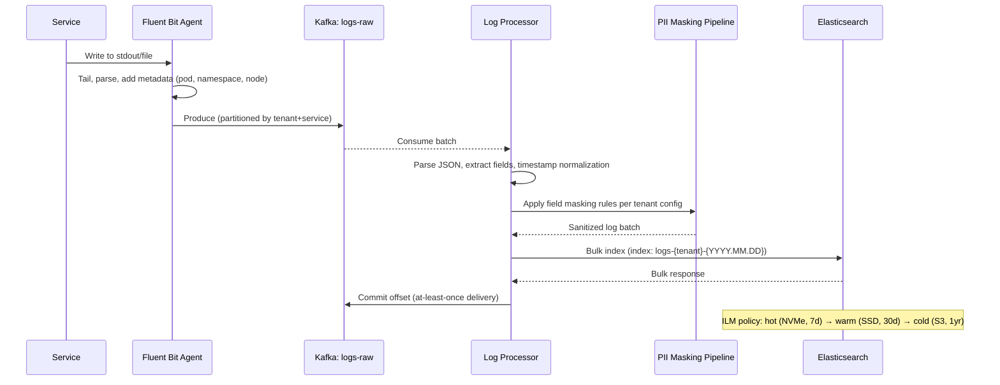
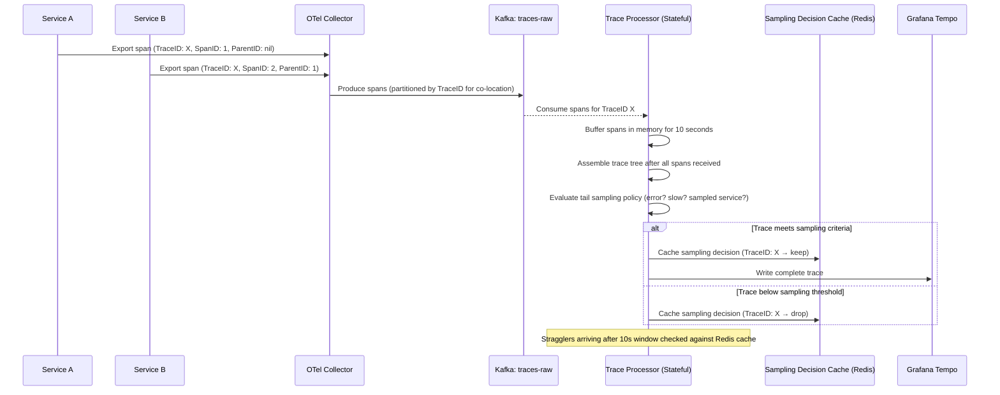
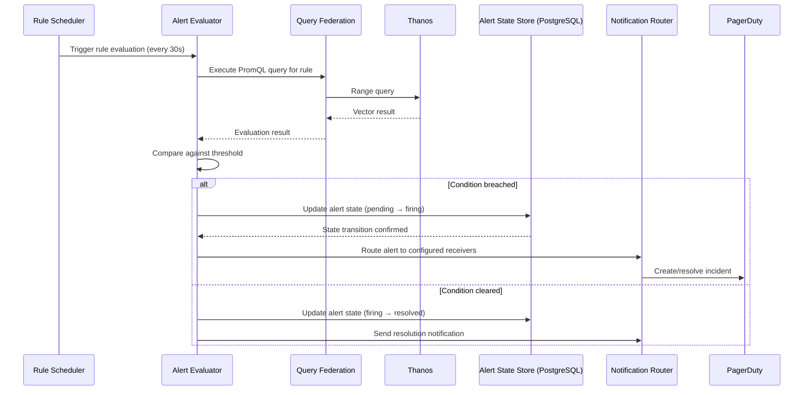

# 01 — High-Level Architecture: Metrics & Monitoring Platform

---

## Objective

Define the top-level architectural approach for the observability platform, justify the choice of Event-Driven Microservices, show the complete data flow from signal emission to visualization and alerting, and establish the separation of concerns that allows independent scaling of ingestion, storage, and query paths.

---

## 1. Architecture Decision: Event-Driven Microservices

### 1.1 Why Event-Driven Microservices?

The observability platform handles three fundamentally different signal types — metrics (numeric time-series), logs (unstructured/structured text), and traces (graph-structured spans) — each with radically different storage backends, query semantics, ingestion rates, and latency requirements. This heterogeneity rules out a unified monolithic design.

**Key drivers:**

| Driver | Implication |
|---|---|
| Heterogeneous signal types | Each signal type needs a purpose-built storage backend; a single storage abstraction is a performance anti-pattern |
| Ingestion >> query throughput | Write path must scale independently of read path; coupling them wastes resources and creates availability entanglement |
| Spiky ingestion patterns | Kafka buffers burst traffic so storage backends are never overwhelmed by coordinated scrape cycles or incident-driven log spikes |
| Failure isolation | An Elasticsearch cluster failure must not prevent metric ingestion; Kafka decouples producers from consumers |
| Independent evolution | The log parsing pipeline evolves independently from the alerting engine; separate deployments reduce blast radius |
| Multi-tenancy | Per-tenant routing and quota enforcement is naturally expressed as stream processing logic on Kafka topics |

### 1.2 Why NOT a Modular Monolith?

A modular monolith is appropriate when data models are closely related and services communicate predominantly through in-process calls. This platform's signal types share no storage model, and their write paths must scale from 10× independently. Collocating metric and log storage in a single process creates:

- JVM heap pressure from competing workloads
- Deployment coupling: upgrading the log parser requires redeploying metric storage
- Inability to use purpose-built storage (you cannot embed Prometheus TSDB and Elasticsearch in the same JVM sensibly)
- Single failure domain destroying all observability simultaneously

A modular monolith could be a valid MVP choice for a team of 2-3 engineers with a single-tenant use case, but it must be treated as a temporary architecture with a documented decomposition plan.

### 1.3 Why NOT a Pure Microservices REST Architecture?

Synchronous REST between ingestion and storage creates:

- Back-pressure and head-of-line blocking during storage slowdowns
- Lost data if the storage service is unavailable when ingestion receives data
- Complex retry logic distributed across dozens of services
- Harder to implement tail-based trace sampling (requires buffering before routing decisions)

Event streaming via Kafka solves all of these: producers write to durable topics regardless of consumer availability; consumers replay from committed offsets; sampling decisions can be made on buffered span windows.

---

## 2. CQRS Application to the Platform

The platform applies Command Query Responsibility Segregation at the signal level:

**Write path (Command):** Agent → Collector → Kafka → Ingestion Processors → Storage backends
**Read path (Query):** Query Federation Layer → Storage backends → Cache → Response

This separation is critical because:
- Write path throughput is 3–4 orders of magnitude higher than read path
- Write path is append-only (no locking)
- Write path needs to be optimized for LSM-tree / WAL sequential writes
- Read path needs to be optimized for scatter-gather across storage backends and cache hit maximization
- Schema evolution (adding new label dimensions) must not lock the write path

The write and read paths have **separate API gateways, separate deployments, and separate scaling groups.**

---

## 3. System Overview Diagram

---

## 4. Detailed Data Flow Diagrams

### 4.1 Metric Ingestion Flow

### 4.2 Log Ingestion Flow

### 4.3 Tail-Based Trace Sampling Flow

### 4.4 Alert Evaluation Flow

---

## 5. Service Boundaries & Responsibilities

| Service | Responsibility | Scaling Axis |
|---|---|---|
| Collector Fleet | Protocol translation, batching, fan-out to Kafka | Horizontal; stateless; scale with monitored instance count |
| Scrape Manager | Target discovery, pull-based metric collection | Horizontal with consistent-hash sharding of targets |
| Metric Processor | Cardinality validation, tenant routing, downsampling trigger | Horizontal Kafka consumer group; partition count drives parallelism |
| Log Processor | Field extraction, PII masking, log-to-metric derivation | Horizontal Kafka consumer group |
| Trace Processor | Span buffering, trace assembly, tail sampling | Stateful; must be consistent-hash sharded by TraceID |
| Thanos Receiver | Remote write endpoint, WAL, block compaction | Horizontal with hash ring for write distribution |
| Elasticsearch | Log indexing and full-text search | Horizontal with index sharding per tenant per day |
| Grafana Tempo | Trace storage and retrieval | Horizontal; TraceID hashing for storage placement |
| Alert Evaluator | Rule scheduling, threshold evaluation, state management | Horizontal with rule set partitioning; Raft for leader election |
| Query Federation | Fanout queries to multiple backends, result merging, caching | Stateless horizontal scaling behind load balancer |
| Dashboard Service | Dashboard CRUD, rendering, template variable resolution | Stateless horizontal scaling |
| Notification Router | Alert routing, deduplication, silence checking | Stateless horizontal; idempotent via deduplication key |

---

## 6. Technology Choices

| Component | Technology | Justification |
|---|---|---|
| Ingestion buffer | Apache Kafka | Durable, ordered, partitioned; handles burst absorption; replay for recovery |
| Time-series storage | Thanos over Prometheus | Adds global query view, unlimited retention via object storage, multi-tenancy, HA |
| Log storage | Elasticsearch | Mature full-text search; ILM for tiered storage; widely understood operationally |
| Trace storage | Grafana Tempo | Cost-efficient: stores traces in object storage (S3); scales to billions of spans cheaply |
| Object storage | S3-compatible (MinIO/AWS S3) | Provider-agnostic; cost-efficient for cold/warm data |
| Query cache | Redis | Low-latency; TTL-based eviction; shared across query federation instances |
| Alert state | PostgreSQL | ACID guarantees for state transitions; alert history requires relational queries |
| Config/discovery | PostgreSQL + etcd | PostgreSQL for durable config; etcd for distributed coordination and scrape target distribution |
| Collector | OpenTelemetry Collector | Protocol-agnostic; supports OTLP, Prometheus, Zipkin, Jaeger, Fluent; extensible pipeline |
| Service mesh | Istio | mTLS between services; traffic management; eliminates need for per-service auth in internal calls |
| API gateway | Envoy | Rate limiting, auth JWT validation, routing to write vs read paths |

---

## 7. Migration Path: From MVP to Full Architecture

### Phase 0 — Single-Node MVP (1 engineer, 1 tenant)

Single OTel Collector, single Prometheus instance, single Elasticsearch node, basic Grafana dashboards. No Kafka. Ingestion is direct write. This is intentionally not production-grade; it establishes the data model and API contracts.

**Scale limit:** ~1M active series, ~100K log lines/second, single tenant.

### Phase 1 — Add Kafka Buffer

Introduce Kafka as the ingestion buffer. Decouple Collector from storage backends. This is the most important architectural evolution: it makes the system resilient to storage failures without data loss. Stream processors become Kafka consumer groups.

**Scale limit:** ~10M active series, ~1M log lines/second.

### Phase 2 — Thanos for Metrics HA

Replace Prometheus single node with Thanos Receiver + Thanos Store Gateway + Thanos Compactor + Thanos Query. Add object storage for long-term metric retention. Enable multi-tenancy via tenant ID injection.

**Scale limit:** ~100M active series.

### Phase 3 — Elasticsearch Cluster + ILM

Multi-node Elasticsearch with hot/warm/cold tiers. ILM policies for automated data movement. Cross-cluster replication for disaster recovery.

**Scale limit:** Petabyte-scale log storage.

### Phase 4 — Trace Tail Sampling + Tempo

Replace head-based sampling in OTel Collector with tail-based sampling in a stateful Trace Processor. Introduce Grafana Tempo for object-storage-backed trace storage.

### Phase 5 — Global Query Federation + Multi-Region

Thanos Query Frontend with query sharding. Cross-region Kafka replication (MirrorMaker2). Read replicas in secondary regions. Geo-routed dashboard queries.

---

## 8. Tradeoffs Summary

| Decision | Benefit | Cost |
|---|---|---|
| Kafka as ingestion buffer | Durability, burst absorption, replay | Operational complexity; adds ~2 seconds to ingestion latency |
| Thanos over native Prometheus | Unlimited retention, HA, global view | Significantly higher operational complexity; requires object storage tuning |
| Elasticsearch for logs | Powerful full-text search, mature tooling | Expensive at scale; operationally demanding; not ideal for very high ingest rates without careful index design |
| Tempo for traces | Extremely cost-efficient (object storage only) | Query performance lower than Jaeger with Cassandra; no trace-based analytics |
| CQRS write/read split | Independent scaling; no read/write contention | Two code paths; more services to operate |
| Tail-based sampling | Better sampling decisions (keep errors, slow traces) | Requires stateful processor with in-memory span buffer; complex failure handling |
| Multi-tenant shared infra | Cost efficiency; operational simplicity | Noisy neighbor risk; requires strict quota enforcement |

---

## 9. Alternatives Considered

| Alternative | Why Rejected |
|---|---|
| InfluxDB for all signals | Cannot handle log full-text search; trace model doesn't map to time-series |
| ClickHouse for metrics + logs | Excellent for analytics; less mature ecosystem for real-time alerting; strong contender for v2 |
| Loki for logs | Better cost efficiency than Elasticsearch for logs-only; lacks full-text inverted index; harder to do complex aggregations |
| VictoriaMetrics | Strong Prometheus replacement; excellent performance; less Thanos-compatible ecosystem |
| Single database (TimescaleDB) | Cannot handle the log and trace workloads at the required scale |

---

## 10. Risks & Bottlenecks

| Risk | Severity | Mitigation |
|---|---|---|
| Kafka consumer lag growing during Elasticsearch slowdown | High | Consumer lag monitoring with autoscaler; ILM tuning to prevent hot node saturation |
| Trace processor OOM during trace assembly | High | Memory limit per tenant; drop oldest incomplete traces under pressure; bounded buffer size |
| Cardinality explosion taking down Thanos Receiver | Critical | Per-tenant cardinality limits enforced at Metric Processor before write reaches TSDB |
| Alert evaluator becoming bottleneck at 1M+ rules | High | Horizontal scaling with rule sharding; vectorized batch evaluation |
| Cold object storage query latency degrading dashboard UX | Medium | Pre-fetch downsampled blocks; query caching in Redis; separate SLO for long-range queries |
| Elasticsearch split brain during network partition | High | Dedicated master nodes; minimum master nodes = (N/2)+1; avoid even-numbered master node counts |

---

## 11. Interview Discussion Points

**"Why Kafka and not a message queue like RabbitMQ?"**
RabbitMQ is message-oriented (each message consumed once, then deleted). Kafka is a distributed log: consumers maintain their own offsets and can replay from any position. This is critical for recovery scenarios: if Elasticsearch goes down for 2 hours, the Log Processor consumer group falls behind by 2 hours in Kafka but catches up on recovery without data loss. RabbitMQ cannot provide this guarantee.

**"How do you handle the thundering herd problem in metric scraping?"**
Prometheus scrapes all targets at the same configured interval. If 500,000 targets are scraped every 15 seconds, scrapes cluster around interval boundaries, creating coordinated write spikes. Mitigations: jitter scrape start times; use remote write batching in OTel Collector; Kafka absorbs the spike; Thanos Receiver uses WAL to smooth writes.

**"What is your disaster recovery strategy if the primary region goes down?"**
For metrics: Thanos stores compacted blocks in S3, which is cross-region replicated. A secondary region can stand up a Thanos Query + Store Gateway pointing at the same S3 bucket and serve historical queries within minutes. Real-time data (last 2 hours in WAL) may be lost. For logs: Elasticsearch cross-cluster replication (CCR) replicates hot indices to a secondary cluster asynchronously. For traces: Tempo object storage in S3; same recovery path as Thanos.

**"How would you handle a large enterprise customer with 100× the normal metric cardinality?"**
Dedicated Thanos Receiver shard for the tenant; separate Kafka topic partition group; higher cardinality quota in Cardinality Guard. Pricing model should reflect storage cost proportional to series count × retention × resolution.

**"When would you replace Elasticsearch with ClickHouse for logs?"**
ClickHouse outperforms Elasticsearch for analytical/aggregation queries (e.g., count errors by service over last 7 days). Elasticsearch outperforms ClickHouse for free-text search (inverted index). If >80% of log queries are analytical and structured (which is true in mature DevOps practices), ClickHouse is a better fit and significantly cheaper. Loki is the middle ground: uses object storage like Tempo, much cheaper than Elasticsearch, but limited query power.
