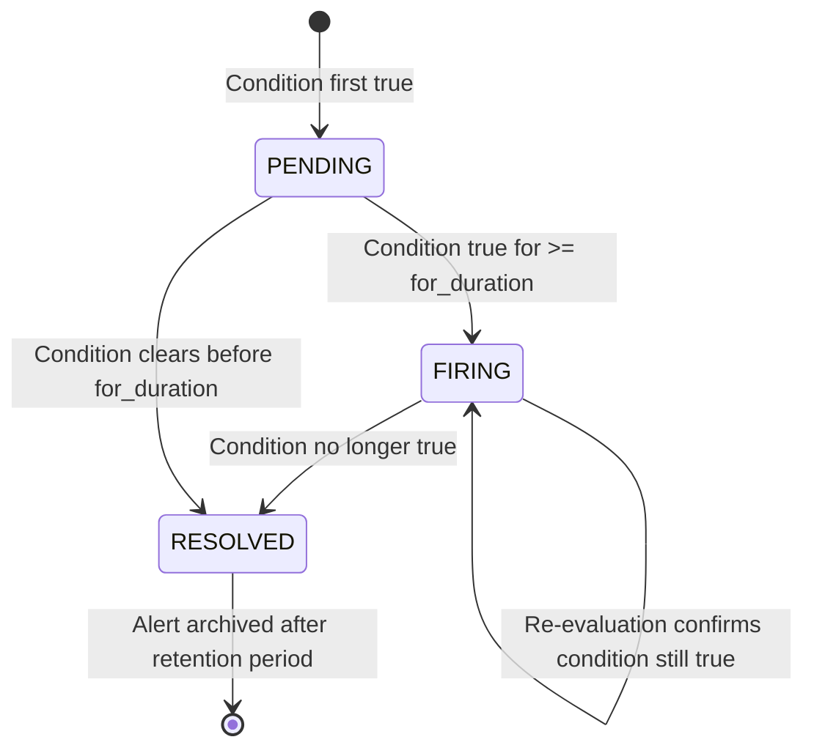
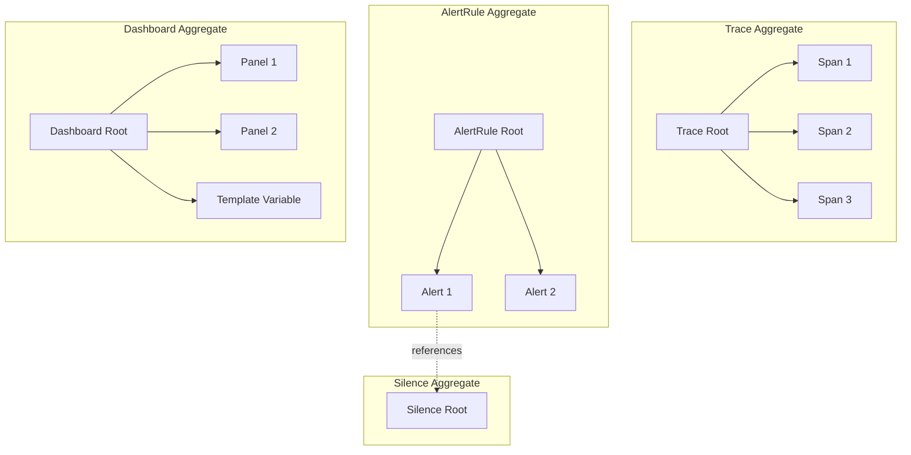
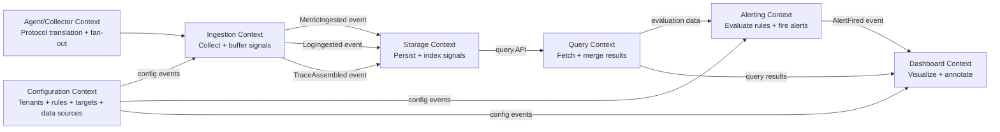

# 02 — Domain Modeling: Metrics & Monitoring Platform

---

## Objective

Define the core domain model using DDD principles: identify entities, aggregates, value objects, domain events, and the ubiquitous language shared across engineering, product, and operations teams. The goal is a model that accurately reflects the business and technical realities of an observability platform, not a data schema.

---

## 1. Ubiquitous Language

The following terms have precise meanings within this platform. Consistency in language across code, documentation, and conversations is mandatory.

| Term | Definition |
|---|---|
| Signal | Any observable data emitted by an instrumented system. Signals are categorized as Metric, Log, or Trace. |
| Metric | A numeric measurement of a system's behavior captured at a point in time, identified by a name and a set of labels. |
| Time Series | A sequence of (timestamp, value) samples for a specific metric name + label set combination. |
| Label | A key-value pair that adds dimensionality to a metric. Labels are immutable once a series is created. |
| Cardinality | The total number of unique time series. High cardinality is the primary operational risk for metrics storage. |
| Sample | A single (timestamp, value) data point within a time series. |
| Scrape | The act of the platform pulling metrics from a registered target's HTTP endpoint. |
| Remote Write | A push protocol where a client sends metric samples to the platform's ingestion endpoint. |
| Log Entry | A single line or structured event emitted by a service, carrying timestamp, level, message, and optional structured fields. |
| Trace | A directed acyclic graph of Spans representing the end-to-end execution of a single request across services. |
| Span | The unit of work within a Trace: a named operation with a start time, duration, service name, and optional attributes. |
| TraceID | A globally unique 128-bit identifier assigned to a request at entry and propagated through all downstream services. |
| SpanID | A 64-bit identifier unique within a Trace, identifying one unit of work. |
| Sampling | The act of deciding which traces to store. Head-based: decided at trace start. Tail-based: decided after the trace is assembled. |
| Alert Rule | A declarative definition of a condition over signals that, when met, triggers an Alert. |
| Alert | An instantiation of an Alert Rule that has fired, carrying state (pending, firing, resolved), labels, and annotations. |
| Inhibition | Suppression of an alert when another specified alert is firing (e.g., suppress service alerts when the whole datacenter alert fires). |
| Silence | A time-bounded muting of alerts matching a label set, typically used during planned maintenance. |
| Dashboard | A collection of Panels arranged in a grid, each Panel visualizing a query over one or more data sources. |
| Panel | A single visualization unit within a Dashboard: a graph, stat, table, heatmap, etc. |
| Data Source | A configured connection to a backend storage system (Thanos, Elasticsearch, Tempo) from which query results can be retrieved. |
| Scrape Target | A registered HTTP endpoint from which the Scrape Manager pulls metrics. |
| Recording Rule | A pre-computed query result written back into the time-series database periodically to speed up expensive dashboard queries. |
| Tenant | A logical organizational unit with isolated data, quotas, and access controls. Equivalent to an Organization in SaaS terms. |
| Annotation | A point-in-time marker overlaid on a time-series graph to indicate an external event (deployment, incident, etc.). |

---

## 2. Core Entities

### 2.1 Metric (Value-Object-like Entity)

A Metric describes the schema of a measurable signal. The actual data lives in Time Series samples.

**Attributes:**
- `metric_name` (String): Conventionally namespaced with underscores (e.g., `http_requests_total`)
- `type` (Enum): COUNTER, GAUGE, HISTOGRAM, SUMMARY
- `unit` (String): bytes, seconds, requests — follows OpenMetrics conventions
- `description` (String): Human-readable explanation
- `label_names` (Set of String): The fixed schema of label keys for this metric family
- `tenant_id` (TenantID): Owner tenant

**Notes:**
- A Metric entity defines the schema. A Time Series is the instantiation of that schema with specific label values.
- Metric names are globally scoped within a tenant but not across tenants.

### 2.2 TimeSeries

A TimeSeries is the primary write and query target in the metrics domain.

**Attributes:**
- `series_id` (SeriesID): Computed hash of `{metric_name, sorted_label_set}` — this IS the identity
- `metric_name` (MetricName): Name of the metric
- `labels` (LabelSet): Immutable set of key-value pairs; determines identity
- `samples` (ordered sequence of Sample): The actual data; stored separately in TSDB, not in this entity
- `created_at` (Timestamp): When the series was first seen
- `last_seen_at` (Timestamp): Used for stale series cleanup
- `tenant_id` (TenantID)

**Critical design note:** The SeriesID is a content-addressed hash (FNV-1a or XXHash of the sorted label pairs). This means two scrapers producing the same metric+labels generate the same SeriesID, which is required for correct merging in a distributed scraping setup.

### 2.3 Sample (Value Object)

**Attributes:**
- `timestamp` (UnixMilliseconds): Millisecond precision
- `value` (Float64): The measured value

A Sample has no identity beyond its position in a TimeSeries. It is never referenced directly; always accessed through its parent series.

### 2.4 LogEntry

A LogEntry represents a single discrete log event.

**Attributes:**
- `log_id` (LogID): Unique identifier (ULID preferred: sortable by time, globally unique)
- `tenant_id` (TenantID)
- `timestamp` (Timestamp): Nanosecond precision for log ordering
- `level` (LogLevel): DEBUG, INFO, WARN, ERROR, FATAL
- `message` (String): The human-readable log message
- `service_name` (String): Emitting service
- `environment` (String): prod, staging, dev
- `host` (String): Hostname or pod name
- `trace_id` (TraceID, nullable): Links this log to a distributed trace
- `span_id` (SpanID, nullable): Links this log to a specific span
- `fields` (Map<String, Any>): Structured key-value pairs extracted from the log
- `raw` (String, nullable): Original unstructured log line for full-text indexing

**Domain constraint:** Once written, a LogEntry is immutable. The only post-write operation permitted is field masking (replacing a value with a hash), which is treated as a data governance event, not an edit.

### 2.5 Trace (Aggregate Root)

A Trace is the aggregate root for the tracing domain. It owns a collection of Spans.

**Attributes:**
- `trace_id` (TraceID): 128-bit globally unique identifier
- `tenant_id` (TenantID)
- `root_span` (SpanID): The entry point span
- `spans` (List of Span): All spans belonging to this trace
- `status` (TraceStatus): OK, ERROR, UNSET — derived from constituent spans
- `duration_ms` (Long): end_time of last span - start_time of root span
- `services` (Set of String): Unique service names in this trace
- `sampled` (Boolean): Whether this trace passed sampling and was persisted
- `ingested_at` (Timestamp): When the trace was assembled and written

**Aggregate invariant:** A Trace must have at most one root span (span with no parent). Traces with multiple apparent roots indicate broken context propagation in instrumentation.

### 2.6 Span (Entity within Trace Aggregate)

**Attributes:**
- `span_id` (SpanID): 64-bit identifier, unique within the trace
- `trace_id` (TraceID): Parent trace
- `parent_span_id` (SpanID, nullable): nil for root span
- `service_name` (String)
- `operation_name` (String): e.g., `HTTP GET /api/users`, `db.query`, `kafka.produce`
- `start_time` (Timestamp): Nanosecond precision
- `end_time` (Timestamp)
- `duration_us` (Long): Derived from end_time - start_time in microseconds
- `status` (SpanStatus): OK, ERROR, UNSET
- `status_message` (String, nullable): Error description
- `kind` (SpanKind): SERVER, CLIENT, PRODUCER, CONSUMER, INTERNAL
- `attributes` (Map<String, Any>): Span-level key-value metadata (HTTP status code, DB statement, etc.)
- `events` (List of SpanEvent): Named timestamped events within the span (exceptions, checkpoints)
- `links` (List of SpanLink): References to causally related spans in other traces

### 2.7 AlertRule (Aggregate Root)

**Attributes:**
- `rule_id` (RuleID)
- `tenant_id` (TenantID)
- `name` (String): Unique within a group
- `group_name` (String): Logical grouping for evaluation scheduling
- `expression` (AlertExpression): The query expression (PromQL for metric rules, Lucene/log queries for log rules)
- `signal_type` (SignalType): METRIC, LOG, TRACE
- `for_duration` (Duration): How long condition must be true before alert fires (e.g., 5 minutes) — prevents flapping
- `labels` (LabelSet): Labels attached to fired alerts (used for routing)
- `annotations` (Map<String, String>): Template-rendered descriptions, runbook URLs, etc.
- `severity` (Severity): critical, warning, info
- `evaluation_interval` (Duration): How often to evaluate
- `enabled` (Boolean)
- `version` (Long): Optimistic locking for concurrent edits
- `created_by` (UserID)
- `created_at` / `updated_at` (Timestamp)

**Aggregate invariants:**
- An AlertRule must have a valid, parseable expression before it can be enabled
- evaluation_interval must be >= 10 seconds to prevent excessive load
- Rules in the same group are evaluated together within the same evaluation cycle

### 2.8 Alert (Entity)

An Alert is the runtime instantiation of an AlertRule firing.

**Attributes:**
- `alert_id` (AlertID): ULID
- `rule_id` (RuleID): The rule that generated this alert
- `tenant_id` (TenantID)
- `fingerprint` (String): Hash of rule_id + label set — used for deduplication
- `state` (AlertState): PENDING, FIRING, RESOLVED
- `labels` (LabelSet): Rule labels + evaluation-time labels (e.g., `{instance="web-01", severity="critical"}`)
- `annotations` (Map<String, String>): Rendered templates at time of firing
- `value` (Float64): The value that triggered the alert
- `started_at` (Timestamp): When condition first became true (PENDING entry)
- `fired_at` (Timestamp, nullable): When PENDING → FIRING (after for_duration)
- `resolved_at` (Timestamp, nullable)
- `silenced_by` (SilenceID, nullable)
- `inhibited_by` (AlertID, nullable)

**State machine:**

### 2.9 Silence

**Attributes:**
- `silence_id` (SilenceID)
- `tenant_id` (TenantID)
- `matchers` (List of LabelMatcher): Label selectors that identify which alerts to silence
- `starts_at` (Timestamp)
- `ends_at` (Timestamp)
- `created_by` (UserID)
- `comment` (String): Reason for silence (required)
- `status` (SilenceStatus): ACTIVE, EXPIRED, PENDING

### 2.10 Dashboard (Aggregate Root)

**Attributes:**
- `dashboard_id` (DashboardID)
- `tenant_id` (TenantID)
- `title` (String)
- `uid` (String): Short URL-safe identifier for linking
- `schema_version` (Integer): For migration compatibility
- `panels` (List of Panel): Ordered list of visualization panels
- `template_variables` (List of TemplateVariable): Dynamic query variables
- `time_range` (TimeRange): Default time range for the dashboard
- `refresh_interval` (Duration, nullable): Auto-refresh cadence
- `tags` (Set of String): For discovery and organization
- `folder_id` (FolderID): Organizational container
- `created_by` (UserID)
- `version` (Long): Dashboard version for history/rollback
- `is_public` (Boolean)

### 2.11 Panel (Entity within Dashboard Aggregate)

**Attributes:**
- `panel_id` (PanelID): Unique within a dashboard
- `title` (String)
- `type` (PanelType): TIMESERIES, STAT, HEATMAP, BAR_CHART, TABLE, LOGS, TRACE_WATERFALL
- `data_source_id` (DataSourceID): Which backend to query
- `targets` (List of QueryTarget): One or more queries powering the panel
- `position` (GridPosition): x, y, width, height in dashboard grid units
- `field_config` (FieldConfig): Unit, thresholds, color mappings
- `options` (Map<String, Any>): Panel-type-specific display options

### 2.12 DataSource

**Attributes:**
- `data_source_id` (DataSourceID)
- `tenant_id` (TenantID)
- `name` (String)
- `type` (DataSourceType): PROMETHEUS, ELASTICSEARCH, TEMPO, LOKI
- `url` (URL): Internal endpoint for the query layer to reach
- `access` (AccessMode): PROXY (server-side) or DIRECT (browser-side)
- `basic_auth_enabled` (Boolean)
- `tls_config` (TLSConfig, nullable)
- `is_default` (Boolean): Default data source for new panels
- `json_data` (Map<String, Any>): Type-specific configuration (e.g., Prometheus remote read headers)

### 2.13 ScrapeTarget

**Attributes:**
- `target_id` (TargetID)
- `tenant_id` (TenantID)
- `address` (String): host:port
- `metrics_path` (String): Default `/metrics`
- `scheme` (String): http or https
- `labels` (LabelSet): Labels added to all metrics scraped from this target
- `scrape_interval` (Duration)
- `scrape_timeout` (Duration)
- `tls_config` (TLSConfig, nullable)
- `basic_auth` (BasicAuth, nullable)
- `status` (TargetStatus): UP, DOWN, UNKNOWN, DROPPED
- `last_scrape_at` (Timestamp)
- `last_error` (String, nullable)
- `discovery_source` (String): kubernetes, consul, static, ec2

### 2.14 RecordingRule

**Attributes:**
- `rule_id` (RuleID)
- `tenant_id` (TenantID)
- `group_name` (String)
- `record` (MetricName): Name of the new time series to create
- `expression` (PromQLExpression): The query to pre-compute
- `labels` (LabelSet, nullable): Additional labels to attach to the result
- `evaluation_interval` (Duration)
- `enabled` (Boolean)

---

## 3. Value Objects

| Value Object | Description | Equality |
|---|---|---|
| `MetricName` | Validated string: [a-zA-Z_:][a-zA-Z0-9_:]* | Structural equality on string value |
| `LabelSet` | Immutable sorted map of key-value label pairs | Structural equality; hash computed for SeriesID |
| `LabelMatcher` | Selector with operator (=, !=, =~, !~) | Structural equality |
| `TraceID` | 128-bit UUID, typically represented as hex string | Byte-level equality |
| `SpanID` | 64-bit identifier | Byte-level equality |
| `TenantID` | UUID | Identity |
| `Duration` | Parsed duration (e.g., "5m", "1h30s") | Normalized to milliseconds for equality |
| `TimeRange` | Start + End Timestamp pair | Structural equality |
| `GridPosition` | (x, y, width, height) in grid units | Structural equality |
| `AlertExpression` | Validated query string for a specific signal type | String equality after normalization |
| `Severity` | Enum: CRITICAL, WARNING, INFO | Enum equality |
| `Sample` | (timestamp_ms, float64_value) | Structural equality |
| `SpanEvent` | Named event within a span: (name, timestamp, attributes) | Structural equality |
| `TLSConfig` | CA cert path, client cert, key, skip verify flag | Structural equality |

---

## 4. Aggregates and Consistency Boundaries

**Consistency rules:**
- All Spans within a Trace are consistent within the Trace aggregate. Span assembly happens in the Trace Processor; the Trace is only written to storage once fully assembled or the assembly window expires.
- An AlertRule and its associated Alerts are consistent: deleting an AlertRule cascades to resolving all its active Alerts.
- A Dashboard and its Panels are consistent: a Panel cannot exist without its Dashboard.
- A Silence is a standalone aggregate; Alerts reference Silences but are not part of the Silence aggregate.
- ScrapeTargets are aggregates unto themselves; they reference Tenants but are not owned by any other aggregate.

---

## 5. Domain Events

Domain events represent things that have happened within the domain. They are the integration points between bounded contexts.

| Event | Source Aggregate | Key Fields | Consumed By |
|---|---|---|---|
| `MetricSeriesCreated` | TimeSeries | tenant_id, series_id, metric_name, labels | Cardinality tracking, billing |
| `MetricSeriesStale` | TimeSeries | tenant_id, series_id, last_seen_at | TSDB cleanup |
| `LogIngested` | LogEntry | tenant_id, log_id, level, service, trace_id | Log-to-metric derivation, live tail |
| `TraceAssembled` | Trace | tenant_id, trace_id, status, duration_ms, services | Dependency graph updates, service map |
| `TraceSamplingDecided` | Trace | tenant_id, trace_id, sampled, reason | Sampling audit |
| `AlertRuleCreated` | AlertRule | tenant_id, rule_id, name, expression | Alert Evaluator scheduling |
| `AlertRuleUpdated` | AlertRule | tenant_id, rule_id, version | Alert Evaluator rescheduling |
| `AlertRuleDeleted` | AlertRule | tenant_id, rule_id | Alert Evaluator, active alert resolution |
| `AlertFired` | Alert | tenant_id, alert_id, fingerprint, labels, value | Notification Router |
| `AlertResolved` | Alert | tenant_id, alert_id, resolved_at | Notification Router |
| `SilenceCreated` | Silence | tenant_id, silence_id, matchers, ends_at | Alert Evaluator |
| `SilenceExpired` | Silence | tenant_id, silence_id | Alert Evaluator |
| `ScrapeTargetDiscovered` | ScrapeTarget | tenant_id, target_id, address, labels | Scrape Manager |
| `ScrapeTargetDown` | ScrapeTarget | tenant_id, target_id, last_error | Alerting (up==0 metric) |
| `DashboardCreated` | Dashboard | tenant_id, dashboard_id, title, created_by | Audit log |
| `DashboardUpdated` | Dashboard | tenant_id, dashboard_id, version, updated_by | Audit log |
| `TenantQuotaExceeded` | Tenant | tenant_id, quota_type, current_value, limit | Rate limiting, operator notification |

---

## 6. Bounded Context Overview

A high-level preview of bounded contexts (detailed in 03-ddd-boundaries.md):

---

## 7. Risks & Design Tensions

**Cardinality as a domain constraint:** Cardinality is not just an infrastructure concern — it is a domain rule. The domain model must enforce that a Tenant cannot create more than `quota.max_series` time series. This check belongs in the Metric Processor (application service in the Ingestion Context), not as a database constraint.

**Trace assembly as a temporal aggregate:** A Trace is only fully consistent once all its Spans have arrived. This creates a fundamental tension: when do you close the aggregate? The domain model resolves this with a configurable assembly window (default 10 seconds). After the window, any late-arriving spans for a completed trace are either attached (if storage allows mutation) or dropped with a `LateSpanDropped` event.

**Alert state as a source of truth:** The Alert entity is the only place where the "is this condition currently firing?" state lives. The Alert Evaluator must treat the Alert state store (PostgreSQL) as the ground truth and Kafka events as eventual notifications, not authoritative state changes.

**Immutability of log entries vs GDPR:** The append-only nature of the log store conflicts with GDPR right-to-erasure. The domain resolution: PII must be masked at ingestion time (before write). Post-write masking is a rare operation (legal request, not normal path) that requires a rewrite operation in the storage layer — acknowledged as an expensive, infrequent exception.

---

## 8. Interview Discussion Points

**"How does your domain model handle the difference between a metric series and a metric sample?"**
A MetricName is the schema (what is being measured). A TimeSeries is the schema instantiated with a specific LabelSet — it has identity (SeriesID). A Sample is a value object within the time series, with no independent existence. This distinction maps to Prometheus's internal model and is why queries like `rate(http_requests_total[5m])` operate on series (selected by label matchers), not on raw samples.

**"How would you model multi-tenancy in the domain?"**
TenantID is a required attribute on every aggregate root and most entities. It is injected at the API boundary (extracted from the authenticated JWT) and propagated through all domain operations. Cross-tenant queries are a domain violation enforced at the application service layer. This is tenant-per-row isolation, not tenant-per-schema — operationally simpler but requires careful enforcement.

**"Why is Trace an aggregate root rather than just a collection?"**
Because there are invariants that span multiple Spans: a trace must have exactly one root span; the trace's overall status is derived from its constituent spans; sampling decisions apply to the whole trace, not individual spans. Modeling Trace as an aggregate enforces these invariants in one place. If Spans were independent entities, you'd need a saga to enforce trace-level consistency — more complex.

**"How do you model the difference between an AlertRule and an Alert?"**
AlertRule is the declarative definition (what to watch for). Alert is the runtime instantiation (the fact that the condition is currently met). This separation allows an AlertRule to be modified without losing history of past Alert firings. It also allows multiple Alerts from the same rule with different label combinations (e.g., the same CPU rule firing for three different hosts simultaneously).

**"How do Recording Rules fit into the domain?"**
A RecordingRule is a specialized form of an AlertRule without the notification behavior. It creates new TimeSeries entities from query results. This is important for dashboards: a complex aggregation that takes 10 seconds to compute over raw data can be pre-computed as a recording rule and stored as a fast-lookup TimeSeries. The tradeoff is write amplification (more series to store) versus query latency reduction.
