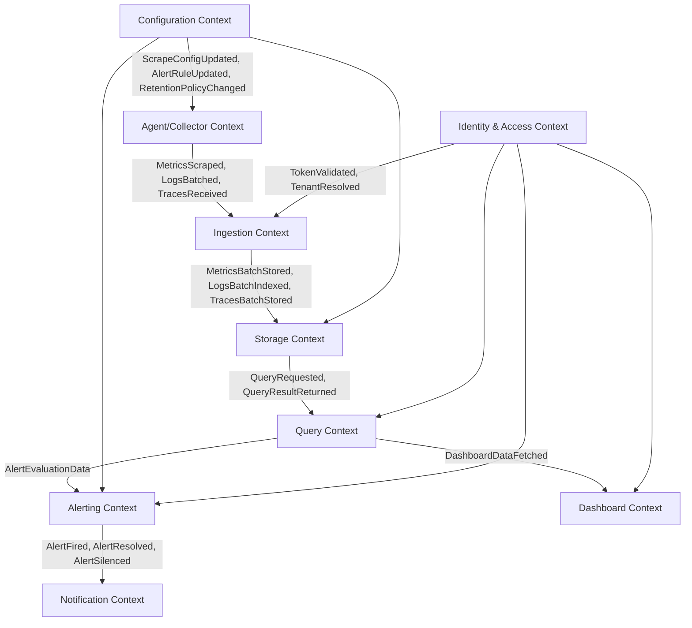

# 03 — DDD Bounded Contexts: Metrics & Monitoring Platform

## Objective

Define bounded contexts with explicit ownership, language, and integration contracts. Each context owns its data and exposes integration events — no shared databases across boundaries.

---

## Bounded Contexts Overview

---

## Context 1: Agent/Collector Context

### Responsibility
Discovers scrape targets, pulls metrics from instrumented services, tails log files, receives traces via OTLP. Normalizes all telemetry into canonical internal format before forwarding downstream.

### Ubiquitous Language
- **Scrape Target**: An endpoint exposing metrics in Prometheus exposition format
- **Scrape Interval**: Frequency at which a target is polled
- **Scrape Job**: Named group of scrape targets with shared configuration
- **Log Tail**: Continuous read of a log file or stdout stream
- **OTLP Receiver**: gRPC/HTTP endpoint accepting OpenTelemetry traces and metrics
- **Agent**: Process running on the observed host; responsible for collection
- **Fleet**: All agents managed by a single control plane

### Aggregates
- `ScrapeJob` (root) → `ScrapeTarget[]`, `RelabelRule[]`
- `LogPipeline` → `LogSource`, `Parser`, `Filter[]`
- `OTLPReceiver` → `BatchProcessor`, `ExportQueue`

### Domain Events Emitted
| Event | Payload | Consumer |
|-------|---------|----------|
| `MetricsBatchScraped` | job, targets, samples[], timestamp | Ingestion Context |
| `LogsBatchCollected` | source, lines[], parsed_fields | Ingestion Context |
| `TraceBatchReceived` | spans[], service_name, trace_id | Ingestion Context |
| `ScrapeTargetDown` | target, reason, consecutive_failures | Alerting Context (direct) |

### Integration Dependencies
- Receives `ScrapeConfigUpdated` from Configuration Context (hot reload)
- No direct DB access — stateless except for WAL buffer

### Boundaries Violated If…
- Agent writes directly to TSDB → tight coupling, can't replace storage
- Agent evaluates alert rules → logic belongs in Alerting Context

---

## Context 2: Ingestion Context

### Responsibility
Validates, normalizes, deduplicates, and routes incoming telemetry to appropriate storage backends. Acts as the write path gateway. Enforces tenant quotas and rate limits.

### Ubiquitous Language
- **Remote Write**: Protocol where Prometheus pushes metrics to a remote endpoint
- **Write Request**: Batch of TimeSeries (label sets + samples)
- **TimeSeries**: Unique combination of metric name + label set
- **Cardinality**: Count of unique TimeSeries; the primary resource constraint
- **Ingestion Quota**: Max samples/sec per tenant
- **Label Enforcement**: Injecting tenant labels to prevent cross-tenant data leakage
- **Exemplar**: Sample annotated with trace_id linking a metric spike to a trace

### Aggregates
- `WriteRequest` (value object, immutable) → `TimeSeries[]`
- `TenantQuota` → `CurrentRate`, `Limit`, `ThrottlePolicy`

### Domain Events Emitted
| Event | Payload | Consumer |
|-------|---------|----------|
| `MetricsBatchAccepted` | tenant_id, series_count, timestamp_range | Storage Context |
| `LogsBatchAccepted` | tenant_id, line_count, index_name | Storage Context |
| `TraceBatchAccepted` | tenant_id, span_count | Storage Context |
| `TenantQuotaExceeded` | tenant_id, current_rate, limit | Alerting Context |
| `IngestionError` | error_type, sample_count_dropped | Observability (meta) |

### Integration Dependencies
- Validates token with Identity & Access Context
- Publishes to Kafka topics consumed by Storage Context

### Boundaries Violated If…
- Ingestion Context performs TSDB chunk writes inline → blocks on storage latency, can't scale independently
- Ingestion Context queries existing data for dedup → creates read-write coupling

---

## Context 3: Storage Context

### Responsibility
Owns physical data persistence across three stores: TSDB (metrics), Elasticsearch (logs), trace backend (Jaeger/Tempo). Manages retention, compaction, tiering, and backup.

### Ubiquitous Language
- **Chunk**: Compressed time-series data block (typically 2h window in Prometheus)
- **Head Block**: In-memory mutable chunk accepting recent writes
- **WAL (Write-Ahead Log)**: Durability log replayed on crash recovery
- **Block**: Immutable persisted chunk, subject to compaction
- **Compaction**: Merging small blocks into larger ones, removing tombstones
- **Tombstone**: Marker for deleted series, applied lazily
- **Index**: Mapping from label sets to series IDs for fast lookup
- **Index Lifecycle Management (ILM)**: ES policy controlling hot→warm→cold→delete transitions
- **Retention Window**: Maximum age of data before deletion
- **Tiering**: Moving older data from fast local SSD to cheap object storage (S3)

### Aggregates
- `TSDBBlock` → `Chunks[]`, `Index`, `Metadata`
- `ESIndex` → `Shards[]`, `ILMPolicy`, `Mappings`
- `RetentionPolicy` → `HotDuration`, `ColdDuration`, `TotalRetention`

### Domain Events Emitted
| Event | Payload | Consumer |
|-------|---------|----------|
| `BlockCompacted` | block_id, series_count, time_range | Observability (meta) |
| `RetentionEnforced` | tenant_id, bytes_deleted, time_range | Observability (meta) |
| `StorageCapacityWarning` | disk_used_pct, projected_full_time | Alerting Context |

### Boundaries Violated If…
- Storage Context exposes raw chunk files directly to Query Context → couples query to storage format
- Storage Context enforces alert rules → wrong domain

---

## Context 4: Query Context

### Responsibility
Handles all read traffic. Evaluates PromQL, log queries (KQL/Lucene), and trace search. Federates across multiple Storage Context shards. Manages query caching and deduplication.

### Ubiquitous Language
- **PromQL**: Prometheus Query Language — functional, time-range aware
- **Instant Query**: PromQL evaluated at a single point in time
- **Range Query**: PromQL evaluated over a time range returning a matrix
- **Step**: Interval between evaluation points in a range query
- **Label Matcher**: Selector filtering series by label values `{job="api", env="prod"}`
- **Lookback Delta**: How far back a range query looks for the last sample (default 5m)
- **Query Shard**: Parallelization of a single query across storage shards
- **Deduplication**: Removing duplicate samples when federating from HA replicas
- **Query Frontend**: Splits large queries into smaller shards, caches results

### Aggregates
- `QueryRequest` → `Expression`, `TimeRange`, `TenantScope`
- `QueryResult` → `ResultType`, `Series[]`, `CacheMetadata`
- `QueryShardPlan` → `Shards[]`, `MergeStrategy`

### Domain Events Emitted
| Event | Payload | Consumer |
|-------|---------|----------|
| `QueryExecuted` | tenant_id, query_type, duration_ms, series_scanned | Observability (meta) |
| `QueryFailed` | tenant_id, error_type, query_hash | Alerting Context |

### Boundaries Violated If…
- Query Context writes data (e.g., recording rules that persist results) → creates read-write coupling; recording rules belong as a separate service between Query and Storage
- Query Context holds persistent state (session) → becomes stateful, can't scale horizontally

---

## Context 5: Alerting Context

### Responsibility
Evaluates alert rules against Query Context results on a configurable interval. Manages alert state machine (pending → firing → resolved). Routes notifications to Notification Context.

### Ubiquitous Language
- **Alert Rule**: PromQL expression + threshold + duration + labels + annotations
- **Pending**: Rule expression is true but duration threshold not yet met
- **Firing**: Rule has been true for >= configured duration
- **Resolved**: Rule expression is no longer true
- **Inhibition**: Suppress lower-priority alerts when higher-priority alert fires (e.g., suppress all service alerts when host is down)
- **Silencing**: Operator-created mute window for a matching label set
- **Alert Group**: Collection of related firing alerts routed together
- **Routing Tree**: Decision tree mapping alert labels to notification receivers
- **Repeat Interval**: How often to re-notify while alert remains firing

### Aggregates
- `AlertRule` → `Expression`, `Duration`, `Labels`, `Annotations`, `TenantId`
- `AlertInstance` → `State`, `FiringAt`, `ResolvedAt`, `Labels`
- `Silence` → `Matchers[]`, `StartsAt`, `EndsAt`, `CreatedBy`
- `Route` → `Matchers[]`, `Receiver`, `GroupBy[]`, `RepeatInterval`

### Domain Events Emitted
| Event | Payload | Consumer |
|-------|---------|----------|
| `AlertFired` | alert_name, labels, annotations, tenant_id, firing_at | Notification Context |
| `AlertResolved` | alert_name, labels, tenant_id, resolved_at, duration | Notification Context |
| `AlertSilenced` | silence_id, alert_name, silenced_by, expires_at | Notification Context |

### Boundaries Violated If…
- Alerting Context sends emails/PagerDuty directly → couples routing logic to delivery; Notification Context owns that
- Alerting Context queries TSDB directly → bypasses Query Context, duplicates federation logic

---

## Context 6: Notification Context

### Responsibility
Receives alert events, deduplicates them, applies grouping delays, and delivers to configured receivers (email, PagerDuty, Slack, OpsGenie, webhooks). Manages delivery state and retry.

### Ubiquitous Language
- **Receiver**: Configured notification destination (PagerDuty integration, Slack channel)
- **Group Wait**: Delay before sending first notification for a new group (allows batching)
- **Group Interval**: How long to wait before re-sending notifications for updated group
- **Deduplication Key**: Hash of alert labels used to identify duplicate alerts from HA replicas
- **Delivery Receipt**: Acknowledgment from external provider that notification was accepted

### Aggregates
- `NotificationGroup` → `Alerts[]`, `Receiver`, `GroupState`, `LastSentAt`
- `DeliveryAttempt` → `Status`, `Timestamp`, `Error`, `RetryCount`

### Boundaries Violated If…
- Notification Context evaluates alert conditions → wrong domain
- Notification Context stores alert history → belongs in Alerting Context

---

## Context 7: Dashboard Context

### Responsibility
Stores and renders dashboards. Manages panels, variables, annotations, and data source bindings. No data storage — delegates all queries to Query Context.

### Ubiquitous Language
- **Dashboard**: Named collection of panels sharing time range and variables
- **Panel**: Individual visualization (graph, table, stat, heatmap)
- **Query**: Panel-specific data source query (PromQL, KQL, TraceQL)
- **Variable**: Dynamic template value injected into panel queries (e.g., `$instance`)
- **Annotation**: Event overlay on a time-series graph (deployments, incidents)
- **Data Source**: Registered connection to a Query Context endpoint

### Aggregates
- `Dashboard` → `Panels[]`, `Variables[]`, `Annotations[]`, `Permissions`
- `DataSource` → `Type`, `URL`, `AuthConfig`, `TenantScope`

---

## Context 8: Configuration Context

### Responsibility
Manages scrape configs, alert rule files, retention policies, and data source credentials. Provides hot-reload via config push events. Single source of truth for system configuration.

### Ubiquitous Language
- **Scrape Config**: YAML-equivalent configuration for a scrape job
- **Rule Group**: Named collection of alert/recording rules evaluated together
- **Hot Reload**: Applying configuration changes without restarting the service
- **Config Version**: Monotonically increasing version for change tracking

---

## Context 9: Identity & Access Context

### Responsibility
Authenticates API calls, resolves tenant from token, enforces RBAC. Shared kernel used by Ingestion, Query, Dashboard, and Alerting contexts.

### Ubiquitous Language
- **Tenant**: Organization-level isolation boundary
- **Service Account**: Machine identity for agent authentication (API key)
- **Role**: Named permission set (viewer, editor, admin)
- **Scope**: Resource type + action (e.g., `dashboard:read`, `alert-rule:write`)

---

## Context Map Summary

| Relationship | Pattern | Direction |
|---|---|---|
| Collector → Ingestion | Events via Kafka | Upstream/Downstream |
| Ingestion → Storage | Events via Kafka | Upstream/Downstream |
| Query → Storage | Request/Response (sync) | Customer/Supplier |
| Alerting → Query | Request/Response (sync, periodic) | Customer/Supplier |
| Alerting → Notification | Domain Events | Published Language |
| All → Identity & Access | Shared Kernel (ACL) | Conformist |
| All → Configuration | Open Host Service | Downstream conformist |

---

## Anti-Corruption Layer Locations

| Boundary | Why ACL Needed |
|---|---|
| OTLP → Ingestion Context | OTLP proto format ≠ internal canonical format |
| Elasticsearch API → Storage Context | ES-specific index names, field mappings must not leak into domain |
| PagerDuty API → Notification Context | External vendor model must not pollute internal alert model |

---

## Risks & Tradeoffs

| Risk | Impact | Mitigation |
|---|---|---|
| Kafka becomes shared integration bus coupling all contexts | High coupling if one context reads another's topics | Strict topic ownership — only one context publishes per topic |
| Query Context becomes god service | Centralization, single bottleneck | Shard horizontally; query frontend routes by tenant/time range |
| Configuration Context becomes SPOF | All contexts stall on config reload failure | Config served from object storage with local cache fallback |
| Identity & Access as shared kernel creates coupling | Changes ripple across all contexts | Version the ACL interface; abstract behind interface, not direct call |

---

## Interview Discussion Points

**Q: Why not merge Ingestion and Storage into one context?**
Ingestion is write-path optimized (high throughput, low latency, stateless). Storage is read-path optimized (compaction, retention, durability). Merging them forces both teams to coordinate on every change and creates a single scaling bottleneck.

**Q: How do you handle HA in the Alerting Context — won't two alert evaluators double-fire?**
AlertManager uses gossip protocol (memberlist) for cluster coordination. Alert deduplication key is computed from labels. Notification Context deduplicates on the same key before delivery.

**Q: Where does recording rules fit?**
Between Query Context and Storage Context — recording rules periodically evaluate PromQL and write results back as new series. They're best modeled as a separate service that is a consumer of Query Context and a producer to Storage Context, not owned by either.

**Q: Why is Identity & Access a shared kernel instead of its own upstream context?**
Because every other context needs to validate requests. Making it a strict upstream with event-based integration would add latency to every request. Shared kernel with a stable, versioned interface is the pragmatic choice; accept the coupling, manage it with interface contracts.
