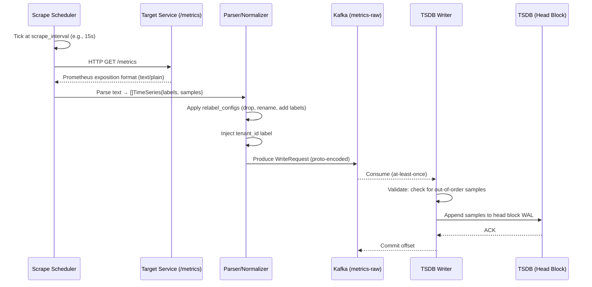
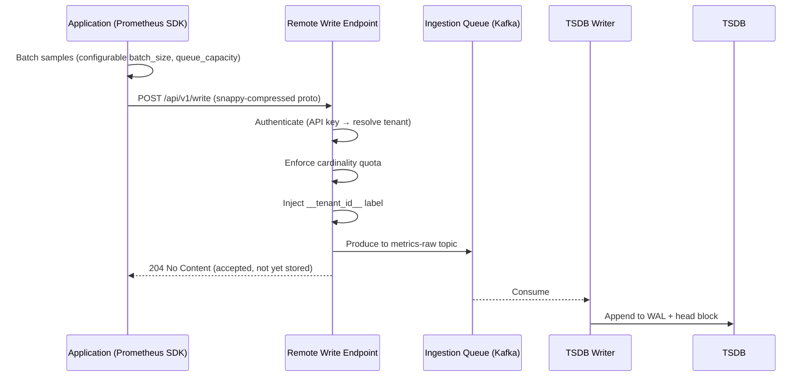
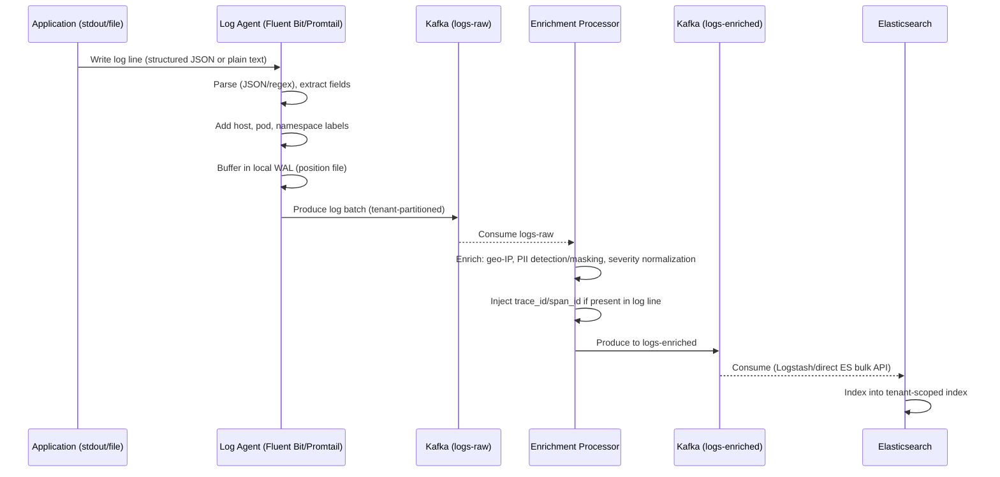
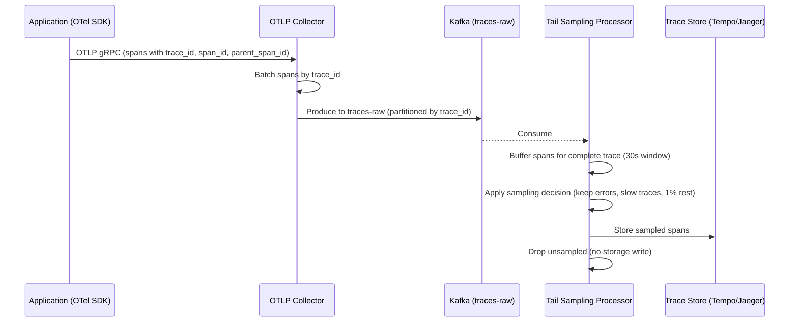
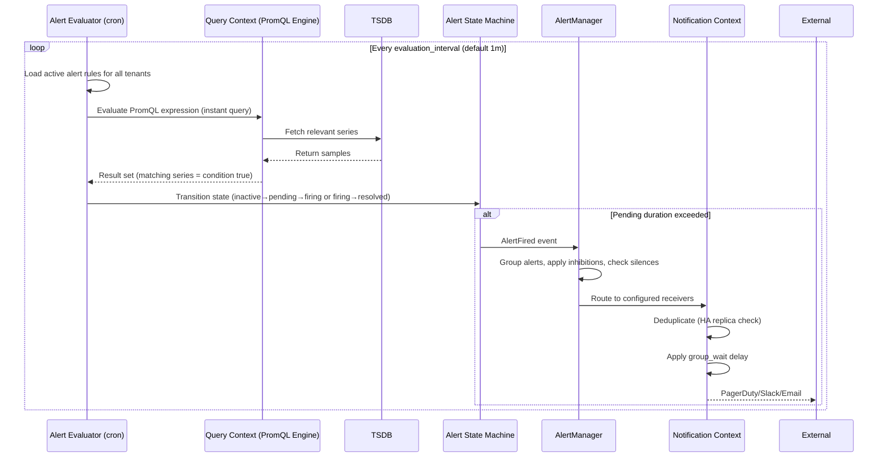
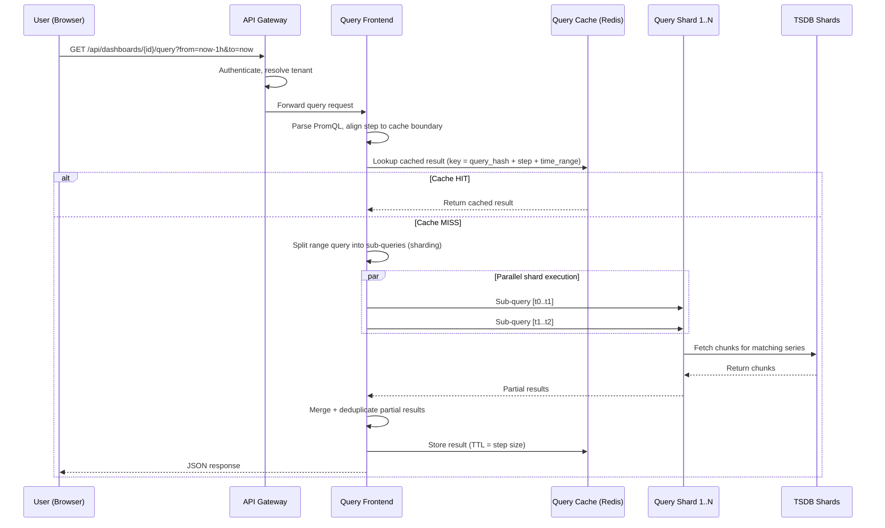
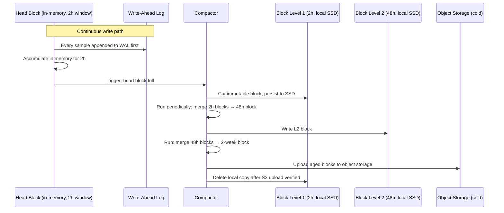
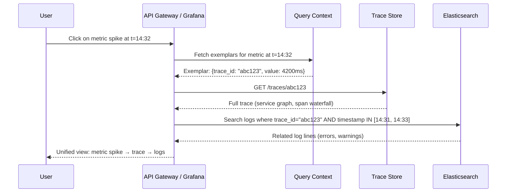

# 06 — Event Flow: Metrics & Monitoring Platform

## Objective

Document all critical data flows through the observability pipeline — from telemetry emission to storage, alerting, and query response. Each flow highlights ordering guarantees, failure handling, and performance characteristics.

---

## Flow 1: Metrics Scrape (Pull Model)

**Failure Handling:**
- Target unreachable → scraper marks series as stale (special NaN value), continues next interval
- Kafka producer full → scraper applies backpressure via remote_write queue; drops oldest if queue full
- TSDB writer crash → WAL replay on restart recovers in-flight samples
- Out-of-order sample (clock skew) → rejected with error, logged, NOT retried

---

## Flow 2: Metrics Push (Remote Write)

**Key Design Decision:** Return 204 on Kafka produce success, NOT on TSDB write success. This means "accepted" ≠ "stored". Clients must tolerate potential data loss on downstream failure. For financial-grade observability, use synchronous write path with 2xx only on TSDB commit — but this sacrifices throughput 10x.

---

## Flow 3: Log Shipping

**Position File:** Agent tracks byte offset in log file. On restart, resumes from last committed position — prevents duplicate ingestion. Key reliability mechanism.

**PII Masking in Enrichment:** Credit card numbers, SSNs, email patterns detected via regex → replaced with `[REDACTED]` before ES indexing. Masking is one-way — original log NOT stored anywhere.

---

## Flow 4: Trace Ingestion (OTLP)

**Tail Sampling:** Decision made AFTER seeing all spans for a trace, not at head. Enables "always sample error traces" without knowing upfront if trace will error. Requires buffering all spans for a trace window — memory intensive.

**Partition by trace_id:** Ensures all spans for one trace go to same Kafka partition → same consumer → single sampling decision point.

---

## Flow 5: Alert Evaluation

**Pending State:** Rule must be true for `for: 5m` before firing. Prevents flapping on transient spikes. State stored in AlertManager in-memory; HA cluster replicates via gossip.

**Inhibition Example:** Alert `HostDown{host=web-01}` inhibits all other alerts with `{host=web-01}` → reduces noise during host failure.

---

## Flow 6: Dashboard Query

**Step Alignment:** If user queries `step=60s`, results are snapped to minute boundaries. This makes cache keys deterministic — two users querying same metric at different second offsets get same cached result.

**Thundering Herd:** 50 users open same dashboard simultaneously → all miss cache at same time → 50 identical queries to TSDB. Query Frontend deduplicates in-flight identical queries: first query executes, rest wait for same result.

---

## Flow 7: TSDB Compaction (Background)

**Why Compaction Matters:** Many small blocks = many open file descriptors + slow range queries (must scan N files). Compaction reduces query scan cost. Tombstones (deleted series) only physically removed at compaction time.

---

## Cross-Flow: Trace-Metric-Log Correlation

**Exemplar:** Single sample in a time-series annotated with a trace_id. Prometheus stores them in memory (not persisted by default). Critical for "jump from metric to trace" UX. Low overhead — one exemplar per scrape interval per series.

---

## Failure Handling Summary

| Flow | Failure Point | Behavior | Recovery |
|------|--------------|----------|----------|
| Scrape | Target down | Stale marker written | Auto-recovers when target returns |
| Scrape | Kafka full | Remote write queue backs up → drops oldest | Queue monitoring + alert on drop rate |
| Log shipping | Agent crash | Position file tracks offset | Resume from last committed position |
| Log shipping | ES node down | Kafka consumer pauses, lag builds | ES recovers, consumer catches up |
| Trace ingestion | Collector OOM | Spans dropped before Kafka | Head-based sampling fallback |
| Alert eval | Evaluator restarts | In-memory state lost → alerts re-enter pending | `for` duration restarts; brief delay in firing |
| Alert eval | Query timeout | Alert stays in last known state | Configurable: fire on error vs keep last state |
| Dashboard query | TSDB shard down | Partial results returned | Frontend returns partial data with error annotation |

---

## Interview Discussion Points

**Q: What happens if Prometheus misses a scrape?**
Series shows a gap. If gap > 5m (default lookback delta), range queries return no data for that window. `absent()` function can alert on this. For critical metrics, use two Prometheus instances scraping same targets — deduplication on query side.

**Q: Why use Kafka between collector and storage instead of direct write?**
Decouples ingestion rate from storage write rate. Storage compaction, ES indexing, and TSDB writes have variable latency. Kafka absorbs bursts. Without Kafka, a slow ES node directly back-pressures log agents → agents buffer on disk → eventual data loss.

**Q: How do you guarantee ordering in the log flow?**
Within a single log source (one file/pod), ordering is guaranteed by Kafka partition assignment (same source always → same partition). Across sources, logs are only approximately ordered by ingestion time, not guaranteed by event time. ES stores event timestamp; queries filter by event timestamp, not Kafka offset.

**Q: Alert flapping — how do you prevent noisy alerts?**
Three mechanisms: (1) `for: duration` in rule prevents transient triggers, (2) `repeat_interval` in routing prevents re-notification while already firing, (3) silence for known maintenance windows. Additionally, use `avg_over_time` or rate functions instead of instant values to smooth spikes.
