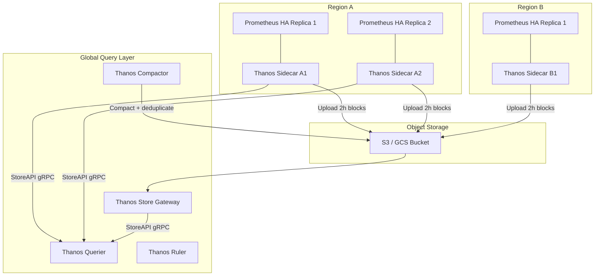
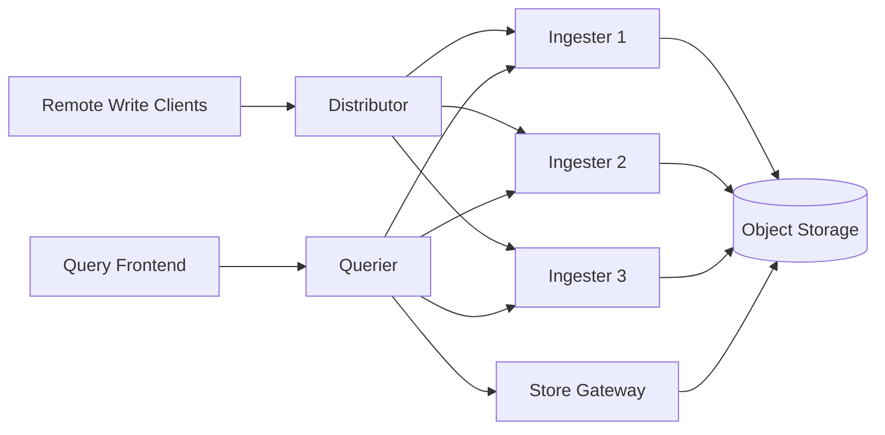
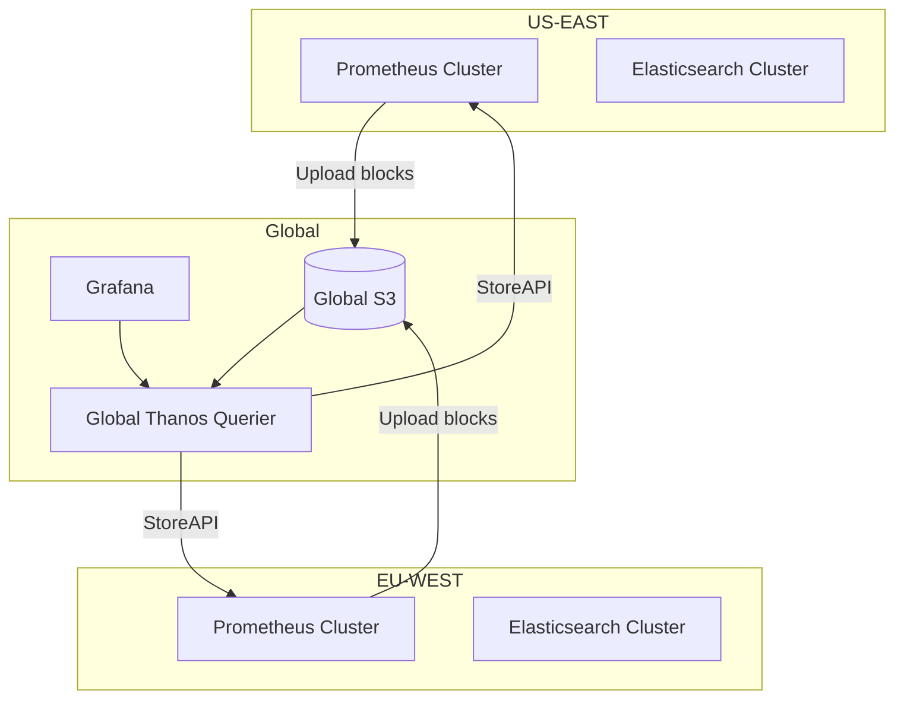

# 07 — Scaling Strategy: Metrics & Monitoring Platform

## Objective

Define how each component scales independently, identify the primary bottlenecks at each order of magnitude, and describe the architectural evolution from single-node to global federation.

---

## Scale Tiers

| Tier | Active Series | Log Volume | Traces/Day | Architecture |
|------|--------------|------------|------------|---|
| Startup | 100K | 10GB/day | 1M | Single Prometheus + ELK + Grafana |
| Mid-size | 5M | 500GB/day | 100M | Prometheus HA + Thanos + ES cluster |
| Large | 50M | 5TB/day | 1B | Cortex/Mimir + ES multi-cluster + Tempo |
| Hyper-scale | 500M+ | 50TB+/day | 10B+ | Global federation, streaming eval, custom TSDB |

---

## Bottleneck #1: Cardinality Explosion (The Primary Prometheus Killer)

Cardinality = number of unique `{metric_name, label_set}` combinations. Each unique series requires:
- In-memory inverted index entry
- WAL append on every scrape
- Head block memory allocation

**Cardinality math:**
```
100 services × 50 endpoints × 10 status codes × 5 methods = 250,000 series per metric
× 20 metrics = 5M series
```

At 5M active series, Prometheus needs ~12GB RAM. At 10M+ series, a single Prometheus instance becomes unstable.

**What triggers cardinality explosion:**
- Using user_id, request_id, or session_id as label values → unbounded label cardinality
- Kubernetes pod names as labels (pods restart with new names)
- Trace IDs embedded in metrics labels
- Dynamic endpoint paths without normalization (`/users/123` vs `/users/{id}`)

**Mitigation Strategies:**

| Strategy | Description | Tradeoff |
|---|---|---|
| Label cardinality limits | Enforce max unique values per label at ingestion | May drop legitimate high-cardinality metrics |
| Metric relabeling | Drop high-cardinality labels before storage | Loses granularity |
| Recording rules | Pre-aggregate high-cardinality series into lower-cardinality summaries | Aggregation loses fine-grained data |
| Histograms over gauges | Use `histogram_quantile` on pre-bucketed data instead of storing every value | Approximation; bucket boundaries matter |
| Exemplars for high-cardinality dimensions | Store trace_id in exemplars (not labels), link to trace for detail | Requires exemplar support in instrumentation |

---

## Scaling Prometheus: Vertical Limits

Single Prometheus scaling via hardware:

| Resource | Limit | Symptom at Limit |
|---|---|---|
| RAM | ~16GB → ~10M series | OOM kill, crash loop |
| CPU | 8 cores → ~100K samples/sec | Scrape timeouts, rule eval lag |
| Local SSD | ~500GB → ~1M series × 15 days | Disk full, compaction blocked |
| File descriptors | 65536 (Linux default) | "too many open files" on block access |

Vertical scaling alone cannot reach 50M+ series. Must move to horizontal.

---

## Horizontal Scaling: Thanos Architecture



**Thanos Sidecar:** Runs alongside each Prometheus. Uploads completed 2h blocks to S3. Serves StoreAPI for recent data (last 2h) not yet in S3.

**Thanos Store Gateway:** Reads blocks from S3 lazily. Caches index files locally (index-header). Serves StoreAPI for historical data.

**Thanos Querier:** Federates queries across all StoreAPI endpoints. Deduplicates samples from HA replicas using `replica` label. Single global query endpoint for users.

**Thanos Compactor:** Runs as a singleton (no HA). Merges small blocks in S3, applies retention, removes tombstones. Must not run in parallel (would corrupt blocks).

---

## Horizontal Scaling: Cortex/Mimir Architecture (Multi-Tenant)

Thanos is bolt-on for existing Prometheus. Cortex/Mimir is purpose-built multi-tenant TSDB.



**Distributor:** Consistent-hash ring routes each time-series to N ingesters (default 3). Stateless; can scale horizontally.

**Ingester:** Holds recent samples in memory. Writes chunks to object storage on flush. Replicates across ring via consistent hash.

**Querier:** Queries both ingesters (recent) and store gateway (historical). Merges and deduplicates.

**Key Advantage over Thanos:** Per-tenant rate limiting, multi-tenant isolation, built-in sharding. No Prometheus instances needed — clients remote-write directly.

---

## Kafka Scaling for Ingestion

**Partition Strategy for Metrics:**

| Strategy | Pros | Cons |
|---|---|---|
| Hash by `{metric_name + labels}` | Same series → same partition → ordered writes | Hot partitions for popular metrics |
| Hash by `tenant_id` | Simple tenant isolation | All metrics for one tenant → one partition (hot) |
| Hash by `scrape_job` | Balances across jobs | Uneven job sizes create imbalance |
| Round-robin | Perfect load balance | Same series may go to different partitions → out-of-order at consumer |

**Recommended:** Hash by `{tenant_id + metric_name}` — balances between tenants and metric families while keeping related series together.

**Partition Count:** Start at 100 partitions for metrics-raw. Each partition consumed by one TSDB writer thread. Scale partitions = scale throughput linearly.

---

## Elasticsearch Scaling for Logs

**Index Strategy:**

```
logs-{tenant_id}-{YYYY.MM.DD}
```

Daily indices enable:
- Efficient time-range queries (skip entire indices outside range)
- Simple retention (delete index = delete day's logs)
- Parallel indexing across days

**Shard Sizing:** 30-50GB per shard is optimal for ES. Over-sharding (many tiny shards) wastes heap. Under-sharding (huge shards) makes recovery slow.

```
Daily log volume per tenant: 100GB
Shards per index: 100GB / 40GB = 3 primary shards + 1 replica = 6 total shards/day
```

**ILM Tiers:**
- Hot (0-7 days): Fast SSD nodes, 1 replica
- Warm (7-30 days): HDD nodes, 1 replica
- Cold (30-90 days): Frozen index (searchable from S3, no replicas)
- Delete (90+ days): Index deleted

**Scaling ES Write Throughput:**
- Bulk API only — never single-document indexing
- Increase `refresh_interval` from 1s to 30s for write-heavy indices (trades search freshness for write speed)
- `index.translog.durability: async` (risk: lose up to 5s of logs on crash)

---

## Query Path Scaling

**Query Frontend (Cortex/Mimir pattern):**
1. **Vertical shard splitting:** Long-range queries split into parallel sub-queries by time window
2. **Horizontal shard splitting:** PromQL label matchers used to split by series subset (sharding by label value)
3. **Caching:** Step-aligned results cached in Redis; cache key = `hash(query + step + time_range_bucket)`

**Query Priority Classes:**
- Dashboard queries: low priority, cached, can tolerate 1-2s latency
- Alert evaluation queries: medium priority, must complete within eval interval
- Ad-hoc exploration: lowest priority, resource-limited

Use query scheduler with priority lanes to prevent dashboard storm from blocking alert evaluation.

---

## Multi-Region Architecture



**Cross-region query latency:** StoreAPI calls across regions add 50-200ms RTT. For dashboards, acceptable. For alert evaluation, keep rules evaluated locally per region — global alert correlation is a separate use case.

---

## Backpressure Handling

**Remote Write Queue (Client Side):**
- Prometheus maintains in-memory queue of pending write requests
- `queue_config.max_samples_per_send` controls batch size
- `queue_config.capacity` controls buffer depth
- When queue full: oldest samples dropped (prioritizes recency)
- Alert on `prometheus_remote_storage_samples_dropped_total`

**Kafka Consumer Lag:**
- TSDB writer can't keep up → Kafka consumer lag grows
- Alert threshold: lag > 5 minutes of data
- Response: Add more TSDB writer instances (scale consumer group)
- Limit: Partition count is ceiling on parallelism — must increase partitions first

**ES Bulk Queue:**
- ES rejects bulk requests when write queue full (429)
- Logstash/consumer retries with exponential backoff
- Alert on `es_thread_pool_write_queue_size`

---

## Horizontal vs Vertical Scaling Decision Table

| Component | Scale Direction | When to Scale | Signal |
|---|---|---|---|
| Prometheus | Vertical first, then federate | RAM > 70% | `prometheus_tsdb_head_series` |
| Kafka broker | Horizontal (add brokers + partitions) | Producer throughput limit | `kafka_producer_record_error_rate` |
| TSDB Writer | Horizontal (add consumer instances) | Consumer lag > 2min | Kafka consumer lag |
| Elasticsearch | Horizontal (add data nodes) | Shard size > 50GB or CPU > 70% | ES cluster health / shard stats |
| Query Frontend | Horizontal (stateless) | Query latency p99 > 5s | `cortex_query_frontend_queue_duration_seconds` |
| AlertManager | HA pair (2-3 nodes max) | Always HA, not for throughput | Gossip cluster health |

---

## Overengineering Warnings

| Temptation | Why It's Overengineering | When It's Actually Needed |
|---|---|---|
| Deploy Thanos immediately | Single Prometheus handles 5M series; Thanos adds ops complexity | > 5M series OR multi-region requirement |
| Cortex/Mimir for single tenant | Multi-tenant complexity with zero benefit | SaaS product with 10+ tenants needing isolation |
| 100+ Kafka partitions from day 1 | Partition count is hard to reduce; over-partitioning wastes resources | Only when throughput benchmarks demand it |
| Global ES federation | Extreme operational complexity | Regulatory requirement to query logs across all regions |
| Tail sampling at low volume | Adds 30s latency buffer, complex state; not worth it under 10K traces/sec | When storage cost of 100% traces is prohibitive |

---

## Interview Discussion Points

**Q: Why does cardinality kill Prometheus more than metric volume?**
Memory usage scales with unique series count, not sample count. 1M series × 1 sample/15s = 66K samples/sec. 1M series × 10 labels each = 10M label index entries in RAM. The index, not the samples, is the memory bottleneck.

**Q: Thanos vs Cortex vs Mimir — when to use each?**
Thanos: Add long-term storage to existing Prometheus with minimal refactoring. Cortex: Multi-tenant SaaS monitoring with per-tenant isolation and billing. Mimir: Cortex successor with better performance, object-storage native design, simpler ops. For greenfield multi-tenant, use Mimir.

**Q: How do you handle a hot partition in Kafka for metrics?**
Root cause is usually one metric with very high cardinality getting all data on one partition. Fix: change partition key to include metric name hash, not just tenant. Or: pre-aggregate at collection layer before Kafka using recording rules.

**Q: What's the maximum Elasticsearch throughput for log ingestion?**
A well-tuned 3-node ES cluster (32GB heap each) handles ~50K log events/sec. Beyond that: add nodes, reduce field mappings (dynamic: false), increase refresh_interval, disable _source for archival indices.
