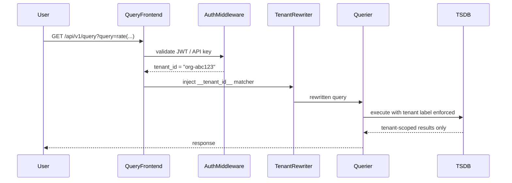
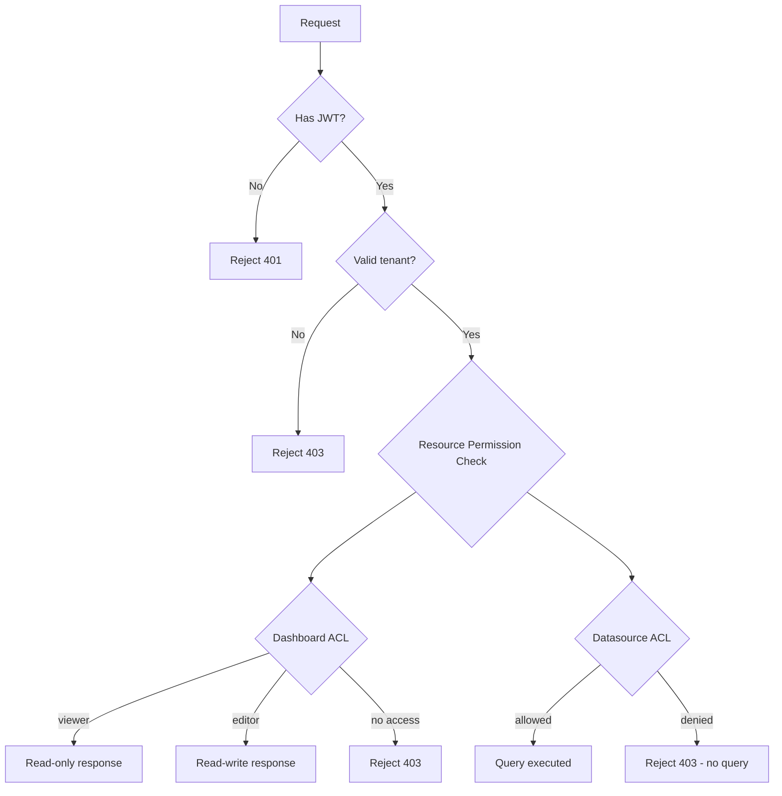

# 08 — Security Design

## Objective

Define the security architecture for a multi-tenant metrics and monitoring platform that ingests sensitive operational data from thousands of customers. Security here is not a bolt-on — it is a foundational constraint because: (1) observability data leaks business logic (query rates, error rates, revenue proxies), (2) multi-tenancy means one misconfigured query can expose a competitor's infrastructure metrics, (3) scrape credentials and API keys represent lateral movement paths into customer infrastructure, and (4) alerting pipelines touching PagerDuty/Slack carry notification credentials that must be protected.

The threat surface spans ingestion endpoints, query execution, dashboard rendering, credential storage, and the Kubernetes control plane. This document covers each layer.

---

## Multi-Tenant Data Isolation

### The Core Problem

In a shared Prometheus + Grafana + Elasticsearch stack, the query engine is powerful enough to access any time series if the tenant boundary is not enforced at the query layer itself. A PromQL query like `{__name__=~".+"}` with no tenant label would return all series across all tenants if isolation is not enforced below the query planner.

### Label-Based Tenant Enforcement

Every metric ingested into the platform is tagged with a reserved label: `__tenant_id__`. This label is:

- Injected at the ingest gateway (not trusted from the scrape target — label injection from external sources is rejected).
- Immutable — any attempt by a client to set `__tenant_id__` in a remote write payload is stripped and replaced with the authenticated tenant's ID.
- Indexed in the TSDB storage engine as a first-class shard key.

At query time, the query frontend wraps every incoming PromQL expression in a label matcher that enforces tenant scope before the expression is passed to the storage layer:

```
user query:  rate(http_requests_total[5m])
rewritten:   rate(http_requests_total{__tenant_id__="org-abc123"}[5m])
```

This rewrite happens in the query frontend middleware, not in client-side code. The rewrite is non-bypassable because the storage layer rejects queries that arrive without a `__tenant_id__` matcher.

### Tenant Scoping in Elasticsearch

For logs, Elasticsearch enforces isolation via index-per-tenant strategy (for smaller tenants) or document-level security (DLS) for shared indices. DLS is applied as a Kibana/OpenSearch security plugin rule that injects a `term` filter on `tenant_id` for every query. The trade-off is query performance — DLS adds an execution-time filter that cannot be cached as easily as index routing.

For large tenants (>100M events/day), dedicated indices are provisioned to avoid noisy-neighbor effects on search latency.

### Cross-Tenant Query Prevention



---

## mTLS Between Collector and Ingest Endpoints

### Why mTLS at This Layer

Remote write from Prometheus agents or OpenTelemetry collectors to the ingest gateway is a high-throughput, persistent connection. Attackers who can MITM or spoof this connection can inject false metrics — causing alerts to fire or suppressing alerts for real incidents. mTLS provides:

1. **Server authentication**: collector verifies it is talking to a legitimate ingest endpoint (prevents DNS hijacking leading to credential exfiltration).
2. **Client authentication**: ingest gateway verifies the collector's identity before accepting data, preventing unauthorized metric injection.

### Certificate Lifecycle

Collector certificates are short-lived (24-hour TTL) and issued by an internal CA. In Kubernetes environments, cert-manager with Vault PKI backend automates certificate rotation. The workflow:

- Collector pod mounts a projected service account token.
- On startup, the collector authenticates to Vault via Kubernetes auth method, exchanging the service account token for a short-lived x.509 certificate.
- On 70% TTL expiration, the collector triggers a certificate renewal without disrupting the existing connection (using TLS renegotiation or maintaining dual connections during rotation).

Outside Kubernetes, collector certificates are provisioned via Vault agent sidecar or pre-baked into CI/CD pipeline secrets.

### TLS Configuration Baseline

| Parameter | Value | Rationale |
|---|---|---|
| TLS version | 1.3 minimum | Eliminates known 1.2 vulnerabilities (BEAST, POODLE) |
| Cipher suites | AEAD only | Authenticated encryption prevents passive decryption |
| Certificate TTL | 24 hours | Limits blast radius of credential compromise |
| OCSP stapling | Enabled | Reduces revocation check latency |
| Client cert pinning | Optional for high-security tenants | Prevents CA compromise from affecting that tenant |

---

## API Key and OAuth2 for UI Access

### Authentication Architecture

The platform supports two authentication modes:

**Service-to-service (collectors, CI/CD integrations):** API keys scoped to a specific tenant and permission set. API keys are:
- Hashed with SHA-256 before storage (only the hash is stored, never the raw key).
- Prefixed with a tenant identifier (`org-abc123-...`) for fast key routing without database lookup.
- Rotatable without downtime (overlapping validity window during rotation).
- Revocable instantly via a key revocation list (checked in-memory, refreshed from Redis every 30 seconds).

**Human users (Grafana UI, admin console):** OAuth2 authorization code flow with PKCE, integrated with the customer's identity provider (Okta, Google Workspace, Azure AD) via OIDC. The platform acts as an OAuth2 relying party. Session tokens are short-lived JWTs (15-minute access tokens, 7-day refresh tokens stored in httpOnly cookies with SameSite=Strict).

### JWT Design

| Claim | Purpose |
|---|---|
| `sub` | User ID |
| `tenant_id` | Enforced at query layer |
| `org_roles` | `[{org: "abc123", role: "editor"}]` |
| `exp` | 15-minute TTL |
| `jti` | Unique token ID for revocation tracking |

JWT signatures use RS256 (asymmetric) so the query layer can verify without needing the signing key — only the public key is distributed to query nodes.

---

## RBAC: Viewer / Editor / Admin Per Dashboard and Datasource

### Role Model

RBAC in the monitoring platform is two-dimensional: **role** × **resource**. A user can be a viewer on one dashboard and an editor on another. Roles do not cascade globally unless the user holds an org-level admin role.

```
Roles:
  viewer    → can query, view dashboards, view alerts. Cannot modify.
  editor    → can create/edit dashboards, silences, annotations. Cannot manage users.
  admin     → can manage users, datasources, API keys, org settings.
  superadmin → platform-level (only platform operators). Cross-tenant.
```



### Datasource-Level ACL

A critical attack surface: an editor who can configure a datasource can redirect queries to an external endpoint they control, exfiltrating queries and results. Mitigations:

- Datasource creation is admin-only.
- Datasource URLs are validated against an allowlist (no `localhost`, no `169.254.x.x` metadata endpoints, no RFC-1918 ranges by default).
- Datasource credentials are stored in Vault, not in the Grafana database. The UI never returns raw credentials — only masked previews.

---

## Scrape Credential Management

### The Problem

Prometheus scraping often requires credentials: bearer tokens for Kubernetes API server metrics, basic auth for JMX exporters, TLS client certs for private endpoints. These credentials, if stored in plain text in scrape configs, represent a significant risk — a leaked scrape config gives an attacker read access to every monitored endpoint.

### Vault Integration

```mermaid
graph LR
    ScrapeConfig[Scrape Config\n(credential reference)] --> VaultAgent[Vault Agent Sidecar]
    VaultAgent --> Vault[HashiCorp Vault\nKV v2 / PKI]
    Vault --> VaultAgent
    VaultAgent --> Collector[Prometheus / OTel Collector]
    Collector --> Target[Scrape Target]
```

Scrape configs reference credential paths (`vault:secret/path/to/bearer-token`) rather than literal values. The collector's Vault agent sidecar resolves these at runtime and injects them into the collector's in-memory configuration. Credentials never touch disk or appear in ConfigMaps.

### Kubernetes Secrets Integration

For Kubernetes-native deployments, scrape credentials are stored in Kubernetes Secrets with:
- RBAC limiting Secret read access to the collector's service account only.
- Secrets encrypted at rest via KMS (AWS KMS / GCP CMEK) rather than etcd's default base64.
- Secret rotation via External Secrets Operator, which syncs from Vault → Kubernetes Secrets, keeping TTLs short.

### Rotation Without Downtime

Credential rotation is a two-phase commit: new credential is activated on the target before the old one is revoked. The collector holds both credentials in memory during the overlap window (typically 5 minutes). Post-rotation, the old credential is revoked and the overlap window closes.

---

## Audit Logging

### What Must Be Audited

Every state change in the monitoring platform is auditable. The principle: if an incident occurs and someone asks "who changed the alert threshold from 95% to 50%?", the answer must be instantly retrievable.

| Event Category | Examples |
|---|---|
| Alert rule changes | Create, modify, delete alert rules; change thresholds |
| Dashboard changes | Create, edit, delete panels; change time ranges; share links |
| Datasource changes | Add, modify, delete datasources; credential updates |
| User management | Role assignments, API key creation/revocation, user deactivation |
| Silence/inhibit operations | Creating silences that suppress alerts |
| Query execution | High-cardinality queries, cross-datasource queries (for forensics) |
| Auth events | Login, logout, failed auth, MFA events |

### Audit Log Architecture

Audit logs are append-only, written to an isolated Kafka topic (`audit-events`) separate from operational metrics. They are:
- **Immutable**: stored in write-once S3/GCS buckets with object lock (WORM compliance).
- **Tamper-evident**: each log entry includes a hash of the previous entry (chain of custody).
- **Forwarded to SIEM**: streamed to Splunk or Elasticsearch Security for correlation with security events.
- **Retention**: minimum 1 year online, 7 years cold storage (for SOC2/GDPR compliance).

Audit log schema includes: `timestamp`, `actor_id`, `actor_ip`, `tenant_id`, `action`, `resource_type`, `resource_id`, `old_value` (hashed), `new_value` (hashed), `correlation_id`.

---

## PII in Logs: Detection, Masking, and Redaction Pipeline

### The Problem

Application logs ingested into the platform frequently contain PII — user IDs, email addresses, credit card numbers, session tokens, health data. Ingesting and storing this without control creates GDPR, HIPAA, and CCPA exposure.

### Detection

PII detection runs as a stream processor in the log ingestion pipeline, before logs reach Elasticsearch. Detection uses:

- **Pattern matching**: regex patterns for known PII formats (email, credit card, SSN, phone numbers, IP addresses).
- **Named Entity Recognition (NER)**: ML model (spaCy or AWS Comprehend) for unstructured PII (names, addresses, dates of birth).
- **Custom rules per tenant**: tenants define their own PII patterns via a rule configuration API.

### Masking vs. Redaction

| Strategy | Description | When to Use |
|---|---|---|
| Masking | Replace PII with a placeholder: `user@example.com` → `u***@***.com` | When structure needed for debugging |
| Tokenization | Replace with a reversible token: `user@example.com` → `PII_TOKEN_A3F7` | When correlation needed (same PII, same token) |
| Redaction | Fully remove the field: field dropped from log record | Highest-risk PII (SSN, health data) |
| Hashing | Replace with SHA-256 hash | When uniqueness tracking needed without reversibility |

### Pipeline Architecture

```mermaid
graph LR
    LogSource --> OTelCollector[OTel Collector]
    OTelCollector --> KafkaRaw[Kafka: logs-raw]
    KafkaRaw --> PIIDetector[PII Detector\nStream Processor]
    PIIDetector --> PIIStore[Vault: PII Token Store\n(reversible for authorized users)]
    PIIDetector --> KafkaEnriched[Kafka: logs-enriched\n(PII replaced)]
    KafkaEnriched --> Elasticsearch
```

The PII detector is a stateless stream processor. The token store in Vault allows authorized users (e.g., legal/security team) to reverse tokens when investigating a specific incident, with an audit log of every reversal.

---

## Network Policies in Kubernetes

### Principle of Least Privilege at the Network Layer

Every component in the monitoring platform runs with explicit NetworkPolicy rules. Default-deny egress and ingress for all namespaces, with explicit allow rules:

| Source | Destination | Port | Protocol | Reason |
|---|---|---|---|---|
| OTel Collector | Kafka | 9093 | TLS | Metric/log ingestion |
| Query Frontend | Querier pods | 9090 | mTLS | Query fan-out |
| Query Frontend | Redis | 6379 | TLS | Query result cache |
| Grafana | Query Frontend | 9090 | HTTPS | Dashboard queries |
| Alert Evaluator | Alert Manager | 9093 | mTLS | Alert firing |
| All pods | Vault | 8200 | HTTPS | Secret retrieval |
| Ingress Controller | Grafana | 3000 | HTTPS | User traffic |

No pod has unrestricted egress. Egress to the public internet is only permitted through a dedicated egress gateway (for webhook notifications to PagerDuty, Slack, etc.) — this gateway logs all outbound requests.

---

## Threat Model

### STRIDE Analysis

| Threat | Attack Vector | Mitigation |
|---|---|---|
| **Spoofing** | Forged remote write from malicious Prometheus agent | mTLS client certificate authentication |
| **Tampering** | Injecting false metrics to suppress real alerts | Immutable `__tenant_id__` label, WAL integrity checks |
| **Repudiation** | Admin denies changing alert threshold | Append-only audit log with hash chaining |
| **Information Disclosure** | Cross-tenant metric query | Mandatory `__tenant_id__` label injection at query layer |
| **Denial of Service** | High-cardinality query explosion (unbounded regex) | Query cost estimation, cardinality limits per query |
| **Elevation of Privilege** | Viewer uses API to edit dashboard | RBAC checked server-side on every mutation |

### High-Risk Attack Scenarios

**Scenario 1 — Credential Exfiltration via Datasource SSRF**: An attacker with editor access creates a datasource pointing to `http://169.254.169.254/` (AWS metadata endpoint). The Grafana proxy fetches this on the attacker's behalf, returning IAM credentials.  
Mitigation: Datasource URL allowlist + SSRF protection (block metadata IPs, RFC-1918, loopback).

**Scenario 2 — Alert Suppression Attack**: An attacker with editor access creates a silence matching all firing alerts before initiating an attack on the monitored infrastructure.  
Mitigation: Silence operations are audit-logged and trigger a secondary notification to org admins. Silences over a certain scope (matching >X% of active alerts) require admin approval.

**Scenario 3 — Metric Injection via Compromised Collector**: An attacker compromises a collector and injects synthetic metrics that cause a chaos alert (`deployment replicas = 0`) to fire and trigger automated remediation (scale down).  
Mitigation: Automated remediation pipelines should require signature verification of the triggering alert payload. Alert payloads include a HMAC signed by the alert evaluator using a key stored in Vault.

---

## Secrets Rotation

### Rotation Policy Table

| Secret Type | Rotation Frequency | Rotation Method | Downtime? |
|---|---|---|---|
| Collector mTLS certificates | 24 hours | Automated via cert-manager + Vault PKI | No (dual-certificate overlap) |
| API keys | On demand / 90-day max | Key rotation API with overlap window | No |
| Datasource credentials | 30 days (or on compromise) | External Secrets Operator + Vault | No |
| JWT signing key (RSA) | 90 days | Key rotation with 24h grace period for old tokens | No |
| Kafka SASL credentials | 30 days | Rolling restart of consumers with new credentials | No |
| Database passwords | 30 days | Vault dynamic secrets (ephemeral per-connection) | No |
| Encryption keys (TSDB at-rest) | Annually or on compromise | Key re-wrapping (envelope encryption) | No |

### Emergency Rotation Procedure

On detection of a suspected credential compromise:
1. Immediately revoke the specific credential (API key, certificate serial number added to CRL).
2. Alert the security team via a separate, out-of-band channel.
3. Rotate all credentials of the same type as a precaution.
4. Review audit logs for the 30 days prior to identify what was accessed.
5. File a security incident report within 72 hours (GDPR Article 33 requirement).

---

## Interview Discussion Points

### Depth Questions a Senior Interviewer Will Ask

**Q: How do you enforce tenant isolation if a bug in the query rewriter fails to inject the tenant label?**  
A: Defense in depth — the storage layer itself enforces a tenant label requirement. A query reaching the store without `__tenant_id__` is rejected with a 400, not served cross-tenant. The storage layer is the last line of defense; the query frontend rewriter is convenience, not the security boundary.

**Q: Your mTLS certificates rotate every 24 hours. What happens if Vault is down during rotation?**  
A: Collectors cache their current valid certificate and continue using it until expiry. If Vault is down during the rotation window, the collector retries with exponential backoff. Vault is deployed in HA mode (3-node Raft cluster) to minimize this risk. For the 24-hour TTL case, even a 2-hour Vault outage leaves 22 hours of headroom. For shorter TTLs (e.g., 4-hour certs), Vault availability becomes a harder dependency.

**Q: How do you handle a Grafana admin who intentionally misconfigures RBAC to gain cross-tenant access?**  
A: Org admins can only manage users within their own tenant — they have no API surface to assign roles in other tenants. Cross-tenant admin is only possible for platform superadmins, whose actions are heavily audited and require MFA step-up authentication.

**Q: What is your strategy for GDPR right-to-erasure requests when PII is in logs stored in S3?**  
A: Tokenization. PII is stored as tokens; the actual PII lives in a separate erasure-friendly store (Vault KV). When an erasure request arrives, we delete the mapping from token → PII. The logs in S3 remain intact but become permanently unreadable without the token mapping. This avoids the operational nightmare of rewriting S3 objects.

**Q: How do you prevent cardinality explosion from becoming a DoS vector?**  
A: Query cost estimation before execution — queries with unbounded label matchers (`{__name__=~".+"}`) are analyzed for estimated series count before being sent to the store. Queries exceeding a per-tenant cardinality budget (e.g., 10M series per query) are rejected with a 429 and an explanatory error. Tenants can request budget increases with justification.

**Startup vs. Enterprise distinction**: A startup running single-tenant can skip most of this — mTLS is operational overhead, RBAC can be simple, PII masking can be manual. The investment in multi-tenant isolation, audit logging, and secrets automation is justified at scale (>100 tenants or SOC2/HIPAA requirements). The mistake startups make is retrofitting multi-tenancy after launch — it requires rebuilding the storage layer.
