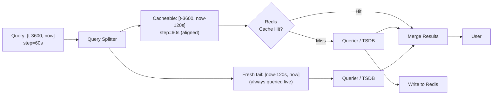
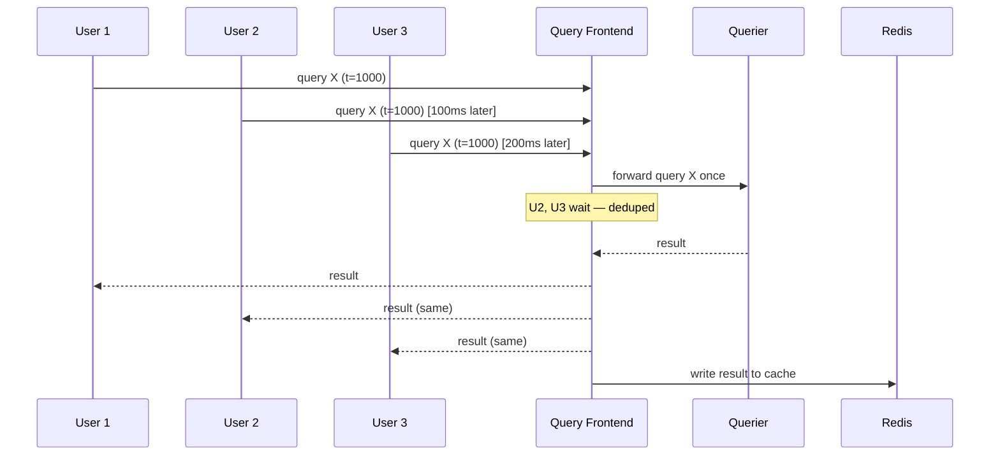

# 09 — Caching Strategy

## Objective

Define the multi-layer caching architecture for a metrics and monitoring platform where query latency is a first-class user experience concern. The challenge is fundamentally different from caching in a web application: time-series data is append-only and the "present" is always advancing, which means cache invalidation cannot rely on content-addressable keys. A cached result for `rate(http_requests_total[5m])` at `t=1000` is valid forever, but the same query at `t=1001` produces different data. The caching strategy must exploit this temporal immutability of past data while correctly handling the moving present.

The five caching layers addressed here serve different latency profiles and data shapes:

1. Query result cache (PromQL range queries)
2. Metadata cache (label names, label values, series index)
3. Dashboard panel cache (rendered aggregations)
4. TSDB chunk cache (hot block reads)
5. Elasticsearch query cache

---

## Layer 1: Query Result Cache (PromQL Range Queries)

### The Step Alignment Problem

The most important insight for PromQL caching: the same query with slightly different time ranges produces entirely different cache keys. A user who opens a dashboard at `t=1001` requests a range `[t-3600, t=1001]` with step 60s. A second user opening the same dashboard 30 seconds later requests `[t-3600, t=1031]`. These two queries share 99% of their data points but produce different cache keys if the key is the raw time range.

**Step alignment** solves this: instead of using the raw start/end timestamps as cache keys, the system aligns the requested range to boundaries that are multiples of the step interval. A query with step=60s is split into:
- A **cacheable sub-range**: aligned to 60-second boundaries (e.g., `[t-3600, now-120s]`). This range will not change in the future and can be cached with a TTL of infinity.
- An **uncacheable tail**: the last 1-2 steps near the present (e.g., `[now-120s, now]`). This is always fetched fresh.

### Cache Key Design

Cache key = `hash(tenant_id + query_expr_normalized + step + aligned_start + aligned_end)`

Query expression normalization is critical: `rate(http_requests_total[5m])` and `rate( http_requests_total [5m] )` (with extra whitespace) must produce the same cache key. The query frontend runs a PromQL AST normalizer before computing the hash — whitespace, label order, and label value quoting style are all canonicalized.

### Cache Storage in Redis

| Parameter | Value | Rationale |
|---|---|---|
| Key TTL for historical ranges | 24 hours | Old data will not change; long TTL is safe |
| Key TTL for near-present ranges | 30 seconds | Present data changes rapidly |
| Value encoding | Protobuf (compressed) | 5–10x smaller than JSON for matrix results |
| Redis instance type | Cluster mode, 3 primary shards | Query results can be large; distribution avoids hot keys |
| Eviction policy | `allkeys-lru` | Evict least-recently-used when memory pressure hits |
| Max value size | 10 MB | Queries returning >10MB of data bypass cache (cardinality bombs) |

### Cache Hit Rate Targets

| Query Type | Target Hit Rate | Notes |
|---|---|---|
| Dashboard panel load (1hr range, 60s step) | >85% | Aligned to step boundaries, shared across users |
| Alert evaluation (5m range, frequent) | >60% | Evaluates same query repeatedly; step alignment critical |
| Exploratory ad-hoc query | <20% | Expected — exploratory queries are inherently unique |
| Daily report queries (midnight run) | >95% | Same query, same time range, run repeatedly |

---

## Layer 2: Metadata Cache (Label Names, Label Values, Series Lookup)

### Why Metadata Caching Is Critical

Before PromQL evaluates `rate(http_requests_total{job="api-server"}[5m])`, the query planner must:
1. Resolve the label `job="api-server"` to a list of matching series IDs.
2. Look up posting lists (which chunks contain data for those series).

In a large deployment (10M+ active series per tenant), these lookups are expensive — they scan inverted indexes in the TSDB. For a dashboard with 20 panels, each running a separate PromQL query, this happens 20 times per dashboard load.

### In-Process Cache vs. Shared Cache

The metadata cache exists at two levels:

**In-process (Querier pods)**: Each Querier maintains an in-memory LRU cache of series index lookups. This is fastest (nanosecond access) but not shared across Querier replicas, so cache misses scale with the number of Querier pods.

**Shared (Redis)**: Label cardinality data (list of all label names, list of all values for a given label name) is shared in Redis across all Querier pods. This is used by the Grafana variables system (the dropdown showing all `job` values for a tenant) — these queries are frequent and expensive without caching.

### Cache Invalidation for Metadata

Metadata is more mutable than query results:
- New scrape targets come online → new label values appear.
- Services are decommissioned → label values go stale.

Invalidation strategy: TTL-based with short windows (60 seconds for label values, 5 minutes for label name sets). Stale-while-revalidate pattern — return the cached (possibly stale) result immediately while refreshing in the background. For Grafana dropdowns, showing a 60-second stale list of job names is acceptable UX.

---

## Layer 3: Dashboard Panel Cache (Rendered Results)

### Problem: 100 Users Open the Same Dashboard Simultaneously

When a popular on-call dashboard is opened by 100 engineers at the start of an incident, the monitoring platform receives 100 × N (panels per dashboard) simultaneous PromQL queries. Without caching, this creates a thundering herd that overwhelms the Querier layer precisely when the platform needs to be most responsive.

### Query Deduplication (Cortex/Mimir Query Frontend Pattern)

The query frontend maintains an in-flight request registry. When two identical queries arrive simultaneously (same tenant, same expression, same time range after step alignment), the second request is not forwarded to the Querier — instead, it waits for the first request's result and both receive the same response.

This reduces the thundering herd from 100 Querier requests to 1, at the cost of slightly higher P99 latency for the waiting requests (they wait for the first request to complete rather than executing in parallel).

### Panel Result Cache

After deduplication, panel results are stored in Redis with a short TTL (30–60 seconds for dashboards with auto-refresh). The Grafana server itself maintains a panel result cache keyed on `dashboard_uid + panel_id + time_range + variables_state`. Subsequent requests within the TTL window return the cached panel result without hitting the query layer.

### Auto-Refresh Thundering Herd

Dashboards with auto-refresh (every 30 seconds) from 100 simultaneous viewers can create a synchronized thundering herd every 30 seconds. Mitigation: jitter the auto-refresh interval by ±20% per client (handled in the Grafana frontend). 100 clients with 24–36 second refresh intervals spread load across a 12-second window instead of concentrating it at one moment.

---

## Layer 4: TSDB Chunk Cache (Hot Block Reads)

### TSDB Storage Anatomy

Prometheus / Mimir TSDB stores data in memory (head block, most recent 2 hours) and on disk (immutable blocks, older data). When a query spans both head and disk blocks, the disk I/O for older blocks is the bottleneck.

The chunk cache sits between the Querier and the object store (S3/GCS for long-term storage), caching recently-accessed chunks in memory (Memcached or Redis).

### Cache Strategy for Chunks

Chunk files are immutable once written (they are sealed when a head block is flushed). This makes them ideal cache targets — a cached chunk will never become stale. TTL is effectively infinite; eviction is LRU when memory pressure occurs.

| Cache Tier | Storage | Latency | Capacity |
|---|---|---|---|
| Head block | In-process memory (Querier) | <1ms | Last 2 hours of data |
| Chunk cache | Memcached cluster | 1–5ms | Configurable (commonly 200GB–2TB) |
| Object store | S3 / GCS | 50–200ms | Unlimited |

The chunk cache has the highest ROI for range queries that span 2–24 hours (recent-but-not-in-memory data). Queries for data >7 days old are typically infrequent enough that cache warming is not cost-effective; they pay the object store latency.

### Cache Warming

When a new Querier pod starts, its in-process chunk cache is cold. Under load, this creates a burst of object store reads. Mitigation: new Querier pods receive no traffic for the first 60 seconds (handled by the load balancer health check delay), allowing them to warm their cache via background prefetch of the most-accessed series for the tenant.

---

## Layer 5: Elasticsearch Query Cache

### Elasticsearch's Native Caching

Elasticsearch has three built-in caching layers:

1. **Node query cache**: LRU cache of filter results (not full query results). Filters like `term: {tenant_id: "abc"}` are cached and reused across queries with the same filter. Extremely effective for log dashboards where the tenant filter is constant.
2. **Shard request cache**: Caches entire aggregation results for queries that match a full shard's data (e.g., queries over a specific index). This is the primary cache for Kibana/Grafana log dashboards. Invalidated when new documents are indexed into the shard — meaning it is most effective for historical indices that are no longer receiving writes.
3. **Field data cache**: Caches field values used for sorting and aggregations (`terms` aggregation on `service.name`). Can be very large and is a common memory pressure source.

### Cross-Layer Cache Interaction

The shard request cache is most effective when queries land on immutable shards (old indices, closed shards). For log platforms, this means:
- Log indices from >24 hours ago benefit from high shard cache hit rates.
- Today's log index (receiving constant writes) has very low shard cache hits because every new document insertion invalidates the cache for that shard.
- For current-day log queries, rely on the node query cache (for filter reuse) rather than the shard request cache.

---

## Cache Invalidation: The Fundamental Challenge

### Time-Series Invalidation Is Append-Only — Except When It Isn't

The simplifying assumption for PromQL caching is that historical data is immutable. This breaks in three real-world scenarios:

**Scenario 1 — Backfill**: An operator backfills missing metrics for a previous 1-hour window (e.g., a collector was down and data is recovered from another source). Any cached query result for that time window is now stale.  
Mitigation: Backfill operations trigger a cache invalidation message on a dedicated Kafka topic. The query frontend subscribes to this topic and evicts cached entries for the affected time range and tenant.

**Scenario 2 — Recording Rule Computation**: Recording rules pre-aggregate metrics and store the result as new time series. If a recording rule is recalculated (e.g., due to a bug fix), cached results referencing the recording rule output are stale.  
Mitigation: Recording rule updates bump a rule version, and cached results are keyed on rule version. Old versions are evicted on rule change.

**Scenario 3 — Out-of-Order Samples**: Prometheus accepts samples that arrive late (within a configurable out-of-order window, typically 10 minutes). A cached query result for `[now-30m, now-20m]` could become stale if a late sample arrives within that window.  
Mitigation: Maintain a "no-cache zone" for the last `out_of_order_time_window` (default: 10 minutes before now). Queries that include this window are not cached.

---

## Tradeoffs

| Decision | Chosen Approach | Alternative | Why |
|---|---|---|---|
| Step alignment cache key | Align to step boundaries | Raw timestamps | Without alignment, two users 1s apart generate different keys; hit rate near 0% |
| Query deduplication | Deduplicate at query frontend | Let all queries hit storage | 100x fan reduction during incident dashboards |
| Metadata TTL | 60s TTL, stale-while-revalidate | Longer TTL | 60s is short enough to show new targets within 1 refresh cycle |
| Chunk cache backend | Memcached | Redis | Memcached's simpler eviction model scales better for pure cache-only workloads |
| Panel cache TTL | 30–60s | Content-based invalidation | Time-based is simpler; 30–60s matches typical dashboard refresh rate |
| Historical data TTL | 24 hours | Permanent | Memory cost of permanent TTL is too high; LRU eviction handles it naturally |

---

## Risks and Bottlenecks

**Redis as single point of cache failure**: If the Redis cluster fails, all cache misses cascade to the query layer simultaneously. This creates a thundering herd that can overwhelm the Querier. Mitigation: Redis Cluster (3+ shards, 1 replica each) for HA. Circuit breaker in the query frontend that falls back to direct querier calls (without caching) if Redis latency exceeds 10ms p99 for 30 consecutive seconds.

**Cache pollution from long-tail queries**: Large ad-hoc exploratory queries evict cached frequent dashboard queries from Redis. Mitigation: Two-tier Redis — a small "hot" tier for dashboard panel results (protected by a second-chance eviction policy) and a larger "cold" tier for ad-hoc query results.

**Cardinality explosion bypassing cache**: A query for `{__name__=~".+"}` generates a result too large to cache (10MB limit) and also too expensive to compute. Without a cache hit to serve, this query goes to the Querier every time it is attempted. Mitigation: Query cost estimation + per-tenant rate limiting on expensive queries, independent of the caching layer.

---

## Scaling Concerns

As tenant count grows, Redis keyspace grows proportionally. With 10,000 tenants each generating 1,000 unique cache keys, Redis holds 10M keys. At 1KB average value size, this is 10GB — manageable on a single Redis Cluster. At 100KB average value (larger time ranges), this is 1TB — requires sharding the Redis cluster by tenant hash.

Cache key partitioning strategy at scale: tenant ID's first 2 hex characters determine which Redis shard receives the write. This ensures locality (one tenant's cache is on one shard) and simplifies per-tenant cache eviction (drop all keys on shard X matching tenant prefix).

---

## Future Extensibility

- **Query result reuse across dashboards**: If two different dashboards in the same org query the same underlying metric with the same parameters, the cache currently treats them as independent. A future optimization is a cross-dashboard deduplication layer that identifies semantically equivalent queries regardless of which dashboard issued them.
- **Predictive cache warming**: Use query history to identify patterns (e.g., the Monday morning 9am dashboard load spike) and pre-warm caches before the spike hits.
- **Columnar encoding for cache values**: Storing query results in Apache Arrow columnar format in Redis would reduce memory usage and speed up deserialization on cache hits.

---

## Interview Discussion Points

**Q: Why does step alignment matter so much? Why not just cache with a 10-second rounding on timestamps?**  
A: The issue is cache fragmentation. With 10-second rounding, users 5 seconds apart still get different keys. With full step alignment, everyone querying with step=60s at any point within that 60-second window gets the same cache key. The difference is >80% hit rate vs. <5% hit rate for shared dashboards.

**Q: How do you handle the thundering herd when Redis itself is the bottleneck?**  
A: Query deduplication at the query frontend prevents the thundering herd from reaching Redis in the first place — only one request per unique query is sent to Redis, and the rest wait for the result. The deduplication data structure is in-memory in the query frontend, not in Redis.

**Q: What's the trade-off between caching at the query result layer vs. the storage chunk layer?**  
A: Chunk cache works at a lower level — it speeds up the computation of any query that touches those chunks. Query result cache works at a higher level — it avoids computation entirely for repeated queries. They complement each other. For novel queries (never seen before), only chunk cache helps. For repeated dashboard queries, both help, but query result cache is more efficient (no computation needed at all).

**Q: At what point does the caching layer become more complex than the problem warrants?**  
A: Single-tenant deployments with moderate load (< 1000 active series, < 100 concurrent users) get by with Prometheus's native in-process caching and Grafana's built-in panel caching. The multi-layer Redis + deduplication architecture is justified when dashboard load causes measurable storage I/O spikes — typically at 50+ concurrent dashboard users or 1M+ active series. The mistake is building 5 layers of caching on day 1.
