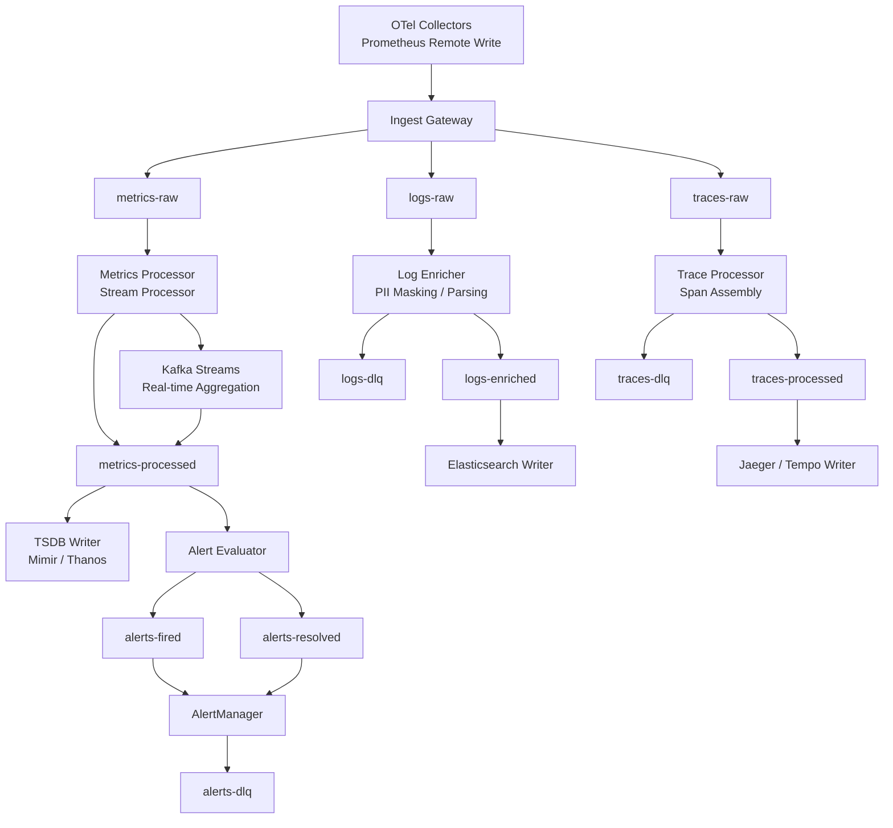

# 10 — Message Queue Design

## Objective

Define the Kafka topology that forms the observability data pipeline backbone. The monitoring platform ingests three distinct data types — metrics, logs, and traces — each with different volume profiles, ordering requirements, durability needs, and processing semantics. Kafka serves as the decoupling layer between ingestion (which must be fast and never drop data) and storage backends (which can be slower and may need backpressure). This document covers topic design, partition strategy, consumer groups, exactly-once semantics debates, dead letter queues, retention design, backpressure handling, and real-time stream aggregation.

---

## Kafka Topology Overview



---

## Topic Inventory

| Topic | Purpose | Retention | Partitions |
|---|---|---|---|
| `metrics-raw` | Raw remote write payloads from Prometheus agents | 2 hours | 96 |
| `metrics-processed` | Validated, normalized metrics ready for TSDB write | 4 hours | 96 |
| `logs-raw` | Raw log batches from OTel collector | 4 hours | 48 |
| `logs-enriched` | Parsed, PII-masked, enriched log records | 4 hours | 48 |
| `traces-raw` | Raw span batches from OTel collector | 4 hours | 48 |
| `traces-processed` | Complete traces (spans assembled by trace ID) | 4 hours | 48 |
| `alerts-fired` | Alert instances that transitioned to firing state | 7 days | 12 |
| `alerts-resolved` | Alert instances that transitioned to resolved state | 7 days | 12 |
| `alerts-dlq` | Undeliverable alert notifications | 30 days | 6 |
| `logs-dlq` | Unparseable/oversized log records | 7 days | 12 |
| `traces-dlq` | Malformed or oversized trace spans | 7 days | 12 |
| `audit-events` | Immutable audit trail for platform operations | 365 days | 12 |

Metrics topics have 2x the partitions of logs/traces because metric ingestion volume is typically 3–5x higher than log volume for a typical customer fleet. Alert topics have far fewer partitions — alert volume is low, and ordering within an alert group matters.

---

## Partition Strategy

### Metrics: The Hash-by-Metric-Name vs. Hash-by-Scrape-Target Debate

This is one of the most consequential partitioning decisions in the pipeline.

**Option A: Hash by metric name**
- All samples for `http_requests_total` across all targets land on the same partition(s).
- **Advantage**: Kafka Streams aggregations over a metric name (e.g., sum across all instances) read from a single partition, avoiding cross-partition joins.
- **Disadvantage**: If `http_requests_total` has 1M active series (high-cardinality label space), that single partition becomes a hot partition. A single metric name monopolizes partition bandwidth. In practice, the top 10 metric names often represent 80% of volume.

**Option B: Hash by scrape target (job + instance)**
- All metrics from `job="api-server", instance="10.0.0.1:8080"` land on the same partition.
- **Advantage**: Even load distribution — partition load is bounded by the number of scrape targets, not by metric name cardinality. Scrape targets are typically more evenly distributed.
- **Disadvantage**: Cross-target aggregations (like `sum(http_requests_total)`) require cross-partition reads.

**Option C: Hash by tenant + metric name hash (recommended)**
- Key = `tenant_id + xxhash(metric_name)`. This distributes by metric name within a tenant, avoiding cross-tenant interference.
- **Advantage**: Per-tenant hot partitions are isolated. A tenant with a high-cardinality metric doesn't affect others.
- **Disadvantage**: Same hot-partition risk within a tenant for high-volume metrics.

**Decision**: Use Option C (tenant + metric name hash) with a secondary partition expansion strategy for known hot partitions. If a specific metric name generates >5% of total partition bandwidth, that metric is assigned a dedicated "overflow" partition range.

### Logs: Hash by Service

Log partition key = `tenant_id + service_name`. Log consumers in Elasticsearch typically write one index per service per day. By co-locating a service's logs on the same partition, the Elasticsearch writer for that service reads from a single partition sequentially, which maximizes write throughput (Elasticsearch bulk indexing is 10–100x more efficient in sequential batches than scattered appends).

### Traces: Hash by Trace ID

This is non-negotiable: all spans belonging to the same trace must land on the same partition. Trace assembly (the process of collecting all spans for a trace ID and emitting a complete trace) requires seeing all spans together. With hash-by-trace-ID, the trace assembler reads from one partition and has all spans available.

The subtlety: trace IDs are random (UUID or random 128-bit values), so they distribute evenly across partitions without hot spots — unlike metric names, which have highly skewed access patterns.

---

## Consumer Groups Per Storage Backend

Each storage backend operates as an independent consumer group. This allows each backend to consume at its own pace without affecting others.

| Consumer Group | Topic(s) Consumed | Instances | Purpose |
|---|---|---|---|
| `tsdb-writer-cg` | `metrics-processed` | 48 pods (1:2 partition ratio) | Write to Mimir/Thanos TSDB |
| `recording-rule-cg` | `metrics-processed` | 12 pods | Evaluate recording rules, write back to metrics-processed |
| `alert-evaluator-cg` | `metrics-processed` | 6 pods | Evaluate alert expressions continuously |
| `es-log-writer-cg` | `logs-enriched` | 24 pods | Bulk index to Elasticsearch |
| `log-pii-masker-cg` | `logs-raw` | 12 pods | PII masking, field parsing, enrich with k8s metadata |
| `trace-assembler-cg` | `traces-raw` | 24 pods | Assemble complete traces from spans |
| `tempo-writer-cg` | `traces-processed` | 12 pods | Write to Grafana Tempo |
| `alert-notifier-cg` | `alerts-fired`, `alerts-resolved` | 6 pods | Route to PagerDuty, Slack, webhooks |

### Consumer Lag as a Health Signal

Consumer lag (the gap between the latest Kafka offset and the consumer's committed offset) is the primary health indicator for the pipeline. Alert thresholds:

- `tsdb-writer-cg` lag > 5 minutes → TSDB write throughput falling behind; scale writer pods.
- `es-log-writer-cg` lag > 10 minutes → Elasticsearch indexing bottleneck; check cluster health.
- `alert-evaluator-cg` lag > 30 seconds → Alert latency SLO at risk; escalate immediately.

---

## Exactly-Once Semantics Debate

### Metrics: At-Least-Once Is Acceptable

Duplicate metric samples are handled gracefully by the TSDB write path. Prometheus's TSDB deduplicates samples at the same timestamp (identical `(labels, timestamp, value)` tuples are idempotent writes). Remote write includes a sequence identifier that the ingest gateway uses for deduplication over a short window (60 seconds).

The cost of exactly-once for metrics (2-phase Kafka transactions + idempotent producer overhead) is not justified when the storage layer already handles duplicates. At-least-once with TSDB-level deduplication is the right model.

### Traces: Ordering Matters — At-Least-Once with Idempotency

Trace spans must be assembled in a complete set before being written to the trace store. The challenge: spans for a single trace can arrive out of order and from different collectors. The trace assembler:

1. Buffers spans for a trace ID for a configurable window (default: 10 seconds after the last span for that trace).
2. When the buffer window closes, emits the complete trace to `traces-processed`.
3. Uses exactly-once Kafka producer semantics for the assembled trace output to ensure no trace is written twice.

Exactly-once is justified here because trace duplication causes visible user-facing errors (duplicate trace IDs in Jaeger UI, incorrect span count reporting).

### Logs: At-Least-Once with Application-Level Deduplication

Log duplication is generally tolerable (seeing a log line twice is annoying but not incorrect). However, for compliance log pipelines (audit logs, security events), exactly-once semantics are enabled using Kafka transactions. The cost: ~20% throughput reduction on the log producer. This is acceptable for audit logs (low volume) but not for application logs (high volume, where duplication is benign).

| Signal Type | Kafka Semantics | Justification |
|---|---|---|
| Metrics | At-least-once + TSDB dedup | Storage layer handles duplicates; EOS overhead not justified |
| Application logs | At-least-once | Duplication tolerable; throughput more important |
| Audit/security logs | Exactly-once (Kafka transactions) | Compliance requirement; low volume makes EOS cost acceptable |
| Traces | Exactly-once for assembled traces | Prevents duplicate traces in UI; assembly is stateful anyway |
| Alerts | Exactly-once | Duplicate alert fires cause false incident escalations |

---

## Dead Letter Queue Strategy

### When Records Go to DLQ

A record enters the DLQ when:
- It cannot be parsed (malformed protobuf, truncated payload, unknown schema version).
- It exceeds the size limit (configurable per signal type; default: 1MB for metrics, 10MB for logs/traces).
- It has been retried more than 5 times and continues to fail (e.g., downstream storage is accepting writes but the specific record causes a persistent error like a schema validation failure).
- The schema version is unknown (the consumer does not have the decoder for that schema version — indicates a schema registry mismatch).

### DLQ Design Principles

1. **DLQ is separate per signal type**: `metrics-dlq`, `logs-dlq`, `traces-dlq`. Do not co-locate — it makes DLQ consumers simpler and allows independent retention policies.
2. **DLQ records include failure metadata**: original topic, original partition, original offset, failure timestamp, failure reason, retry count, consumer group ID. This allows root cause analysis and selective replay.
3. **DLQ consumers are human-operated tools, not automated replayers**: Automatically replaying DLQ records risks creating infinite retry loops. A human (or an operator-approved automation with a circuit breaker) inspects DLQ contents, fixes the root cause, then triggers selective replay.
4. **DLQ retention is longer than main topic**: Main topics have 2–4 hour retention (buffer for consumer lag). DLQ has 7–30 day retention to allow investigation and replay.

### Schema Evolution and DLQ Interaction

The schema registry governs protobuf schema evolution. A consumer receiving a message with an unknown schema version (e.g., a new field added by a newer producer) will DLQ that message if the consumer is not updated. This reveals the deployment sequencing requirement: **always deploy consumers before producers** when adding new schema fields, so consumers are ready to handle the new format before it starts appearing in the topics.

---

## Kafka Retention vs. TSDB Retention

### The Buffering Problem

Kafka retention for `metrics-raw` is set to 2 hours. This is not long-term storage — it is a buffer to absorb spikes in TSDB writer latency and allow consumer restarts without data loss. The TSDB is the long-term storage system (typically 90 days → 1 year, with downsampled data retained indefinitely in object storage).

This creates a critical operational decision: if the TSDB writer falls behind by more than 2 hours, Kafka messages start expiring before they are consumed. This is data loss.

### Retention Sizing

| Topic | Retention | Rationale |
|---|---|---|
| `metrics-raw` | 2 hours | Short — TSDB deduplication handles brief gaps |
| `metrics-processed` | 4 hours | Longer — alert evaluator and recording rules must not miss data |
| `logs-raw` | 4 hours | ES writer can be slower; need buffer for ES maintenance windows |
| `logs-enriched` | 4 hours | Same as above |
| `traces-raw` | 4 hours | Trace assembler needs to buffer spans for assembly window |
| `alerts-fired` | 7 days | Alert replay for incident analysis; low volume |

Retention is time-based (not size-based) because these are streaming pipelines — the data volume is proportional to time, and operators think in "hours of buffer" rather than "GBs of data."

---

## Backpressure Handling When Storage Falls Behind

### The Backpressure Problem

When Elasticsearch is undergoing rolling maintenance, its indexing throughput drops. The `es-log-writer-cg` consumer group falls behind. Kafka retains the unprocessed logs, but the ingest gateway is still accepting new logs at full speed. If the gap exceeds the Kafka retention window, logs are lost.

### Remote Write Queue on the Prometheus Side

Prometheus remote write maintains an in-memory queue (WAL-backed) on the sender side. If the ingest gateway is slow (returns HTTP 429 or 503), Prometheus stops sending and queues up to `remote_write.queue_config.capacity` samples (default: 2500). This provides a first line of backpressure relief — the collector absorbs short bursts before they hit Kafka.

Remote write queue parameters tuned for production:

| Parameter | Value | Effect |
|---|---|---|
| `capacity` | 100,000 samples | In-memory queue depth |
| `max_shards` | 200 | Parallel connections to ingest gateway |
| `min_shards` | 10 | Minimum parallelism to avoid head-of-line blocking |
| `max_backoff` | 5s | Maximum retry interval |

If the queue fills up (backpressure propagated from ingest gateway), Prometheus starts dropping the oldest queued samples. This is acceptable — for alerting purposes, the most recent samples matter most; old backlogged samples from a degraded storage period are less valuable.

### Consumer-Side Backpressure

The Elasticsearch writer implements adaptive batch sizing and backpressure signaling:
- When ES bulk indexing latency exceeds 2 seconds, the writer reduces its fetch batch size from Kafka (reducing throughput).
- When ES returns HTTP 429 (circuit breaker triggered), the writer pauses consumption for an exponential backoff period.
- The consumer group lag metric is exposed to the autoscaler, which adds writer pods when lag grows.

The autoscaler adds writer pods quickly (scale-up trigger: lag > 5 minutes for 2 consecutive minutes) and removes them slowly (scale-down trigger: lag < 1 minute for 15 consecutive minutes), following a conservative scale-down to avoid thrashing.

---

## Kafka Streams for Real-Time Aggregation

### Use Case: Pre-Aggregation to Reduce TSDB Write Volume

High-cardinality metrics create a write amplification problem. If a service has 10,000 pod instances each reporting `http_requests_total{pod="pod-X"}`, the TSDB receives 10,000 distinct time series. For dashboards that only ever show the sum across all pods, this cardinality is wasted.

Kafka Streams runs a real-time aggregation topology that computes `sum(http_requests_total) by (job, method, status)` continuously, dropping the `pod` label. The aggregated series is emitted to `metrics-processed` alongside (or instead of) the raw high-cardinality series.

```mermaid
graph LR
    MP[metrics-processed] --> KSInput[Kafka Streams\nInput Processor]
    KSInput --> RuleEval[Recording Rule\nEvaluator]
    RuleEval --> Aggregate[Tumbling Window\nAggregator\n60s windows]
    Aggregate --> KSOutput[Kafka Streams\nOutput Processor]
    KSOutput --> MPBack[metrics-processed\n(aggregated series)]
```

Kafka Streams tumbling windows are used for 1-minute aggregations. The state store (RocksDB, backed by a changelog topic in Kafka) holds the partial aggregates for the current window. On window close, the aggregate is emitted.

### Exactly-Once Semantics for Kafka Streams Aggregations

Kafka Streams uses exactly-once processing (EOS) for stateful operations to ensure that partial aggregates are not duplicated during rebalancing. This is the right tradeoff: the volume of recording rule outputs is much lower than raw metric volume (aggregation reduces series count by 10–100x), so the EOS overhead is proportionally small.

---

## Interview Discussion Points

**Q: Why use Kafka here instead of writing directly from collectors to TSDB?**  
A: Three reasons. (1) Decoupling — TSDB maintenance (compaction, WAL flush) creates write latency spikes. Without a queue, collectors experience timeouts and drop data. Kafka absorbs the spike. (2) Fan-out — multiple consumers (TSDB writer, alert evaluator, recording rules, PII masker) read the same data independently. Without Kafka, the ingest gateway would need to write to N backends, creating tight coupling. (3) Replayability — if the alert evaluator has a bug and misses alerts for 30 minutes, replay from Kafka (within the retention window) to re-evaluate.

**Q: What happens to alert latency if the `alert-evaluator-cg` consumer group falls behind?**  
A: Alert SLO breach. If the evaluator is 5 minutes behind, it is evaluating 5-minute-old metrics. An incident that started 4 minutes ago might not have fired yet. This is the highest priority consumer group in the system — it has dedicated pods, a separate consumer group (isolated from write-heavy consumers), and a lag alert that fires before the 30-second SLO boundary. In production, the alert evaluator typically queries the TSDB directly (bypassing Kafka) for the most recent evaluation window, using Kafka only as an ordering/deduplication mechanism.

**Q: Why is exactly-once semantics a "debate" for metrics rather than a clear choice?**  
A: Because the TSDB write path already handles duplicates correctly (idempotent on timestamp), the distributed transaction cost of Kafka EOS (2-phase commit overhead, ~15–30% throughput reduction) buys nothing. You are paying a real performance cost for a correctness guarantee you already have elsewhere. The debate is real at enterprise scale — some ops teams insist on EOS for auditability even when it provides no functional benefit, arguing that "at-least-once" in documentation makes auditors nervous.

**Q: How do you handle a Kafka cluster upgrade without dropping observability data?**  
A: Rolling broker upgrades with leader election. Since each partition has replicas, the upgrade takes one broker offline at a time, promotes a replica to leader, upgrades the broker, brings it back. Producer and consumers reconnect to the new leader automatically. Remote write queues on the Prometheus side buffer the 30–60 seconds of leader election latency. Zero data loss if ISR (in-sync replicas) count ≥ 2 during the upgrade.

**Q: At what scale does Kafka become the bottleneck in this pipeline?**  
A: At ~10GB/s sustained throughput per Kafka cluster (approximately 100M metrics per minute from 50,000 scraped targets). Beyond this, horizontal Kafka cluster expansion becomes complex to manage. At this scale, consider tiered Kafka (Confluent Tiered Storage or Apache Kafka with S3 tiering) to separate the hot broker tier from the storage tier, allowing independent scaling of compute vs. storage. Startups rarely need this — the bottleneck is typically the TSDB write path or Elasticsearch indexing before Kafka itself.
