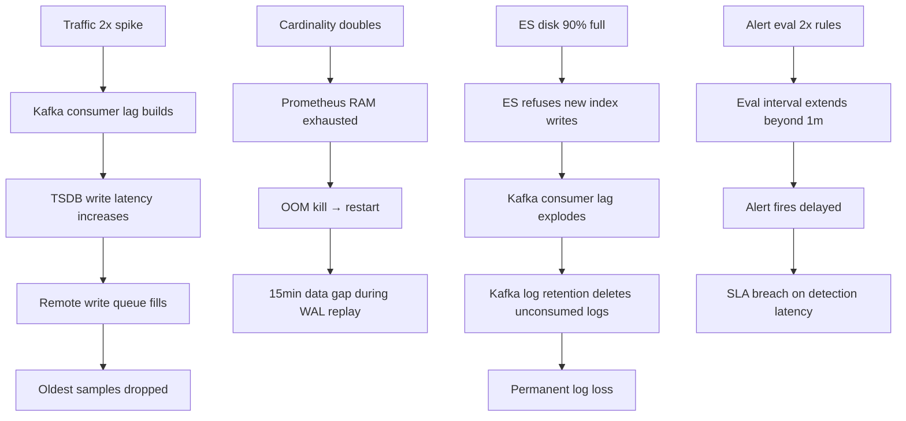

# 11 — Failure Scenarios: Metrics & Monitoring Platform

## Objective

Enumerate concrete failure modes, their blast radius, detection signals, mitigation mechanisms, and recovery procedures. Focus on production-realistic failures, not theoretical edge cases.

---

## Failure 1: Collector/Scraper Dies Mid-Scrape

**Scenario:** Prometheus process crashes while halfway through a scrape cycle. Some targets were scraped, some were not.

**Blast Radius:** Data gap for unscraped targets in that interval (15s by default). PromQL `rate()` functions will interpolate across the gap up to 5m (lookback delta). Gaps > 5m return no data.

**Detection:**
- `prometheus_target_scrape_duration_seconds` stops updating
- `up{job="..."}` series goes stale → triggers `absent()` alerts
- WAL replay on restart logs recovered vs dropped samples

**Mitigation:**
- Run two Prometheus replicas scraping identical target sets (HA pair)
- Thanos/Mimir Querier deduplicates using `replica` label on query side
- Short scrape intervals (15s) mean gap is at most 15s of data

**Recovery:**
1. Prometheus restarts, replays WAL (typically < 2 minutes for 2h head block)
2. Resumes scraping from current time — historical gap is permanent
3. If WAL is corrupted: delete WAL directory, restart with cold head (lose up to 2h of recent data in memory)

**Interview Note:** The gap is NOT recoverable from Prometheus alone. If 100% data fidelity is required, push model (remote_write) with persistent queue is more reliable than pull model.

---

## Failure 2: Kafka Partition Leader Election During High-Throughput Ingestion

**Scenario:** Kafka broker hosting partition leader for `metrics-raw-partition-7` crashes. Leader election takes 5-30 seconds.

**Blast Radius:** All remote_write clients pushing to that partition experience 5-30s of failed writes. Clients with in-memory queue buffer the samples; when queue fills, oldest samples are dropped.

**Detection:**
- `kafka_server_replicamanager_leadercount` drops on failed broker
- Producer error rate spikes: `kafka_producer_record_error_total`
- Remote write queue depth rises: `prometheus_remote_storage_queue_highest_sent_timestamp_seconds` lags

**Mitigation:**
- Set `min.insync.replicas=2` and `acks=all` for metrics topics — producers wait for new leader
- Remote_write retry with exponential backoff (Prometheus does this automatically)
- Queue capacity sized for 5-10 minutes of normal throughput to absorb leader election delay

**Recovery:**
1. Kafka controller detects leader failure, elects new leader from ISR (in-sync replicas)
2. Producers resume writing to new leader
3. Samples buffered in producer queue drain normally
4. Samples dropped from full queue are permanently lost — acceptable for metrics (brief gap)

---

## Failure 3: TSDB Head Block WAL Corruption

**Scenario:** OS crash during WAL fsync. WAL segment is partially written. On restart, WAL replay encounters corrupted segment.

**Blast Radius:** All samples written after the last clean WAL checkpoint (up to 2h) in the head block may be lost or partially recovered.

**Detection:**
- Prometheus logs: `"unexpected error replaying chunks"`
- Startup time exceeds 10 minutes (replay stuck)
- `prometheus_tsdb_wal_corruptions_total` counter increments

**Mitigation:**
- Prometheus WAL is append-only with checksums — corruption is detectable
- WAL uses 128MB segments; corruption isolates to one segment
- Use local SSD with reliable write path (EBS `io2` in AWS, not `gp2`)

**Recovery:**
1. Prometheus detects corruption, truncates WAL at last valid checkpoint
2. Samples from corrupted segment onward are lost (typically < 2h)
3. Persist blocks are not affected — only head block data is at risk
4. If head block fully corrupt: delete `wal/` and `chunks_head/` directories; lose entire head (up to 2h)
5. HA replica fills the gap with its own data (if Thanos deduplication is configured)

---

## Failure 4: Elasticsearch Split-Brain

**Scenario:** Network partition divides 5-node ES cluster into two groups (3 nodes + 2 nodes). Both sides believe they are the primary cluster.

**Blast Radius:**
- Both sides accept log writes independently
- After partition heals, conflicting index states cause data inconsistency
- Worst case: duplicate documents, lost updates, corrupted index state

**Detection:**
- `elasticsearch_cluster_health_status` shows `red` or `yellow`
- `_cluster/health` API returns `number_of_pending_tasks > 0`
- Kibana shows cluster health warning

**Mitigation:**
- Set `discovery.zen.minimum_master_nodes` = (N/2 + 1) = 3 for 5 nodes
- With `minimum_master_nodes=3`: minority partition (2 nodes) cannot elect master → goes read-only → prevents split-brain
- Use dedicated master nodes (3 dedicated masters, not co-located with data nodes)

**Recovery:**
1. Partition heals → minority nodes rejoin cluster
2. ES reconciles diverged shards using shard versions
3. Run `POST /_cluster/reroute?retry_failed=true` to reassign stuck shards
4. If data loss: replay logs from Kafka (if still within retention window)

---

## Failure 5: Alert Evaluator Restart During Active Incident

**Scenario:** AlertManager pod restarts (OOM or rolling deploy) while 10 alerts are firing. In-memory alert state is lost.

**Blast Radius:**
- All firing alerts transition to "unknown" state
- Alerts re-enter pending state (must wait for `for: duration` again)
- If `for: 5m`, alerts won't re-fire for 5 minutes — gap in on-call notification
- Inhibitions and silences also lost (unless persisted)

**Detection:**
- `alertmanager_alerts_firing` drops to 0 unexpectedly
- `alertmanager_notifications_total` stops incrementing
- On-call team notices PagerDuty silence

**Mitigation:**
- Run AlertManager as 3-node cluster with gossip state replication (memberlist)
- In HA mode, one node restarting doesn't lose cluster state
- Persist silences to local storage (AlertManager writes `silences.json` to disk)
- Mount persistent volume for AlertManager data directory

**Recovery:**
1. AlertManager restarts and joins cluster gossip
2. Receives alert state from peer nodes via gossip within seconds
3. Silences restored from persistent volume
4. Alert evaluation resumes — pending alerts re-evaluate immediately

**Interview Note:** This is why AlertManager HA uses gossip, not Raft. Raft requires quorum; AlertManager prefers eventual consistency (eventual deduplication is fine; strict ordering is not needed for notifications).

---

## Failure 6: Query Frontend OOM on Cardinality Explosion Query

**Scenario:** Engineer runs `sum by() (rate(http_requests_total[5m]))` with no label matchers on a 50M series TSDB. Query fetches ALL series matching the metric name, allocates GBs of memory.

**Blast Radius:**
- Query Frontend pod OOM killed (or swaps heavily)
- Other in-flight queries for the same tenant fail
- If no per-tenant query isolation, other tenants' queries also affected

**Detection:**
- `process_resident_memory_bytes` spikes on query nodes
- `cortex_query_frontend_queries_total{result="error"}` increments
- Kubernetes reports OOMKilled on pod

**Mitigation:**
- Enforce per-tenant query limits: `max_fetched_series_per_query`, `max_fetched_chunk_bytes`
- Query timeout: kill queries exceeding 30s wall clock time
- Per-tenant query concurrency limit: max 5 concurrent queries
- Query shard: break single query into parallel shards with bounded per-shard series count
- Warn users when query selects >1M series without label matchers

**Recovery:**
1. Query Frontend pod restarts (stateless — no data loss)
2. User receives error response with guidance to add label matchers
3. Long-term: implement query cost estimation before execution

---

## Failure 7: Storage Node Disk Full

**Scenario:** TSDB local SSD fills up. Compactor cannot write new blocks; head block cannot flush.

**Blast Radius:**
- Prometheus stops accepting new samples (write path blocked)
- All scrapes continue but samples are dropped
- Alert evaluation data becomes stale
- Cascading: if Prometheus is also AlertManager's data source, alerts stop firing

**Detection:**
- `prometheus_tsdb_head_chunks_storage_size_bytes` approaching disk capacity
- Node disk usage alert (should be configured separately on infra monitoring)
- `prometheus_tsdb_compactions_failed_total` increments

**Mitigation:**
- Configure disk usage alert at 70% threshold (not 90% — compaction needs headroom)
- Enable remote_write to Thanos/Mimir — local TSDB only holds short retention (2 days local, rest in S3)
- Separate TSDB data volume from OS volume
- Automated disk resize or snapshot + expand in cloud environments

**Recovery:**
1. Emergency: delete oldest persisted blocks manually (data loss) to free space
2. Better: reduce local retention (`--storage.tsdb.retention.time=24h`) and let Thanos handle history
3. Long-term: provision larger disks, implement disk pressure runbook

---

## Failure 8: Clock Skew Between Scraped Target and Prometheus

**Scenario:** Target's system clock is 10 minutes ahead of Prometheus. Prometheus receives samples with future timestamps.

**Blast Radius:**
- Prometheus rejects samples timestamped more than 10m in the future (default `--storage.tsdb.out-of-order-time-window`)
- Silently drops samples → data gap
- No error visible to target — scrape "succeeds" from Prometheus perspective

**Detection:**
- `prometheus_target_scrape_sample_duplicate_timestamp_total` increments
- Compare `time()` PromQL function against target's `process_start_time_seconds`
- NTP monitoring on all hosts

**Mitigation:**
- Run NTP/Chrony on all hosts; alert on `chrony_tracking_root_distance_seconds > 0.1`
- In Kubernetes: node clock skew is managed by cloud provider NTP; pods inherit node clock
- Prometheus `--storage.tsdb.out-of-order-time-window=10m` allows accepting slightly out-of-order samples

**Recovery:**
- Fix NTP on affected host
- Historical data during skew period has incorrect timestamps — cannot retroactively fix
- If critical: use push model (remote_write) where client controls timestamp, reducing scraper clock dependency

---

## Failure 9: Network Partition Between Global Query Layer and Regional Shards

**Scenario:** Thanos Querier in US-EAST loses connectivity to regional Prometheus in EU-WEST for 30 minutes.

**Blast Radius:**
- Global dashboards showing EU-WEST data show gaps or errors
- Alerts using cross-region metric federation may mis-fire (absent data looks like metric = 0)
- EU-WEST region continues operating normally for local queries/alerts

**Detection:**
- `thanos_store_series_total` drops for EU-WEST StoreAPI endpoint
- Query errors with `"context deadline exceeded"` for EU-WEST series
- Grafana shows partial data (only some shards return results)

**Mitigation:**
- Thanos Querier is configured with `--store.sd-dns` for discovery; unavailable stores are marked unhealthy and skipped (partial results returned, not full failure)
- Configure `--query.partial-response` flag: return available data with warning rather than failing entire query
- Regional Prometheus/AlertManager pairs operate independently — inter-region partition doesn't affect local alerting

**Recovery:**
1. Network partition heals
2. Thanos Querier rediscovers healthy EU-WEST StoreAPI endpoint (health check TTL)
3. Historical data during partition is accessible via Thanos Store Gateway from S3 (blocks uploaded every 2h)
4. Recent data (< 2h) from EU-WEST was not uploaded to S3 during partition → permanent gap if Prometheus in EU-WEST was also affected

---

## "What Would Break First?" Analysis

**Primary failure chain for most systems:** Cardinality spike → Prometheus OOM → data gap → alert evaluation stops → on-call blind during incident.

---

## Failure Runbook Summary

| Failure | Detection Signal | Immediate Action | Root Fix |
|---|---|---|---|
| Prometheus OOM | `kube_pod_container_status_restarts_total` | Restart; check WAL replay | Audit high-cardinality labels; add limits |
| Kafka consumer lag | `kafka_consumer_group_lag` > threshold | Scale consumer group | Add partitions + consumer instances |
| ES disk full | Node disk usage > 85% | Delete oldest indices manually | Enable ILM; provision more storage |
| AlertManager split | `alertmanager_cluster_members` drops | Check gossip port connectivity | Fix network; verify minimum peers |
| WAL corruption | Prometheus startup failure | Remove corrupted WAL segment | Use EBS io2 or NVMe; check disk errors |
| Query OOM | Pod OOMKilled | Restart pod (stateless) | Add per-tenant query limits |
| Clock skew | NTP alert | Fix NTP on affected node | Enforce NTP monitoring on all hosts |

---

## Interview Discussion Points

**Q: How do you monitor your monitoring system?**
Meta-monitoring: a separate lightweight Prometheus ("Prometheus to monitor Prometheus") that scrapes the main Prometheus cluster. Alert on the meta-monitor. For ES: use ES's own metrics API scraped by Prometheus. Never let the primary monitoring stack be its own sole observer.

**Q: What happens when the on-call person's pager service (PagerDuty) is down?**
AlertManager supports multiple receivers per route. Configure fallback: PagerDuty primary → email secondary → Slack tertiary. Also maintain a dead man's switch: periodic "heartbeat" alert that must fire; if it stops, something is wrong with the entire alert pipeline.

**Q: How do you prevent a runaway query from taking down the whole cluster?**
Query isolation via per-tenant resource quotas (Cortex/Mimir). Query Frontend enforces `max_fetched_series_per_query`. Queries exceeding timeout are killed. Low-priority dashboard queries are preemptable. High-priority alert evaluation queries are protected via separate query lane.

**Q: Can you lose alert history during an AlertManager upgrade?**
With stateful HA (gossip + persistent volume): no, rolling upgrade keeps cluster alive. With single-instance AlertManager: yes, active alerts lose state during restart. This is why production AlertManager must always be 3-node HA cluster.
