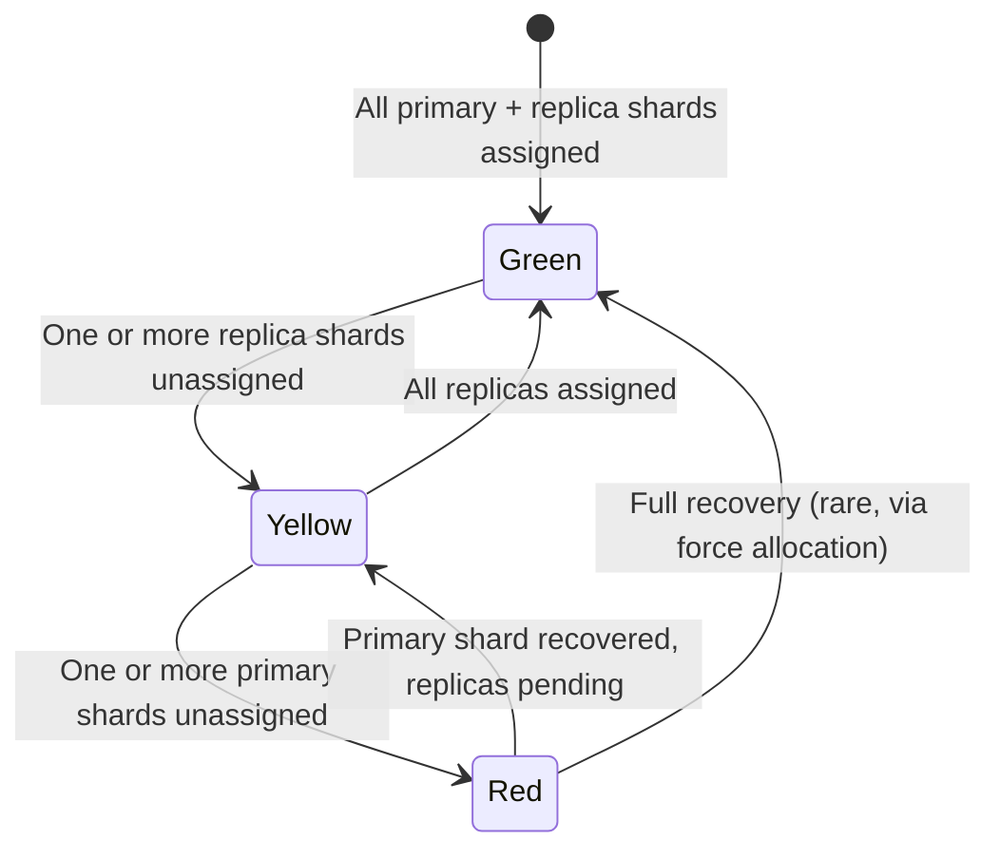
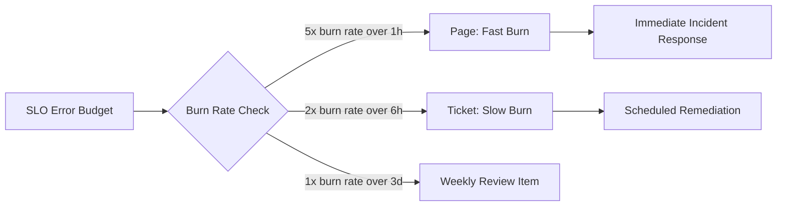
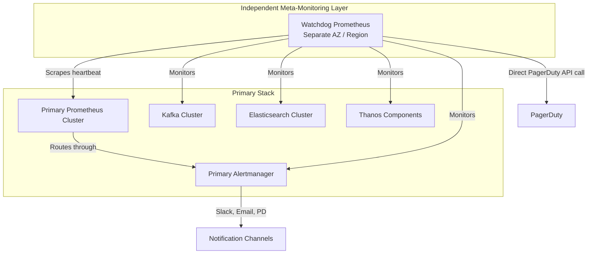
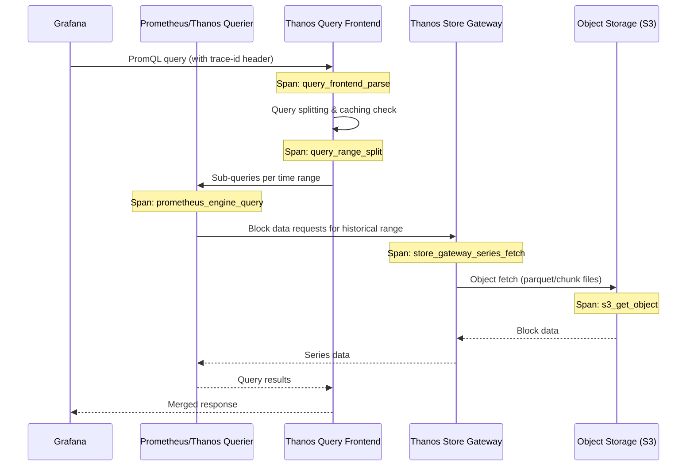
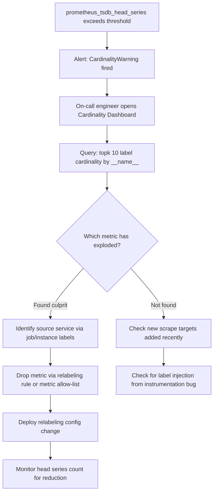

# 12 — Observability of the Observability Platform (Meta-Monitoring)

---

## Objective

A monitoring platform that cannot monitor itself is a liability, not an asset. When Prometheus goes down, how do you know? When Kafka consumer lag grows and alerts stop firing, who alerts the on-call engineer? This document defines the meta-monitoring strategy — the internal observability of the observability stack itself.

The core challenge is the **circular dependency problem**: the very tools used to alert on production systems must themselves be observed, but they cannot be the sole observers of themselves. A Prometheus instance that is down cannot scrape itself and fire an alert about its own downtime. This demands a layered, independent meta-monitoring architecture.

---

## Design Decisions

### 1. Independent Watchdog Layer

Meta-monitoring must be architecturally independent from the primary observability stack. The primary Prometheus cluster cannot be its own sole guardian.

**Strategy: Deadman's Switch (Heartbeat Alerting)**

A dedicated "watchdog" Prometheus instance — intentionally kept minimal and on separate infrastructure (different availability zone, separate node pool, even a different cloud region) — continuously scrapes a heartbeat endpoint exposed by the primary Prometheus cluster. If the heartbeat disappears for more than one scrape cycle, the watchdog fires an alert through an independent alerting channel (PagerDuty direct API, SMS, separate Alertmanager instance not connected to the primary).

**Strategy: Alertmanager Inhibition vs. Alertmanager Failure**

Alertmanager has its own HA cluster. Its cluster gossip state must be monitored independently. If the Alertmanager HA cluster loses quorum, alerts may still be evaluated by Prometheus but silently dropped. The watchdog Prometheus must scrape Alertmanager's own metrics endpoint.

### 2. Prometheus Scraping Itself

Prometheus exposes its own metrics at `/metrics`. Key metrics to scrape:

| Metric | What It Tells You |
|---|---|
| `prometheus_tsdb_head_series` | Active time-series count — cardinality health |
| `prometheus_tsdb_head_chunks` | Chunk count in head block — memory pressure indicator |
| `prometheus_engine_query_duration_seconds` | Query latency distribution — PromQL performance |
| `prometheus_rule_evaluation_duration_seconds` | Alert rule evaluation time |
| `prometheus_rule_evaluation_failures_total` | Alert rules that failed to evaluate (e.g., target down, query timeout) |
| `prometheus_target_scrape_duration_seconds` | Per-target scrape latency |
| `prometheus_target_scrapes_exceeded_sample_limit_total` | Targets hitting sample limits |
| `prometheus_remote_storage_samples_pending` | Remote write queue backlog depth |
| `prometheus_remote_storage_failed_samples_total` | Samples dropped due to remote write failures |
| `prometheus_notifications_dropped_total` | Alerts dropped without delivery |
| `prometheus_tsdb_compactions_triggered_total` | Background compaction activity |
| `prometheus_tsdb_wal_corruptions_total` | WAL corruption events — data integrity signal |
| `up{job="prometheus"}` | Whether Prometheus itself is reachable (scraped by watchdog) |

### 3. Prometheus Scraping Kafka

Kafka does not natively expose Prometheus metrics. The JMX Exporter (or Confluent's dedicated exporter) must be deployed as a sidecar or agent.

Key Kafka metrics to monitor:

| Metric | Alert Threshold |
|---|---|
| `kafka_consumer_group_lag` per consumer group | > 50,000 messages for > 5 minutes |
| `kafka_server_BrokerTopicMetrics_MessagesInPerSec` | Sudden drop > 80% from baseline |
| `kafka_controller_KafkaController_ActiveControllerCount` | != 1 (split-brain or no controller) |
| `kafka_log_Log_Size` per partition | Approaching retention limit |
| `kafka_network_RequestMetrics_RequestsPerSec` for Produce | Below expected floor for ingestion pipeline |
| `kafka_server_ReplicaManager_UnderReplicatedPartitions` | > 0 for > 1 minute |
| `kafka_server_ReplicaManager_OfflineReplicaCount` | > 0 immediately |
| `kafka_log_LogFlushRateAndTimeMs_99thPercentile` | > 500ms |

Kafka's ZooKeeper (if still in use) or KRaft quorum nodes also need independent scraping. ZooKeeper latency and outstanding requests are early warning signals.

### 4. Elasticsearch Cluster Health Metrics

Elasticsearch exposes a REST-based metrics endpoint. The Elasticsearch Exporter (or Metricbeat in Prometheus mode) translates these to Prometheus format.

Key Elasticsearch metrics:

| Metric | Alert |
|---|---|
| `elasticsearch_cluster_health_status` | != green (yellow = warn, red = critical) |
| `elasticsearch_cluster_health_active_shards` | Sudden drop |
| `elasticsearch_cluster_health_relocating_shards` | > 0 for > 10 minutes (ongoing rebalance) |
| `elasticsearch_cluster_health_unassigned_shards` | > 0 for > 2 minutes |
| `elasticsearch_indices_indexing_index_time_in_millis` | p99 > 2000ms |
| `elasticsearch_jvm_mem_heap_used_percent` | > 75% (GC pressure risk above 85%) |
| `elasticsearch_thread_pool_write_rejected` | > 0 (write queue saturation) |
| `elasticsearch_indices_segments_count` | Rapid growth signals missing merges |
| `elasticsearch_indices_store_size_in_bytes` per index | Approaching shard size limits (50GB guideline) |
| `elasticsearch_nodes_roles` | Unexpected topology changes (data node leaving) |

**Elasticsearch Cluster Health State Machine:**

---

## Key SLIs (Service Level Indicators)

SLIs measure actual observable behavior. Each SLI must be derived from real metric data, not synthetic.

| SLI | Definition | Measurement Method |
|---|---|---|
| **Ingestion Latency p99** | Time from metric sample generation at source to availability in TSDB for query | Timestamp embedded in metric payload vs. TSDB write timestamp |
| **Query Latency p99** | Time from PromQL/LogQL query submission to first byte of response | `prometheus_engine_query_duration_seconds` histogram bucket at 0.99 |
| **Alert Evaluation Lag** | Delta between alert condition becoming true and AlertManager receiving the firing alert | `prometheus_rule_evaluation_duration_seconds` + `prometheus_rule_evaluation_failures_total` tracking |
| **Log Indexing Lag** | Time from log line emission to searchability in Elasticsearch | Timestamp in log event vs. index creation time, sampled via synthetic canary logs |
| **Trace Ingestion Latency p99** | Time from span export to Jaeger/Tempo queryability | Synthetic span injection with known trace IDs |
| **Scrape Success Rate** | Fraction of configured scrape targets that return 200 in a given interval | `up` metric across all job/instance pairs |
| **Remote Write Success Rate** | Fraction of samples successfully written to long-term storage backend | `prometheus_remote_storage_failed_samples_total` / `prometheus_remote_storage_samples_total` |

### SLI Calculation: Ingestion Latency

The platform embeds a **canary metric injector**: a synthetic time-series publisher that emits a metric with a wall-clock timestamp as a label value. A query then computes the difference between the current time and the most recent ingestion timestamp of that canary series. This gives end-to-end ingestion lag including Kafka transit time and TSDB write.

---

## SLOs (Service Level Objectives)

SLOs define the minimum acceptable SLI values. They form the basis for error budgets and internal reliability commitments.

| SLO | Target | Error Budget (30-day) | Burn Rate Alert Threshold |
|---|---|---|---|
| Ingestion Success Rate | 99.9% | 43.2 minutes downtime | 5% budget burned in 1 hour |
| Alert Evaluation Completion | 99.5% of rules evaluated within 30s | 3.6 hours | 2% budget burned in 30 minutes |
| Query Availability (reads) | 99.5% of queries complete without 5xx | 3.6 hours | Alert at 10x burn rate |
| Log Indexing Lag p99 < 60s | 99% of time intervals | 7.2 hours | Alert when lag > 120s sustained 5 min |
| Trace Query Availability | 99.0% | 7.2 hours | Alert at 5x burn rate |

**Error Budget Burn Rate Alerting (SLO Burn Rate Model):**

---

## SLAs (Service Level Agreements)

SLAs are external commitments. For an internal observability platform serving engineering teams, SLAs are typically internal service agreements with consuming teams.

| SLA Tier | Ingestion Availability | Query Availability | Alert Delivery | Coverage |
|---|---|---|---|---|
| Tier 1 (Production) | 99.9% monthly | 99.5% monthly | <= 30s end-to-end | All production workloads |
| Tier 2 (Staging) | 99.0% monthly | 99.0% monthly | <= 2 minutes | Pre-production systems |
| Tier 3 (Dev) | 95.0% monthly | 95.0% monthly | Best effort | Developer sandboxes |

**SLA Breach Notifications:** Automated monthly SLA report generated from Prometheus recording rules, distributed to platform consumers. SLA breaches trigger a post-incident review.

---

## Dashboards

### Dashboard 1: Ingestion Pipeline Health

**Purpose:** Operational view for on-call engineers monitoring the data ingestion path.

**Panels:**
- Ingestion rate by source (metrics/sec, logs/sec, traces/sec) — time-series graph with 5-minute rate
- Kafka consumer lag by consumer group — heatmap (consumer group x time)
- Remote write queue depth per Prometheus instance — gauge + sparkline
- Remote write failure rate — single stat with threshold coloring (green < 0.1%, yellow < 1%, red >= 1%)
- Scrape duration p99 by job — top-N bar chart sorted by worst latency
- Ingestion latency p99 (canary-derived) — time-series with SLO threshold line

### Dashboard 2: Storage Layer Health

**Purpose:** Capacity and performance view for the TSDB and Elasticsearch clusters.

**Panels:**
- TSDB chunk count per Prometheus instance — time-series (growth rate indicates cardinality trends)
- TSDB head series count — time-series with cardinality explosion threshold line
- TSDB WAL size — time-series
- Thanos store compaction status — table showing last compaction time per block
- Elasticsearch index size by index pattern — bar chart, sorted descending
- Elasticsearch shard count and unassigned shards — stat panels with alert indicators
- Elasticsearch JVM heap usage per node — multi-line time-series
- Elasticsearch indexing rate vs. rejected writes — overlaid time-series

### Dashboard 3: Alert System Health

**Purpose:** Verify the alerting pipeline is functioning end-to-end.

**Panels:**
- Active firing alerts count by severity — stat panel
- Alert evaluation duration p99 by rule group — heatmap
- Alert evaluation failures — counter with rate
- Alertmanager notification delivery rate by receiver — time-series
- Alertmanager silences active count — stat panel
- Time since last alert fired (deadman check) — if this is > 24h, it may indicate broken alerting

### Dashboard 4: Query Layer Performance

**Purpose:** Monitor PromQL and LogQL query performance for dashboard and API consumers.

**Panels:**
- Query latency p50/p95/p99 — time-series
- Concurrent queries active — gauge
- Query timeout rate — counter
- Subquery usage and slow query log — table view
- Grafana panel load time distribution — histogram from Grafana's own metrics

---

## Alerting on the Monitoring Platform (Who Watches the Watchmen)

The meta-alerting strategy uses **independent alert channels** not routed through the primary Alertmanager. This prevents a cascading failure where both the monitoring system and its alerting mechanism fail simultaneously.

### Architecture: Layered Alert Channels

### Critical Meta-Alerts

| Alert Name | Condition | Severity | Routing |
|---|---|---|---|
| `PrometheusDown` | `up{job="prometheus"} == 0` for 2 minutes | P1 | Watchdog → PagerDuty direct |
| `AlertmanagerDown` | `up{job="alertmanager"} == 0` for 2 minutes | P1 | Watchdog → PagerDuty direct |
| `PrometheusRuleEvaluationFailures` | `rate(prometheus_rule_evaluation_failures_total[5m]) > 0` | P2 | Primary AM |
| `KafkaConsumerLagCritical` | Consumer lag > 100K for > 5 min | P1 | Watchdog |
| `KafkaUnderReplicatedPartitions` | > 0 for > 1 min | P2 | Primary AM |
| `ElasticsearchClusterRed` | Health status == red | P1 | Watchdog |
| `ElasticsearchClusterYellow` | Health status == yellow for > 10 min | P2 | Primary AM |
| `ElasticsearchJVMHeapHigh` | Heap > 80% for > 5 min | P2 | Primary AM |
| `ThanosStoreGatewayDown` | Any Thanos store gateway unhealthy | P2 | Primary AM |
| `IngestionLatencyHigh` | Canary-derived ingestion lag p99 > 30s | P2 | Primary AM |
| `AlertEvaluationLagHigh` | Rule eval duration p99 > 15s | P2 | Primary AM |
| `RemoteWriteFailureRateHigh` | Failed samples rate > 1% for 5 min | P1 | Watchdog |
| `PrometheusCardinalityExplosion` | Head series growth rate > 10K/min | P2 | Primary AM |
| `DeadmansSwitch` | Heartbeat metric absent for > 2 scrape cycles | P0 | Watchdog → SMS + PagerDuty |

---

## Distributed Tracing for Query Path

The query path — from a Grafana panel refresh to a PromQL response — involves multiple hops. Instrumenting this path with distributed tracing allows pinpointing latency.

### Query Path Trace Spans

**OpenTelemetry Integration:** Thanos Querier and Thanos Query Frontend natively support OpenTelemetry trace export. Grafana passes trace context via HTTP headers. The trace pipeline: OTel collector → Tempo (or Jaeger) → queryable from Grafana's Explore view.

**Key trace attributes to capture:**
- Number of series fetched from each store
- Cache hit/miss per query frontend cache
- Block metadata fetch count
- Query evaluation time breakdown (parse, fetch, eval, serialize)

---

## Cardinality Self-Monitoring

Cardinality explosion is the most common operational crisis for Prometheus deployments. The platform must continuously monitor its own cardinality health.

### Cardinality Metrics

| Signal | Metric | Threshold |
|---|---|---|
| Total active series | `prometheus_tsdb_head_series` | > 5M per instance = warning |
| Series created per second | `rate(prometheus_tsdb_head_series[5m])` | > 1000/s sustained = danger |
| Top-N label cardinality | Custom recording rule using label_names query | Any single label value count > 100K |
| Scrape target sample count | `scrape_samples_scraped` per target | > 50K per target |
| High-cardinality label detection | `prometheus_tsdb_symbol_table_size_bytes` | Rapid growth |

### Cardinality Explosion Detection Flow

### Cardinality Budget per Team

Multi-tenant deployments should enforce cardinality budgets per namespace/team via admission controllers or per-scrape sample limits. Recording rules aggregate cross-team cardinality into a team-labeled series for capacity reporting.

---

## Tradeoffs

| Approach | Pro | Con |
|---|---|---|
| Watchdog Prometheus in separate region | True independence from primary stack failures | Additional infra cost, configuration drift risk |
| Deadman switch via Alertmanager | Simple, uses existing tooling | Alertmanager itself must be healthy — doesn't protect against AM failure |
| Synthetic canary injection for SLI measurement | Real end-to-end measurement, catches pipeline bugs | Canary data pollutes TSDB, adds cardinality |
| Tracing query path | Pinpoints latency contributors precisely | Requires OTel instrumentation in Thanos/Prometheus (may need custom builds) |
| Per-team cardinality budgets | Prevents noisy neighbors | Requires enforcement mechanism, adds operational overhead |

---

## Alternatives Considered

| Alternative | Rejected Because |
|---|---|
| Using the same Prometheus cluster to monitor itself as primary strategy | If Prometheus is down or overwhelmed, it cannot scrape itself reliably |
| External SaaS (Datadog, New Relic) to monitor internal platform | Vendor lock-in, cost at scale, requires exporting sensitive internal data |
| Alertmanager routing meta-alerts through itself | Creates circular dependency — AM failure breaks meta-alerts |
| No meta-monitoring (trust the platform) | Unacceptable operational risk; monitoring blindness is a P0 incident category |

---

## Risks

- **Watchdog configuration drift:** If the watchdog Prometheus is not kept in sync with the primary (new alert rules, new scrape targets), it may miss failures it was designed to catch.
- **False positive meta-alerts:** Network partitions between watchdog and primary may cause spurious "Prometheus is down" alerts. Require confirmation from at least 2 scrape cycles.
- **Cardinality creep in meta-monitoring:** The watchdog itself can be a source of cardinality if it scrapes very granular targets. Keep the watchdog minimal.
- **Alert fatigue from meta-monitoring:** Too many low-severity meta-alerts cause engineers to ignore them. Apply strict severity discipline.

---

## Scaling Concerns

- At very high scale (100+ Prometheus instances), the watchdog itself becomes a scaling concern. Use a fleet management layer (Prometheus federation or Thanos) for the watchdog tier.
- Elasticsearch cluster health metrics become more complex at 50+ node clusters. Aggregate node-level metrics with recording rules to avoid dashboard overload.
- Kafka consumer lag monitoring at high partition counts (1000+) requires careful metric labeling strategy to avoid cardinality explosion from the Kafka exporter itself.

---

## Interview Discussion Points

**Q: How do you monitor a system that is itself responsible for monitoring?**

The key insight is that you need at least one layer of observability that is architecturally independent from the system being observed. This is the watchdog pattern. The watchdog must be simple, minimal, and fault-independent. It uses the most reliable alerting path possible (direct API calls to PagerDuty, not through the same Alertmanager being monitored).

**Q: What is a deadman's switch in monitoring?**

A deadman's switch is an alert that fires when a signal *stops* being received, rather than when a threshold is crossed. If a system is healthy, it continuously emits a heartbeat. The alert condition is: "heartbeat absent for N minutes." This catches total monitoring failures where no alerts are firing at all — including cases where the entire alerting pipeline is broken.

**Q: How do you measure end-to-end ingestion latency when you control the ingestion pipeline?**

Use synthetic canary injection. Publish a metric with the current wall-clock timestamp encoded as a label or gauge value. Query the platform for the most recently ingested canary value, and compute the difference between the ingested timestamp and now. This gives true end-to-end measurement including all pipeline stages: scrape → Kafka → consumer → TSDB write → query availability.

**Q: What is cardinality and why is it dangerous in Prometheus?**

Cardinality is the number of unique time-series, determined by the unique combinations of label names and values. Prometheus stores each unique series separately in memory and on disk. Unbounded label cardinality (e.g., a user_id or request_id label on a metric) can cause millions of unique series, exhausting RAM, slowing queries, and eventually crashing the Prometheus instance. The TSDB is optimized for millions of series, but not billions.

**Q: Who watches the watchmen? (meta-meta-monitoring)**

In practice, the watchdog is kept maximally simple to reduce its own failure probability. Cloud provider uptime monitors (AWS CloudWatch synthetic monitors, GCP uptime checks) can be used as the final independent layer — they are operated by the cloud provider, completely external to your infrastructure. The cost-benefit of adding another meta-monitoring layer diminishes rapidly; at some point you accept the residual risk that all monitoring infrastructure can fail simultaneously and invest in human runbooks instead.
